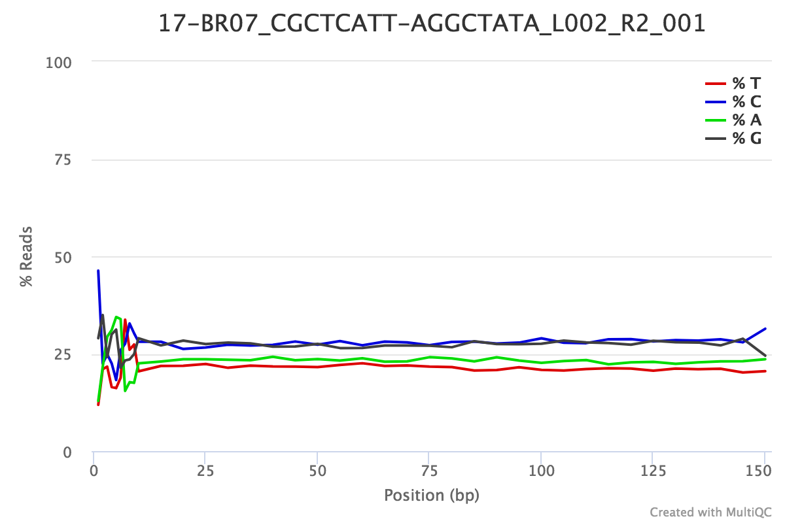

```{r setup, include=FALSE}
knitr::opts_chunk$set(echo = TRUE)
rm(list=ls())

library(tidyverse)
library(ggplot2)
library(knitr)

source("../functions/theme_pub.r")
theme_github <- function(x){
  theme_pub(base_size=12)
}

theme_set(theme_github())
```

## Getting the data

The data were downloaded from LIMS using the following command:

`wget -r --cut-dirs=2 -np -nH -R "index.html*" http://cgr.liv.ac.uk/illum/LIMS14834_0e999fb268fcd08f/Trimmed/`

The data were then copied to their current location.

Note that [the short read fastq files ultimately uploaded to NCBI GEO database under project accession GSE151570](https://www.ncbi.nlm.nih.gov/geo/query/acc.cgi?acc=GSE151570) have a slightly different and more descriptive naming convention. Some of the lines in this script may not work with the renamed sequences. 

## Quality control of RNAseq data

Using [FastQC](https://www.bioinformatics.babraham.ac.uk/projects/fastqc/) and [MultiQC](http://multiqc.info). FASTQC was installed manually from Babraham Bioinformatics into `~/programs`. MultiQC was installed using pip: `pip install multiqc`.

```{bash, eval=FALSE}
mkdir ../rnaseq/qc

~/programs/bin/fastqc -t 8 \
   -outdir ../rnaseq/qc \
   -extract ../rnaseq/reads/Trimmed/Sample_*/*.fastq.gz

multiqc ../rnaseq/qc
```

The generated file, `multiqc_report.html`, has summary plots of the data, which are included here.


This shows approximately 20% of reads are unique for each sample, and there are between 5.9m and 19.2m reads per sample (discounting R0).

### Sequence quality scores

**Mean quality per base**


**Per sequence quality scores**


### Sequence content

**Per base sequence content**

Example per-base sequence content plot. All samples looked fairly similar, though the R1 sequences may be a little more variable across the read. All samples gave either 'fail' or 'warn'.



This is due to an issue with 'less than random' hexamer priming in the reverse transcription stage of the library preparation. ["This happens in pretty much all RNA-Seq libraries to a greater or lesser extent"](https://sequencing.qcfail.com/articles/positional-sequence-bias-in-random-primed-libraries/) and thus is not something to worry about.

**Per-sequence GC content**

- 47 samples pass
- 30 samples warn
- 103 samples fail

The R2 reads for all samples were either 'pass' or 'warn'. The R1 reads for all samples, except 28, were 'fail'. 


["Sharp peaks on an otherwise smooth distribution are normally the result of a specific contaminant (adapter dimers for example), which may well be picked up by the overrepresented sequences module."](https://www.bioinformatics.babraham.ac.uk/projects/fastqc/Help/3%20Analysis%20Modules/5%20Per%20Sequence%20GC%20Content.html) I suspect that this is due to overrepresented/duplicated sequences (see below). 

**Per Base N Content**

All sequences passed.

### Sequence length

**Sequence Length Distribution**

All sequences warn, but [warnings here can be ignored.](http://www.bioinformatics.babraham.ac.uk/projects/fastqc/Help/3%20Analysis%20Modules/7%20Sequence%20Length%20Distribution.html)

### Sequence duplication

**Sequence Duplication Levels**

All the paired sequences (R1 and R2) fail. This is not uncommon with RNAseq studies which are expected to find high levels of duplication of heavily expressed genes.

**Overrepresented sequences**

Of the 25 sequences with 'warn', all were the R2 (sense) reads.


**Adapter content**

All sequences pass. 

## Following up on the reasons for overrepresented sequences

To investigate the reason for overrepresented sequences, I looked at the tables in the FastQC output and BLASTed some of the top hits against the nr database. These revealed that ssrA (also known as 10Sa RNA and tmRNA) was overrepresented. See [Janssen et al., 2012](https://www.ncbi.nlm.nih.gov/pubmed/22243584) for details. 

Pull out matches from the FastQC output using grep. `ssra` is a cropped version of the top matching sequence in R1 reads, which matches the chromosome at complement(5798624..5798661) (i.e. reading into ssrA from the 3' end). `ssra_revcom` is a cropped version of the top matching sequence in R2, matching the chromosome at 5798342..5798379 (reading into ssrA from the 5' end).

```{bash}
ssra=GCTGTCGGTACTACATGCGTAGCCGTTTCTATTAAGTT
grep $ssra \
     ../rnaseq/qc/*_R[12]_*/fastqc_data.txt | awk '{print $1,$3}' \
    | awk -v FS='/' '{print $4, $5}' | awk '{print $1,$3,"ssrA"}' \
    > ../rnaseq/overrepresented_ssrA.txt
ssra_revcom=TTTAGGTGCATGCCGAGTTGGTAACAGAACTCGTAAAT
grep $ssra_revcom \
     ../rnaseq/qc/*_R[12]_*/fastqc_data.txt | awk '{print $1,$3}' \
    | awk -v FS='/' '{print $4, $5}' | awk '{print $1,$3,"ssrA_rev"}' \
    >> ../rnaseq/overrepresented_ssrA.txt
```

Plot in R.

```{r}
ssra <- read.table("../rnaseq/overrepresented_ssrA.txt", 
                   header=FALSE, sep=" ", stringsAsFactors=FALSE)
ssra_Tab <- ssra %>% group_by(V1) %>% 
  summarise(ssra = sum(V2)) %>% ungroup() %>%
  mutate(R = sapply(strsplit(V1, "_"), `[`, 4),
         L = sapply(strsplit(V1, "_"), `[`, 3),
         sample = sapply(strsplit(V1, "_"), `[`, 1))

ggplot(data=ssra_Tab, aes(x=reorder(sample,ssra), 
                          y=ssra, 
                          colour=R, 
                          shape=L)) + 
  geom_point() + 
  theme(axis.text.x=element_text(angle=90, hjust=1, vjust=0.5),
        legend.position="right")
```

Calculate statistics.

```{r}
ssra_Tab %>% filter(R=="R1") %>% select(ssra) %>% summary()

ssra_Tab %>% filter(R=="R2") %>% select(ssra) %>% summary()
```

This shows that just this basic ssrA sequence constitutes between 2.3 and 7.7% of the sequences in the R1 direction, and between 0.9 and 3% of the sequences in the R2 direction, which is consistent with the plot showing overrepresented sequences above. Exploratory analyses showed that the majority of the remaining reads were other functional RNAs (e.g. RnaseP).

Investigate RnaseP. Again pull out matches: `rnasep` is a cropped version of the top matching sequence in R1 reads, which matches the chromosome at 1041144..1041193 (reading into RNaseP from the 5' end). `rnasep_revcom` is a cropped version of the top matching sequence in R2, matching the chromosome at 1040894..1040943 (reading into rnaseP from the 5' end).

```{bash}
rnasep=GTCGATCTATAAGCCGGGTTCTGTCTTGAACAGTCATTCGTCTACGATGG
grep $rnasep \
     ../rnaseq/qc/*_R[12]_*/fastqc_data.txt | awk '{print $1,$3}' \
    | awk -v FS='/' '{print $4, $5}' | awk '{print $1,$3,"RnaseP"}' \
    > ../rnaseq/overrepresented_rnasep.txt
rnasep_revcom=GGAAAGTCCGGGCTCCATAGGGCGAAGTGCCAGGTAATGCCTGGGAGGCG
grep $rnasep_revcom \
     ../rnaseq/qc/*_R[12]_*/fastqc_data.txt | awk '{print $1,$3}' \
    | awk -v FS='/' '{print $4, $5}' | awk '{print $1,$3,"RnaseP_rev"}' \
    >> ../rnaseq/overrepresented_rnasep.txt
```

Analyse and plot in R.

```{r}
rnasep <- read.table("../rnaseq/overrepresented_rnasep.txt", 
                   header=FALSE, sep=" ", stringsAsFactors=FALSE)
rnasep_Tab <- rnasep %>% group_by(V1) %>% 
  summarise(rnasep = sum(V2)) %>% ungroup() %>%
  mutate(R = sapply(strsplit(V1, "_"), `[`, 4),
         L = sapply(strsplit(V1, "_"), `[`, 3),
         sample = sapply(strsplit(V1, "_"), `[`, 1))

ggplot(data=rnasep_Tab, aes(x=reorder(sample,rnasep), 
                          y=rnasep, 
                          colour=R, 
                          shape=L)) + 
  geom_point() + 
  theme(axis.text.x=element_text(angle=90, hjust=1, vjust=0.5),
        legend.position="right")
```

Calculate statistics.

```{r}
rnasep_Tab %>% filter(R=="R1") %>% select(rnasep) %>% summary()

rnasep_Tab %>% filter(R=="R2") %>% select(rnasep) %>% summary()
```

Overall, it seems that the overrepresented sequences make biological sense and are unlikely to have emerged from low quality or bias in the library preparation.

[Proceed to analysis.](COMPMUT_RNAseq_2_Alignment.md)

---

**[Back to index.](COMPMUT_index.md)**

