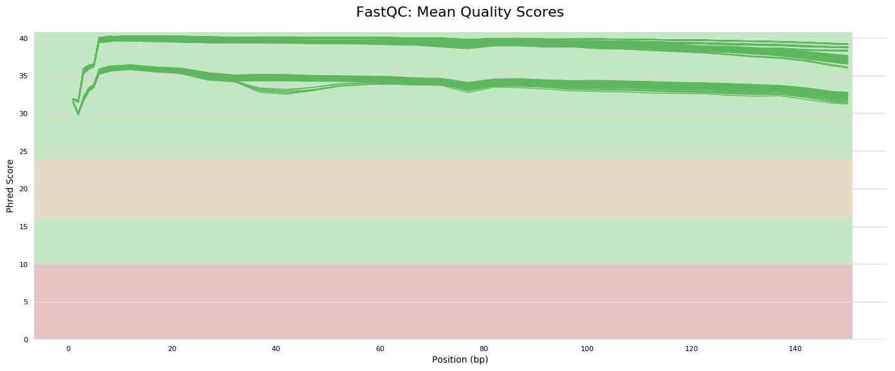
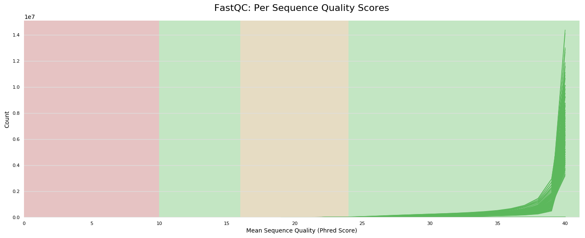
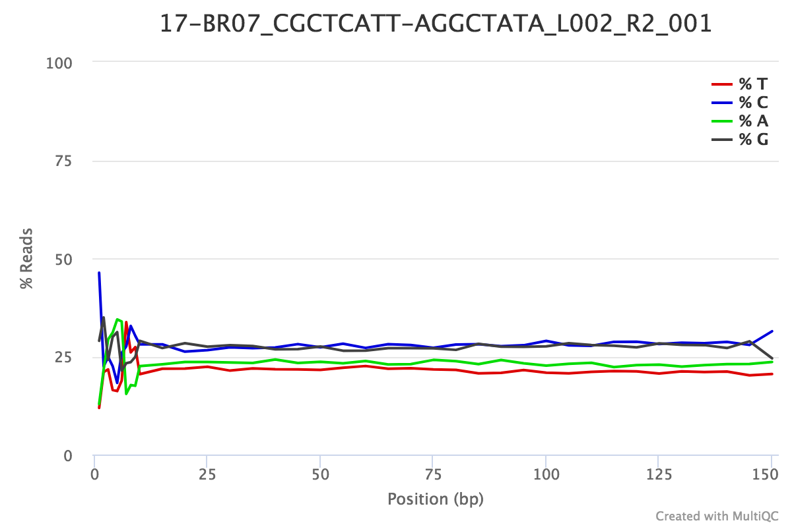
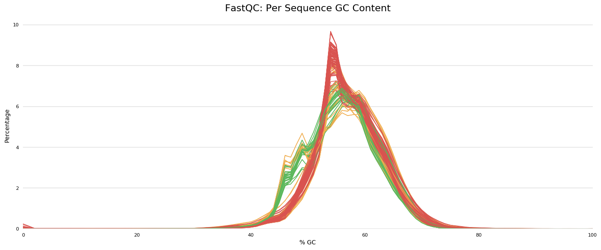
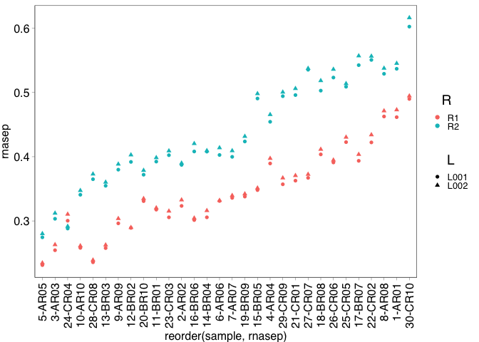

COMPMUT RNAseq Analysis 1: Quality Control of RNAseq reads
================
jpjh
compiled Feb 2021

[Now published in PLoS
Biology](https://journals.plos.org/plosbiology/article?id=10.1371/journal.pbio.3001225):

Hall, J. P. J., Wright, R. C. T., Harrison, E., Muddiman, K. J., Jamie
Wood, A., Paterson, S., & Brockhurst, M. A. (2021). Plasmid fitness
costs are caused by specific genetic conflicts enabling resolution by
compensatory mutation. *PLoS Biology*, *19*(10), e3001225.
<https://doi.org/10.1371/journal.pbio.3001225>

**[Back to index.](COMPMUT_index.md)**

------------------------------------------------------------------------

## Getting the data

The data were downloaded from LIMS using the following command:

`wget -r --cut-dirs=2 -np -nH -R "index.html*" http://cgr.liv.ac.uk/illum/LIMS14834_0e999fb268fcd08f/Trimmed/`

The data were then copied to their current location.

Note that [the short read fastq files ultimately uploaded to NCBI GEO
database under project accession
GSE151570](https://www.ncbi.nlm.nih.gov/geo/query/acc.cgi?acc=GSE151570)
have a slightly different and more descriptive naming convention. Some
of the lines in this script may not work with the renamed sequences.

## Quality control of RNAseq data

Using
[FastQC](https://www.bioinformatics.babraham.ac.uk/projects/fastqc/) and
[MultiQC](http://multiqc.info). FASTQC was installed manually from
Babraham Bioinformatics into `~/programs`. MultiQC was installed using
pip: `pip install multiqc`.

``` bash
mkdir ../rnaseq/qc

~/programs/bin/fastqc -t 8 \
   -outdir ../rnaseq/qc \
   -extract ../rnaseq/reads/Trimmed/Sample_*/*.fastq.gz

multiqc ../rnaseq/qc
```

The generated file, `multiqc_report.html`, has summary plots of the
data, which are included here.


This shows approximately 20% of reads are unique for each sample, and
there are between 5.9m and 19.2m reads per sample (discounting R0).

### Sequence quality scores

**Mean quality per base**



**Per sequence quality scores**



### Sequence content

**Per base sequence content**

Example per-base sequence content plot. All samples looked fairly
similar, though the R1 sequences may be a little more variable across
the read. All samples gave either ‘fail’ or ‘warn’.



This is due to an issue with ‘less than random’ hexamer priming in the
reverse transcription stage of the library preparation. [“This happens
in pretty much all RNA-Seq libraries to a greater or lesser
extent”](https://sequencing.qcfail.com/articles/positional-sequence-bias-in-random-primed-libraries/)
and thus is not something to worry about.

**Per-sequence GC content**

-   47 samples pass
-   30 samples warn
-   103 samples fail

The R2 reads for all samples were either ‘pass’ or ‘warn’. The R1 reads
for all samples, except 28, were ‘fail’.



[“Sharp peaks on an otherwise smooth distribution are normally the
result of a specific contaminant (adapter dimers for example), which may
well be picked up by the overrepresented sequences
module.”](https://www.bioinformatics.babraham.ac.uk/projects/fastqc/Help/3%20Analysis%20Modules/5%20Per%20Sequence%20GC%20Content.html)
I suspect that this is due to overrepresented/duplicated sequences (see
below).

**Per Base N Content**

All sequences passed.

### Sequence length

**Sequence Length Distribution**

All sequences warn, but [warnings here can be
ignored.](http://www.bioinformatics.babraham.ac.uk/projects/fastqc/Help/3%20Analysis%20Modules/7%20Sequence%20Length%20Distribution.html)

### Sequence duplication

**Sequence Duplication Levels**

All the paired sequences (R1 and R2) fail. This is not uncommon with
RNAseq studies which are expected to find high levels of duplication of
heavily expressed genes.

**Overrepresented sequences**

Of the 25 sequences with ‘warn’, all were the R2 (sense) reads.


**Adapter content**

All sequences pass.

## Following up on the reasons for overrepresented sequences

To investigate the reason for overrepresented sequences, I looked at the
tables in the FastQC output and BLASTed some of the top hits against the
nr database. These revealed that ssrA (also known as 10Sa RNA and tmRNA)
was overrepresented. See [Janssen et al.,
2012](https://www.ncbi.nlm.nih.gov/pubmed/22243584) for details.

Pull out matches from the FastQC output using grep. `ssra` is a cropped
version of the top matching sequence in R1 reads, which matches the
chromosome at complement(5798624..5798661) (i.e. reading into ssrA from
the 3’ end). `ssra_revcom` is a cropped version of the top matching
sequence in R2, matching the chromosome at 5798342..5798379 (reading
into ssrA from the 5’ end).

``` bash
ssra=GCTGTCGGTACTACATGCGTAGCCGTTTCTATTAAGTT
grep $ssra \
     ../rnaseq/qc/*_R[12]_*/fastqc_data.txt | awk '{print $1,$3}' \
    | awk -v FS='/' '{print $4, $5}' | awk '{print $1,$3,"ssrA"}' \
    > ../rnaseq/overrepresented_ssrA.txt
ssra_revcom=TTTAGGTGCATGCCGAGTTGGTAACAGAACTCGTAAAT
grep $ssra_revcom \
     ../rnaseq/qc/*_R[12]_*/fastqc_data.txt | awk '{print $1,$3}' \
    | awk -v FS='/' '{print $4, $5}' | awk '{print $1,$3,"ssrA_rev"}' \
    >> ../rnaseq/overrepresented_ssrA.txt
```

Plot in R.

``` r
ssra <- read.table("../rnaseq/overrepresented_ssrA.txt", 
                   header=FALSE, sep=" ", stringsAsFactors=FALSE)
ssra_Tab <- ssra %>% group_by(V1) %>% 
  summarise(ssra = sum(V2)) %>% ungroup() %>%
  mutate(R = sapply(strsplit(V1, "_"), `[`, 4),
         L = sapply(strsplit(V1, "_"), `[`, 3),
         sample = sapply(strsplit(V1, "_"), `[`, 1))

ggplot(data=ssra_Tab, aes(x=reorder(sample,ssra), 
                          y=ssra, 
                          colour=R, 
                          shape=L)) + 
  geom_point() + 
  theme(axis.text.x=element_text(angle=90, hjust=1, vjust=0.5),
        legend.position="right")
```

<!-- -->

Calculate statistics.

``` r
ssra_Tab %>% filter(R=="R1") %>% select(ssra) %>% summary()
```

    ##       ssra      
    ##  Min.   :2.377  
    ##  1st Qu.:3.932  
    ##  Median :4.823  
    ##  Mean   :4.960  
    ##  3rd Qu.:6.130  
    ##  Max.   :7.701

``` r
ssra_Tab %>% filter(R=="R2") %>% select(ssra) %>% summary()
```

    ##       ssra       
    ##  Min.   :0.8922  
    ##  1st Qu.:1.4290  
    ##  Median :1.8579  
    ##  Mean   :1.9068  
    ##  3rd Qu.:2.3024  
    ##  Max.   :3.0212

This shows that just this basic ssrA sequence constitutes between 2.3
and 7.7% of the sequences in the R1 direction, and between 0.9 and 3% of
the sequences in the R2 direction, which is consistent with the plot
showing overrepresented sequences above. Exploratory analyses showed
that the majority of the remaining reads were other functional RNAs
(e.g. RnaseP).

Investigate RnaseP. Again pull out matches: `rnasep` is a cropped
version of the top matching sequence in R1 reads, which matches the
chromosome at 1041144..1041193 (reading into RNaseP from the 5’ end).
`rnasep_revcom` is a cropped version of the top matching sequence in R2,
matching the chromosome at 1040894..1040943 (reading into rnaseP from
the 5’ end).

``` bash
rnasep=GTCGATCTATAAGCCGGGTTCTGTCTTGAACAGTCATTCGTCTACGATGG
grep $rnasep \
     ../rnaseq/qc/*_R[12]_*/fastqc_data.txt | awk '{print $1,$3}' \
    | awk -v FS='/' '{print $4, $5}' | awk '{print $1,$3,"RnaseP"}' \
    > ../rnaseq/overrepresented_rnasep.txt
rnasep_revcom=GGAAAGTCCGGGCTCCATAGGGCGAAGTGCCAGGTAATGCCTGGGAGGCG
grep $rnasep_revcom \
     ../rnaseq/qc/*_R[12]_*/fastqc_data.txt | awk '{print $1,$3}' \
    | awk -v FS='/' '{print $4, $5}' | awk '{print $1,$3,"RnaseP_rev"}' \
    >> ../rnaseq/overrepresented_rnasep.txt
```

Analyse and plot in R.

``` r
rnasep <- read.table("../rnaseq/overrepresented_rnasep.txt", 
                   header=FALSE, sep=" ", stringsAsFactors=FALSE)
rnasep_Tab <- rnasep %>% group_by(V1) %>% 
  summarise(rnasep = sum(V2)) %>% ungroup() %>%
  mutate(R = sapply(strsplit(V1, "_"), `[`, 4),
         L = sapply(strsplit(V1, "_"), `[`, 3),
         sample = sapply(strsplit(V1, "_"), `[`, 1))

ggplot(data=rnasep_Tab, aes(x=reorder(sample,rnasep), 
                          y=rnasep, 
                          colour=R, 
                          shape=L)) + 
  geom_point() + 
  theme(axis.text.x=element_text(angle=90, hjust=1, vjust=0.5),
        legend.position="right")
```

<!-- -->

Calculate statistics.

``` r
rnasep_Tab %>% filter(R=="R1") %>% select(rnasep) %>% summary()
```

    ##      rnasep      
    ##  Min.   :0.2312  
    ##  1st Qu.:0.3031  
    ##  Median :0.3353  
    ##  Mean   :0.3460  
    ##  3rd Qu.:0.3939  
    ##  Max.   :0.4946

``` r
rnasep_Tab %>% filter(R=="R2") %>% select(rnasep) %>% summary()
```

    ##      rnasep      
    ##  Min.   :0.2745  
    ##  1st Qu.:0.3854  
    ##  Median :0.4117  
    ##  Mean   :0.4395  
    ##  3rd Qu.:0.5150  
    ##  Max.   :0.6165

Overall, it seems that the overrepresented sequences make biological
sense and are unlikely to have emerged from low quality or bias in the
library preparation.

[Proceed to analysis.](COMPMUT_RNAseq_2_Alignment.md)

------------------------------------------------------------------------

**[Back to index.](COMPMUT_index.md)**
