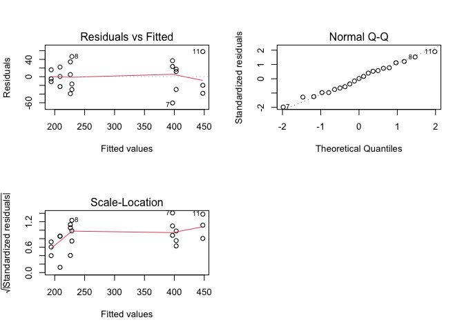
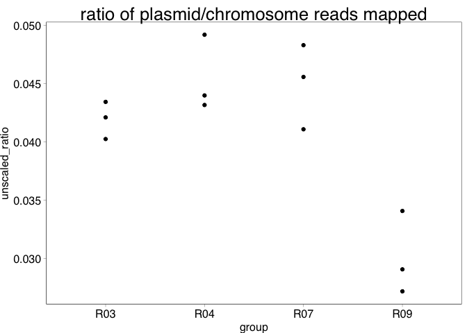
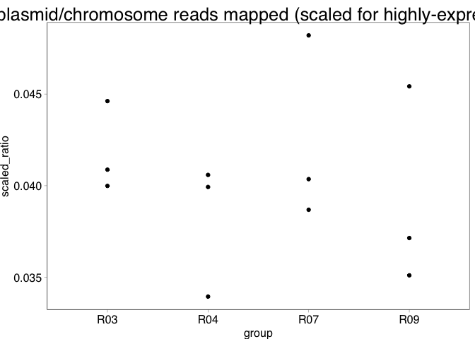
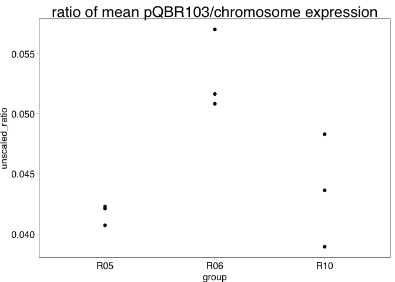
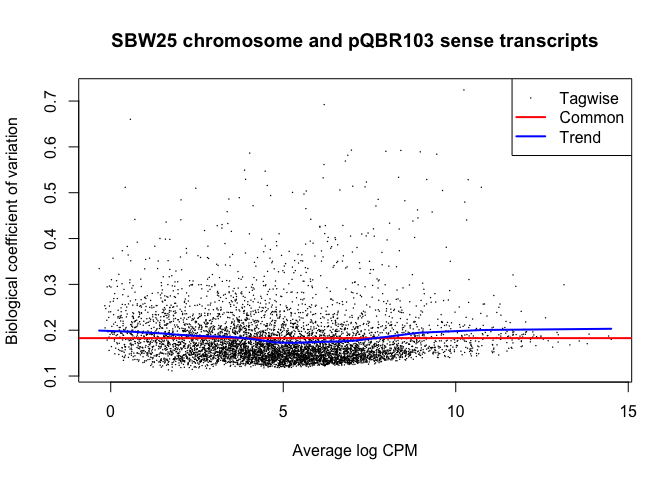
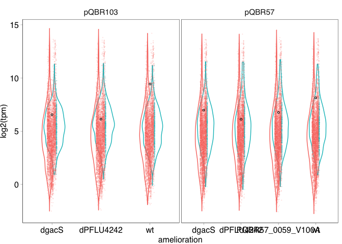
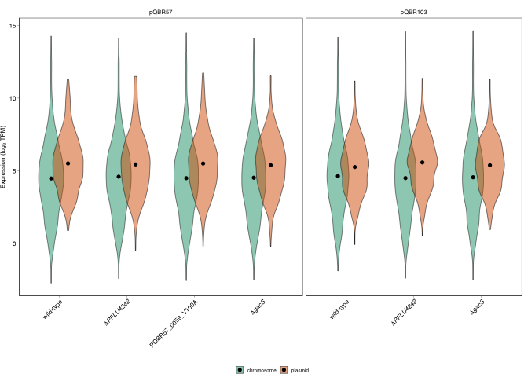
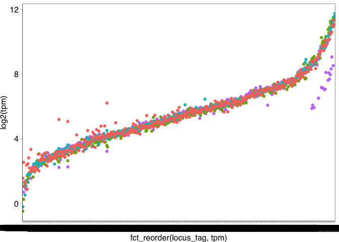

COMPMUT RNAseq Analysis 4: Analysing differential expression using edgeR
================
jpjh
compiled Feb 2021

## edgeR analysis

The analysis will look at the SBW25 chromosome, pQBR103, and pQBR57
separately.

All comparisons will be made with the base, i.e. with wild-type
chromosome for chromosomal comparisons, and with uncompensated hosts for
the plasmids. For the chromosome, it is also worth comparing
plasmid-bearing compensated with plasmid-bearing uncompensated (to look
for significant changes compared with the non-compensated state).

Note that as I am using Benjamini-Hochberg FDR adjustments doing these
separate analyses will not require additional correction for multiple
testing (FDR, as a rate, should scale).

Files and comparisons to use outpu:

1.  SBW25 chromosome, sense transcripts from (putative) protein-coding
    genes. Remove PFLU\_4242 and PFLU\_3777 (gacS) genes since these are
    artificially missing from some treatments due to knockouts, and
    remove the small RNAs to analyse separately as some of these are
    expressed at very high levels (&gt;15% of total mappings) and thus
    may affect the analysis.
    -   Comparisons against plasmid-free (R01), output
        `./data/COMPMUT_RNAseq_1_de_table_chr_vanc.csv`.
    -   Comparisons against plasmid-bearers, e.g. against R03 (pQBR57)
        and R05 (pQBR103), output
        `./data/COMPMUT_RNAseq_2_de_table_chr_comp.csv`.
2.  pQBR57 plasmid, sense transcripts.
    -   All comparisons against plasmid bearing (R03), output
        `./data/COMPMUT_RNAseq_3_de_table_pQ57.csv`.
3.  pQBR103 plasmid, sense transcripts.
    -   All comparisons against plasmid bearing (R05), output
        `./data/COMPMUT_RNAseq_4_de_table_pQ103.csv`.
4.  TPM for plasmid and chromosomal genes, output
    `./data/COMPMUT_RNAseq_5_tpm.csv`.

A preliminary analysis of antisense transcripts did not reveal anything
particularly exciting, so that analysis is not included here.

All analyses follow Example 3.3 in the [edgeR User’s
Guide](https://www.bioconductor.org/packages/release/bioc/vignettes/edgeR/inst/doc/edgeRUsersGuide.pdf).

### 1. SBW25 sense transcripts

Get the data from the file and reorganise the column names for easy
reference.

``` r
library(edgeR)
```

    ## Loading required package: limma

``` r
data <- read.table(file="../rnaseq/rsubread/CountsMatrix.csv", sep=",")
samples <- colnames(data)
field_to_take <- which(unlist(strsplit(samples[1], ".", fixed=TRUE))=="AR01")
samples <- sapply(strsplit(samples, ".", fixed=TRUE), `[`, field_to_take)
colnames(data) <- samples
dat <- data[,sort(samples)]
```

Apply treatment information to each sample. Load up the .csv table
detailing treatments and create a treatment translation table.

``` r
trt_tab <- read.table("../rnaseq/TreatmentTable.csv",
                      sep=",", header=TRUE)
trans_tab <- data.frame(name=samples,
                        rep=substr(samples,1,1),
                        trt=substr(samples,2,4))
trt_trans <- trans_tab %>% left_join(trt_tab, by="trt")
trt_trans <- trt_trans %>% arrange(name) %>% 
  select(name, amelioration, plasmid, trt) %>%
  mutate(group = factor(paste(plasmid, amelioration, sep=".")))
```

#### 1. SBW25 chromosome

First analyse SBW25 putative protein-coding genes. Take only genes with
the “PFLU\_” prefix that aren’t amongst the small RNAs (i.e. have a
numeric PFLU identifier).

Create a DGEList object, and filter out genes with low counts (i.e. keep
genes with &gt;1 cpm in ≥3 samples).

``` r
protein_coding <- grep("^PFLU_[0-9]", rownames(dat))

dat_chr <- dat[protein_coding,]

y_chr <- DGEList(counts=dat_chr,
              genes=rownames(dat_chr),
              group=trt_trans$trt)

keep_chr <- rowSums(cpm(y_chr)>1) >= 3
sum(keep_chr)
```

    ## [1] 5891

5891 out of 6009 chromosomal genes meet criteria.

PFLU\_4242 and gacS are present only in a subset of samples, so these
should be analysed separately.

``` r
keep_chr[c("PFLU_4242","PFLU_3777")] <- FALSE
sum(keep_chr)
```

    ## [1] 5889

``` r
z_chr <- y_chr[keep_chr, , keep.lib.sizes=FALSE]
```

Exploratory plot of the data.

``` r
plotMDS(z_chr, main="SBW25 chromosome sense transcripts")
```

<!-- -->

Shows a clear separation of the ∆gacS mutants, pQBR103-carriers on the
other end of dim 1, and a possible outlier in CR03, but in general
everything looks good.

Interesting to note that pQBR103 acqusition has a broadly opposite
effect to ∆gacS according to the multi-dimensional scaling.

Calculate normalization factors and estimate (and plot) dispersion.

``` r
z_chr <- calcNormFactors(z_chr)
z_chr <- estimateDisp(z_chr, robust=TRUE)
```

    ## Design matrix not provided. Switch to the classic mode.

``` r
plotBCV(z_chr, main="SBW25 chromosome sense transcripts")
```

<!-- -->

On the whole, the BCV follows the model, with an asymptotic value of
approximately 0.2. [This is within the range
expected](https://www.ncbi.nlm.nih.gov/pmc/articles/PMC4934518/), and
the fact that variation does not apparently scale with CPM suggests that
dispersion can be modelled with a single estimate.

Extract normalization factors for application to coverage plots. The
normalization factors [“normalize for RNA composition by finding a set
of scaling factors for the library sizes that minimize the log-fold
changes between the samples for most
genes.”](https://www.bioconductor.org/packages/devel/bioc/vignettes/edgeR/inst/doc/edgeRUsersGuide.pdf)
A value below 1 indicates that a few highly-expressed genes are
monopolizing the sequencing, making other genes appear abnormally low.
The product of the norm.factor and the lib.size is the ‘effective
library size’ which is used in downstream applications.

``` r
normfac <- z_chr$samples %>%
  rownames_to_column(var = "sample") %>%
  mutate(eff.lib.size = norm.factors * lib.size)
write.table(normfac, "../rnaseq/edgeR_NormalizationFactors.csv", quote=FALSE, sep=",", row.names=FALSE)

print(normfac)
```

    ##    sample group lib.size norm.factors eff.lib.size
    ## 1    AR01   R01 17849678    0.9739542     17384769
    ## 2    AR02   R02 10078537    1.0341112     10422328
    ## 3    AR03   R03  9131327    1.0082707      9206849
    ## 4    AR04   R04 24454432    1.0815750     26449301
    ## 5    AR05   R05 20883731    1.0693780     22332602
    ## 6    AR06   R06  9619977    1.0441133     10044346
    ## 7    AR07   R07  8996824    1.0125476      9109712
    ## 8    AR08   R08 11685572    0.9974957     11656308
    ## 9    AR09   R09 17107128    0.9686844     16571408
    ## 10   AR10   R10 21428826    1.0566370     22642491
    ## 11   BR01   R01 20500527    0.9938363     20374167
    ## 12   BR02   R02 14822543    1.0351782     15343974
    ## 13   BR03   R03 14537492    0.9612019     13973465
    ## 14   BR04   R04 12480785    1.0259763     12804990
    ## 15   BR05   R05  9386906    1.0451915      9811114
    ## 16   BR06   R06 17161396    0.9678330     16609366
    ## 17   BR07   R07 12686531    0.9548954     12114310
    ## 18   BR08   R08 17066629    1.0027624     17113774
    ## 19   BR09   R09 27738274    1.0229478     28374807
    ## 20   BR10   R10 16964433    0.9893176     16783213
    ## 21   CR01   R01 21720129    1.0333753     22445045
    ## 22   CR02   R02 28598188    0.9513055     27205614
    ## 23   CR03   R03 20999302    0.9553052     20060742
    ## 24   CR04   R04 14069418    0.9366981     13178797
    ## 25   CR05   R05 17093926    0.9399043     16066654
    ## 26   CR06   R06 14964421    0.9394728     14058666
    ## 27   CR07   R07 15929809    1.0097389     16084947
    ## 28   CR08   R08 23076488    0.9690770     22362893
    ## 29   CR09   R09 26036322    1.0064410     26204023
    ## 30   CR10   R10  9372278    1.0367697      9716894

Plot these normalization factors to look for structure.

``` r
library(ggplot2)
ggplot(data=normfac, aes(x=group, y=norm.factors)) + 
  geom_hline(yintercept=1) + geom_point() + ggtitle("SBW25 sense normalization factors")
```

<!-- -->

No obvious patterns or trends in the normalisation factors.

##### 1.1. SBW25 chromosome: baseline expression

Investigate baseline expression.

Identify the most highly expressed genes in the wild-type host.

`AM181176_gene_info.tsv`, and similar files for the plasmids, were made
using [`COMPMUT_RNAseq_5_gene_info.Rmd`](COMPMUT_RNAseq_5_gene_info.md).

``` r
gene_info_chr <- read.csv("../rnaseq/ref/AM181176_gene_info.tsv", header=TRUE, sep="\t",
                           row.names="locus_tag")
chr_genelengths <- gene_info_chr[rownames(z_chr),"length_na"]
z_rpkm <- data.frame(rpkm(z_chr, gene.length = chr_genelengths))
z_rpkm_wt <- z_rpkm[,grep("R01",colnames(z_rpkm))]
z_rpkm_wt$mean <- rowMeans(z_rpkm_wt)
z_rpkm_wt$feature <- rownames(z_rpkm_wt)
z_rpkm_wt$product <- gene_info_chr[z_rpkm_wt$feature,"product"]
head(z_rpkm_wt[with(z_rpkm_wt, order(-mean)),c("feature","mean","product")], n=20)
```

    ##             feature     mean                                    product
    ## PFLU_1702 PFLU_1702 40500.60 major outer membrane lipoprotein precursor
    ## PFLU_4612 PFLU_4612 28550.11    putative outer membrane porin A protein
    ## PFLU_1037 PFLU_1037 18985.72             conserved hypothetical protein
    ## PFLU_5506 PFLU_5506 18802.78                  50S ribosomal protein L36
    ## PFLU_5529 PFLU_5529 18650.27                       elongation factor TU
    ## PFLU_4146 PFLU_4146 18486.74         putative 50S ribosomal protein L35
    ## PFLU_5519 PFLU_5519 17578.44                  50S ribosomal protein L29
    ## PFLU_4988 PFLU_4988 16494.29                          10 kDa chaperonin
    ## PFLU_5516 PFLU_5516 15780.25                  50S ribosomal protein L24
    ## PFLU_4150 PFLU_4150 15693.85                   major cold shock protein
    ## PFLU_5515 PFLU_5515 15333.44                   50S ribosomal protein L5
    ## PFLU_5518 PFLU_5518 15110.16                  30S ribosomal protein S17
    ## PFLU_5514 PFLU_5514 14647.62                  30S ribosomal protein S14
    ## PFLU_5517 PFLU_5517 14560.80                  50S ribosomal protein L14
    ## PFLU_5520 PFLU_5520 14166.31                  50S ribosomal protein L16
    ## PFLU_1050 PFLU_1050 13303.38               putative DNA-binding protein
    ## PFLU_5522 PFLU_5522 12592.67                  50S ribosomal protein L22
    ## PFLU_6123 PFLU_6123 12544.12                       ATP synthase C chain
    ## PFLU_4145 PFLU_4145 12335.90                  50S ribosomal protein L20
    ## PFLU_5509 PFLU_5509 12102.69                  50S ribosomal protein L30

Most genes are associated with translation, largely as expected, which
is reassuring.

##### 1.2. SBW25 chromosome: differential expression

Fit the model. Specify a model matrix where each treatment is
investigated separately.

``` r
trt_trans$trt <- factor(trt_trans$trt, levels=c(paste(rep("R0",9,),1:9, sep=""),"R10"))
design <- model.matrix(~0+trt, data=trt_trans)
colnames(design) <- levels(trt_trans$trt)
fit_chr <- glmQLFit(z_chr, design)
```

##### 1a. Comparisons with the ancestor

First compare all samples with the wild-type plasmid free (R01), to
identify what genes are differentially-expressed compared with this
baseline.

Contrast names are specified by “plasmid\_type”:“amelioration”. To avoid
confusion, “amelioration” will be set as “wt” when there is no
amelioration.

``` r
contr <- makeContrasts(none.dPFLU4242          = R02-R01,
                       pQBR57.wt               = R03-R01,
                       pQBR57.dPFLU4242        = R04-R01,
                       pQBR103.wt              = R05-R01,
                       pQBR103.dPFLU4242       = R06-R01,
                       pQBR57.PQBR57_0059_V100A= R07-R01,
                       none.dgacS              = R08-R01,
                       pQBR57.dgacS            = R09-R01,
                       pQBR103.dgacS           = R10-R01,
                       levels=design)
```

Specify a function to extract differentially-expressed genes for each
combination of treatments, following the general specification in the
edgeR User’s Guide. This test applies a quasi-likelihood negative
binomial log-linear model to the specified contrast, and outputs the
results in a table.

``` r
getCoefficients <- function(x,f,cont,n=Inf,p=1) {
  qlf <- glmQLFTest(f,contrast=cont[,x])
  ttags <- topTags(qlf, n=n, p=p, sort.by="none")
  ttagstab <- ttags$table
  cols <- paste(x, colnames(ttags))
  colnames(ttagstab) <- cols
  ttagstab[,c(2:6)]
}

contrast_names <- colnames(contr)

full_table_chr <- plyr::llply(contrast_names,
                     function(x) getCoefficients(x=x, f=fit_chr, cont=contr))
full_table_chr <- data.frame(full_table_chr)

head(full_table_chr)
```

    ##           none.dPFLU4242.logFC none.dPFLU4242.logCPM none.dPFLU4242.F
    ## PFLU_0001        -4.809769e-02              8.451345     1.627333e-01
    ## PFLU_0002        -3.502385e-05              9.590174     5.991814e-08
    ## PFLU_0003         3.612585e-02              7.999327     7.593496e-02
    ## PFLU_0004         1.639471e-02              9.828637     1.291255e-02
    ## PFLU_0005        -1.312475e-01              6.822139     1.230068e+00
    ## PFLU_0006         1.289981e-02              3.913718     5.191125e-03
    ##           none.dPFLU4242.PValue none.dPFLU4242.FDR pQBR57.wt.logFC
    ## PFLU_0001             0.6900723          0.9998713       0.2492766
    ## PFLU_0002             0.9998066          0.9998713       0.1121192
    ## PFLU_0003             0.7851422          0.9998713       0.2610223
    ## PFLU_0004             0.9104335          0.9998713       0.3674398
    ## PFLU_0005             0.2779196          0.9998713      -0.1116215
    ## PFLU_0006             0.9431342          0.9998713       0.1397880
    ##           pQBR57.wt.logCPM pQBR57.wt.F pQBR57.wt.PValue pQBR57.wt.FDR
    ## PFLU_0001         8.451345   4.3668370       0.04694843     0.2043454
    ## PFLU_0002         9.590174   0.6137710       0.44071010     0.6739397
    ## PFLU_0003         7.999327   3.9591915       0.05762835     0.2279203
    ## PFLU_0004         9.828637   6.4692536       0.01751809     0.1222820
    ## PFLU_0005         6.822139   0.8884735       0.35488624     0.6045488
    ## PFLU_0006         3.913718   0.6061755       0.44351807     0.6763019
    ##           pQBR57.dPFLU4242.logFC pQBR57.dPFLU4242.logCPM pQBR57.dPFLU4242.F
    ## PFLU_0001            -0.12960017                8.451345        1.181018654
    ## PFLU_0002             0.04207738                9.590174        0.086474522
    ## PFLU_0003             0.04700547                7.999327        0.128566132
    ## PFLU_0004            -0.05149415                9.828637        0.127369023
    ## PFLU_0005            -0.21124921                6.822139        3.183643964
    ## PFLU_0006             0.01135668                3.913718        0.004026377
    ##           pQBR57.dPFLU4242.PValue pQBR57.dPFLU4242.FDR pQBR103.wt.logFC
    ## PFLU_0001               0.2874870            0.7231999     -0.004828774
    ## PFLU_0002               0.7711287            0.9332457      0.074876857
    ## PFLU_0003               0.7229251            0.9176016      0.157188289
    ## PFLU_0004               0.7241620            0.9176016     -0.045879401
    ## PFLU_0005               0.0864872            0.5765247     -0.090917778
    ## PFLU_0006               0.9499084            0.9858029      0.219569559
    ##           pQBR103.wt.logCPM pQBR103.wt.F pQBR103.wt.PValue pQBR103.wt.FDR
    ## PFLU_0001          8.451345  0.001640132         0.9680165      0.9924145
    ## PFLU_0002          9.590174  0.273803831         0.6053860      0.8795999
    ## PFLU_0003          7.999327  1.437156633         0.2418088      0.6323959
    ## PFLU_0004          9.828637  0.101102399         0.7531441      0.9337313
    ## PFLU_0005          6.822139  0.590025052         0.4495844      0.7995718
    ## PFLU_0006          3.913718  1.506899906         0.2310143      0.6215756
    ##           pQBR103.dPFLU4242.logFC pQBR103.dPFLU4242.logCPM pQBR103.dPFLU4242.F
    ## PFLU_0001              0.04374625                 8.451345         0.134586538
    ## PFLU_0002             -0.01361097                 9.590174         0.009046429
    ## PFLU_0003              0.15960841                 7.999327         1.481121244
    ## PFLU_0004              0.13403292                 9.828637         0.862650051
    ## PFLU_0005             -0.10846129                 6.822139         0.838875019
    ## PFLU_0006             -0.01359530                 3.913718         0.005692974
    ##           pQBR103.dPFLU4242.PValue pQBR103.dPFLU4242.FDR
    ## PFLU_0001                0.7168014             0.9983876
    ## PFLU_0002                0.9249814             0.9983876
    ## PFLU_0003                0.2349316             0.9349523
    ## PFLU_0004                0.3618547             0.9754845
    ## PFLU_0005                0.3684449             0.9777698
    ## PFLU_0006                0.9404541             0.9983876
    ##           pQBR57.PQBR57_0059_V100A.logFC pQBR57.PQBR57_0059_V100A.logCPM
    ## PFLU_0001                     0.06951430                        8.451345
    ## PFLU_0002                    -0.01234681                        9.590174
    ## PFLU_0003                     0.11119726                        7.999327
    ## PFLU_0004                     0.10639769                        9.828637
    ## PFLU_0005                    -0.08007593                        6.822139
    ## PFLU_0006                     0.06073210                        3.913718
    ##           pQBR57.PQBR57_0059_V100A.F pQBR57.PQBR57_0059_V100A.PValue
    ## PFLU_0001                0.339720515                       0.5651967
    ## PFLU_0002                0.007442689                       0.9319363
    ## PFLU_0003                0.718598019                       0.4046245
    ## PFLU_0004                0.543577309                       0.4677983
    ## PFLU_0005                0.456939030                       0.5052463
    ## PFLU_0006                0.113141001                       0.7393952
    ##           pQBR57.PQBR57_0059_V100A.FDR none.dgacS.logFC none.dgacS.logCPM
    ## PFLU_0001                    0.9835083      0.045629144          8.451345
    ## PFLU_0002                    0.9963139     -0.038552744          9.590174
    ## PFLU_0003                    0.9626215      0.051785266          7.999327
    ## PFLU_0004                    0.9705026      0.111712887          9.828637
    ## PFLU_0005                    0.9801009     -0.309131030          6.822139
    ## PFLU_0006                    0.9872990      0.005463212          3.913718
    ##           none.dgacS.F none.dgacS.PValue none.dgacS.FDR pQBR57.dgacS.logFC
    ## PFLU_0001 0.1465028942        0.70512585     0.88983721         0.13908027
    ## PFLU_0002 0.0725945192        0.78980107     0.92293544         0.03582114
    ## PFLU_0003 0.1560704069        0.69614162     0.88562929         0.21983625
    ## PFLU_0004 0.5994548978        0.44602644     0.72061721         0.28779794
    ## PFLU_0005 6.8072551984        0.01509035     0.09484211        -0.18531806
    ## PFLU_0006 0.0009325221        0.97588041     0.99186199         0.19842113
    ##           pQBR57.dgacS.logCPM pQBR57.dgacS.F pQBR57.dgacS.PValue
    ## PFLU_0001            8.451345     1.36184679          0.25419773
    ## PFLU_0002            9.590174     0.06269502          0.80432646
    ## PFLU_0003            7.999327     2.81389338          0.10587672
    ## PFLU_0004            9.828637     3.97434396          0.05718546
    ## PFLU_0005            6.822139     2.45739498          0.12950879
    ## PFLU_0006            3.913718     1.25367705          0.27346371
    ##           pQBR57.dgacS.FDR pQBR103.dgacS.logFC pQBR103.dgacS.logCPM
    ## PFLU_0001        0.4789853          0.06702723             8.451345
    ## PFLU_0002        0.9066906         -0.08907692             9.590174
    ## PFLU_0003        0.2757665          0.13114586             7.999327
    ## PFLU_0004        0.1840565          0.23261851             9.828637
    ## PFLU_0005        0.3162012         -0.37938178             6.822139
    ## PFLU_0006        0.5010724          0.02748031             3.913718
    ##           pQBR103.dgacS.F pQBR103.dgacS.PValue pQBR103.dgacS.FDR
    ## PFLU_0001      0.31606618          0.578973683        0.74705873
    ## PFLU_0002      0.38744984          0.539263536        0.71735328
    ## PFLU_0003      1.00059276          0.326724342        0.53494799
    ## PFLU_0004      2.59697648          0.119587099        0.29029202
    ## PFLU_0005     10.22867322          0.003723658        0.02680761
    ## PFLU_0006      0.02355161          0.879259885        0.93666155

Output this table for analysis. Filename describes that it is just
looking at chromosomal genes, and comparing with the ancestor. Note that
the CPM given in this table is the [log2 counts per million per
gene](https://www.rdocumentation.org/packages/edgeR/versions/3.14.0/topics/DGEGLM-class).

``` r
write.table(full_table_chr, "../data/COMPMUT_RNAseq_1_de_table_chr_vanc.csv", sep=",", quote=FALSE)
```

##### 1b. Effects of compensatory mutations (comparisons with plasmid-bearing wild-type)

Compare compensated lines with the plasmid-bearing wild-type to identify
genes that are differentially-expressed by compensation.

Exploratory analyses suggested that these are likley to be the same
genes that are upregulated by plasmid acquisition.

``` r
contr_comp <- makeContrasts(pQBR57.dPFLU4242.c        = R04-R03,
                            pQBR57.PQBR57_0059_V100A.c= R07-R03,
                            pQBR57.dgacS.c            = R09-R03,
                            pQBR103.dPFLU4242.c       = R06-R05,
                            pQBR103.dgacS.c           = R10-R05,
                            levels=design)

contrast_names_comp <- colnames(contr_comp)

full_table_chr_comp <- plyr::llply(contrast_names_comp,
                     function(x) getCoefficients(x=x, f=fit_chr, cont=contr_comp))
full_table_chr_comp <- data.frame(full_table_chr_comp)

kable(head(full_table_chr_comp))
```

|            | pQBR57.dPFLU4242.c.logFC | pQBR57.dPFLU4242.c.logCPM | pQBR57.dPFLU4242.c.F | pQBR57.dPFLU4242.c.PValue | pQBR57.dPFLU4242.c.FDR | pQBR57.PQBR57\_0059\_V100A.c.logFC | pQBR57.PQBR57\_0059\_V100A.c.logCPM | pQBR57.PQBR57\_0059\_V100A.c.F | pQBR57.PQBR57\_0059\_V100A.c.PValue | pQBR57.PQBR57\_0059\_V100A.c.FDR | pQBR57.dgacS.c.logFC | pQBR57.dgacS.c.logCPM | pQBR57.dgacS.c.F | pQBR57.dgacS.c.PValue | pQBR57.dgacS.c.FDR | pQBR103.dPFLU4242.c.logFC | pQBR103.dPFLU4242.c.logCPM | pQBR103.dPFLU4242.c.F | pQBR103.dPFLU4242.c.PValue | pQBR103.dPFLU4242.c.FDR | pQBR103.dgacS.c.logFC | pQBR103.dgacS.c.logCPM | pQBR103.dgacS.c.F | pQBR103.dgacS.c.PValue | pQBR103.dgacS.c.FDR |
|:-----------|-------------------------:|--------------------------:|---------------------:|--------------------------:|-----------------------:|-----------------------------------:|------------------------------------:|-------------------------------:|------------------------------------:|---------------------------------:|---------------------:|----------------------:|-----------------:|----------------------:|-------------------:|--------------------------:|---------------------------:|----------------------:|---------------------------:|------------------------:|----------------------:|-----------------------:|------------------:|-----------------------:|--------------------:|
| PFLU\_0001 |               -0.3788768 |                  8.451345 |           10.0628246 |                 0.0039688 |              0.0484346 |                         -0.1797623 |                            8.451345 |                      2.2693096 |                           0.1444558 |                        0.6488251 |           -0.1101964 |              8.451345 |        0.8545750 |             0.3640739 |          0.6463766 |                 0.0485750 |                   8.451345 |             0.1657941 |                  0.6873327 |               0.8706608 |             0.0718560 |               8.451345 |         0.3629299 |              0.5522939 |           0.6892263 |
| PFLU\_0002 |               -0.0700418 |                  9.590174 |            0.2395078 |                 0.6288164 |              0.8166111 |                         -0.1244660 |                            9.590174 |                      0.7558416 |                           0.3928803 |                        0.8158224 |           -0.0762980 |              9.590174 |        0.2843040 |             0.5985894 |          0.8056390 |                -0.0884878 |                   9.590174 |             0.3821900 |                  0.5420095 |               0.7912626 |            -0.1639538 |               9.590174 |         1.3117273 |              0.2628977 |           0.4165200 |
| PFLU\_0003 |               -0.2140168 |                  7.999327 |            2.6607254 |                 0.1153536 |              0.3276153 |                         -0.1498250 |                            7.999327 |                      1.3032447 |                           0.2644081 |                        0.7475836 |           -0.0411860 |              7.999327 |        0.0987758 |             0.7559042 |          0.8945572 |                 0.0024201 |                   7.999327 |             0.0003405 |                  0.9854248 |               0.9938632 |            -0.0260424 |               7.999327 |         0.0394402 |              0.8441808 |           0.9073518 |
| PFLU\_0004 |               -0.4189340 |                  9.828637 |            8.4003089 |                 0.0076852 |              0.0716443 |                         -0.2610421 |                            9.828637 |                      3.2679224 |                           0.0826605 |                        0.5680139 |           -0.0796419 |              9.828637 |        0.3047735 |             0.5857933 |          0.7985701 |                 0.1799123 |                   9.828637 |             1.5532860 |                  0.2241709 |               0.5216953 |             0.2784979 |               9.828637 |         3.7193225 |              0.0651826 |           0.1525072 |
| PFLU\_0005 |               -0.0996278 |                  6.822139 |            0.7058139 |                 0.4087777 |              0.6539776 |                          0.0315455 |                            6.822139 |                      0.0706456 |                           0.7925726 |                        0.9600856 |           -0.0736966 |              6.822139 |        0.3873283 |             0.5393267 |          0.7729605 |                -0.0175435 |                   6.822139 |             0.0218862 |                  0.8835737 |               0.9565010 |            -0.2884640 |               6.822139 |         5.9027013 |              0.0226141 |           0.0699813 |
| PFLU\_0006 |               -0.1284314 |                  3.913718 |            0.5065664 |                 0.4831996 |              0.7108558 |                         -0.0790559 |                            3.913718 |                      0.1887553 |                           0.6676710 |                        0.9264900 |            0.0586331 |              3.913718 |        0.1077626 |             0.7454318 |          0.8882736 |                -0.2331649 |                   3.913718 |             1.6602377 |                  0.2093355 |               0.5009251 |            -0.1920892 |               3.913718 |         1.1405675 |              0.2957083 |           0.4520265 |

Output table.

``` r
write.table(full_table_chr_comp, "../data/COMPMUT_RNAseq_2_de_table_chr_comp.csv", sep=",", quote=FALSE)
```

##### 1c. Analysis of PFLU\_4242 and gacS transcription under different conditions

Get the lines from `y` and copy across the normalization factors that
were calculated for `z` so that counts can be normalized.

``` r
y_ko <- y_chr[c("PFLU_4242","PFLU_3777"),]
counts_ko <- data.frame(name = rownames(y_ko$samples),
                        trt = y_ko$samples$group,
                        lib.size = y_ko$samples$lib.size,
                        norm.factors = z_chr$samples$norm.factors,
                        PFLU_4242 = y_ko$counts["PFLU_4242",],
                        gacS = y_ko$counts["PFLU_3777",])
counts_ko$scale.factor <- with(counts_ko, (lib.size * norm.factors)/1e6)
counts_ko$PFLU_4242_scaled <- with(counts_ko, PFLU_4242 / scale.factor)
counts_ko$gacS_scaled <- with(counts_ko, gacS / scale.factor)

summary(counts_ko[,c("PFLU_4242_scaled","gacS_scaled")])
```

    ##  PFLU_4242_scaled    gacS_scaled    
    ##  Min.   :  0.0781   Min.   : 1.052  
    ##  1st Qu.:  0.3784   1st Qu.: 2.086  
    ##  Median :209.7263   Median :30.536  
    ##  Mean   :210.6180   Mean   :24.198  
    ##  3rd Qu.:364.2798   3rd Qu.:33.337  
    ##  Max.   :505.6423   Max.   :49.722

Summarize transcription for PFLU\_4242 and gacS under different
treatments.

``` r
counts_ko <- merge(trt_trans, counts_ko, by=c("name","trt"))

counts_ko$amelioration <- factor(counts_ko$amelioration,
                                 levels=c("wt","dgacS","dPFLU4242","PQBR57_0059_V100A"))
```

Plot expression of the different genes.

``` r
(plot_fig8 <- counts_ko %>% 
  select(1:5, PFLU_4242_scaled, gacS_scaled) %>%
  pivot_longer(cols = c(PFLU_4242_scaled, gacS_scaled),
               names_to = "gene", values_to = "cpm") %>%
  mutate(gene = factor(gene, levels=c("gacS_scaled", "PFLU_4242_scaled"),
                       labels=c("gacS", "PFLU4242"))) %>%
  ggplot(aes(x=amelioration, y=cpm, colour=plasmid)) +
  geom_hline(yintercept=0, size=0.1) +
  geom_point(position=position_dodge(width=0.2), alpha=0.8, shape=16) +
  scale_x_discrete(breaks=c("wt","dPFLU4242","PQBR57_0059_V100A","dgacS"),
                   labels=c("wt","∆PFLU4242","PQBR57_0059 V100A","∆gacS"),
                   name="") +
  labs(y="counts per million", x="amelioration", name="expression (cpm)") +
  facet_grid(gene~., scales = "free_y") + 
  scale_colour_manual(values=c("grey","#4BA6F9","chartreuse"),
                      name="plasmid") +
  theme(legend.position=c(0.85,0.85), axis.text.x=element_text(angle=45, hjust=1)))
```

<!-- -->

PFLU\_4242 expression appears reduced in the gacS mutant, and also
appears reduced in the presence of pQBR103. However PFLU\_4242 seems not
to have an effect on gacS (which is expected).

Test for these effects using a simple linear model.

``` r
mod_4242_expr <- lm(PFLU_4242_scaled ~ plasmid * amelioration,
                    data=subset(counts_ko, amelioration!="dPFLU4242"))
par(mfrow=c(2,2))
plot(mod_4242_expr, 1:3)
par(mfrow=c(1,1))
```

<!-- -->

Plot suggests that model assumptions are met.

``` r
kable(anova(mod_4242_expr))
```

|                      |  Df |   Sum Sq |   Mean Sq |  F value | Pr(&gt;F) |
|:---------------------|----:|---------:|----------:|---------:|----------:|
| plasmid              |   2 | 82865.52 | 41432.762 | 29.59078 | 0.0000094 |
| amelioration         |   2 | 97876.40 | 48938.198 | 34.95108 | 0.0000036 |
| plasmid:amelioration |   2 | 34846.49 | 17423.243 | 12.44347 | 0.0007839 |
| Residuals            |  14 | 19602.68 |  1400.191 |       NA |        NA |

Significant interaction between chromosomal mutation and plasmid.

``` r
summary(mod_4242_expr)
```

    ## 
    ## Call:
    ## lm(formula = PFLU_4242_scaled ~ plasmid * amelioration, data = subset(counts_ko, 
    ##     amelioration != "dPFLU4242"))
    ## 
    ## Residuals:
    ##     Min      1Q  Median      3Q     Max 
    ## -60.542 -22.773   0.469  22.304  58.040 
    ## 
    ## Coefficients: (2 not defined because of singularities)
    ##                                              Estimate Std. Error t value
    ## (Intercept)                                   447.602     21.604  20.719
    ## plasmidpQBR103                               -238.712     30.553  -7.813
    ## plasmidpQBR57                                 -44.564     30.553  -1.459
    ## ameliorationdgacS                            -218.925     30.553  -7.166
    ## ameliorationPQBR57_0059_V100A                  -6.076     30.553  -0.199
    ## plasmidpQBR103:ameliorationdgacS              204.107     43.208   4.724
    ## plasmidpQBR57:ameliorationdgacS                42.040     43.208   0.973
    ## plasmidpQBR103:ameliorationPQBR57_0059_V100A       NA         NA      NA
    ## plasmidpQBR57:ameliorationPQBR57_0059_V100A        NA         NA      NA
    ##                                              Pr(>|t|)    
    ## (Intercept)                                  6.66e-12 ***
    ## plasmidpQBR103                               1.80e-06 ***
    ## plasmidpQBR57                                0.166746    
    ## ameliorationdgacS                            4.82e-06 ***
    ## ameliorationPQBR57_0059_V100A                0.845213    
    ## plasmidpQBR103:ameliorationdgacS             0.000326 ***
    ## plasmidpQBR57:ameliorationdgacS              0.347082    
    ## plasmidpQBR103:ameliorationPQBR57_0059_V100A       NA    
    ## plasmidpQBR57:ameliorationPQBR57_0059_V100A        NA    
    ## ---
    ## Signif. codes:  0 '***' 0.001 '**' 0.01 '*' 0.05 '.' 0.1 ' ' 1
    ## 
    ## Residual standard error: 37.42 on 14 degrees of freedom
    ## Multiple R-squared:  0.9167, Adjusted R-squared:  0.8809 
    ## F-statistic: 25.66 on 6 and 14 DF,  p-value: 8.646e-07

This is driven by the interaction of pQBR103 and gacS: PFLU\_4242
expression is significantly greater in the gacS mutant with pQBR103 than
would be expected given expression in the chromosomal wild-type
background (which is exceptionally low).

``` r
library("emmeans")

comparisons <- lsmeans(mod_4242_expr, pairwise ~ amelioration | plasmid)

kable(comparisons$contrasts)
```

| contrast                    | plasmid |    estimate |       SE |  df |    t.ratio |   p.value |
|:----------------------------|:--------|------------:|---------:|----:|-----------:|----------:|
| wt - dgacS                  | none    |  218.925284 | 30.55259 |  14 |  7.1655222 | 0.0000136 |
| wt - PQBR57\_0059\_V100A    | none    |          NA |       NA |  NA |         NA |        NA |
| dgacS - PQBR57\_0059\_V100A | none    |          NA |       NA |  NA |         NA |        NA |
| wt - dgacS                  | pQBR103 |   14.818019 | 30.55259 |  14 |  0.4850004 | 0.8794759 |
| wt - PQBR57\_0059\_V100A    | pQBR103 |          NA |       NA |  NA |         NA |        NA |
| dgacS - PQBR57\_0059\_V100A | pQBR103 |          NA |       NA |  NA |         NA |        NA |
| wt - dgacS                  | pQBR57  |  176.885437 | 30.55259 |  14 |  5.7895392 | 0.0001303 |
| wt - PQBR57\_0059\_V100A    | pQBR57  |    6.076415 | 30.55259 |  14 |  0.1988838 | 0.9784636 |
| dgacS - PQBR57\_0059\_V100A | pQBR57  | -170.809022 | 30.55259 |  14 | -5.5906555 | 0.0001845 |

Output these figures.

``` r
svglite::svglite(height=3.2, width=2.2, file = "../plots/Fig8.svg")
plot_fig8 + theme_pub() + theme(axis.text.x=element_text(angle=45, hjust=1), legend.position="right")
dev.off()
```

    ## quartz_off_screen 
    ##                 2

#### 2. Analysis of transcripts from the plasmid (pQBR57)

Pull out the lines corresponding to pQBR57 from the big table of counts
data and analyse these.

``` r
pQBR57_trts <- trt_trans[grep("[A-C]R0[3479]", trt_trans$name),]

dat_pQBR57 <- dat[grep("^PQBR57_", rownames(dat)),
                  pQBR57_trts$name]

y_pQ57 <- DGEList(counts=dat_pQBR57,
             genes=rownames(dat_pQBR57),
             group=pQBR57_trts$trt)
keep_pQ57 <- rowSums(cpm(y_pQ57)>1) >= 3
sum(keep_pQ57)
```

    ## [1] 426

All genes have expression of at least 3, so all are analysed.

``` r
z_pQ57 <- y_pQ57
```

Exploratory plot of the data.

``` r
plotMDS(z_pQ57, main="pQBR57 sense transcripts")
```

<!-- -->

The ∆gacS mutant seems to have a big effect here. There’s also some
separation on the y-axis between the non-compensated (R03) and the
ameliorations.

Calculate plasmid normalization factors and library sizes and compare
these with the chromosome.

``` r
z_pQ57 <- calcNormFactors(z_pQ57)
z_pQ57 <- estimateDisp(z_pQ57, robust=TRUE)
```

    ## Design matrix not provided. Switch to the classic mode.

``` r
plotBCV(z_pQ57, main="pQBR57 sense transcripts")
```

<!-- -->

Extract normalization factors and compare with mapping against the
chromosome.

``` r
normfac_pQ57 <- z_pQ57$sample
normfac_pQ57$sample <- rownames(normfac_pQ57)
normfac_pQ57$eff.lib.size <-with(normfac_pQ57, norm.factors * lib.size)

# get the corresponding normalization factors from the chromosome mapping
normfac_pQ57_chr <- normfac[normfac$group %in% pQBR57_trts$trt,]

normfacs <- merge(normfac_pQ57_chr,
                  normfac_pQ57, by=c("sample", "group"))

head(normfacs)
```

    ##   sample group lib.size.x norm.factors.x eff.lib.size.x lib.size.y
    ## 1   AR03   R03    9131327      1.0082707        9206849     396637
    ## 2   AR04   R04   24454432      1.0815750       26449301    1203118
    ## 3   AR07   R07    8996824      1.0125476        9109712     410054
    ## 4   AR09   R09   17107128      0.9686844       16571408     583038
    ## 5   BR03   R03   14537492      0.9612019       13973465     585172
    ## 6   BR04   R04   12480785      1.0259763       12804990     549033
    ##   norm.factors.y eff.lib.size.y
    ## 1      0.9488134       376334.5
    ## 2      0.8778434      1056149.2
    ## 3      0.8965938       367651.9
    ## 4      1.2909176       752654.0
    ## 5      0.9549105       558786.9
    ## 6      0.9466445       519739.1

This gives the library size as estimated for the chromosome (“x”) and
for the plasmid (“y”). Plotting one against the other gives some idea of
global effects.

``` r
ggplot(data=normfacs, aes(x=eff.lib.size.x, y=eff.lib.size.y, colour=group)) +
  geom_point() + ggtitle("library size (scaled) SBW25 chromosome vs. pQBR57 sense") +
  labs(x="chromosome", y="plasmid") +
  coord_trans(xlim=c(0,4e7), ylim=c(0,10e5))
```

<!-- -->

The effective library sizes calculated for plasmid and chromosome
independently are roughly proportional for all samples.

``` r
ggplot(data=normfacs, aes(x=lib.size.x, y=lib.size.y, colour=group)) +
  geom_point() + 
  labs(x="chromosome", y="plasmid") +
  ggtitle("library size (unscaled) SBW25 chromosome vs. pQBR57 sense")
```

<!-- -->

However, when plotting the non-scaled library sizes, we can see an
effect whereby the gacS samples (R09) consistently fall
‘below-the-line’, i.e. they have reduced transcription from the plasmid
given transcription from the chromosome. The normalization factors for
the plasmid for R09 are consistently high (&gt;1.25) and the others are
often relatively low, suggesting that transcription from the other
treatments is skewed by a small number of highly-expressed genes,
whereas from the ∆gacS mutant expression is more equitable.

Calculate ratios of plasmid library size vs. chromosomal library size,
before and after scaling for highly-expressed genes.

``` r
normfacs$unscaled_ratio <- normfacs$lib.size.y / normfacs$lib.size.x
normfacs$scaled_ratio <- normfacs$eff.lib.size.y / normfacs$eff.lib.size.x

ggplot(data=normfacs, aes(x=group, y=unscaled_ratio)) + 
  geom_point() + ggtitle("ratio of plasmid/chromosome reads mapped")
```

<!-- -->

``` r
ggplot(data=normfacs, aes(x=group, y=scaled_ratio)) + 
  geom_point() + ggtitle("ratio of plasmid/chromosome reads mapped (scaled for highly-expressed genes)")
```

<!-- -->

If the plasmid data are analysed using the plasmid-calculated
normalization factors, this will identify plasmid genes that are
differentially expressed once the general effect of gacS has been
accounted for. I think that this is the correct method, though it would
also be useful to estimate the overall effect of ∆gacS on the plasmid.

Fit the model as before.

``` r
design_pQ57 <- model.matrix(~0+trt, data=droplevels(pQBR57_trts))
colnames(design_pQ57) <- sub("trt","", colnames(design_pQ57))
fit_pQ57 <- glmQLFit(z_pQ57, design_pQ57)
```

Specify contrasts to make. In this analysis, all samples are compared
with the plasmid in the wild-type host (i.e. R03).

``` r
contr_pQ57 <- makeContrasts(pQBR57.dPFLU4242         = R04-R03,
                            pQBR57.PQBR57_0059_V100A = R07-R03,
                            pQBR57.dgacS             = R09-R03,
                            levels=design_pQ57)
```

Extract coefficients as before.

``` r
contrast_names_pQ57 <- colnames(contr_pQ57)
full_table_pQ57 <- plyr::llply(contrast_names_pQ57,
                     function(x) getCoefficients(x=x, f=fit_pQ57, cont=contr_pQ57))
full_table_pQ57 <- data.frame(full_table_pQ57)
head(full_table_pQ57)
```

    ##             pQBR57.dPFLU4242.logFC pQBR57.dPFLU4242.logCPM pQBR57.dPFLU4242.F
    ## PQBR57_0001             -0.2019546               12.709340          2.9848783
    ## PQBR57_0002              0.2769057                5.803860          1.3588175
    ## PQBR57_0003              0.2915900                6.033976          0.7062134
    ## PQBR57_0004              0.8517387               15.473300          8.5400430
    ## PQBR57_0005              0.8619202               13.833168         10.3758561
    ## PQBR57_0006              0.8000047               14.100922         10.5053092
    ##             pQBR57.dPFLU4242.PValue pQBR57.dPFLU4242.FDR
    ## PQBR57_0001             0.104379861           0.27279645
    ## PQBR57_0002             0.261776787           0.49343766
    ## PQBR57_0003             0.413777196           0.63977493
    ## PQBR57_0004             0.010425859           0.06436835
    ## PQBR57_0005             0.005653813           0.04460230
    ## PQBR57_0006             0.005425630           0.04360978
    ##             pQBR57.PQBR57_0059_V100A.logFC pQBR57.PQBR57_0059_V100A.logCPM
    ## PQBR57_0001                    -0.20200552                       12.709340
    ## PQBR57_0002                    -0.07359223                        5.803860
    ## PQBR57_0003                    -0.19867087                        6.033976
    ## PQBR57_0004                     0.15420189                       15.473300
    ## PQBR57_0005                     0.21784832                       13.833168
    ## PQBR57_0006                     0.20207065                       14.100922
    ##             pQBR57.PQBR57_0059_V100A.F pQBR57.PQBR57_0059_V100A.PValue
    ## PQBR57_0001                 2.98262839                       0.1044996
    ## PQBR57_0002                 0.08493138                       0.7746769
    ## PQBR57_0003                 0.28156248                       0.6033750
    ## PQBR57_0004                 0.28366981                       0.6020351
    ## PQBR57_0005                 0.67085082                       0.4254592
    ## PQBR57_0006                 0.67736609                       0.4232682
    ##             pQBR57.PQBR57_0059_V100A.FDR pQBR57.dgacS.logFC pQBR57.dgacS.logCPM
    ## PQBR57_0001                    0.5058729         0.12844261           12.709340
    ## PQBR57_0002                    0.9458854        -0.01533765            5.803860
    ## PQBR57_0003                    0.9095731         0.42272650            6.033976
    ## PQBR57_0004                    0.9095731        -2.32332360           15.473300
    ## PQBR57_0005                    0.8549321        -2.51000114           13.833168
    ## PQBR57_0006                    0.8545604        -2.48808305           14.100922
    ##             pQBR57.dgacS.F pQBR57.dgacS.PValue pQBR57.dgacS.FDR
    ## PQBR57_0001     1.21282919        2.879714e-01     5.149235e-01
    ## PQBR57_0002     0.00429619        9.485974e-01     9.737409e-01
    ## PQBR57_0003     1.60223987        2.247161e-01     4.533355e-01
    ## PQBR57_0004    58.41939035        1.416278e-06     3.549027e-05
    ## PQBR57_0005    79.43586968        2.062255e-07     5.856805e-06
    ## PQBR57_0006    91.82774727        8.042545e-08     2.447232e-06

Output this table for analysis.

``` r
write.table(full_table_pQ57, "../data/COMPMUT_RNAseq_3_de_table_pQ57.csv", sep=",", quote=FALSE)
```

##### Highly expressed genes from pQBR57

To investigate gene expression levels between plasmid and chromosome,
load up table of gene lengths so RPKM values can be extracted. Also load
up the pQBR103 gene lengths at this point.

It is not possible to compare RPKM values from the chromosome and the
plasmid analysis extracted separately, since each is normalized using a
different denominator. Therefore extract both together.

``` r
gene_info_pQ57 <- read.csv("../rnaseq/ref/LN713926_gene_info.tsv", header=TRUE, sep="\t", stringsAsFactors=FALSE)
gene_info_pQ57$length_na <- with(gene_info_pQ57, (end-start)+1)
rownames(gene_info_pQ57) <- gene_info_pQ57$locus_tag

gene_info_pQ103 <- read.csv("../rnaseq/ref/AM235768_gene_info.tsv", header=TRUE, sep="\t", stringsAsFactors=FALSE)
gene_info_pQ103$length_na <- with(gene_info_pQ103, (end-start)+1)
rownames(gene_info_pQ103) <- gene_info_pQ103$locus_tag
```

Extract corresponding lines from the pQBR57 treatments.

``` r
dat_pQBR57_chr <- dat[grep("(^PQBR57_)|(^PFLU_[0-9])", rownames(dat)),
                  pQBR57_trts$name]

y_pQ57_chr <- DGEList(counts=dat_pQBR57_chr,
             genes=rownames(dat_pQBR57_chr),
             group=pQBR57_trts$trt)

keep_pQ57_chr <- rowSums(cpm(y_pQ57_chr)>1) >= 3

sum(keep_pQ57_chr)
```

    ## [1] 6256

This is comparable to 5889 + 426 = 6315, though less because the
filtering will remove fewer genes when more treatments are considered.

``` r
keep_pQ57_chr[c("PFLU_4242","PFLU_3777")] <- FALSE
sum(keep_pQ57_chr)
```

    ## [1] 6254

``` r
z_pQ57_chr <- y_pQ57_chr[keep_pQ57_chr, , keep.lib.sizes=FALSE]
```

Exploratory plot of the data.

``` r
plotMDS(z_pQ57_chr, main="SBW25 chromosome and pQBR57 sense transcripts")
```

<!-- -->

Calculate normalization factors and plot coefficients.

``` r
z_pQ57_chr <- calcNormFactors(z_pQ57_chr)
z_pQ57_chr <- estimateDisp(z_pQ57_chr, robust=TRUE)
```

    ## Design matrix not provided. Switch to the classic mode.

``` r
plotBCV(z_pQ57_chr, main="SBW25 chromosome and pQBR57 sense transcripts")
```

<!-- -->

Extract and plot normalization factors as before.

``` r
normfac_pQ57_chr <- z_pQ57_chr$samples
normfac_pQ57_chr$sample <- rownames(normfac_pQ57_chr)
normfac_pQ57_chr$eff.lib.size <-with(normfac_pQ57_chr, norm.factors * lib.size)

print(normfac_pQ57_chr)
```

    ##      group lib.size norm.factors sample eff.lib.size
    ## AR03   R03  9527572    1.0181843   AR03      9700825
    ## AR04   R04 25656284    1.0844273   AR04     27822374
    ## AR07   R07  9406463    0.9984130   AR07      9391535
    ## AR09   R09 17689568    0.9975622   AR09     17646445
    ## BR03   R03 15122059    0.9748456   BR03     14741673
    ## BR04   R04 13029302    1.0368471   BR04     13509394
    ## BR07   R07 13298881    0.9452379   BR07     12570607
    ## BR09   R09 28543490    1.0212077   BR09     29148831
    ## CR03   R03 21882806    0.9801523   CR03     21448483
    ## CR04   R04 14676259    0.9429255   CR04     13838618
    ## CR07   R07 16583660    1.0156672   CR07     16843480
    ## CR09   R09 26743030    0.9928755   CR09     26552499

Plot to check for any patterns in normalization.

``` r
ggplot(data=normfac_pQ57_chr, aes(x=group, y=norm.factors)) + 
  geom_hline(yintercept=1) + geom_point() + ggtitle("SBW25 chromosome and pQBR57 sense normalization factors")
```

<!-- -->

Extract RPKM data.

``` r
genelengths <- data.frame(row.names = c(rownames(gene_info_chr), gene_info_pQ57$locus_tag, gene_info_pQ103$locus_tag),
                          length_na = c(gene_info_chr$length_na, gene_info_pQ57$length_na, gene_info_pQ103$length_na))

pQ57_chr_genelengths <- genelengths[rownames(z_pQ57_chr),"length_na"]
pQ57_chr_rpkm <- data.frame(rpkm(z_pQ57_chr, gene.length = pQ57_chr_genelengths))
```

Convert to Transcripts Per Million, since [TPM is considered a more
acceptable
metric](https://haroldpimentel.wordpress.com/2014/05/08/what-the-fpkm-a-review-rna-seq-expression-units/),
and is also the measure used by [San Millan et
al. 2018](https://www.nature.com/articles/s41396-018-0224-8).

``` r
fpkmToTpm <- function(fpkm)
{
    exp(log(fpkm) - log(sum(fpkm)) + log(1e6))
}

pQ57_chr_tpm <- data.frame(apply(pQ57_chr_rpkm, 2, fpkmToTpm))
```

Make data long and plot.

``` r
pQ57_chr_tpm_long <- pQ57_chr_tpm %>% 
  rownames_to_column(var="locus_tag") %>%
  pivot_longer(cols = -(locus_tag),
               names_to = "name",
               values_to = "tpm") %>%
  mutate(pc = ifelse(startsWith(locus_tag, "PFLU_"),
                     "chr", "pla")) %>%
  left_join(trt_trans, by = "name")

summ_pQ57_chr_tpm_long <- pQ57_chr_tpm_long %>%
  group_by(pc, amelioration, plasmid, trt, locus_tag, group) %>%
  summarise(mean = mean(tpm), 
            n = n(), 
            se = sd(tpm)/n, 
            ci = (qt(0.95/2 + 0.5, n-1)) * se) %>%
  rename(tpm = mean)
```

    ## `summarise()` has grouped output by 'pc', 'amelioration', 'plasmid', 'trt', 'locus_tag'. You can override using the `.groups` argument.

``` r
pd <- position_dodge(width=0.2)
ggplot(data=summ_pQ57_chr_tpm_long, aes(x=trt, y=log2(tpm), colour=pc)) +
  geom_violin(position=pd) +
  geom_point(aes(group=locus_tag), alpha=0.2, size=0.4, shape=16, position=pd)
```

<!-- -->

We will return to this data frame shortly.

#### 3. Analysis of transcripts from the plasmid (pQBR103)

``` r
pQBR103_trts <- trt_trans[grep("[A-C]R[10][560]", trt_trans$name),]

dat_pQBR103 <- dat[grep("^pQBR0", rownames(dat)),
                  pQBR103_trts$name]

y_pQ103 <- DGEList(counts=dat_pQBR103,
             genes=rownames(dat_pQBR103),
             group=pQBR103_trts$trt)
keep_pQ103 <- rowSums(cpm(y_pQ103)>1) >= 3
sum(keep_pQ103)
```

    ## [1] 478

Again, all genes have expression of at least 3, so all are analysed.

``` r
z_pQ103 <- y_pQ103
```

Exploratory plot of the data

``` r
plotMDS(z_pQ103, main="pQBR103 sense transcripts")
```

<!-- -->

There is a clear separation of the three treatments.

Again, calculate plasmid normalization factors and library sizes and
compare these with the chromosome.

``` r
z_pQ103 <- calcNormFactors(z_pQ103)
z_pQ103 <- estimateDisp(z_pQ103, robust=TRUE)
```

    ## Design matrix not provided. Switch to the classic mode.

``` r
plotBCV(z_pQ103, main="pQBR103 sense transcripts")
```

<!-- -->

Extract normalization factors and compare with mapping against the
chromosome.

``` r
normfac_pQ103 <- z_pQ103$sample
normfac_pQ103$sample <- rownames(normfac_pQ103)
normfac_pQ103$eff.lib.size <-with(normfac_pQ103, norm.factors * lib.size)

# get the corresponding normalization factors from the chromosome mapping
normfac_pQ103_chr <- normfac[normfac$group %in% pQBR103_trts$trt,]

normfacs_pQ103 <- left_join(normfac_pQ103_chr,
                        normfac_pQ103, by=c("sample", "group"))

kable(normfacs_pQ103)
```

| sample | group | lib.size.x | norm.factors.x | eff.lib.size.x | lib.size.y | norm.factors.y | eff.lib.size.y |
|:-------|:------|-----------:|---------------:|---------------:|-----------:|---------------:|---------------:|
| AR05   | R05   |   20883731 |      1.0693780 |       22332602 |     850528 |      1.0352322 |       880494.0 |
| AR06   | R06   |    9619977 |      1.0441133 |       10044346 |     548462 |      0.9378083 |       514352.2 |
| AR10   | R10   |   21428826 |      1.0566370 |       22642491 |    1035053 |      1.0457084 |      1082363.6 |
| BR05   | R05   |    9386906 |      1.0451915 |        9811114 |     396892 |      1.0392406 |       412466.3 |
| BR06   | R06   |   17161396 |      0.9678330 |       16609366 |     886319 |      0.9900154 |       877469.5 |
| BR10   | R10   |   16964433 |      0.9893176 |       16783213 |     740242 |      1.0655157 |       788739.5 |
| CR05   | R05   |   17093926 |      0.9399043 |       16066654 |     719991 |      0.9299639 |       669565.7 |
| CR06   | R06   |   14964421 |      0.9394728 |       14058666 |     760633 |      0.9537163 |       725428.1 |
| CR10   | R10   |    9372278 |      1.0367697 |        9716894 |     365031 |      1.0130581 |       369797.6 |

This gives the library size as estimated for the chromosome (“x”) and
for the plasmid (“y”). Plot one against another again.

``` r
ggplot(data=normfacs_pQ103, aes(x=eff.lib.size.x, y=eff.lib.size.y, colour=group)) +
  labs(x="chromosome", y="plasmid") +
  geom_point() + ggtitle("library size (scaled) SBW25 chromosome vs. pQBR103 sense") +
  theme(legend.position="right")
```

<!-- -->

The effective library sizes calculated for plasmid and chromosome
independently are roughly proportional for all samples.

``` r
ggplot(data=normfacs_pQ103, aes(x=lib.size.x, y=lib.size.y, colour=group)) +
  labs(x="chromosome", y="plasmid") +
  geom_point() + ggtitle("library size (unscaled) SBW25 chromosome vs. pQBR103 sense") +
    theme(legend.position="right")
```

<!-- -->

In contrast to pQBR57, there is no obvious global effect on the plasmid
of the ∆gacS knockout. There may be increased transcription in the
∆PFLU4242 background.

``` r
normfacs_pQ103$unscaled_ratio <- normfacs_pQ103$lib.size.y / normfacs_pQ103$lib.size.x
normfacs_pQ103$scaled_ratio <- normfacs_pQ103$eff.lib.size.y / normfacs_pQ103$eff.lib.size.x

ggplot(data=normfacs_pQ103, aes(x=group, y=unscaled_ratio)) + 
  geom_point() + ggtitle("ratio of mean pQBR103/chromosome expression")
```

<!-- -->

``` r
ggplot(data=normfacs_pQ103, aes(x=group, y=scaled_ratio)) + 
  geom_point() + ggtitle("ratio of mean pQBR103/chromosome expression (scaled for highly-expressed genes)")
```

<!-- -->

Inspection of this ratio plot suggests that there is a possible
upregulation of pQBR103 genes in the ∆PFLU\_4242 knockout.

Fit the model as before.

``` r
design_pQ103 <- model.matrix(~0+trt, data=droplevels(pQBR103_trts))
colnames(design_pQ103) <- sub("trt","", colnames(design_pQ103))
fit_pQ103 <- glmQLFit(z_pQ103, design_pQ103)
```

Specify contrasts to make. In the first analysis, all samples are
compared with the wild-type plasmid-bearer (R05), to identify what genes
are differentially-expressed compared with this baseline.

``` r
contr_pQ103 <- makeContrasts(pQBR103.dPFLU4242     = R06-R05,
                             pQBR103.dgacS         = R10-R05,
                            levels=design_pQ103)
```

Extract coefficients as before.

``` r
contrast_names_pQ103 <- colnames(contr_pQ103)
full_table_pQ103 <- plyr::llply(contrast_names_pQ103,
                     function(x) getCoefficients(x=x, f=fit_pQ103, cont=contr_pQ103))
full_table_pQ103 <- data.frame(full_table_pQ103)
head(full_table_pQ103)
```

    ##          pQBR103.dPFLU4242.logFC pQBR103.dPFLU4242.logCPM pQBR103.dPFLU4242.F
    ## pQBR0001              0.06234590                 14.18554           0.3095948
    ## pQBR0002              0.12461086                 14.28672           1.1730977
    ## pQBR0003             -0.09034341                 10.83910           0.2982826
    ## pQBR0004              0.56755171                 12.19412          11.7131382
    ## pQBR0005              0.53477858                 13.01698          13.0385937
    ## pQBR0006              0.68149950                 13.62425          31.6277215
    ##          pQBR103.dPFLU4242.PValue pQBR103.dPFLU4242.FDR pQBR103.dgacS.logFC
    ## pQBR0001             5.874613e-01            0.75485616           0.3478510
    ## pQBR0002             2.986154e-01            0.50259910           0.3595468
    ## pQBR0003             5.942906e-01            0.75783900          -0.4084886
    ## pQBR0004             4.594979e-03            0.03230000          -0.1714229
    ## pQBR0005             3.206988e-03            0.02403841          -0.2286221
    ## pQBR0006             8.561838e-05            0.00165603          -0.5545496
    ##          pQBR103.dgacS.logCPM pQBR103.dgacS.F pQBR103.dgacS.PValue
    ## pQBR0001             14.18554        9.617825          0.008503175
    ## pQBR0002             14.28672        9.745460          0.008175222
    ## pQBR0003             10.83910        6.043936          0.028896803
    ## pQBR0004             12.19412        1.067076          0.320604348
    ## pQBR0005             13.01698        2.383906          0.146784831
    ## pQBR0006             13.62425       20.927925          0.000532758
    ##          pQBR103.dgacS.FDR
    ## pQBR0001        0.04671859
    ## pQBR0002        0.04571335
    ## pQBR0003        0.10707498
    ## pQBR0004        0.50577188
    ## pQBR0005        0.33411023
    ## pQBR0006        0.01061076

Output this table for analysis.

``` r
write.table(full_table_pQ103, "../data/COMPMUT_RNAseq_4_de_table_pQ103.csv", sep=",", quote=FALSE)
```

##### Highly expressed genes from pQBR103

Extend analysis to pQBR103.

Extract corresponding lines from the pQBR103 treatments.

``` r
dat_pQBR103_chr <- dat[grep("(^pQBR0[0-9])|(^PFLU_[0-9])", rownames(dat)),
                       pQBR103_trts$name]

y_pQ103_chr <- DGEList(counts=dat_pQBR103_chr,
             genes=rownames(dat_pQBR103_chr),
             group=pQBR103_trts$trt)

keep_pQ103_chr <- rowSums(cpm(y_pQ103_chr)>1) >= 3

sum(keep_pQ103_chr)
```

    ## [1] 6296

This is again similar to 5889 + 478 = 6367.

``` r
keep_pQ103_chr[c("PFLU_4242","PFLU_3777")] <- FALSE
sum(keep_pQ103_chr)
```

    ## [1] 6294

``` r
z_pQ103_chr <- y_pQ103_chr[keep_pQ103_chr, , keep.lib.sizes=FALSE]
```

Exploratory plot of the data.

``` r
plotMDS(z_pQ103_chr, main="SBW25 chromosome and pQBR103 sense transcripts")
```

<!-- -->

Calculate normalization factors and plot coefficients.

``` r
z_pQ103_chr <- calcNormFactors(z_pQ103_chr)
z_pQ103_chr <- estimateDisp(z_pQ103_chr, robust=TRUE)
```

    ## Design matrix not provided. Switch to the classic mode.

``` r
plotBCV(z_pQ103_chr, main="SBW25 chromosome and pQBR103 sense transcripts")
```

<!-- -->

Extract and plot normalization factors as before.

``` r
normfac_pQ103_chr <- z_pQ103_chr$samples
normfac_pQ103_chr$sample <- rownames(normfac_pQ103_chr)
normfac_pQ103_chr$eff.lib.size <-with(normfac_pQ103_chr, norm.factors * lib.size)

kable(normfac_pQ103_chr)
```

|      | group | lib.size | norm.factors | sample | eff.lib.size |
|:-----|:------|---------:|-------------:|:-------|-------------:|
| AR05 | R05   | 21732974 |    1.0502418 | AR05   |     22824878 |
| AR06 | R06   | 10167873 |    1.0328726 | AR06   |     10502118 |
| AR10 | R10   | 22462752 |    1.0600236 | AR10   |     23811046 |
| BR05 | R05   |  9783334 |    1.0308934 | BR05   |     10085575 |
| BR06 | R06   | 18046973 |    0.9695007 | BR06   |     17496552 |
| BR10 | R10   | 17703711 |    0.9916718 | BR10   |     17556271 |
| CR05 | R05   | 17813143 |    0.9277246 | CR05   |     16525691 |
| CR06 | R06   | 15724390 |    0.9309886 | CR06   |     14639228 |
| CR10 | R10   |  9736793 |    1.0159097 | CR10   |      9891703 |

Plot to check for any patterns in normalization.

``` r
library(ggplot2)
ggplot(data=normfac_pQ103_chr, aes(x=group, y=norm.factors)) + 
  geom_hline(yintercept=1) + geom_point() + ggtitle("SBW25 chromosome and pQBR103 sense normalization factors")
```

<!-- -->

Extract RPKM data.

``` r
pQ103_chr_genelengths <- genelengths[rownames(z_pQ103_chr),"length_na"]
pQ103_chr_rpkm <- data.frame(rpkm(z_pQ103_chr, gene.length = pQ103_chr_genelengths))
```

Convert to TPM as above.

``` r
pQ103_chr_tpm <- data.frame(apply(pQ103_chr_rpkm, 2, fpkmToTpm))
```

Make data long and plot.

``` r
pQ103_chr_tpm_long <- pQ103_chr_tpm %>% 
  rownames_to_column(var="locus_tag") %>%
  pivot_longer(cols = -(locus_tag),
               names_to = "name",
               values_to = "tpm") %>%
  mutate(pc = ifelse(startsWith(locus_tag, "PFLU_"),
                     "chr", "pla")) %>%
  left_join(trt_trans, by = "name")

summ_pQ103_chr_tpm_long <- pQ103_chr_tpm_long %>%
  group_by(pc, amelioration, plasmid, trt, locus_tag, group) %>%
  summarise(mean = mean(tpm), 
            n = n(), 
            se = sd(tpm)/n, 
            ci = (qt(0.95/2 + 0.5, n-1)) * se) %>%
  rename(tpm = mean)
```

    ## `summarise()` has grouped output by 'pc', 'amelioration', 'plasmid', 'trt', 'locus_tag'. You can override using the `.groups` argument.

``` r
pd <- position_dodge(width=0.2)
ggplot(data=summ_pQ103_chr_tpm_long, aes(x=trt, y=log2(tpm), colour=pc)) +
  geom_violin(position=pd) +
  geom_point(aes(group=locus_tag), alpha=0.2, size=0.4, shape=16, position=pd)
```

<!-- -->

##### Both plasmids together

Plot both plasmids together. Highlight PFLU\_1169 as a check.

``` r
both_tpm_long <- bind_rows(summ_pQ57_chr_tpm_long, summ_pQ103_chr_tpm_long)

ggplot(data=both_tpm_long, aes(x=amelioration, y=log2(tpm), colour=pc)) +
  geom_violin(position=pd) +
  geom_point(aes(group=locus_tag), alpha=0.2, size=0.4, shape=16, position=pd) +
  geom_point(data=subset(both_tpm_long, locus_tag=="PFLU_1169"), colour="black", shape=1, size=1) +
  scale_x_discrete(breaks=c("wt","dgacS","dPFLU4242","PQBR57_0059_V100A")) +
  facet_grid(.~plasmid, scales="free_x")
```

<!-- -->

Make this a nice plot for outputting. Reorder variables.

``` r
both_tpm_long <- both_tpm_long %>%
  mutate(amelioration = factor(amelioration, 
                               levels=c("wt","dPFLU4242","PQBR57_0059_V100A","dgacS")),
         plasmid = factor(plasmid, levels=c("pQBR57","pQBR103")))
```

Plot.

``` r
both_tpm_long$log2tpm <- with(both_tpm_long, log2(tpm))

both_tpm_long_summ <- both_tpm_long %>%
  group_by(amelioration, plasmid, group, pc) %>%
    summarise(mean = mean(log2tpm), 
            n = n(), 
            se = sd(log2tpm)/n, 
            ci = (qt(0.95/2 + 0.5, n-1)) * se) %>%
  rename(log2tpm=mean)
```

    ## `summarise()` has grouped output by 'amelioration', 'plasmid', 'group'. You can override using the `.groups` argument.

``` r
pd2 <- position_dodge(width=0.5)
(plot_fig10 <- ggplot(data=both_tpm_long, aes(x=amelioration, y=log2tpm, fill=pc)) +
  geom_violin(position=pd2, alpha=0.5, size=0.2) +
  geom_point(data=both_tpm_long_summ, shape=16, colour="black", position=pd2) +
  scale_x_discrete(breaks=c("wt","dgacS","dPFLU4242","PQBR57_0059_V100A"),
                   labels=c("wild-type",expression(paste(Delta,italic("gacS"))),
                            expression(paste(Delta,italic("PFLU4242"))),
                            "PQBR57_0059_V100A")) +
  facet_grid(.~plasmid, scales="free_x", space="free_x") +
  labs(x="", y=expression(paste("Expression (log"[2], " TPM)"))) +
  scale_fill_brewer(type="qual", name="", breaks=c("chr","pla"),
                    labels=c("chromosome","plasmid"), palette=2) +
  theme_pub() + 
  theme(axis.text.x=element_text(angle=45, hjust=1),
        legend.position="bottom"))
```

<!-- -->

Output as svg.

``` r
svglite::svglite(height=3, width=3.5, file = "../plots/Fig10.svg")
plot_fig10 + theme_pub() + theme(axis.text.x=element_text(angle=45, hjust=1))
dev.off()
```

    ## quartz_off_screen 
    ##                 2

``` r
write.csv(both_tpm_long, file="../data/COMPMUT_RNAseq_5_tpm.csv", row.names=FALSE)
```

Test whether plasmids are expressed at higher level than chromosome
using a Kolmogorov-Smirnov test (following San Millan et al., ISME,
2018)

``` r
pc_kstest <- function(x, t){
  c <- pull(with(x, x[trt==t & pc=="chr","log2tpm"]))
  p <- pull(with(x, x[trt==t & pc=="pla","log2tpm"]))
  test <- ks.test(c,p)
  data.frame(test$statistic, test$p.value)
}

ks_tests <- data.frame(trts=trt_tab[trt_tab$plasmid!="none","trt"])

kable(cbind(ks_tests, plyr::ldply(ks_tests$trts, function(trt) pc_kstest(both_tpm_long, t=trt))))
```

| trts | test.statistic | test.p.value |
|:-----|---------------:|-------------:|
| R03  |      0.2160806 |            0 |
| R04  |      0.1602058 |            0 |
| R05  |      0.1723316 |            0 |
| R06  |      0.2432296 |            0 |
| R07  |      0.2004288 |            0 |
| R09  |      0.1882504 |            0 |
| R10  |      0.2150618 |            0 |

Note that in this plot, TPM was calculated from each replicate
separately, and the mean taken from across 3 replicates. TPM was
calculated from the total transcripts mapping to protein-coding genes on
plasmid and on chromosome (so noncoding RNAs were not considered).

Note also that TPM takes account of gene lengths (since it is calculated
from FPKM). As an aside, how do plasmid genes and chromosomal genes
differ in terms of length?

``` r
genelengths_analysis <- genelengths %>% rownames_to_column(var="locus_tag") %>%
  mutate(replicon = ifelse(locus_tag %in% rownames(gene_info_chr), "chr",
                           ifelse(locus_tag %in% rownames(gene_info_pQ57), "pQBR57",
                                  ifelse(locus_tag %in% rownames(gene_info_pQ103), "pQBR103",
                                         "error"
                                  ))))
genelengths_analysis %>% group_by(replicon) %>%
  summarise(mean = mean(length_na),
            max = max(length_na),
            min = min(length_na),
            median = median(length_na))
```

    ## # A tibble: 3 x 5
    ##   replicon  mean   max   min median
    ## * <chr>    <dbl> <dbl> <dbl>  <dbl>
    ## 1 chr       997. 14073    72    864
    ## 2 pQBR103   742.  5841    72    558
    ## 3 pQBR57    600.  5646   114    402

``` r
genelengths_analysis %>% ggplot(aes(x=replicon, y=length_na)) + geom_violin()
```

<!-- -->

``` r
genelengths_analysis %>% ggplot(aes(x=replicon, y=length_na)) + geom_violin() + 
  coord_trans(y = "log10")
```

<!-- -->

Plasmid genes tend to be shorter than chromosomal genes, but the range
is similar for both.

#### Plot TPM across each plasmid

##### pQBR57

``` r
pQ57_tpm_plot <- filter(both_tpm_long, pc=="pla" & plasmid=="pQBR57")
pQ57_tpm_plot$locus_number <- as.numeric(as.character(substr(pQ57_tpm_plot$locus_tag,8,11)))
ggplot(data=pQ57_tpm_plot,
       aes(x=locus_number, y=log2tpm, colour=amelioration)) +
  scale_colour_brewer(type="qual", palette=4) + 
  geom_step(size=0.2) + theme_pub() + theme(legend.position="bottom")
```

<!-- -->

``` r
ggplot(data=pQ57_tpm_plot,
       aes(x=locus_number, fill=tpm, y=amelioration)) +
  geom_tile(height=0.9) + theme_pub() + theme(legend.position="bottom")
```

<!-- -->

Note that white bars here indicate genes removed for low expression.

Most highly expressed genes:

``` r
pQ57_tpm_wt <- subset(pQ57_tpm_plot, amelioration=="wt")

pQ57_top20 <- tail(pQ57_tpm_wt %>% arrange(log2tpm), n=20) %>% select(locus_tag) %>% pull() %>% rev()
```

    ## Adding missing grouping variables: `pc`, `amelioration`, `plasmid`, `trt`

``` r
gene_info_pQ57[as.character(pQ57_top20),
               c("locus_tag","protein_name","go")]
```

    ##               locus_tag                                protein_name
    ## PQBR57_0309 PQBR57_0309                     Uncharacterized protein
    ## PQBR57_0149 PQBR57_0149                     Uncharacterized protein
    ## PQBR57_0310 PQBR57_0310                     Uncharacterized protein
    ## PQBR57_0008 PQBR57_0008                     Uncharacterized protein
    ## PQBR57_0056 PQBR57_0056                     Uncharacterized protein
    ## PQBR57_0009 PQBR57_0009                     Uncharacterized protein
    ## PQBR57_0005 PQBR57_0005                     Uncharacterized protein
    ## PQBR57_0006 PQBR57_0006                     Uncharacterized protein
    ## PQBR57_0067 PQBR57_0067                     Uncharacterized protein
    ## PQBR57_0010 PQBR57_0010                     Uncharacterized protein
    ## PQBR57_0007 PQBR57_0007                     Uncharacterized protein
    ## PQBR57_0314 PQBR57_0314                     Uncharacterized protein
    ## PQBR57_0307 PQBR57_0307                     Uncharacterized protein
    ## PQBR57_0060 PQBR57_0060                     Uncharacterized protein
    ## PQBR57_0057 PQBR57_0057                     Uncharacterized protein
    ## PQBR57_0062 PQBR57_0062                     Uncharacterized protein
    ## PQBR57_0061 PQBR57_0061       Aerobic cobaltochelatase CobS subunit
    ## PQBR57_0004 PQBR57_0004              DNA-cytosine methyltransferase
    ## PQBR57_0306 PQBR57_0306                     Uncharacterized protein
    ## PQBR57_0332 PQBR57_0332 Transcriptional regulator MvaT, P16 subunit
    ##                                 go
    ## PQBR57_0309                       
    ## PQBR57_0149                       
    ## PQBR57_0310             GO:0016021
    ## PQBR57_0008                       
    ## PQBR57_0056             GO:0016021
    ## PQBR57_0009                       
    ## PQBR57_0005                       
    ## PQBR57_0006                       
    ## PQBR57_0067                       
    ## PQBR57_0010                       
    ## PQBR57_0007                       
    ## PQBR57_0314                       
    ## PQBR57_0307                       
    ## PQBR57_0060                       
    ## PQBR57_0057                       
    ## PQBR57_0062                       
    ## PQBR57_0061 GO:0005524; GO:0016887
    ## PQBR57_0004             GO:0008168
    ## PQBR57_0306                       
    ## PQBR57_0332

The top 16 are all uncharacterised proteins. A repeated GO term amongst
the top hits is <GO:0016021> (membrane component).

An alternative plot.

``` r
ggplot(data=pQ57_tpm_plot, aes(x=fct_reorder(locus_tag, tpm),
                               y=log2(tpm), colour=trt)) +
  geom_point()
```

<!-- -->

Clearly shows the negative effect that gacS knockout has on gene
expression from pQBR57.

##### pQBR103

``` r
pQ103_tpm_plot <- filter(both_tpm_long, pc=="pla" & plasmid=="pQBR103")
pQ103_tpm_plot$locus_number <- as.numeric(as.character(substr(pQ103_tpm_plot$locus_tag,5,8)))
ggplot(data=pQ103_tpm_plot,
       aes(x=locus_number, y=log2tpm, colour=amelioration)) +
  scale_colour_brewer(type="qual", palette=4) + 
  geom_step(size=0.2) + theme_pub() + theme(legend.position="bottom")
```

<!-- -->

``` r
ggplot(data=pQ103_tpm_plot,
       aes(x=locus_number, fill=tpm, y=amelioration)) +
  geom_tile(height=0.9) + theme_pub() + theme(legend.position="bottom")
```

<!-- -->

And the alternative plot

``` r
ggplot(data=pQ103_tpm_plot, aes(x=fct_reorder(locus_tag, tpm),
                               y=log2(tpm), colour=trt)) +
  geom_point()
```

<!-- -->

Top expressed genes:

``` r
pQ103_tpm_wt <- subset(pQ103_tpm_plot, amelioration=="wt")

pQ103_top20 <- tail(pQ103_tpm_wt %>% arrange(log2tpm), n=20) %>% select(locus_tag) %>% pull() %>% rev()
```

    ## Adding missing grouping variables: `pc`, `amelioration`, `plasmid`, `trt`

``` r
gene_info_pQ103[as.character(pQ103_top20),
               c("locus_tag","protein_name","go")]
```

    ##          locus_tag                    protein_name                     go
    ## pQBR0078  pQBR0078         Uncharacterized protein                       
    ## pQBR0079  pQBR0079    Putative PspA family protein                       
    ## pQBR0258  pQBR0258         Uncharacterized protein                       
    ## pQBR0408  pQBR0408  Putative transmembrane protein             GO:0016021
    ## pQBR0259  pQBR0259         Uncharacterized protein                       
    ## pQBR0178  pQBR0178 Putative DNA-binding protein Hu             GO:0003677
    ## pQBR0005  pQBR0005         Uncharacterized protein                       
    ## pQBR0147  pQBR0147         Uncharacterized protein                       
    ## pQBR0137  pQBR0137         Uncharacterized protein GO:0003723; GO:0006355
    ## pQBR0001  pQBR0001   Putative partitioning protein                       
    ## pQBR0138  pQBR0138         Uncharacterized protein                       
    ## pQBR0111  pQBR0111         Uncharacterized protein                       
    ## pQBR0177  pQBR0177  Putative transmembrane protein             GO:0016021
    ## pQBR0269  pQBR0269         Uncharacterized protein             GO:0016021
    ## pQBR0420  pQBR0420         Uncharacterized protein                       
    ## pQBR0002  pQBR0002   Putative partitioning protein             GO:0003677
    ## pQBR0466  pQBR0466  Putative transmembrane protein             GO:0016021
    ## pQBR0429  pQBR0429                            <NA>                   <NA>
    ## pQBR0089  pQBR0089         Uncharacterized protein                       
    ## pQBR0007  pQBR0007         Uncharacterized protein

Check what the minimum expression levels are from each plasmid in the
wild-type background.

``` r
both_tpm_long <- both_tpm_long[with(both_tpm_long, order(tpm)), ]

head(both_tpm_long[both_tpm_long$pc=="pla" & both_tpm_long$amelioration=="wt",], n=10)
```

    ## # A tibble: 10 x 11
    ## # Groups:   pc, amelioration, plasmid, trt, locus_tag [10]
    ##    pc    amelioration plasmid trt   locus_tag   group     tpm     n     se    ci
    ##    <chr> <fct>        <fct>   <fct> <chr>       <fct>   <dbl> <int>  <dbl> <dbl>
    ##  1 pla   wt           pQBR103 R05   pQBR0219    pQBR10… 0.938     3 0.180  0.773
    ##  2 pla   wt           pQBR57  R03   PQBR57_0253 pQBR57… 1.84      3 0.155  0.669
    ##  3 pla   wt           pQBR57  R03   PQBR57_0002 pQBR57… 2.09      3 0.0719 0.309
    ##  4 pla   wt           pQBR57  R03   PQBR57_0402 pQBR57… 2.45      3 0.276  1.19 
    ##  5 pla   wt           pQBR57  R03   PQBR57_0340 pQBR57… 2.53      3 0.249  1.07 
    ##  6 pla   wt           pQBR103 R05   pQBR0255    pQBR10… 2.68      3 0.0436 0.188
    ##  7 pla   wt           pQBR103 R05   pQBR0346    pQBR10… 2.73      3 0.237  1.02 
    ##  8 pla   wt           pQBR57  R03   PQBR57_0207 pQBR57… 2.93      3 0.483  2.08 
    ##  9 pla   wt           pQBR103 R05   pQBR0188    pQBR10… 2.98      3 0.181  0.778
    ## 10 pla   wt           pQBR103 R05   pQBR0281    pQBR10… 3.12      3 0.0963 0.414
    ## # … with 1 more variable: log2tpm <dbl>

And maximum expression:

``` r
tail(both_tpm_long[both_tpm_long$pc=="pla" & both_tpm_long$amelioration=="wt",], n=10)
```

    ## # A tibble: 10 x 11
    ## # Groups:   pc, amelioration, plasmid, trt, locus_tag [10]
    ##    pc    amelioration plasmid trt   locus_tag   group      tpm     n    se    ci
    ##    <chr> <fct>        <fct>   <fct> <chr>       <fct>    <dbl> <int> <dbl> <dbl>
    ##  1 pla   wt           pQBR103 R05   pQBR0258    pQBR103… 1335.     3  91.2  393.
    ##  2 pla   wt           pQBR57  R03   PQBR57_0005 pQBR57.… 1417.     3 137.   588.
    ##  3 pla   wt           pQBR57  R03   PQBR57_0009 pQBR57.… 1517.     3  64.6  278.
    ##  4 pla   wt           pQBR57  R03   PQBR57_0056 pQBR57.… 1547.     3  57.2  246.
    ##  5 pla   wt           pQBR57  R03   PQBR57_0008 pQBR57.… 1959.     3 131.   564.
    ##  6 pla   wt           pQBR57  R03   PQBR57_0310 pQBR57.… 2067.     3  85.2  366.
    ##  7 pla   wt           pQBR57  R03   PQBR57_0149 pQBR57.… 2141.     3  94.1  405.
    ##  8 pla   wt           pQBR103 R05   pQBR0079    pQBR103… 2319.     3 322.  1384.
    ##  9 pla   wt           pQBR103 R05   pQBR0078    pQBR103… 2323.     3 265.  1141.
    ## 10 pla   wt           pQBR57  R03   PQBR57_0309 pQBR57.… 2533.     3  69.7  300.
    ## # … with 1 more variable: log2tpm <dbl>

Get the range for each plasmid in the wild-type condition.

pQBR57:

``` r
summary(both_tpm_long[both_tpm_long$pc=="pla" & both_tpm_long$group=="pQBR57.wt","tpm"])
```

    ##       tpm          
    ##  Min.   :   1.835  
    ##  1st Qu.:  18.088  
    ##  Median :  43.194  
    ##  Mean   : 131.853  
    ##  3rd Qu.: 109.026  
    ##  Max.   :2532.916

pQBR103:

``` r
summary(both_tpm_long[both_tpm_long$pc=="pla" & both_tpm_long$group=="pQBR103.wt","tpm"])
```

    ##       tpm           
    ##  Min.   :   0.9385  
    ##  1st Qu.:  15.0272  
    ##  Median :  38.9824  
    ##  Mean   :  87.1594  
    ##  3rd Qu.:  91.9896  
    ##  Max.   :2323.4689

Get details summarising the different regions for annotation. These were
taken from [Hall et al. 2015](dx.doi.org/10.1111/1462-2920.12901).

``` r
regions <- read.csv("../ext/pQBR_regions.csv", header=TRUE, sep=",") %>%
  filter(region!="")

regions_cols <- data.frame(
  region = c("tra",       "par",        "che",        "sam",    
             "pil",   "Tn5042", "uvr",        "rep"),
  colour = c("steelblue1","darkorange1","chartreuse2","yellow3",
             "purple","red3",   "hotpink","grey")
)

regions <- regions %>% left_join(regions_cols, by="region")
```

Make the heatmaps look good, add in regions, prepare with both
untransformed and log-transformed tpm data.

``` r
(plot_pQBR57_heatmap <- ggplot(data=pQ57_tpm_plot,
       aes(x=locus_number, y=reorder(amelioration, c(desc(amelioration))))) +
  scale_fill_gradient(low="white", high= "darkred", breaks=c(1,2,3),
                      limits=c(0,4),
                      name="TPM/1000") +
  labs(x="pQBR57 locus") +
   scale_y_discrete(breaks=c("wt","dgacS","dPFLU4242","PQBR57_0059_V100A"),
                   labels=c("wild-type",expression(paste(Delta,italic("gacS"))),
                            expression(paste(Delta,italic("PFLU4242"))),
                            "PQBR57_0059_V100A"),
                   name="") +
  geom_tile(height=0.9, aes(fill=tpm/1000)) +
  theme_pub() + theme(legend.position="bottom") +
  geom_segment(data=filter(regions, plasmid=="pQBR57"), 
               y=4.5, yend=4.55, aes(xend=locus_number),
             colour=filter(regions, plasmid=="pQBR57")$colour,
             size=1))
```

<!-- -->

``` r
(plot_pQBR103_heatmap <- ggplot(data=pQ103_tpm_plot,
       aes(x=locus_number, y=reorder(amelioration, c(desc(amelioration))))) +
  scale_fill_gradient(low="white", high= "darkred", breaks=c(1,2,3),
                      limits=c(0,4),
                      name="TPM/1000") +
  labs(x="pQBR103 locus") +
   scale_y_discrete(breaks=c("wt","dgacS","dPFLU4242"),
                   labels=c("wild-type",expression(paste(Delta,italic("gacS"))),
                            expression(paste(Delta,italic("PFLU4242")))),
                   name="") +
  geom_tile(height=0.9, aes(fill=tpm/1000)) +
  theme_pub() + theme(legend.position="bottom") +
  geom_segment(data=filter(regions, plasmid=="pQBR103"), 
               y=3.5, yend=3.55, aes(xend=locus_number),
             colour=filter(regions, plasmid=="pQBR103")$colour,
             size=1))
```

<!-- -->

``` r
(plot_pQBR57_log_heatmap <- ggplot(data=pQ57_tpm_plot,
       aes(x=locus_number, y=reorder(amelioration, c(desc(amelioration))))) +
  scale_fill_gradient(low="white", high= "darkred", breaks=c(3,6,9),
                      limits=c(-0.5,12),
                      name=expression(paste("log"[2], " TPM"))) +
  labs(x="pQBR57 locus") +
   scale_y_discrete(breaks=c("wt","dgacS","dPFLU4242","PQBR57_0059_V100A"),
                   labels=c("wild-type",expression(paste(Delta,italic("gacS"))),
                            expression(paste(Delta,italic("PFLU4242"))),
                            "PQBR57_0059_V100A"),
                   name="") +
  geom_tile(height=0.9, aes(fill=log2tpm)) +
  theme_pub() + theme(legend.position="bottom") +
  geom_segment(data=filter(regions, plasmid=="pQBR57"), 
               y=4.5, yend=4.55, aes(xend=locus_number),
             colour=filter(regions, plasmid=="pQBR57")$colour,
             size=1))
```

<!-- -->

``` r
(plot_pQBR103_log_heatmap <- ggplot(data=pQ103_tpm_plot,
       aes(x=locus_number, y=reorder(amelioration, c(desc(amelioration))))) +
  scale_fill_gradient(low="white", high= "darkred", breaks=c(3,6,9),
                      limits=c(-0.5,12),
                      name=expression(paste("log"[2], " TPM"))) +
  labs(x="pQBR103 locus") +
   scale_y_discrete(breaks=c("wt","dgacS","dPFLU4242","PQBR103_0059_V100A"),
                   labels=c("wild-type",expression(paste(Delta,italic("gacS"))),
                            expression(paste(Delta,italic("PFLU4242")))),
                   name="") +
  geom_tile(height=0.9, aes(fill=log2tpm)) +
  theme_pub() + theme(legend.position="bottom") +
  geom_segment(data=filter(regions, plasmid=="pQBR103"), 
               y=3.5, yend=3.55, aes(xend=locus_number),
             colour=filter(regions, plasmid=="pQBR103")$colour,
             size=1))
```

<!-- -->

Output.

``` r
library(patchwork)

svglite::svglite(height=4, width=7.2, file = "../plots/Fig11.svg")
(plot_pQBR57_heatmap + theme(legend.position="none")) / (plot_pQBR103_heatmap) +
  plot_layout(heights=c(2.3,1.7))
dev.off()
```

    ## quartz_off_screen 
    ##                 2

``` r
svglite::svglite(height=4, width=7.2, file = "../plots/Fig11_alt.svg")
(plot_pQBR57_log_heatmap + theme(legend.position="none")) / (plot_pQBR103_log_heatmap) +
  plot_layout(heights=c(2.3,1.7))
dev.off()
```

    ## quartz_off_screen 
    ##                 2

------------------------------------------------------------------------

**[Back to index.](COMPMUT_index.md)**
