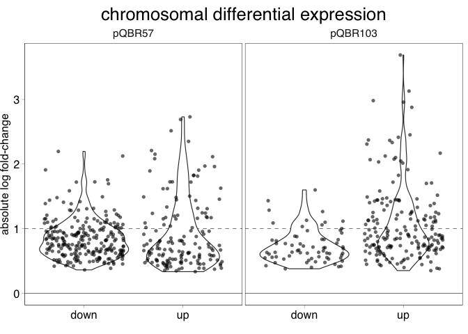
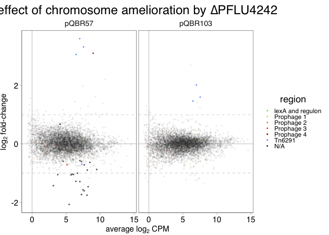
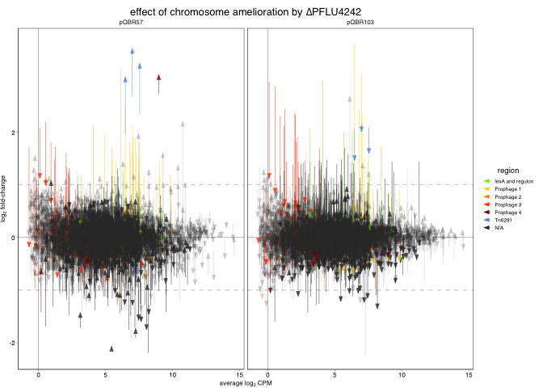

COMPMUT RNAseq Analysis 6a: Chromosomal genes — plots, figures, and
analysis
================
jpjh
24 February, 2021

## Analysis of edgeR tables outline

This data was collected in
[`COMPMUT_RNAseq_4_edgeR.Rmd`](COMPMUT_RNAseq_4_edgeR.md).

This analysis will pull out differentially expressed genes under the
different treatments.

1.  Chromosomal genes differentially expressed relative to the ancestor.

-   Effect of plasmid acquisition
-   Effect of ameliorations without plasmid
-   Effect of ameliorations on effect of plasmid

1.  Chromosomal genes differentially expressed relative to the
    unameliorated plasmid.

-   Are the genes which are upregulated by the plasmid and then not
    significantly different from the ancestor significantly
    downregulated relative to the plasmid-carrying strain?

1.  Plasmid genes differentially expressed relative to the unameliorated
    plasmid.

-   Comparisons of gene expression from plasmid and from chromosome.

This document covers points 1 and 2. For points 3, see
[`COMPMUT_RNAseq_6b_analysis`](COMPMUT_RNAseq_6b_analysis.md) for pQBR57
genes, and [`COMPMUT_RNAseq_6c_analysis`](COMPMUT_RNAseq_6c_analysis.md)
for pQBR103 genes.

### 1. Chromosomal differential expression relative to plasmid-free

Load up the data for chromosomal differential expression. Note that this
is in wide format.

``` r
full_table_chr <- read.csv("../data/COMPMUT_RNAseq_1_de_table_chr_vanc.csv", sep=",")
dim(full_table_chr)
```

    ## [1] 5889   45

``` r
full_table_chr$gene <- rownames(full_table_chr)
```

Generate volcano plots for each treatment. Reshape data into long format
for plotting.

Wide format is indicated by `tab` or `table`, in contrast to long
format.

``` r
source("../functions/makeLong.R")

chr <- makeLong(full_table_chr)
head(chr)
```

    ##        gene          contrast       FDR   logCPM        logFC plasmid
    ## 1 PFLU_0001        none.dgacS 0.8898372 8.451345  0.045629144    none
    ## 2 PFLU_0001    none.dPFLU4242 0.9998713 8.451345 -0.048097689    none
    ## 3 PFLU_0001     pQBR103.dgacS 0.7470587 8.451345  0.067027229 pQBR103
    ## 4 PFLU_0001 pQBR103.dPFLU4242 0.9983876 8.451345  0.043746251 pQBR103
    ## 5 PFLU_0001        pQBR103.wt 0.9924145 8.451345 -0.004828774 pQBR103
    ## 6 PFLU_0001      pQBR57.dgacS 0.4789853 8.451345  0.139080274  pQBR57
    ##   amelioration
    ## 1        dgacS
    ## 2    dPFLU4242
    ## 3        dgacS
    ## 4    dPFLU4242
    ## 5           wt
    ## 6        dgacS

Generate plots. Plots that I might want to output are indicated by `p`.

``` r
(p_chr <- ggplot(data=chr, aes(x=logFC, y=(-log10(FDR)))) +
  ggtitle("chromosomal transcripts") +
  geom_vline(xintercept=0, size=0.1) +
  geom_vline(xintercept=c(-1,1), size=0.1, linetype="dashed") +
  geom_hline(yintercept=0, size=0.1) + 
  geom_hline(yintercept=-log10(0.05), size=0.1, linetype="dashed") + 
  geom_point(alpha=0.5, shape=16, size=0.4) +
  facet_grid(plasmid~amelioration))
```

<!-- -->

Plot abundance against logFC for each condition (MA plots).

``` r
(p_ma_chr <- ggplot(data=chr, aes(y=logFC, x=logCPM, colour=ifelse(FDR<0.05,"sig","nonsig"))) +
  ggtitle("chromosomal transcripts MA plot") +
  geom_hline(yintercept=0, size=0.1) + 
  geom_hline(yintercept=1, size=0.1, linetype="dashed") + 
  geom_hline(yintercept=-1, size=0.1, linetype="dashed") +
  scale_colour_manual(values=c("black","red")) +
  geom_point(alpha=0.5, shape=16, size=0.4) +
  facet_grid(plasmid~amelioration))
```

<!-- -->

Investigate differentially expressed &gt;2x change transcripts from the
chromosome.

``` r
list_2xde_chr <- chr %>% filter(FDR<0.05 & abs(logFC)>1) %>% select(gene) %>% pull() %>% unique()
length(list_2xde_chr)
```

    ## [1] 570

570 &gt;2x differentially-expressed sense transcripts across all
treatments.

Plot each of these as heat maps. Use the `fct_reorder` function from
package `forcats` to order each axis by the mean logFC.

``` r
chr_2xde <- chr %>% filter(gene %in% list_2xde_chr)

ggplot(data=chr_2xde, 
       aes(x=fct_reorder(contrast, logFC), y=forcats::fct_reorder(gene, logFC), fill=logFC)) + 
  ggtitle("chromosomal transcripts >2x DE in ≥1 treatment relative to wild-type plasmid-free") +
  geom_tile() +
  scale_fill_gradient2() + 
  theme(legend.position="right", 
        axis.text.x=element_text(angle=45, hjust=1), axis.text.y = element_blank())
```

<!-- -->

The main pattern here is the gacS mutants, which all show a broadly
similar cohort of genes downregulated by mutation, as well as a subset
which are upregulated.

#### 1.1. Investigating effects of plasmid acquistion

How many genes are significantly (FDR&lt;0.05) differentially regulated
following acquisition by each plasmid?

``` r
chr_pq_de_summ <- chr %>% group_by(plasmid, amelioration) %>%
  filter(FDR<0.05) %>%
  summarise(de_all = n(),
            up_all = sum(logFC>0),
            down_all = sum(logFC<0),
            up_2x = sum(logFC>1),
            down_2x = sum(logFC<(-1)))
```

    ## `summarise()` has grouped output by 'plasmid'. You can override using the `.groups` argument.

``` r
chr_pq_de_summ %>% filter(amelioration=="wt")
```

    ## # A tibble: 2 x 7
    ## # Groups:   plasmid [2]
    ##   plasmid amelioration de_all up_all down_all up_2x down_2x
    ##   <fct>   <fct>         <int>  <int>    <int> <int>   <int>
    ## 1 pQBR57  wt              398    153      245    47      60
    ## 2 pQBR103 wt              254    186       68    77      11

Both pQBR57 and pQBR103 downregulate genes as well as upregulate them.
In fact, pQBR57 downregulates more genes than it upregulates.

For both plasmids there are many differentially-expressed genes but
which aren’t &gt;2x DE. Plot the distribution of fold-changes.

``` r
ggplot(data=subset(chr, amelioration=="wt" & plasmid %in% c("pQBR57","pQBR103") & FDR<0.05), 
       aes(x=ifelse(logFC>0, "up", "down"), 
                             y=abs(logFC))) +
  geom_hline(yintercept=0, size=0.2) +
  geom_hline(yintercept=1, size=0.2, linetype="dashed") +
  geom_violin(size=0.4) + geom_point(position=position_jitter(), shape=16, alpha=0.6) + facet_wrap(.~plasmid) +
  labs(x="", y="absolute log fold-change") +
  ggtitle("chromosomal differential expression")
```

<!-- -->

##### What genes are similarly regulated by the plasmids?

Genes differentially-expressed by each plasmid.

``` r
chr_pq57_de <- chr %>% filter(amelioration=="wt" & plasmid=="pQBR57" & FDR<0.05)
chr_pq103_de <- chr %>% filter(amelioration=="wt" & plasmid=="pQBR103" & FDR<0.05)
```

First investigate the common responses to plasmid acquisition.

What genes are upregulated by both plasmids?

``` r
up_both <- full_table_chr %>% filter(pQBR57.wt.FDR<0.05 & pQBR103.wt.FDR<0.05 &
                          pQBR57.wt.logFC>0 & pQBR103.wt.logFC>0)
rownames(up_both)
```

    ##  [1] "PFLU_0054"  "PFLU_0848"  "PFLU_1169"  "PFLU_1170"  "PFLU_1171" 
    ##  [6] "PFLU_1172"  "PFLU_1173"  "PFLU_1174"  "PFLU_1175"  "PFLU_1177" 
    ## [11] "PFLU_1178"  "PFLU_1179"  "PFLU_1180"  "PFLU_1182"  "PFLU_1183" 
    ## [16] "PFLU_1184"  "PFLU_1185"  "PFLU_1189"  "PFLU_1190"  "PFLU_1482" 
    ## [21] "PFLU_1559"  "PFLU_1560"  "PFLU_1886"  "PFLU_1887"  "PFLU_1888" 
    ## [26] "PFLU_2834"  "PFLU_2835"  "PFLU_2836"  "PFLU_2837"  "PFLU_2838" 
    ## [31] "PFLU_2839"  "PFLU_2841"  "PFLU_2842"  "PFLU_2850"  "PFLU_2851" 
    ## [36] "PFLU_2852"  "PFLU_2853"  "PFLU_2854"  "PFLU_2857A" "PFLU_2858" 
    ## [41] "PFLU_2861"  "PFLU_3047"  "PFLU_3055"  "PFLU_3605"  "PFLU_4162" 
    ## [46] "PFLU_4163"  "PFLU_5096"  "PFLU_5271"  "PFLU_5498"  "PFLU_5959"

50 genes upregulated by both plasmids.

Many of these are sequential genes, indicating operons. Exploratory
analyses already identified upregulation of prophage/tailocin loci.
[Silby et
al. (2009)](https://www.ncbi.nlm.nih.gov/pmc/articles/PMC2718517/)
identifies prophage loci in the SBW genome at the following locations
(see Supplementary Table 3):

-   Prophage 1: 1304498..1317448 (12,951 bp), including genes
    PFLU\_1169–PFLU\_1187.
-   Prophage 2: 1738434..1754039, including PFLU\_1587-PFLU\_1600.
-   Prophage 3: 3107845..3166503, including PFLU\_2817 to PFLU\_2905.
    PFLU\_2860 is a putative holin, according to PHASTER.
-   Prophage 4: 4565054..4584205, including PFLU\_4122A to PFLU\_4140.
-   Tn6921: 2060106..2082441, including PFLU\_1885 to PFLU\_1909.

This leaves 16 genes. Notable amongst these is PFLU\_1560 and
PFLU\_3605, which are lexA homologues, and PFLU\_1559 (sul1 cell
division inhibitor), a known part of SOS response. The activation of the
SOS response would also explain the activation of the prophages.

What other genes are in the SOS regulon in SBW25, and how many of these
are also activated? This is investigated in
[`COMPMUT_RNAseq_7_lexA.Rmd`](COMPMUT_RNAseq_7_lexA.md), giving the
following list of 12 genes with a lexA-consensus site within 150 bp of
the start codon:

``` r
lexA <- read.csv("../rnaseq/ref/LexA_sites.csv", sep=",", header=FALSE, stringsAsFactors = FALSE)
colnames(lexA) <- c("position","distance","locus_tag","strand")
lexA <- with(lexA, lexA[order(position),])
(lexA_downstream_genes <- lexA[lexA$distance<151,"locus_tag"])
```

    ##  [1] "PFLU_0054" "PFLU_0848" "PFLU_0902" "PFLU_1166" "PFLU_1189" "PFLU_1295"
    ##  [7] "PFLU_1323" "PFLU_1560" "PFLU_1750" "PFLU_3139" "PFLU_4940" "PFLU_5271"

This allows us to explain several of the remaining upregulated-by-both
genes:

-   PFLU\_0054: SOS-regulated
-   PFLU\_0848: SOS-regulated
-   PFLU\_1189: recA, SOS-regulated
-   PFLU\_1190: recX, downstream of recA and likely part of the same
    operon
-   PFLU\_1559: downstream of lexA and likely part of the same operon
-   PFLU\_1560: lexA
-   PFLU\_3605: lexA homologue
-   PFLU\_5271: SOS-regulated

The lexA homologues don’t have lexA binding sites, so add these to
`lexA_and_regulon`.

``` r
lexA_and_regulon <- c(lexA_downstream_genes, "PFLU_1559","PFLU_3605")
```

Leaving the following 8 genes upregulated by both but not part of either
a prophage/transposon or the immediate lexA regulon:

-   PFLU\_1482: putative colicin-pore forming protein (bacteriocin?)
-   PFLU\_3047: putative methyl-accepting chemotaxis protein
-   PFLU\_3055: uncharacterised
-   PFLU\_4162: uncharacterised
-   PFLU\_4163: DNA-specific endonuclease I (EC 3.1.21.1)
-   PFLU\_5096: Putative chemotaxis-related protein
-   PFLU\_5498: UvrA (excinuclease)
-   PFLU\_5959: Putative multidrug resistance transporter

Also, seven putative SOS-regulated genes are not upregulated by both
plasmids.

``` r
lexA_and_regulon[!(lexA_and_regulon %in% rownames(up_both))]
```

    ## [1] "PFLU_0902" "PFLU_1166" "PFLU_1295" "PFLU_1323" "PFLU_1750" "PFLU_3139"
    ## [7] "PFLU_4940"

-   PFLU\_0902: conserved hypothetical
-   PFLU\_1166: conserved hypothetical upstream of mutS
-   PFLU\_1295: alcohol dehydrogenase, upstream of lysR regulatory
    protein on other strand
-   PFLU\_1323: putative membrane protein, upstream of helicase on other
    strand
-   PFLU\_1750: conserved hypothetical upstream of ribosomal subunit
-   PFLU\_3139: conserved hypothetical
-   PFLU\_4940: exodeoxyribonuclease I

Get details on these from the table.

``` r
full_table_chr[lexA_and_regulon[!(lexA_and_regulon %in% rownames(up_both))],
                grep("pQBR...?\\.wt\\.",colnames(full_table_chr))]
```

    ##           pQBR57.wt.logFC pQBR57.wt.logCPM pQBR57.wt.F pQBR57.wt.PValue
    ## PFLU_0902      0.18541169         3.759663  1.72984593       0.20033323
    ## PFLU_1166     -0.58607855         8.018031 12.33235483       0.00170915
    ## PFLU_1295      0.19558120         8.097686  2.34767397       0.13799261
    ## PFLU_1323      0.41660240         3.605014  6.63217297       0.01629804
    ## PFLU_1750      0.01910422         6.269904  0.01669029       0.89823744
    ## PFLU_3139     -0.10611751         4.299628  0.76548874       0.38992114
    ## PFLU_4940     -0.02649605         6.265759  0.03762269       0.84776576
    ##           pQBR57.wt.FDR pQBR103.wt.logFC pQBR103.wt.logCPM pQBR103.wt.F
    ## PFLU_0902    0.44755782       0.02122139          3.759663    0.0225575
    ## PFLU_1166    0.03366283      -0.12100107          8.018031    0.5300512
    ## PFLU_1295    0.36457537      -0.20824365          8.097686    2.6589726
    ## PFLU_1323    0.11805554       0.61166474          3.605014   14.4115878
    ## PFLU_1750    0.95728647       0.60393245          6.269904   16.6603891
    ## PFLU_3139    0.63383473       0.61866713          4.299628   26.5400638
    ## PFLU_4940    0.93743225      -0.26866489          6.265759    3.8578107
    ##           pQBR103.wt.PValue pQBR103.wt.FDR
    ## PFLU_0902      8.818153e-01    0.972287093
    ## PFLU_1166      4.733307e-01    0.813140238
    ## PFLU_1295      1.154677e-01    0.455756760
    ## PFLU_1323      8.314064e-04    0.026609524
    ## PFLU_1750      3.997508e-04    0.015978759
    ## PFLU_3139      2.497837e-05    0.001961301
    ## PFLU_4940      6.069326e-02    0.335608098

Some of these are upregulated by pQBR103 (PFLU\_1323, 1750, 3139), and
one (PFLU\_1166) is possibly downregulated by pQBR57.

Add details of each region to the table enabling annotation in the
plots. See
[`COMPMUT_RNAseq_5_gene_info.Rmd`](COMPMUT_RNAseq_5_gene_info.md) for
details of how I generated the table of gene info.

``` r
gene_info <- read.table("../rnaseq/ref/AM181176_gene_info.tsv", header=TRUE, sep="\t",
                      stringsAsFactors = FALSE)
```

Annotate gene\_info with information on the regions or regulons to which
these genes belong. Genes are assigned to the mobile genetic elements
(prophage/Tn6291) if either their start or their end is within the
element. The llocations of the MGEs was from [Silby et
al. (2009)](https://www.ncbi.nlm.nih.gov/pmc/articles/PMC2718517/) or
[Hall et al. (2017)](dx.doi.org/10.1038/s41559-017-0250-3).

``` r
regions <- data.frame(region = c("Prophage 1","Prophage 2","Prophage 3","Prophage 4","Tn6291"),
                      start  = c(1304498,     1738434,     3107845,     4565054,     2060106),
                      end    = c(1317448,     1754039,     3166503,     4584205,     2082441),
                      stringsAsFactors=FALSE)

gene_info$region <- ""

for (i in 1:nrow(gene_info)){
  x <- gene_info[i,]
  region <- with(regions, regions[(x$start>start & x$start<end) | 
                                    (x$end>start & x$end<end),"region"])
  if(length(region)>1){
    print("Regions must be non-overlapping")
    break
  } else if(length(region)==0){
    region <- "N/A"
  }
  gene_info[i,"region"] <- region
}
```

Add the lexA regulon to `gene_info`.

``` r
gene_info[gene_info$locus_tag %in% lexA_and_regulon,"region"] <- "lexA and regulon"
```

Apply these regions to `full_table_chr`.

``` r
rownames(gene_info) <- gene_info$locus_tag
full_table_chr$region <- gene_info[rownames(full_table_chr),"region"]

full_table_chr$region <- factor(full_table_chr$region, 
                                levels=c("lexA and regulon", regions$region, "N/A"))
```

**‘Candidate cost’ genes**

The fact that both plasmids upregulate a similar set of genes suggests
that these might be causally reponsible, at least in part, for plasmid
cost. Get a shortlist of ‘candidate cost’ genes for further analysis.
These are genes that are more than 2x upregulated by both plasmids, and
are not upregulated in the compensated mutants.

``` r
up_both_2x <- full_table_chr %>% filter(gene %in% rownames(up_both) &
                                        pQBR57.wt.logFC>1 & pQBR103.wt.logFC>1)
```

25 genes are &gt;2x upregulated by both plasmids.

``` r
candidate_cost <- up_both_2x %>% filter(pQBR57.dPFLU4242.FDR>0.05 & pQBR103.dPFLU4242.FDR>0.05)
```

22 genes are &gt;2x upregulated by both plasmids and not significantly
DE in the PFLU4242 mutant.

Collect this shortlist for examination. Read in the list of genes that
were eventually selected for expression, and print together as a table.

``` r
cols_to_take <- c("gene","region","pQBR103.wt.logCPM","pQBR103.wt.FDR","pQBR57.wt.FDR",
                  "pQBR57.dPFLU4242.FDR","pQBR103.dPFLU4242.FDR")

write.csv(candidate_cost[,cols_to_take], 
          file="../rnaseq/CandidateCost.csv")

expressed <- readLines("../rnaseq/expressed.txt")

candidate_cost %>% mutate(expressed = ifelse(gene %in% expressed, "*", "")) %>%
  select(all_of(cols_to_take), region, expressed) %>% kable()
```

|            | gene       | region           | pQBR103.wt.logCPM | pQBR103.wt.FDR | pQBR57.wt.FDR | pQBR57.dPFLU4242.FDR | pQBR103.dPFLU4242.FDR | expressed |
|:-----------|:-----------|:-----------------|------------------:|---------------:|--------------:|---------------------:|----------------------:|:----------|
| PFLU\_0054 | PFLU\_0054 | lexA and regulon |         4.0972041 |      0.0000000 |     0.0000001 |            0.6272468 |             0.9715632 | \*        |
| PFLU\_1169 | PFLU\_1169 | Prophage 1       |         6.4662261 |      0.0000001 |     0.0000197 |            0.6810251 |             0.8713554 | \*        |
| PFLU\_1170 | PFLU\_1170 | Prophage 1       |         7.0060263 |      0.0000000 |     0.0000006 |            0.5923398 |             0.8963404 | \*        |
| PFLU\_1171 | PFLU\_1171 | Prophage 1       |         7.0247388 |      0.0000004 |     0.0000113 |            0.8382105 |             0.9983876 | \*        |
| PFLU\_1172 | PFLU\_1172 | Prophage 1       |         6.8032418 |      0.0000000 |     0.0000024 |            0.7507919 |             0.9983876 |           |
| PFLU\_1173 | PFLU\_1173 | Prophage 1       |         7.5068936 |      0.0000000 |     0.0000001 |            0.8495269 |             0.9852996 | \*        |
| PFLU\_1174 | PFLU\_1174 | Prophage 1       |         7.2009260 |      0.0000221 |     0.0000009 |            0.7376472 |             0.9983876 | \*        |
| PFLU\_1559 | PFLU\_1559 | lexA and regulon |         5.6522317 |      0.0000000 |     0.0000007 |            0.7739964 |             0.7023155 |           |
| PFLU\_1560 | PFLU\_1560 | lexA and regulon |         6.2948464 |      0.0000000 |     0.0000002 |            0.6267583 |             0.7023155 |           |
| PFLU\_2835 | PFLU\_2835 | Prophage 3       |         1.2011432 |      0.0000033 |     0.0009528 |            0.9134176 |             0.7613184 |           |
| PFLU\_2836 | PFLU\_2836 | Prophage 3       |         3.8412075 |      0.0000001 |     0.0001200 |            0.8280343 |             0.7023155 |           |
| PFLU\_2838 | PFLU\_2838 | Prophage 3       |         0.0970863 |      0.0001858 |     0.0128596 |            0.4915496 |             0.7523855 |           |
| PFLU\_2839 | PFLU\_2839 | Prophage 3       |         0.5327719 |      0.0000121 |     0.0009528 |            0.4593371 |             0.7813800 | \*        |
| PFLU\_2841 | PFLU\_2841 | Prophage 3       |         1.2558780 |      0.0000457 |     0.0049987 |            0.7930456 |             0.8410448 | \*        |
| PFLU\_2850 | PFLU\_2850 | Prophage 3       |         0.9260357 |      0.0002473 |     0.0049731 |            0.6075101 |             0.9715632 |           |
| PFLU\_2851 | PFLU\_2851 | Prophage 3       |         2.0599982 |      0.0000014 |     0.0004193 |            0.9643725 |             0.7220948 |           |
| PFLU\_2852 | PFLU\_2852 | Prophage 3       |         2.2623203 |      0.0002213 |     0.0024577 |            0.8987819 |             0.7874230 |           |
| PFLU\_2853 | PFLU\_2853 | Prophage 3       |         2.2033046 |      0.0000026 |     0.0015252 |            0.8240467 |             0.7071114 |           |
| PFLU\_2854 | PFLU\_2854 | Prophage 3       |         2.1162074 |      0.0000001 |     0.0000192 |            0.8668477 |             0.6595927 |           |
| PFLU\_2861 | PFLU\_2861 | Prophage 3       |        -0.1204213 |      0.0447184 |     0.0448659 |            0.9587605 |             0.9194326 |           |
| PFLU\_3605 | PFLU\_3605 | lexA and regulon |         3.1549291 |      0.0003663 |     0.0411467 |            0.8406607 |             0.9567231 |           |
| PFLU\_5959 | PFLU\_5959 | N/A              |         5.4773694 |      0.0000005 |     0.0000197 |            0.8860592 |             0.9567231 |           |

This shortlist was examined and genes were selected for inducible
expression.

**Plots**

Add these details to the volcano plots for the plasmids. In addition,
use different size points to indicate whether a gene is significantly
upregulated by both plasmids.

``` r
chr$region <- factor(full_table_chr[chr$gene,"region"],
                     levels=c("lexA and regulon", regions$region, "N/A"))

cols <- c("chartreuse2","gold1","orange2","orangered1","darkred","cornflowerblue","grey20")

(plot_fig12 <- ggplot(data=subset(chr, amelioration=="wt" & plasmid %in% c("pQBR103","pQBR57")),
                 aes(x=logFC, y=(-log10(FDR)), colour=region, alpha=region, 
                     size=ifelse(gene %in% rownames(up_both), "both", ""))) +
    ggtitle("chromosomal sense transcripts") +
    geom_vline(xintercept=0, size=0.1) +
    geom_vline(xintercept=c(-1,1), size=0.1, linetype="dashed") +
    geom_hline(yintercept=0, size=0.1) + 
    geom_hline(yintercept=-log10(0.05), size=0.1, linetype="dashed") + 
    geom_point(shape=16) +
    scale_colour_manual(values=cols) +
    scale_alpha_manual(values=c(rep(0.8,6),0.2)) +
    scale_size_manual(values=c(0.5,0.8), guide=FALSE) +
    labs(x=expression(paste("log"[2]," fold-change")), y=expression(paste("-log"[10]," FDR"))) +
    geom_point(data=subset(chr, gene=="PFLU_1169" & amelioration=="wt" & plasmid %in% c("pQBR103","pQBR57")),
               shape=1, size=1.5, colour="black", alpha=0.8) +
    facet_grid(.~plasmid) +
    theme(legend.position="right"))
```

<!-- -->

The prophage loci (at least prophage 1) are tailocins, and are most
likely upregulated as a consequence of the SOS response. Therefore, it
seems that the common gene activation to acquisition of either plasmid
can be explained by the SOS response.

Output this image in colour.

``` r
svglite::svglite(height=3.5, width=5.4, file = "../plots/Fig12.svg")
plot_fig12 + theme_pub() + theme(legend.position="right")
dev.off()
```

    ## quartz_off_screen 
    ##                 2

Similar figures can be plotted as MA plots.

``` r
(p_chr_col_ma <- ggplot(data=subset(chr, amelioration=="wt" & plasmid %in% c("pQBR103","pQBR57")),
                 aes(x=logCPM, y=logFC, colour=region, alpha=region, 
                     size=ifelse(gene %in% rownames(up_both), "both", ""))) +
    ggtitle("chromosomal sense transcripts") +
    geom_vline(xintercept=0, size=0.1) +
    geom_hline(yintercept=c(-1,1), size=0.1, linetype="dashed") +
    geom_hline(yintercept=0, size=0.1) + 
    geom_point(shape=16) +
    scale_colour_manual(values=cols) +
    scale_alpha_manual(values=c(rep(0.8,6),0.2)) +
    scale_size_manual(values=c(0.5,0.8), guide=FALSE) +
       geom_point(data=subset(chr, gene=="PFLU_1169" & amelioration=="wt" & plasmid %in% c("pQBR103","pQBR57")),
               shape=1, size=1.5, colour="black", alpha=0.8) +
    labs(y=expression(paste("log"[2]," fold-change")), x=expression(paste("average log"[2]," CPM"))) +
    facet_grid(.~plasmid) +
    theme_pub() + theme(legend.position="right"))
```

<!-- -->

Log fold-change for each plasmid can also be plotted directly against
one another:

``` r
lines <- data.frame(intercept= c(-1,0,1),
                    linetype = c("2","1","2"))
leg_title <- "FDR <0.05"

tab_chr_pq_de <- full_table_chr[unique(union(chr_pq57_de$gene, chr_pq103_de$gene)),
                                  c(grep("pQBR...?\\.wt\\.",colnames(full_table_chr), value=TRUE),"region")]

sig <- with(tab_chr_pq_de, ifelse(pQBR57.wt.FDR<0.05 & pQBR103.wt.FDR<0.05, "both",
                                  ifelse(pQBR57.wt.FDR<0.05, "pQBR57 only",
                                  ifelse(pQBR103.wt.FDR<0.05, "pQBR103 only", "neither"))))

(p_chr_pq_col <- ggplot(data=tab_chr_pq_de, aes(x=pQBR57.wt.logFC, y=pQBR103.wt.logFC)) +
  geom_vline(data=lines, aes(xintercept=intercept, linetype=linetype), size=0.2, show.legend=FALSE) +
  geom_hline(data=lines, aes(yintercept=intercept, linetype=linetype), size=0.2, show.legend=FALSE) +
  geom_point(aes(shape=sig, size=sig, colour=region), alpha=0.8) +
    geom_point(data=tab_chr_pq_de["PFLU_1169",],
               shape=1, size=1.5, colour="black", alpha=0.8) +
  scale_size_manual(values=c(1.5,0.8,0.8)) + 
  scale_shape_manual(values=c(16,0,4)) +
  scale_colour_manual(values=cols,
                      breaks=) +
  coord_fixed() + 
  labs(x="pQBR57 log fold-change", y="pQBR103 log fold-change", 
       alpha=leg_title, size=leg_title, shape=leg_title) +
  theme_pub() + theme(legend.position="right"))
```

<!-- -->

The genes in the top right quadrant are upregulated by both plasmids.

However, it may be misleading to look for correlations between these
axes as both have the same denominator.

###### Downregulated by both

The genes downregulated by both plasmids:

``` r
down_both <- full_table_chr %>% filter(pQBR57.wt.FDR<0.05 & pQBR103.wt.FDR<0.05 &
                            pQBR57.wt.logFC<0 & pQBR103.wt.logFC<0)
```

7 genes.

``` r
kable(gene_info[rownames(down_both),c("locus_tag","protein_name")])
```

|             | locus\_tag  | protein\_name                           |
|:------------|:------------|:----------------------------------------|
| PFLU\_0954  | PFLU\_0954  | Uncharacterized protein                 |
| PFLU\_0955  | PFLU\_0955  | Uncharacterized protein                 |
| PFLU\_1695  | PFLU\_1695  | Uncharacterized protein                 |
| PFLU\_1720  | PFLU\_1720  | Putative LysR-family regulatory protein |
| PFLU\_3205  | PFLU\_3205  | Uncharacterized protein                 |
| PFLU\_3415  | PFLU\_3415  | Putative hydrolase                      |
| PFLU\_4125A | PFLU\_4125A | Uncharacterized protein                 |

Most of these are uncharacterised proteins. PFLU\_1720 is a LysR
transcriptional regulator, which are abundant in prokaryotes (see
[Maddocks & Oyston,
2008](https://www.ncbi.nlm.nih.gov/pubmed/19047729)).

###### Downregulated by pQBR57 but upregulated by pQBR103

There is an interesting cluster of transcripts that are significantly
downregulated by pQBR57 but significantly upregulated by pQBR103 (there
are no genes that are the converse).

``` r
down57_up103 <- full_table_chr %>% filter(pQBR57.wt.FDR<0.05 & pQBR103.wt.FDR<0.05 &
                       pQBR57.wt.logFC<0 & pQBR103.wt.logFC>0)
```

33 genes. These seem to have a wide range of functions. Some of the
genes are consecutive and may be part of the same operon.

``` r
kable(gene_info[rownames(down57_up103),c("locus_tag","strand")])
```

-   PFLU\_0061, PFLU\_0063 (+ strand)
-   PFLU\_0146 +
-   PFLU\_0645 -
-   PFLU\_1321 +
-   PFLU\_2039 -
-   PFLU\_2071, PFLU\_2076, PFLU\_2078, PFLU\_2079, PFLU\_2081 (-
    strand)
-   PFLU\_2410 +
-   PFLU\_2696 -
-   PFLU\_2762, PFLU\_2763 (+ strand)
-   PFLU\_3014 +
-   PFLU\_3030 +
-   PFLU\_3146 -
-   PFLU\_3364, PFLU\_3365, PFLU\_3369 (+ strand)
-   PFLU\_3389, PFLU\_3391, PFLU\_3392, PFLU\_3393 (+ strand)
-   PFLU\_3401 +
-   PFLU\_3900, PFLU\_3901, PFLU\_3902 (- strand)
-   PFLU\_4510 +
-   PFLU\_4819 -
-   PFLU\_5583, PFLU\_5584 (+ strand)

Are there any functions overrepresented amongst these genes?

Use [goatools](https://github.com/tanghaibao/goatools) for analysis.

``` bash
. ~/miniconda3/etc/profile.d/conda.sh

conda config --add channels defaults
conda config --add channels bioconda
conda config --add channels conda-forge

conda install goatools

mkdir -p ../goatools/data
```

goatools requires three files, one describing the study genes, one
describing the population genes, and one describing the association
between these files.

``` r
write.table(rownames(down57_up103), file="../goatools/data/down57_up103.txt",
            sep="", quote=FALSE, row.names=FALSE, col.names = FALSE)
write.table(gene_info[,"locus_tag"], file="../goatools/data/SBW25_genes.txt",
            sep="", quote=FALSE, row.names=FALSE, col.names = FALSE)

associations <- data.frame(locus_tag = gene_info$locus_tag,
                           go_terms = gsub(" ","",gene_info$go))

write.table(associations, file="../goatools/data/SBW25_genes_go.txt",
            sep="\t", quote=FALSE, row.names=FALSE, col.names = FALSE)
```

Run goatools.

``` bash
wget http://geneontology.org/ontology/go-basic.obo

conda activate

find_enrichment.py ../goatools/data/down57_up103.txt \
                   ../goatools/data/SBW25_genes.txt \
                   ../goatools/data/SBW25_genes_go.txt \
                   --outfile ../goatools/down57_up103.tsv
                   
```

Read data into R and investigate.

``` r
down57_up103_go <- read.table("../goatools/down57_up103.tsv", sep="\t",
                              header=FALSE)
colnames(down57_up103_go) <- c("GO","NS","enrichment","name","ratio_in_study",
                               "ratio_in_pop","p_uncorrected",
                               "depth","study_count","p_bonferroni","p_sidak",
                               "p_holm","p_fdr_bh","study_items")
down57_up103_go[down57_up103_go$p_fdr_bh<0.1,
                c("GO","name","ratio_in_study","p_fdr_bh")] %>% kable()
```

|     | GO           | name                                                 | ratio\_in\_study | p\_fdr\_bh |
|:----|:-------------|:-----------------------------------------------------|:-----------------|-----------:|
| 1   | <GO:0006112> | energy reserve metabolic process                     | 3/33             |  0.0001141 |
| 2   | <GO:0005977> | glycogen metabolic process                           | 3/33             |  0.0001141 |
| 3   | <GO:0015980> | energy derivation by oxidation of organic compounds  | 4/33             |  0.0008601 |
| 4   | <GO:0005975> | carbohydrate metabolic process                       | 7/33             |  0.0047055 |
| 5   | <GO:0006073> | cellular glucan metabolic process                    | 3/33             |  0.0060910 |
| 6   | <GO:0044042> | glucan metabolic process                             | 3/33             |  0.0060910 |
| 7   | <GO:0005978> | glycogen biosynthetic process                        | 2/33             |  0.0063181 |
| 8   | <GO:0005976> | polysaccharide metabolic process                     | 4/33             |  0.0165716 |
| 9   | <GO:0006091> | generation of precursor metabolites and energy       | 4/33             |  0.0276191 |
| 10  | <GO:0044262> | cellular carbohydrate metabolic process              | 4/33             |  0.0276191 |
| 11  | <GO:0016051> | carbohydrate biosynthetic process                    | 4/33             |  0.0356826 |
| 12  | <GO:0034637> | cellular carbohydrate biosynthetic process           | 3/33             |  0.0935399 |
| 28  | <GO:0006807> | nitrogen compound metabolic process                  | 0/33             |  0.0935399 |
| 43  | <GO:0004553> | hydrolase activity, hydrolyzing O-glycosyl compounds | 4/33             |  0.0033373 |
| 44  | <GO:0016798> | hydrolase activity, acting on glycosyl bonds         | 4/33             |  0.0163167 |

All of the enriched functions seem generally associated with metabolism,
with the top scoring terms related to glycogen/carbohydrate. These are
associated with 7/33 of the genes in this cluster.

###### Upregulated by pQBR57 and downregulated by pQBR103

``` r
up57_down103 <- full_table_chr %>% filter(pQBR57.wt.FDR<0.05 & pQBR103.wt.FDR<0.05 &
                       pQBR57.wt.logFC>0 & pQBR103.wt.logFC<0)
nrow(up57_down103)
```

    ## [1] 0

No genes are upregulated by pQBR57 and downregulated by pQBR103.

##### Transcriptional effects of each plasmid

We have now characterised the genes that are differentially regulated by
both plasmids. Now consider each plasmid separately. What are their
overall effects on expression?

Recall this table:

``` r
kable(chr_pq_de_summ)
```

| plasmid | amelioration        | de\_all | up\_all | down\_all | up\_2x | down\_2x |
|:--------|:--------------------|--------:|--------:|----------:|-------:|---------:|
| none    | dgacS               |     733 |     191 |       542 |     31 |      274 |
| pQBR57  | wt                  |     398 |     153 |       245 |     47 |       60 |
| pQBR57  | dPFLU4242           |      28 |       5 |        23 |      4 |       14 |
| pQBR57  | dgacS               |    1103 |     367 |       736 |     57 |      329 |
| pQBR57  | PQBR57\_0059\_V100A |      25 |       5 |        20 |      4 |       10 |
| pQBR103 | wt                  |     254 |     186 |        68 |     77 |       11 |
| pQBR103 | dPFLU4242           |       3 |       3 |         0 |      3 |        0 |
| pQBR103 | dgacS               |    1019 |     290 |       729 |     22 |      326 |

###### Differentially regulated by pQBR57

Get the list of genes upregulated by pQBR57 and perform GO analysis as
above. Analyse all genes (not only those exclusively DE by pQBR57) to
get a global picture.

Get files…

``` r
chr_pq57_de <- chr %>% filter(plasmid=="pQBR57" & amelioration=="wt" & FDR<0.05)
chr_pq57_up <- chr_pq57_de %>% filter(logFC>0)

write.table(chr_pq57_up$gene, file="../goatools/data/up57.txt",
            sep="", quote=FALSE, row.names=FALSE, col.names = FALSE)

chr_pq57_down <- chr_pq57_de %>% filter(logFC<0)

write.table(chr_pq57_down$gene, file="../goatools/data/down57.txt",
            sep="", quote=FALSE, row.names=FALSE, col.names = FALSE)
```

Run goatools…

``` bash
find_enrichment.py ../goatools/data/up57.txt \
                   ../goatools/data/SBW25_genes.txt \
                   ../goatools/data/SBW25_genes_go.txt \
                   --outfile ../goatools/up57.tsv
                   
find_enrichment.py ../goatools/data/down57.txt \
                   ../goatools/data/SBW25_genes.txt \
                   ../goatools/data/SBW25_genes_go.txt \
                   --outfile ../goatools/down57.tsv
```

Analyse: upregulated genes (focus on ‘biological process’, aka BP).

``` r
go_colnames <- c("GO","NS","enrichment","name","ratio_in_study",
                       "ratio_in_pop","p_uncorrected",
                       "depth","study_count","p_bonferroni","p_sidak",
                       "p_holm","p_fdr_bh","study_items")

up57_go <- read.table("../goatools/up57.tsv", sep="\t",
                      header=FALSE, col.names=go_colnames)

up57_go %>% filter(p_fdr_bh<0.1 & NS=="BP") %>% arrange(p_fdr_bh) %>% 
  select(GO, name, ratio_in_study, p_fdr_bh) %>%
  kable()
```

| GO           | name                                        | ratio\_in\_study | p\_fdr\_bh |
|:-------------|:--------------------------------------------|:-----------------|-----------:|
| <GO:0007165> | signal transduction                         | 17/153           |  0.0002160 |
| <GO:0050794> | regulation of cellular process              | 25/153           |  0.0007153 |
| <GO:0009605> | response to external stimulus               | 6/153            |  0.0007323 |
| <GO:0050789> | regulation of biological process            | 26/153           |  0.0007323 |
| <GO:0065007> | biological regulation                       | 26/153           |  0.0009620 |
| <GO:0009432> | SOS response                                | 5/153            |  0.0010316 |
| <GO:0009991> | response to extracellular stimulus          | 5/153            |  0.0028009 |
| <GO:0031668> | cellular response to extracellular stimulus | 5/153            |  0.0028009 |
| <GO:0071496> | cellular response to external stimulus      | 5/153            |  0.0028009 |
| <GO:0007154> | cell communication                          | 5/153            |  0.0037039 |
| <GO:0040011> | locomotion                                  | 8/153            |  0.0409251 |
| <GO:0006935> | chemotaxis                                  | 7/153            |  0.0511795 |
| <GO:0042330> | taxis                                       | 7/153            |  0.0511795 |
| <GO:0006974> | cellular response to DNA damage stimulus    | 7/153            |  0.0531700 |

Upregulated genes overrepresented in functions asssociated with SOS
response, signal transduction, and cellular responses. However these
function are only about 10% (17/153) of the upregulated genes.

``` r
down57_go <- read.table("../goatools/down57.tsv", sep="\t",
                      header=FALSE, col.names=go_colnames)

down57_go %>% filter(p_fdr_bh<0.1 & NS=="BP") %>% arrange(p_fdr_bh) %>% 
  select(GO, name, ratio_in_study, p_fdr_bh) %>%
  kable()
```

| GO           | name                                                | ratio\_in\_study | p\_fdr\_bh |
|:-------------|:----------------------------------------------------|:-----------------|-----------:|
| <GO:0009987> | cellular process                                    | 49/245           |  0.0063189 |
| <GO:0006112> | energy reserve metabolic process                    | 3/245            |  0.0164320 |
| <GO:0005977> | glycogen metabolic process                          | 3/245            |  0.0164320 |
| <GO:0006807> | nitrogen compound metabolic process                 | 26/245           |  0.0164320 |
| <GO:0044237> | cellular metabolic process                          | 33/245           |  0.0164320 |
| <GO:0044281> | small molecule metabolic process                    | 6/245            |  0.0164320 |
| <GO:0034641> | cellular nitrogen compound metabolic process        | 18/245           |  0.0164320 |
| <GO:0006725> | cellular aromatic compound metabolic process        | 17/245           |  0.0214890 |
| <GO:0071704> | organic substance metabolic process                 | 37/245           |  0.0341383 |
| <GO:0008150> | biological\_process                                 | 75/245           |  0.0402877 |
| <GO:0015980> | energy derivation by oxidation of organic compounds | 5/245            |  0.0614771 |
| <GO:0044249> | cellular biosynthetic process                       | 22/245           |  0.0930953 |
| <GO:0044238> | primary metabolic process                           | 32/245           |  0.0930953 |

Seem largely involved in metabolism (26/245, \~10%).

So, in summary:

**pQBR57 upregulates genes involved in SOS response and signal
transduction, and downregulates genes involved in metabolism**

###### Differentially regulated by pQBR103

Repeat analysis for pQBR103.

Get files…

``` r
chr_pq103_de <- chr %>% filter(plasmid=="pQBR103" & amelioration=="wt" & FDR<0.05)
chr_pq103_up <- chr_pq103_de %>% filter(logFC>0)

write.table(chr_pq103_up$gene, file="../goatools/data/up103.txt",
            sep="", quote=FALSE, row.names=FALSE, col.names = FALSE)

chr_pq103_down <- chr_pq103_de %>% filter(logFC<0)

write.table(chr_pq103_down$gene, file="../goatools/data/down103.txt",
            sep="", quote=FALSE, row.names=FALSE, col.names = FALSE)
```

Run goatools…

``` bash
find_enrichment.py ../goatools/data/up103.txt \
                   ../goatools/data/SBW25_genes.txt \
                   ../goatools/data/SBW25_genes_go.txt \
                   --outfile ../goatools/up103.tsv
                   
find_enrichment.py ../goatools/data/down103.txt \
                   ../goatools/data/SBW25_genes.txt \
                   ../goatools/data/SBW25_genes_go.txt \
                   --outfile ../goatools/down103.tsv
```

Analyse: upregulated genes.

``` r
up103_go <- read.table("../goatools/up103.tsv", sep="\t",
                      header=FALSE, col.names=go_colnames)

up103_go %>% filter(p_fdr_bh<0.1 & NS=="BP") %>% arrange(p_fdr_bh) %>% 
  select(GO, name, ratio_in_study, p_fdr_bh) %>%
  kable()
```

| GO           | name                                                | ratio\_in\_study | p\_fdr\_bh |
|:-------------|:----------------------------------------------------|:-----------------|-----------:|
| <GO:0009605> | response to external stimulus                       | 6/186            |  0.0064031 |
| <GO:0009432> | SOS response                                        | 5/186            |  0.0064031 |
| <GO:0000272> | polysaccharide catabolic process                    | 4/186            |  0.0064031 |
| <GO:0005977> | glycogen metabolic process                          | 3/186            |  0.0075842 |
| <GO:0006112> | energy reserve metabolic process                    | 3/186            |  0.0075842 |
| <GO:0031668> | cellular response to extracellular stimulus         | 5/186            |  0.0075842 |
| <GO:0009991> | response to extracellular stimulus                  | 5/186            |  0.0075842 |
| <GO:0071496> | cellular response to external stimulus              | 5/186            |  0.0075842 |
| <GO:0005976> | polysaccharide metabolic process                    | 8/186            |  0.0075842 |
| <GO:0005975> | carbohydrate metabolic process                      | 15/186           |  0.0075842 |
| <GO:0007154> | cell communication                                  | 5/186            |  0.0086349 |
| <GO:0015980> | energy derivation by oxidation of organic compounds | 5/186            |  0.0146755 |
| <GO:0044271> | cellular nitrogen compound biosynthetic process     | 7/186            |  0.0146755 |
| <GO:0044042> | glucan metabolic process                            | 4/186            |  0.0240197 |
| <GO:0006073> | cellular glucan metabolic process                   | 4/186            |  0.0240197 |
| <GO:0009987> | cellular process                                    | 39/186           |  0.0240197 |
| <GO:0044249> | cellular biosynthetic process                       | 14/186           |  0.0358490 |
| <GO:0006807> | nitrogen compound metabolic process                 | 20/186           |  0.0363615 |
| <GO:0050896> | response to stimulus                                | 11/186           |  0.0471501 |
| <GO:0018130> | heterocycle biosynthetic process                    | 7/186            |  0.0521804 |
| <GO:0005978> | glycogen biosynthetic process                       | 2/186            |  0.0686254 |
| <GO:0044262> | cellular carbohydrate metabolic process             | 7/186            |  0.0771706 |
| <GO:1901362> | organic cyclic compound biosynthetic process        | 8/186            |  0.0839435 |
| <GO:0006974> | cellular response to DNA damage stimulus            | 7/186            |  0.0984395 |

Upregulated genes largely involved in SOS response, signal transduction.
But unlike pQBR57, pQBR103 also seems to upregulate genes involved in
metabolism. However again only a fraction of the genes upregulated by
pQBR103 fall into these GO categories (6/186, 3%).

``` r
down103_go <- read.table("../goatools/down103.tsv", sep="\t",
                      header=FALSE, col.names=go_colnames)

down103_go %>% filter(p_fdr_bh<0.1 & NS=="BP") %>% arrange(p_fdr_bh) %>% 
  select(GO, name, ratio_in_study, p_fdr_bh) %>%
  kable()
```

| GO  | name | ratio\_in\_study | p\_fdr\_bh |
|:----|:-----|:-----------------|-----------:|

No GO terms significantly downregulated by pQBR103. Looking at the list
of genes downregulated by pQBR103 shows that these are mainly of unknown
funciton.

``` r
gene_info[chr_pq103_down$gene,c("locus_tag","product")] %>% kable()
```

|             | locus\_tag  | product                                                           |
|:------------|:------------|:------------------------------------------------------------------|
| PFLU\_0153  | PFLU\_0153  | hypothetical protein                                              |
| PFLU\_0154  | PFLU\_0154  | putative signal peptidase                                         |
| PFLU\_0155  | PFLU\_0155  | putative membrane protein                                         |
| PFLU\_0156  | PFLU\_0156  | putative membrane protein                                         |
| PFLU\_0312  | PFLU\_0312  | putative amino acid ABC transport system%2C permease              |
| PFLU\_0390  | PFLU\_0390  | conserved hypothetical protein                                    |
| PFLU\_0954  | PFLU\_0954  | hypothetical protein                                              |
| PFLU\_0955  | PFLU\_0955  | conserved hypothetical protein                                    |
| PFLU\_1005  | PFLU\_1005  | conserved hypothetical protein                                    |
| PFLU\_1016  | PFLU\_1016  | putative exported protein                                         |
| PFLU\_1294  | PFLU\_1294  | putative LysR-family regulatory protein                           |
| PFLU\_1443  | PFLU\_1443  | conserved hypothetical protein                                    |
| PFLU\_1595  | PFLU\_1595  | conserved hypothetical protein                                    |
| PFLU\_1597  | PFLU\_1597  | conserved hypothetical protein                                    |
| PFLU\_1598  | PFLU\_1598  | hypothetical protein %28pseudogene%29                             |
| PFLU\_1625  | PFLU\_1625  | putative LysR-family regulatory protein                           |
| PFLU\_1657  | PFLU\_1657  | polysaccharide biosynthesis protein                               |
| PFLU\_1668  | PFLU\_1668  | putative polysaccharide biosynthesis-related membrane protein     |
| PFLU\_1695  | PFLU\_1695  | conserved hypothetical protein                                    |
| PFLU\_1720  | PFLU\_1720  | putative LysR-family regulatory protein                           |
| PFLU\_2009  | PFLU\_2009  | putative threonine synthase                                       |
| PFLU\_2012  | PFLU\_2012  | putative dehydrogenase                                            |
| PFLU\_2014  | PFLU\_2014  | putative LysR-family regulatory protein                           |
| PFLU\_2053  | PFLU\_2053  | redox-sensitive transcriptional activator                         |
| PFLU\_2093  | PFLU\_2093  | putative dehydrogenase                                            |
| PFLU\_2174  | PFLU\_2174  | putative oxidoreductase                                           |
| PFLU\_2308  | PFLU\_2308  | putative methyltransferase                                        |
| PFLU\_2365  | PFLU\_2365  | putative TonB-dependent siderophore receptor                      |
| PFLU\_2479  | PFLU\_2479  | conserved hypothetical protein                                    |
| PFLU\_2732  | PFLU\_2732  | conserved hypothetical protein                                    |
| PFLU\_3205  | PFLU\_3205  | hypothetical protein                                              |
| PFLU\_3208  | PFLU\_3208  | putative glutamyl-tRNA amidotransferase subunit A                 |
| PFLU\_3341  | PFLU\_3341  | hypothetical protein                                              |
| PFLU\_3342  | PFLU\_3342  | hypothetical protein                                              |
| PFLU\_3415  | PFLU\_3415  | putative hydrolase                                                |
| PFLU\_3537  | PFLU\_3537  | putative flavin-binding monooxygenase-like protein                |
| PFLU\_3618  | PFLU\_3618  | hypothetical protein                                              |
| PFLU\_3678  | PFLU\_3678  | putative protein-tyrosine phosphatase                             |
| PFLU\_3763  | PFLU\_3763  | hypothetical protein                                              |
| PFLU\_3765A | PFLU\_3765A | conserved hypothetical protein                                    |
| PFLU\_3847  | PFLU\_3847  | putative ABC transporter ATP-binding protein                      |
| PFLU\_3910  | PFLU\_3910  | putative transcriptional regulator                                |
| PFLU\_4114  | PFLU\_4114  | putative AsnC-family transcriptional regulator                    |
| PFLU\_4125A | PFLU\_4125A | conserved hypothetical protein                                    |
| PFLU\_4241  | PFLU\_4241  | conserved hypothetical protein                                    |
| PFLU\_4300  | PFLU\_4300  | hypothetical protein                                              |
| PFLU\_4727  | PFLU\_4727  | hypothetical protein                                              |
| PFLU\_4769  | PFLU\_4769  | conserved hypothetical protein                                    |
| PFLU\_4776  | PFLU\_4776  | conserved hypothetical protein %28pseudogene%29                   |
| PFLU\_4789  | PFLU\_4789  | putative glycerophosphoryl diester phosphodiesterase              |
| PFLU\_4807  | PFLU\_4807  | conserved hypothetical protein                                    |
| PFLU\_4848  | PFLU\_4848  | putative membrane protein                                         |
| PFLU\_4889  | PFLU\_4889  | putative amino acid transport system%2C integral membrane protein |
| PFLU\_5019  | PFLU\_5019  | conserved hypothetical protein                                    |
| PFLU\_5020  | PFLU\_5020  | conserved hypothetical hexapeptide repeat protein                 |
| PFLU\_5021  | PFLU\_5021  | conserved hypothetical protein%2C MutT-like                       |
| PFLU\_5082A | PFLU\_5082A | hypothetical membrane protein                                     |
| PFLU\_5083  | PFLU\_5083  | putative ATP-binding protein                                      |
| PFLU\_5083A | PFLU\_5083A | hypothetical protein                                              |
| PFLU\_5110  | PFLU\_5110  | putative two-component system%2C sensor kinase protein            |
| PFLU\_5283  | PFLU\_5283  | putative phage integrase                                          |
| PFLU\_5286  | PFLU\_5286  | conserved hypothetical protein %28pseudogene%29                   |
| PFLU\_5287  | PFLU\_5287  | conserved hypothetical protein                                    |
| PFLU\_5305  | PFLU\_5305  | putative plasmid partitioning protein                             |
| PFLU\_5449  | PFLU\_5449  | putative regulatory protein                                       |
| PFLU\_5664  | PFLU\_5664  | putative oxidoreductase                                           |
| PFLU\_5825  | PFLU\_5825  | putative exported protein                                         |
| PFLU\_5837  | PFLU\_5837  | putative exported protein                                         |

In summary:

**pQBR103 upregulates genes involved in SOS response and signal
transduction, and unlike pQBR57, in metabolism. Unlike pQBR57, pQBR103
doesn’t significantly downregulate any particular gene subsets as
assessed by GO terms**

### 1.2. Effects of amelioration without the plasmid

The volcano plots above show that there are no genes differentially
expressed in the ∆PFLU\_4242 mutant relative to the wild-type.

``` r
chr_dPFLU4242_de <- chr %>% filter(FDR<0.05 & 
                             amelioration=="dPFLU4242" & 
                             plasmid == "none")
nrow(chr_dPFLU4242_de)
```

    ## [1] 0

The ∆gacS mutant has a dramatic effect on gene expression, however.

``` r
chr_dgacS_de <- chr %>% filter(FDR<0.05 & 
                             amelioration=="dgacS" & 
                             plasmid == "none")
nrow(chr_dgacS_de)
```

    ## [1] 733

Plot the distribution of gacS-regulated genes.

``` r
ggplot(data=chr_dgacS_de, 
       aes(x=ifelse(logFC>0, "up", "down"), 
           y=abs(logFC))) +
  geom_hline(yintercept=0, size=0.2) +
  geom_hline(yintercept=1, size=0.2, linetype="dashed") +
  geom_violin(size=0.4) + geom_point(position=position_jitter(), shape=16, alpha=0.6) +
  labs(x="", y=expression(paste("absolute log"[2]," fold-change"))) +
  ggtitle("∆gacS differential expression")
```

<!-- -->

The majority of differentially-expressed genes are downregulated by the
gacS knockout, however some are upregulated.

``` r
chr_pq_de_summ[1,] %>% kable()
```

| plasmid | amelioration | de\_all | up\_all | down\_all | up\_2x | down\_2x |
|:--------|:-------------|--------:|--------:|----------:|-------:|---------:|
| none    | dgacS        |     733 |     191 |       542 |     31 |      274 |

##### 1.3. Effects of plasmid amelioration on chromosome gene expression.

To identify the effect of amelioration mutations on the gene expression
changes caused by the plasmid, we compare first whether there are any
differentially-expressed genes in the ameliorated plasmid-bearers.

``` r
chr_pq_de_summ %>% filter(amelioration!="wt" & plasmid!="none") %>% kable()
```

| plasmid | amelioration        | de\_all | up\_all | down\_all | up\_2x | down\_2x |
|:--------|:--------------------|--------:|--------:|----------:|-------:|---------:|
| pQBR57  | dPFLU4242           |      28 |       5 |        23 |      4 |       14 |
| pQBR57  | dgacS               |    1103 |     367 |       736 |     57 |      329 |
| pQBR57  | PQBR57\_0059\_V100A |      25 |       5 |        20 |      4 |       10 |
| pQBR103 | dPFLU4242           |       3 |       3 |         0 |      3 |        0 |
| pQBR103 | dgacS               |    1019 |     290 |       729 |     22 |      326 |

This summary table shows that for all ameliorations there are residual
differentially-expressed genes. These are much reduced compared with the
plasmid differential expression, except for the case of gacS, which (as
shown above) has a significant downregulatory effect even without the
plasmid.

###### Effect of amelioration on pQBR57-bearers

Focus first on PFLU4242 and PQBR57\_0059 ameliorations. We already know
that there are no genes DE by PFLU4242 without pQBR57, and due to the
experimental design we cannot test for the effects of PQBR57\_0059
without pQBR57. The assumption is that the ameliorations reduce
differential expression, but this should be tested. Are there any genes
which are differentially-expressed in the pQBR57 + ameliorated hosts
that were not DE in the pQBR57 hosts?

``` r
chr_pq57_dPFLU4242_de <- chr %>% filter(plasmid=="pQBR57" & amelioration=="dPFLU4242" & FDR<0.05)

chr_pq57_dPFLU4242_de %>% filter(!(gene %in% chr_pq57_de$gene))
```

    ##        gene         contrast          FDR   logCPM      logFC plasmid
    ## 1 PFLU_0157 pQBR57.dPFLU4242 1.876675e-02 4.559365 -0.5940936  pQBR57
    ## 2 PFLU_3511 pQBR57.dPFLU4242 3.255401e-02 4.090282  0.6747805  pQBR57
    ## 3 PFLU_4769 pQBR57.dPFLU4242 4.108559e-05 8.053505 -1.7524204  pQBR57
    ## 4 PFLU_4889 pQBR57.dPFLU4242 1.196056e-02 7.267597 -0.6025867  pQBR57
    ## 5 PFLU_5311 pQBR57.dPFLU4242 4.946731e-02 9.480679 -0.8732609  pQBR57
    ## 6 PFLU_6021 pQBR57.dPFLU4242 4.507905e-02 8.491391 -0.6326831  pQBR57
    ##   amelioration region
    ## 1    dPFLU4242    N/A
    ## 2    dPFLU4242    N/A
    ## 3    dPFLU4242    N/A
    ## 4    dPFLU4242    N/A
    ## 5    dPFLU4242    N/A
    ## 6    dPFLU4242    N/A

Six genes upregulated by the chromosome (PFLU4242) amelioration, though
all have marginal FDR.

``` r
chr_pq57_PQ5759_de <- chr %>% filter(plasmid=="pQBR57" & amelioration=="PQBR57_0059_V100A" & FDR<0.05)

chr_pq57_PQ5759_de %>% filter(!(gene %in% chr_pq57_de$gene))
```

    ##        gene                 contrast        FDR   logCPM      logFC plasmid
    ## 1 PFLU_4769 pQBR57.PQBR57_0059_V100A 0.04309917 8.053505 -0.9892126  pQBR57
    ##        amelioration region
    ## 1 PQBR57_0059_V100A    N/A

One gene upregulated by the plasmid amelioration, again with marginal
FDR.

All of these amelioration-specific differential expression have marginal
FDR, except for PFLU\_4769, an uncharacterised low-GC content protein.
This gene is not differentially-expressed by pQBR57, or by the
ameliorations without the pQBR57, but it is downregulated by each
amelioration where the pQBR57 is present.

``` r
chr_am_de <- chr_pq57_dPFLU4242_de %>% filter(!(gene %in% chr_pq57_de$gene)) %>%
  select(gene) 

full_table_chr["PFLU_4769",grep("logFC|FDR",colnames(full_table_chr))]
```

    ##           none.dPFLU4242.logFC none.dPFLU4242.FDR pQBR57.wt.logFC pQBR57.wt.FDR
    ## PFLU_4769           0.05134101          0.9998713      -0.6119199     0.0995088
    ##           pQBR57.dPFLU4242.logFC pQBR57.dPFLU4242.FDR pQBR103.wt.logFC
    ## PFLU_4769               -1.75242         4.108559e-05        -1.098316
    ##           pQBR103.wt.FDR pQBR103.dPFLU4242.logFC pQBR103.dPFLU4242.FDR
    ## PFLU_4769    0.003791808             -0.08296666             0.9983876
    ##           pQBR57.PQBR57_0059_V100A.logFC pQBR57.PQBR57_0059_V100A.FDR
    ## PFLU_4769                     -0.9892126                   0.04309917
    ##           none.dgacS.logFC none.dgacS.FDR pQBR57.dgacS.logFC pQBR57.dgacS.FDR
    ## PFLU_4769        -2.367694   2.790187e-08          -2.676996     3.296357e-09
    ##           pQBR103.dgacS.logFC pQBR103.dgacS.FDR
    ## PFLU_4769           -2.166775       1.07588e-07

However there seem to be few overall patterns in its expression across
treatments. Interestingly, PFLU\_4769 is downregulated by pQBR103, an
effect that is ameliorated by dPFLU4242 but not by dgacS.

How many of the genes differentially-expressed by each plasmid are still
DE in the ∆PFLU4242 mutant?

``` r
# pQBR57
sum(chr_pq57_de$gene %in% chr_pq57_dPFLU4242_de$gene)
```

    ## [1] 22

``` r
# pQBR103
chr_pq103_dPFLU4242_de <- chr %>% filter(plasmid=="pQBR103-" & amelioration=="dPFLU4242" & FDR<0.05)

sum(chr_pq103_de$gene %in% chr_pq103_dPFLU4242_de$gene)
```

    ## [1] 0

Plot annotated volcano plots for these ameliorations.

``` r
(p_chr_col_am <- ggplot(data=subset(chr, amelioration=="dPFLU4242" & plasmid %in% c("pQBR57","pQBR103")),
                 aes(x=logFC, y=(-log10(FDR)), colour=region, alpha=region, group=gene,
                     size=ifelse(gene %in% rownames(up_both), "both", ""))) +
   ggtitle("effect of chromosome amelioration by ∆PFLU4242") +
   geom_vline(xintercept=0, size=0.1) +
   geom_vline(xintercept=c(-1,1), size=0.1, linetype="dashed") +
   geom_hline(yintercept=0, size=0.1) + 
   geom_hline(yintercept=-log10(0.05), size=0.1, linetype="dashed") + 
   geom_point(shape=16) + 
   scale_colour_manual(values=cols) +
   scale_alpha_manual(values=c(rep(0.8,6),0.2)) +
   scale_size_manual(values=c(0.5,0.8), guide=FALSE) +
   labs(x=expression(paste("log"[2]," fold-change")), y=expression(paste("-log"[10]," FDR"))) +
   facet_grid(.~plasmid) +
   theme(legend.position="right"))
```

<!-- -->

And the corresponding MA plots:

``` r
(p_chr_col_am_MA <- ggplot(data=subset(chr, amelioration=="dPFLU4242" & plasmid %in% c("pQBR57","pQBR103")),
                 aes(y=logFC, x=logCPM, colour=region, alpha=ifelse(FDR<0.05, "A", "B"),
                     group=gene)) +
   ggtitle("effect of chromosome amelioration by ∆PFLU4242") +
    geom_vline(xintercept=0, size=0.1) +
    geom_hline(yintercept=c(-1,1), size=0.1, linetype="dashed") +
    geom_hline(yintercept=0, size=0.1) + 
   geom_point(shape=16, size=0.8) +
   scale_colour_manual(values=cols) +
   scale_alpha_manual(values=c(0.8,0.1), guide=FALSE) +
   labs(y=expression(paste("log"[2]," fold-change")), 
        x=expression(paste("average log"[2]," CPM"))) +
   facet_grid(.~plasmid) +
   theme(legend.position="right"))
```

<!-- -->

Plot ‘before-and-after’ volcano plots, with arrows connecting points
before amelioration with after amelioration.

``` r
chr_pq103_dPFLU4242_de <- subset(chr, plasmid=="pQBR103" & amelioration=="dPFLU4242" & FDR<0.05)

chr_pq57_pq103_dPFLU4242_sig <- union(union(chr_pq57_de$gene, chr_pq103_de$gene), 
                                      union(chr_pq57_dPFLU4242_de$gene, chr_pq103_dPFLU4242_de$gene))

chr_plot <- subset(chr, amelioration %in% c("wt","dPFLU4242","PQBR57_0059_V100A") & plasmid %in% c("pQBR57","pQBR103"))

chr_plot$sig_4242 <- ifelse(chr_plot$gene %in% chr_pq57_pq103_dPFLU4242_sig, "sig", "")

chr_pq57_am_sig <- union(union(chr_pq57_de$gene, chr_pq57_dPFLU4242_de$gene), chr_pq57_PQ5759_de$gene)

chr_plot$sig_PQ5759 <- ifelse(chr_plot$gene %in% chr_pq57_am_sig, "sig", "")

(p_chr_col_am_ba <- ggplot(data=subset(chr_plot, amelioration!="PQBR57_0059_V100A"),
                 aes(x=logFC, y=(-log10(FDR)), colour=region, group=gene,
                     alpha=sig_4242)) +
   ggtitle("effect of chromosome amelioration by ∆PFLU4242") +
   geom_vline(xintercept=0, size=0.1) +
   geom_vline(xintercept=c(-1,1), size=0.1, linetype="dashed") +
   geom_hline(yintercept=0, size=0.1) + 
   geom_hline(yintercept=-log10(0.05), size=0.1, linetype="dashed") + 
   geom_path(size=0.2, arrow=arrow(length=unit(5, "points"),
                                   angle=20, ends="first", type="closed")) + 
   scale_colour_manual(values=cols) +
   scale_alpha_manual(values=c(0.2,0.8), guide=FALSE) +
   scale_size_manual(values=c(0.5,0.8), guide=FALSE) +
   labs(x=expression(paste("log"[2]," fold-change")), y=expression(paste("-log"[10]," FDR"))) +
   facet_grid(.~plasmid) +
   theme(legend.position="right"))
```

<!-- -->

Plot as an MA plot:

``` r
(p_chr_col_am_ma_ba <- ggplot(data=subset(chr_plot, amelioration!="PQBR57_0059_V100A"),
                 aes(y=logFC, x=logCPM, colour=region, alpha=sig_4242,
                     group=gene)) +
   ggtitle("effect of chromosome amelioration by ∆PFLU4242") +
    geom_vline(xintercept=0, size=0.1) +
    geom_hline(yintercept=c(-1,1), size=0.1, linetype="dashed") +
    geom_hline(yintercept=0, size=0.1) + 
   geom_path(size=0.2, arrow=arrow(length=unit(5, "points"),
                                   angle=20, ends="first", type="closed")) + 
   scale_colour_manual(values=cols) +
   scale_alpha_manual(values=c(0.2,0.8), guide=FALSE) +
   labs(y=expression(paste("log"[2]," fold-change")), x=expression(paste("average log"[2]," CPM"))) +
   facet_grid(.~plasmid) +
   theme_pub() + theme(legend.position="right"))
```

<!-- -->

The overwhelming effect, seen in these plots, is that genes which were
upregulated by plasmid acquisition, have come back towards the ancestral
levels of expression.

What is the effect of PQBR57\_0059 amelioration?

``` r
ggplot(data=subset(chr_plot, 
                   plasmid=="pQBR57" & amelioration %in% c("wt","PQBR57_0059_V100A")),
                 aes(x=logFC, y=(-log10(FDR)), colour=region, 
                     alpha=sig_PQ5759, group=gene)) +
   ggtitle("effects of different pQBR57 ameliorations") +
   geom_vline(xintercept=0, size=0.1) +
   geom_vline(xintercept=c(-1,1), size=0.1, linetype="dashed") +
   geom_hline(yintercept=0, size=0.1) + 
   geom_hline(yintercept=-log10(0.05), size=0.1, linetype="dashed") + 
   geom_path(size=0.2, arrow=arrow(length=unit(5, "points"), 
                                   angle=20, ends="first", type="closed")) + 
   geom_path(data=subset(chr_plot, 
                   plasmid=="pQBR57" & amelioration %in% c("wt","dPFLU4242")),
     size=0.2, arrow=arrow(length=unit(5, "points"), 
                           angle=20, ends="first", type="closed"), linetype="11") + 
   scale_colour_manual(values=cols) +
   scale_alpha_manual(values=c(0.2,0.8), guide=FALSE) +
   scale_size_manual(values=c(0.5,0.8), guide=FALSE) +
   labs(x=expression(paste("log"[2]," fold-change")), y=expression(paste("-log"[10]," FDR"))) +
   theme(legend.position="right")
```

<!-- -->

Easier to visualise with the log fold change plotted against one
another:

``` r
tab_chr_pq57_am <- full_table_chr %>% filter(gene %in% c(chr_pq57_de$gene, chr_am_de)) %>%
  select(matches("pQBR57\\.(PQBR57_0059_V100A|dPFLU4242|wt)\\.")) 

tab_chr_pq57_am <- tab_chr_pq57_am %>%
  mutate(sig = factor(with(tab_chr_pq57_am, 
                             ifelse(pQBR57.PQBR57_0059_V100A.FDR<0.05 & pQBR57.dPFLU4242.FDR<0.05,"both",
                             ifelse(pQBR57.PQBR57_0059_V100A.FDR<0.05 & pQBR57.dPFLU4242.FDR>0.05,"PQBR57_0059_V100A only",
                             ifelse(pQBR57.PQBR57_0059_V100A.FDR>0.05 & pQBR57.dPFLU4242.FDR<0.05,"dPFLU4242 only",
                                                  "neither"))))),
         pQBR57_effect = ifelse(pQBR57.wt.logFC>0, "up", "down"))
         
tab_chr_pq57_am[tab_chr_pq57_am$gene %in% chr_am_de$gene,"pQBR57_effect"] <- "none"
tab_chr_pq57_am$pQBR57_effect <- factor(tab_chr_pq57_am$pQBR57_effect)

(p_pq57_am <- ggplot(data=subset(tab_chr_pq57_am, !sig=="neither"), 
       aes(x=pQBR57.PQBR57_0059_V100A.logFC, y=pQBR57.dPFLU4242.logFC)) +
  geom_vline(data=lines, aes(xintercept=intercept, linetype=linetype), size=0.2, show.legend=FALSE) +
  geom_hline(data=lines, aes(yintercept=intercept, linetype=linetype), size=0.2, show.legend=FALSE) +
  geom_point(aes(shape=sig, size=sig, colour=pQBR57_effect), alpha=0.8) +
  scale_size_manual(values=c(1.5,0.8,0.8,0.8)) + 
  scale_shape_manual(values=c(16,0,4,16)) +
  scale_colour_manual(values=c("tomato1","black","steelblue1")) +
  coord_fixed() + 
  labs(x="pQBR57 with PQBR57_0059_V100A mutation logFC cf. plasmid-free", 
       y="pQBR57 with ∆PFLU4242 logFC cf. plasmid-free", 
       alpha="FDR <0.05", size="FDR <0.05", shape="FDR <0.05") +
  theme(legend.position="right"))
```

<!-- -->

However this plot needs to be interpreted carefully due to the
possiblity of spurious correlations (there is a common denominator for
both axes).

This shows that both mechanisms of amelioration markedly reduce the
number of DE genes in a broadly similar manner. However there are still
genes, differentally-expressed by pQBR57, that remain similarly
differentially-expressed.

These are:

``` r
tab_chr_pq57_am %>% filter(pQBR57.dPFLU4242.logFC>0 & 
                              pQBR57.PQBR57_0059_V100A.logFC>0 & sig=="both") %>% rownames()
```

    ## [1] "PFLU_1886"  "PFLU_1887"  "PFLU_1888"  "PFLU_4128A"

Genes associated with Tn6291, and one gene that is part of prophage 4.

What about genes that are downregulated in both ameliorations?

``` r
(chr_pq57_am_down <- tab_chr_pq57_am %>% filter(pQBR57.dPFLU4242.logFC<0 & 
                              pQBR57.PQBR57_0059_V100A.logFC<0 & sig=="both") %>% rownames())
```

    ##  [1] "PFLU_1695" "PFLU_1885" "PFLU_2903" "PFLU_3114" "PFLU_3190" "PFLU_3191"
    ##  [7] "PFLU_3192" "PFLU_3246" "PFLU_3247" "PFLU_3412" "PFLU_3413" "PFLU_3414"
    ## [13] "PFLU_3415" "PFLU_3515" "PFLU_5310" "PFLU_5608" "PFLU_6017"

``` r
sum(chr_pq57_am_down %in% chr_pq57_down$gene)
```

    ## [1] 17

17/18 of these genes were genes downregulated by pQBR57; their GO terms
include <GO:0016021> (integral component of membrane), <GO:0016539>
(protein splicing), <GO:0015031> (protein transport), <GO:0008152>
(metabolic process) and <GO:0016787> (hydrolase activity). The one extra
gene is PFLU\_4769 mentioned above.

###### Effect of amelioration on pQBR103-bearers

There are only 3 chromosomal genes that remain significantly
differentially expressed in the ∆PFLU\_4242 mutant with pQBR103.

``` r
chr %>% filter(plasmid=="pQBR103" & amelioration=="dPFLU4242" & FDR<0.05)
```

    ##        gene          contrast          FDR   logCPM    logFC plasmid
    ## 1 PFLU_1886 pQBR103.dPFLU4242 0.0001353406 6.987180 2.011869 pQBR103
    ## 2 PFLU_1887 pQBR103.dPFLU4242 0.0004634958 7.543337 1.599180 pQBR103
    ## 3 PFLU_1888 pQBR103.dPFLU4242 0.0002813039 6.469731 1.463743 pQBR103
    ##   amelioration region
    ## 1    dPFLU4242 Tn6291
    ## 2    dPFLU4242 Tn6291
    ## 3    dPFLU4242 Tn6291

These are all the genes associated with Tn6291.

**Summary: the PFLU4242 mutation does not have any effect on
plasmid-free bacteria. However, it massively downregulates the
gene-expression consequences of acqusition of pQBR57 and pQBR103. Yet in
both cases, there remain upregulated (and in the case of pQBR57
downregulated) genes. These upregulated genes are all on mobile genetic
elements, particularly Tn6291.**

**Summary: the PQBR57\_0059 mutation has a broadly similar effect to
PFLU4242.**

###### Plot a heatmap showing key ameliorations

For this plot, investigate genes significantly and &gt;2x differentially
expressed.

The first plot will just consider the ∆PFLU4242 and pQBR57\_0059
ameliorations. Genes are clustered manually according to the conditions
under which they are diffentially expressed.

-   DE by both plasmids (up/down)
-   DE by 57 not 103
-   DE by 103 not 57

``` r
chr_2xde_list <- unique(with(chr_2xde, chr_2xde[amelioration!="dgacS" & abs(logFC)>1 & FDR<0.05,"gene"]))

chr_2xde_plot <- chr_2xde %>% filter(gene %in% chr_2xde_list)

groupGeneByExpression <- function(x){
  y <- "9"
  if(x %in% up_both$gene) {
    y <- "1"
  } else if(x %in% up57_down103$gene) {
    y <- "4"
  } else if(x %in% down57_up103$gene) {
    y <- "5"
  } else if(x %in% down_both$gene) {
    y <- "8"
  } else if(x %in% chr_pq57_up$gene) {
    y <- "2"
  } else if(x %in% chr_pq57_down$gene) {
    y <- "6"
  } else if(x %in% chr_pq103_up$gene) {
    y <- "3"
  } else if(x %in% chr_pq103_down$gene) {
    y <- "7"
  }
  return(unlist(y))
}

chr_2xde_plot$group <- unlist(lapply(chr_2xde_plot$gene, groupGeneByExpression))

chr_2xde_gene_names <- data.frame(gene = gene_info[chr_2xde_list,"locus_tag"],
                                  plasmid="region",
                                  amelioration=factor("region", levels=c("wt","dPFLU4242","PQBR57_0059_V100A",
                                                                             "dgacS","region"),
                                                      labels=c("wild-type","∆PFLU4242","PQBR57_0059_V100A",
                                                               "∆gacS","region")),
                                  region=factor(gene_info[chr_2xde_list,"region"],
                                                levels=levels(chr$region))) %>%
  mutate(locus_tag = factor(sub("PFLU_", "", gene)))

chr_2xde_gene_names$group <- unlist(lapply(chr_2xde_gene_names$gene, groupGeneByExpression))

ggplot(data=subset(chr_2xde_plot, amelioration!="dgacS"), 
       aes(x=plasmid, y=gene)) +
  geom_tile(colour="black", aes(fill=logFC, size=ifelse(FDR<0.05,"sig","ns"))) + 
  scale_size_manual(values=c(0,0.1)) +
  scale_fill_gradient2() +
  geom_point(data=chr_2xde_gene_names, aes(colour=region, alpha=region)) +
  scale_alpha_manual(values=c(rep(1,6),0)) +
  scale_colour_manual(values=cols) +
  facet_grid(group~amelioration, scales="free", space="free")
```

<!-- -->

Good start – now rotate and reorder plot.

``` r
ggplot(data=subset(chr_2xde_plot, amelioration!="dgacS"), 
       aes(y=plasmid, x=gene)) +
  geom_tile(colour="black", aes(fill=logFC, size=ifelse(FDR<0.05,"sig","ns"))) + 
  scale_size_manual(values=c(0,0.1)) +
  scale_fill_gradient2() +
  geom_point(data=chr_2xde_gene_names, aes(colour=region, alpha=region)) +
  scale_alpha_manual(values=c(rep(1,6),0)) +
  scale_colour_manual(values=cols) +
  facet_grid(amelioration~group, scales="free", space="free") + 
  theme(legend.position="bottom")
```

<!-- -->

Make the above plot look nice, and output.

``` r
chr_2xde_p <- chr_2xde_plot %>%
  mutate(amelioration = factor(amelioration, levels=c("wt","dPFLU4242","PQBR57_0059_V100A",
                                                       "dgacS","region"),
                                labels=c("wild-type","∆PFLU4242","PQBR57_0059_V100A",
                                         "∆gacS","region")),
         locus_tag = factor(sub("PFLU_", "", gene)))

(plot_fig13 <- 
    ggplot(data=filter(chr_2xde_p, amelioration!="∆gacS"), 
           aes(y=reorder(plasmid, desc(plasmid)), x=locus_tag)) +
    geom_tile(colour="black", aes(fill=logFC, size=ifelse(FDR<0.05,"sig","ns"))) + 
    scale_size_manual(values=c(0,0.2), guide=FALSE) +
    scale_fill_gradient2(high="red",mid="grey90",low="blue") +
    geom_point(data=chr_2xde_gene_names, size=0.3,
               aes(colour=region, shape=region)) +
    scale_alpha_manual(values=c(rep(1,6),0), guide=FALSE, name="") +
    scale_colour_manual(values=cols, name="") +
    scale_shape_manual(values=c(1,20,20,20,20,17,32), name="") +
    facet_grid(amelioration~group, scales="free", space="free") + 
    labs(x="", y="") +
    # geom_point(data=subset(chr_2xde_gene_names, gene %in% expressed),
    #          shape=1, size=0.5, colour="black") + 
    theme(legend.position="bottom", strip.text.x=element_blank(), 
          panel.border=element_blank(), axis.line=element_blank(),
          axis.ticks.x=element_blank(), 
          axis.text.x=element_text(angle=90, hjust=1, vjust=0.5, size=4),
          panel.spacing.x=unit(5, units="pt")))
```

<!-- -->

Output figure for editing and cleaning up in Inkscape.

``` r
svglite::svglite(height=3, width=7.2, file = "../plots/Fig13.svg")
plot_fig13 + theme_pub() + 
    theme(legend.position="bottom", strip.text.x=element_blank(), 
        panel.border=element_blank(), axis.line=element_blank(),
        axis.ticks.x=element_blank(), 
        axis.text.x = element_blank(),
        # axis.text.x=element_text(angle=45, hjust=1, vjust=0.5, size=4),
        panel.spacing.x=unit(5, units="pt"))
dev.off()
```

    ## quartz_off_screen 
    ##                 2

So just to recap – this plot includes all chromosomal genes that were
differentially-expressed (FDR&lt;0.05, \|logFC\|&gt;1) in any treatment
except for gacS.

Add a plot including gacS-regulated genes. Note that this plot shows the
response of the genes above to gacS, it does not include new columns for
the specifically-gacS affected genes.

``` r
svglite::svglite(height=4, width=7.2, file = "../plots/Fig13b.svg")
(plot_fig13b <- 
    ggplot(data=chr_2xde_p,
           aes(y=reorder(plasmid, desc(plasmid)), x=locus_tag)) +
    geom_tile(colour="black", aes(fill=logFC, size=ifelse(FDR<0.05,"sig","ns"))) + 
    scale_size_manual(values=c(0,0.2), guide=FALSE) +
    scale_fill_gradient2(high="red",mid="grey90",low="blue") +
    geom_point(data=chr_2xde_gene_names, size=0.3,
               aes(colour=region, shape=region)) +
    scale_alpha_manual(values=c(rep(1,6),0), guide=FALSE, name="") +
    scale_colour_manual(values=cols, name="") +
    scale_shape_manual(values=c(1,20,20,20,20,17,32), name="") +
    facet_grid(amelioration~group, scales="free", space="free") + 
    labs(x="", y="") + theme_pub() +
    theme(legend.position="bottom", strip.text.x=element_blank(), 
          panel.border=element_blank(), axis.line=element_blank(),
          axis.ticks.x=element_blank(), 
          axis.text.x=element_text(angle=90, hjust=1, vjust=0.5, size=4),
          panel.spacing.x=unit(5, units="pt")))
dev.off()
```

    ## quartz_off_screen 
    ##                 2

###### Plot all genes, not just those 2x DE

Expand the plot above to show all genes where FDR&lt;0.05, i.e. not just
those 2x DE.

``` r
list_de_chr <- chr %>% filter(FDR<0.05 & amelioration!="dgacS") %>% select(gene) %>% pull() %>% unique()
length(list_de_chr)
```

    ## [1] 566

Over twice as long as the 2x DE list.

``` r
chr_de_plot <- chr %>% filter(gene %in% list_de_chr)

chr_de_plot$group <- unlist(lapply(chr_de_plot$gene, groupGeneByExpression))

chr_de_gene_names <- data.frame(gene = gene_info[list_de_chr,"locus_tag"],
                                  plasmid="region",
                                  amelioration=factor("region", levels=c("wt","dPFLU4242","PQBR57_0059_V100A",
                                                                             "dgacS","region"),
                                                      labels=c("wild-type","∆PFLU4242","PQBR57_0059_V100A",
                                                               "∆gacS","region")),
                                  region=factor(gene_info[list_de_chr,"region"],
                                                levels=levels(chr$region))) %>%
  mutate(locus_tag = factor(sub("PFLU_", "", gene)))

chr_de_gene_names$group <- unlist(lapply(chr_de_gene_names$gene, groupGeneByExpression))

chr_de_plot <- chr_de_plot %>%
  mutate(amelioration = factor(amelioration, levels=c("wt","dPFLU4242","PQBR57_0059_V100A",
                                                       "dgacS","region"),
                                labels=c("wild-type","∆PFLU4242","PQBR57_0059_V100A",
                                         "∆gacS","region")),
         locus_tag = factor(sub("PFLU_", "", gene)))

svglite::svglite(height=4, width=14.4, file = "../plots/Fig13c.svg")
(plot_fig13c <- 
    ggplot(data=chr_de_plot,
           aes(y=reorder(plasmid, desc(plasmid)), x=locus_tag)) +
    geom_tile(colour="black", aes(fill=logFC, size=ifelse(FDR<0.05,"sig","ns"))) + 
    scale_size_manual(values=c(0,0.2), guide=FALSE) +
    scale_fill_gradient2(high="red",mid="grey90",low="blue") +
    geom_point(data=chr_2xde_gene_names, size=0.3,
               aes(colour=region, shape=region)) +
    scale_alpha_manual(values=c(rep(1,6),0), guide=FALSE, name="") +
    scale_colour_manual(values=cols, name="") +
    scale_shape_manual(values=c(1,20,20,20,20,17,32), name="") +
    facet_grid(amelioration~group, scales="free", space="free") + 
    labs(x="", y="") +
    theme_pub() +
    # geom_point(data=subset(chr_2xde_gene_names, gene %in% expressed),
    #          shape=1, size=0.5, colour="black") + 
    theme(legend.position="bottom", strip.text.x=element_blank(), 
          panel.border=element_blank(), axis.line=element_blank(),
          axis.ticks.x=element_blank(), 
          axis.text.x=element_text(angle=90, hjust=1, vjust=0.5, size=4),
          panel.spacing.x=unit(5, units="pt")))
dev.off()
```

    ## quartz_off_screen 
    ##                 2

###### Effect of gacS amelioration on plasmid differentially-expressed genes.

There are 733 (733) genes differentially expressed by gacS. gacS mutants
with the plasmids also have a large number of significantly DE genes.

Are there any genes which are differentially-expressed in the plasmid +
∆gacS mutation (and not with either plasmid or knockout alone)?

``` r
chr_pq57_dgacS_de <- filter(chr, plasmid=="pQBR57" & amelioration=="dgacS" & FDR<0.05)

chr_pq57_dgacS_de_subset <-  chr_pq57_dgacS_de %>%
  filter(!gene %in% union(chr_pq57_de$gene, chr_dgacS_de$gene))

nrow(chr_pq57_dgacS_de_subset)
```

    ## [1] 354

Yes — 354 of these.

``` r
ggplot(data=chr_pq57_dgacS_de_subset,
       aes(x=ifelse(logFC>0, "up", "down"), 
           y=abs(logFC))) +
  geom_hline(yintercept=0, size=0.2) +
  geom_hline(yintercept=1, size=0.2, linetype="dashed") +
  geom_violin(size=0.4) + geom_point(position=position_jitter(), shape=16, alpha=0.6) +
  labs(x="", y=expression(paste("absolute log fold-change"))) +
  ggtitle("genes only DE with pQBR57 and ∆gacS together") +
  theme_pub()
```

<!-- -->

Broadly similar distribution of up- and down-regulated genes in this
interaction. The most upregulated gene is:

``` r
chr_pq57_dgacS_de_subset %>% arrange(-logFC) %>% head(n=1)
```

    ##        gene     contrast        FDR   logCPM    logFC plasmid amelioration
    ## 1 PFLU_5359 pQBR57.dgacS 0.01926444 10.74574 2.809413  pQBR57        dgacS
    ##   region
    ## 1    N/A

``` r
gene_info["PFLU_5359","protein_name"]
```

    ## [1] "Putative heme-binding protein"

Are there similar effects for pQBR103?

``` r
chr_pq103_dgacS_de <- filter(chr, plasmid=="pQBR103" & amelioration=="dgacS" & FDR<0.05)
  
chr_pq103_dgacS_de_subset <- chr_pq103_dgacS_de %>%
  filter(!gene %in% union(chr_pq103_de$gene, chr_dgacS_de$gene))

nrow(chr_pq103_dgacS_de_subset)
```

    ## [1] 399

399 genes are differentially regulated by pQBR103 + ∆gacS relative to
either pQBR103 or gacS.

``` r
ggplot(data=chr_pq103_dgacS_de_subset,
       aes(x=ifelse(logFC>0, "up", "down"), 
           y=abs(logFC))) +
  geom_hline(yintercept=0, size=0.2) +
  geom_hline(yintercept=1, size=0.2, linetype="dashed") +
  geom_violin(size=0.4) + geom_point(position=position_jitter(), shape=16, alpha=0.6) +
  labs(x="", y=expression(paste("absolute log fold-change"))) +
  ggtitle("genes only DE with pQBR103 and ∆gacS together")
```

<!-- -->

Here there’s one outlying downregulated gene:

``` r
chr_pq103_dgacS_de_subset %>% arrange(-logFC) %>% head(n=1)
```

    ##        gene      contrast        FDR     logCPM    logFC plasmid amelioration
    ## 1 PFLU_0972 pQBR103.dgacS 0.02389279 -0.5035975 1.801496 pQBR103        dgacS
    ##   region
    ## 1    N/A

``` r
gene_info["PFLU_2688","protein_name"]
```

    ## [1] "Putative ferric alcaligin siderophore receptor"

Also possibly involved in metal homeostasis.

How much overlap is there between these two sets?

``` r
length(intersect(chr_pq103_dgacS_de_subset$gene,
                 chr_pq57_dgacS_de_subset$gene))
```

    ## [1] 142

These unexpectedly-behaving genes can be investigated elsewhere.

One hypothesis is that mutating gacS downregulates genes that are
upregulated by the plasmid. Is there any evidence for this? Plot the
effects of ∆gacS against the independent effects of each plasmid.

``` r
tab_chr_pq57_dgacS_de <- full_table_chr[union(chr_pq57_de$gene, chr_dgacS_de$gene),
                            c(grep("(pQBR57|none)\\.(wt|dgacS)\\.",colnames(full_table_chr), value=TRUE),
                              "region")]
tab_chr_pq57_dgacS_de$sig <- factor(with(tab_chr_pq57_dgacS_de, 
                             ifelse(pQBR57.wt.FDR<0.05 & none.dgacS.FDR<0.05,"both",
                                    ifelse(pQBR57.wt.FDR<0.05 & none.dgacS.FDR>0.05,"pQBR57 only",
                                           ifelse(pQBR57.wt.FDR>0.05 & none.dgacS.FDR<0.05,"dgacS only",
                                                  "neither")))))
summary(tab_chr_pq57_dgacS_de$sig)
```

    ##        both  dgacS only pQBR57 only 
    ##         113         620         285

About 1/4 (113/(113+285)) of the genes regulated by pQBR57 acquisition
are also independently regulated by gacS.

``` r
(p_pq57_dgacS <- ggplot(data=tab_chr_pq57_dgacS_de,
       aes(x=pQBR57.wt.logFC, y=none.dgacS.logFC)) +
  geom_vline(data=lines, aes(xintercept=intercept, linetype=linetype), size=0.2, show.legend=FALSE) +
  geom_hline(data=lines, aes(yintercept=intercept, linetype=linetype), size=0.2, show.legend=FALSE) +
  geom_point(aes(shape=sig, size=sig, colour=region), alpha=0.8) +
  scale_size_manual(values=c(1.5,0.8,0.8)) + 
  scale_shape_manual(values=c(16,0,4)) +
  scale_colour_manual(values=cols,
                      breaks=) +
  coord_fixed() + 
  labs(x="pQBR57 log fold-change", y="∆gacS log fold-change", 
       alpha="FDR <0.05", size="FDR <0.05", shape="FDR <0.05") +
  theme(legend.position="right"))
```

<!-- -->

Separate out plot.

``` r
p_pq57_dgacS + facet_wrap(~sig)
```

<!-- -->

There is no obvious correlation between genes upregulated by pQBR57
acqusition, and those downregulated by gacS. In fact, the majority of
genes differentially regulated both by ∆gacS and pQBR57 (94/113) are
independently downregulated both by the gacS knockout and by pQBR57.

This suggests that gacS doesn’t ameliorate pQBR57 by independently
regulating genes affected by pQBR57. Instead there must be some
interaction with pQBR57 (consistent with the results above).

Plot plasmid effects vs. plasmid + ∆gacS effects.

``` r
tab_chr_pq57_x_dgacS_de <- full_table_chr[union(chr_pq57_de$gene, chr_pq57_dgacS_de$gene),
                            c(grep("(pQBR57|none)\\.(wt|dgacS)\\.",colnames(full_table_chr), value=TRUE),
                              "region")]
tab_chr_pq57_x_dgacS_de$sig <- factor(with(tab_chr_pq57_x_dgacS_de, 
                             ifelse(pQBR57.wt.FDR<0.05 & pQBR57.dgacS.FDR<0.05,"both",
                                    ifelse(pQBR57.wt.FDR<0.05 & pQBR57.dgacS.FDR>0.05,"pQBR57 only",
                                           ifelse(pQBR57.wt.FDR>0.05 & pQBR57.dgacS.FDR<0.05,"pQBR57 with dgacS only",
                                                  "neither")))))
summary(tab_chr_pq57_x_dgacS_de$sig)
```

    ##                   both            pQBR57 only pQBR57 with dgacS only 
    ##                    227                    171                    876

``` r
(p_chr_col_am_ba <- ggplot(data=subset(chr, amelioration %in% c("wt","dgacS") & plasmid %in% c("pQBR57","pQBR103")),
                 aes(x=logFC, y=(-log10(FDR)), colour=region, alpha=region, group=gene,
                     size=ifelse(gene %in% rownames(tab_chr_pq_bothde), "both", ""))) +
   ggtitle("effect of chromosome amelioration by ∆gacS") +
   geom_vline(xintercept=0, size=0.1) +
   geom_vline(xintercept=c(-1,1), size=0.1, linetype="dashed") +
   geom_hline(yintercept=0, size=0.1) + 
   geom_hline(yintercept=-log10(0.05), size=0.1, linetype="dashed") + 
   geom_path(size=0.2, arrow=arrow(length=unit(5, "points"), ends="first")) + 
   scale_colour_manual(values=cols) +
   scale_alpha_manual(values=c(rep(0.8,6),0.2)) +
   scale_size_manual(values=c(0.5,0.8), guide=FALSE) +
   labs(x=expression(paste("log"[2]," fold-change")), y=expression(paste("-log"[10]," FDR"))) +
   facet_grid(.~plasmid) +
   theme(legend.position="right"))
```

<!-- -->

``` r
(p_pq57_x_dgacS <- ggplot(data=tab_chr_pq57_x_dgacS_de,
                       aes(x=pQBR57.wt.logFC, y=pQBR57.dgacS.logFC)) +
  geom_vline(data=lines, aes(xintercept=intercept, linetype=linetype), size=0.2, show.legend=FALSE) +
  geom_hline(data=lines, aes(yintercept=intercept, linetype=linetype), size=0.2, show.legend=FALSE) +
  geom_point(aes(shape=sig, size=sig, colour=region), alpha=0.8) +
  scale_size_manual(values=c(1.5,0.8,0.8)) + 
  scale_shape_manual(values=c(16,0,4)) +
  scale_colour_manual(values=cols) +
  coord_fixed() + 
  labs(x="pQBR57 log fold-change", y="pQBR57 with ∆gacS log fold-change", 
       alpha="FDR <0.05", size="FDR <0.05", shape="FDR <0.05") +
  theme(legend.position="right"))
```

<!-- -->

``` r
p_pq57_dgacS %+% facet_wrap(~sig)
```

<!-- -->

No: it is clear that many of the genes upregulated by pQBR57 tend to
remain upregulated in the ∆gacS mutant.

``` r
sum(chr_pq57_up$gene %in% chr_pq57_dgacS_de$gene)
```

    ## [1] 73

Some of these genes are less extremely DE (and no longer significant),
e.g. prophage 3 genes, and many of the lexA-regulated genes. But other
are more extremely DE in the ∆gacS mutant, e.g. the cluster of metabolic
genes that are downregulated by pQBR57 are even more downregulated in
∆gacS.

How does plasmid acquisition affect gene expression in the ∆gacS
background?

``` r
tab_gacS_x_pq57_de <- full_table_chr[union(chr_dgacS_de$gene, chr_pq57_dgacS_de$gene),
                            c(grep("(pQBR57|none)\\.(wt|dgacS)\\.",colnames(full_table_chr), value=TRUE),
                              "region")]

tab_gacS_x_pq57_de$sig <- factor(with(tab_gacS_x_pq57_de, 
                             ifelse(none.dgacS.FDR<0.05 & pQBR57.dgacS.FDR<0.05,"both",
                                    ifelse(none.dgacS.FDR<0.05 & pQBR57.dgacS.FDR>0.05,"dgacS only",
                                           ifelse(none.dgacS.FDR>0.05 & pQBR57.dgacS.FDR<0.05,"pQBR57 with dgacS only",
                                                  "neither")))))
summary(tab_gacS_x_pq57_de$sig)
```

    ##                   both             dgacS only pQBR57 with dgacS only 
    ##                    628                    105                    475

``` r
(p_gacS_x_pq57 <- ggplot(data=tab_gacS_x_pq57_de, 
       aes(x=none.dgacS.logFC, y=pQBR57.dgacS.logFC)) +
  geom_vline(data=lines, aes(xintercept=intercept, linetype=linetype), size=0.2, show.legend=FALSE) +
  geom_hline(data=lines, aes(yintercept=intercept, linetype=linetype), size=0.2, show.legend=FALSE) +
  geom_point(aes(colour=region, shape=sig, size=sig), alpha=0.8) +
  scale_size_manual(values=c(1.5,0.8,0.8)) + 
  scale_shape_manual(values=c(16,0,4)) +
  scale_colour_manual(values=cols) +
  coord_fixed() + 
  labs(x="∆gacS log fold-change", y="∆gacS with pQBR57 log fold-change", 
       alpha=leg_title, size=leg_title, shape=leg_title) +
  theme(legend.position="right"))
```

<!-- -->

This shows a clear trend whereby genes are regulated similarly in the
gacS mutation with and without pQBR57, but with a cluster of genes above
the line which are specifically upregulated in gacS when pQBR57 is
present.

What about for pQBR103?

``` r
tab_chr_pq103_dgacS_de <- full_table_chr[union(chr_pq103_de$gene, chr_dgacS_de$gene),
                            c(grep("(pQBR103|none)\\.(wt|dgacS)\\.",colnames(full_table_chr), value=TRUE),
                              "region")]
tab_chr_pq103_dgacS_de$sig <- factor(with(tab_chr_pq103_dgacS_de, 
                             ifelse(pQBR103.wt.FDR<0.05 & none.dgacS.FDR<0.05,"both",
                                    ifelse(pQBR103.wt.FDR<0.05 & none.dgacS.FDR>0.05,"pQBR103 only",
                                           ifelse(pQBR103.wt.FDR>0.05 & none.dgacS.FDR<0.05,"dgacS only",
                                                  "neither")))))
summary(tab_chr_pq103_dgacS_de$sig)
```

    ##         both   dgacS only pQBR103 only 
    ##          105          628          149

About 40% (104/(104+152) of the genes regulated by pQBR103 acquisition
are also independently regulated by gacS.

``` r
(p_pq103_dgacS <- ggplot(data=tab_chr_pq103_dgacS_de, 
       aes(x=pQBR103.wt.logFC, y=none.dgacS.logFC)) +
  geom_vline(data=lines, aes(xintercept=intercept, linetype=linetype), size=0.2, show.legend=FALSE) +
  geom_hline(data=lines, aes(yintercept=intercept, linetype=linetype), size=0.2, show.legend=FALSE) +
  geom_point(aes(shape=sig, size=sig, colour=region), alpha=0.8) +
  scale_size_manual(values=c(1.5,0.8,0.8)) + 
  scale_shape_manual(values=c(16,0,4)) +
  scale_colour_manual(values=cols,
                      breaks=) +
  coord_fixed() + 
  labs(x="pQBR103 log fold-change", y="∆gacS log fold-change", 
       alpha=leg_title, size=leg_title, shape=leg_title) +
  theme(legend.position="right"))
```

<!-- -->

``` r
p_pq103_dgacS + facet_wrap(~sig)
```

<!-- -->

In contrast to pQBR57, we find a large cluster of genes here that are
upregulated by pQBR103 but downregulated by ∆gacS. 76/105 of genes
differentially-regulated by both pQBR103 and ∆gacS are upregulated by
pQBR103 and downregulated by ∆gacS.

This suggests that pQBR103 may be ameliorated by ∆gacS independently
regulating a subset of costly genes. I suspect that these are the same
set of metabolic genes upregulated by pQBR103 and downregulated by
pQBR57.

Plot plasmid effects vs. plasmid + ∆gacS effects.

``` r
tab_chr_pq103_x_dgacS_de <- full_table_chr[union(chr_pq103_de$gene, chr_pq103_dgacS_de$gene),
                            c(grep("(pQBR103|none)\\.(wt|dgacS)\\.",colnames(full_table_chr), value=TRUE),
                              "region")]
tab_chr_pq103_x_dgacS_de$sig <- factor(with(tab_chr_pq103_x_dgacS_de, 
                             ifelse(pQBR103.wt.FDR<0.05 & pQBR103.dgacS.FDR<0.05,"both",
                                    ifelse(pQBR103.wt.FDR<0.05 & pQBR103.dgacS.FDR>0.05,"pQBR103 only",
                                           ifelse(pQBR103.wt.FDR>0.05 & pQBR103.dgacS.FDR<0.05,"pQBR103 with dgacS only",
                                                  "neither")))))
summary(tab_chr_pq103_x_dgacS_de$sig)
```

    ##                    both            pQBR103 only pQBR103 with dgacS only 
    ##                     130                     124                     889

``` r
(p_pq103_x_dgacS <- ggplot(data=tab_chr_pq103_x_dgacS_de,
                       aes(x=pQBR103.wt.logFC, y=pQBR103.dgacS.logFC)) +
  geom_vline(data=lines, aes(xintercept=intercept, linetype=linetype), size=0.2, show.legend=FALSE) +
  geom_hline(data=lines, aes(yintercept=intercept, linetype=linetype), size=0.2, show.legend=FALSE) +
  geom_point(aes(shape=sig, size=sig, colour=region), alpha=0.8) +
  scale_size_manual(values=c(1.5,0.8,0.8)) + 
  scale_shape_manual(values=c(16,0,4)) +
  scale_colour_manual(values=cols) +
  coord_fixed() + 
  labs(x="pQBR103 log fold-change", y="pQBR103 with ∆gacS log fold-change", 
       alpha=leg_title, size=leg_title, shape=leg_title) +
  theme_pub() + theme(legend.position="right"))
```

<!-- -->

``` r
p_pq103_dgacS %+% facet_wrap(~sig)
```

<!-- -->

This plot is similar to the situation with pQBR57 in that many of the
genes that are differentially-regulated by pQBR103 are also
differentially-regulated in the ∆gacS mutant.

How does plasmid acquisition affect gene expression in the ∆gacS
background?

``` r
tab_gacS_x_pq103_de <- full_table_chr[union(chr_dgacS_de$gene, chr_pq103_dgacS_de$gene),
                            c(grep("(pQBR103|none)\\.(wt|dgacS)\\.",colnames(full_table_chr), value=TRUE),
                              "region")]

tab_gacS_x_pq103_de$sig <- factor(with(tab_gacS_x_pq103_de, 
                             ifelse(none.dgacS.FDR<0.05 & pQBR103.dgacS.FDR<0.05,"both",
                                    ifelse(none.dgacS.FDR<0.05 & pQBR103.dgacS.FDR>0.05,"dgacS only",
                                           ifelse(none.dgacS.FDR>0.05 & pQBR103.dgacS.FDR<0.05,"pQBR103 with dgacS only",
                                                  "neither")))))
summary(tab_gacS_x_pq103_de$sig)
```

    ##                    both              dgacS only pQBR103 with dgacS only 
    ##                     585                     148                     434

Plot.

``` r
(p_dgacS_x_pq103 <- ggplot(data=tab_gacS_x_pq103_de, 
       aes(x=none.dgacS.logFC, y=pQBR103.dgacS.logFC)) +
  geom_vline(data=lines, aes(xintercept=intercept, linetype=linetype), size=0.2, show.legend=FALSE) +
  geom_hline(data=lines, aes(yintercept=intercept, linetype=linetype), size=0.2, show.legend=FALSE) +
  geom_point(aes(colour=region, shape=sig, size=sig), alpha=0.8) +
  scale_size_manual(values=c(1.5,0.8,0.8)) + 
  scale_shape_manual(values=c(16,0,4)) +
  scale_colour_manual(values=cols) +
  coord_fixed() + 
  labs(x="∆gacS log fold-change", y="∆gacS with pQBR103 log fold-change", 
       alpha=leg_title, size=leg_title, shape=leg_title) +
  theme(legend.position="right"))
```

<!-- -->

This shows a clear trend whereby genes are regulated similarly in the
gacS mutation with and without pQBR103.

**Co-upregulated genes by pQBR57 and pQBR103**

Of the genes upregulated by pQBR57 and pQBR103, how are these affected
independently by the ∆gacS mutant?

``` r
up_both_gacS <- full_table_chr[rownames(up_both),grep("none.dgacS",colnames(full_table_chr))]

up_both_gacS[up_both_gacS$none.dgacS.FDR<0.05,
             c("none.dgacS.logFC","none.dgacS.FDR","none.dgacS.logCPM")]
```

    ##            none.dgacS.logFC none.dgacS.FDR none.dgacS.logCPM
    ## PFLU_2836        -0.5544562   2.267047e-02          3.841208
    ## PFLU_2837        -1.1078171   1.567489e-03          1.394761
    ## PFLU_2842        -0.9973542   3.343163e-02          2.011829
    ## PFLU_2857A       -1.4444507   2.847445e-04          2.761426
    ## PFLU_2858        -1.6787411   5.381272e-06          3.151671
    ## PFLU_5096        -1.7218556   3.965083e-10          5.411043

**Summary: ∆gacS has a big effect on gene expression. It downregulates a
group of genes which are also downregulated by pQBR57 but upregulated by
pQBR103.**

**Its effects on the genes upregulated by the plasmids are to bring
expression of these genes down. It is more effective with pQBR103 than
with pQBR57 – in particular consider prophage 1 gene expression, which
is still significantly upregulated in pQBR57, but not in pQBR103.**

**For both plasmids, there are subsets of genes which are
differentially-expressed when both plasmid and ∆gacS are present, that
are not differentially-expressed when either plasmid or ∆gacS are
present separately.**

**As with PFLU4242, the Tn6291 genes remain upregulated.**

### 2. Chromosomal genes differentially expressed relative to the unameliorated plasmid.

Are the genes which are upregulated by the plasmid and then not
significantly different from the ancestor following amelioration
significantly *downregulated* relative to the plasmid-carrying strain?

``` r
full_table_chr_comp <- read.csv("../data/COMPMUT_RNAseq_2_de_table_chr_comp.csv", sep=",")
full_table_chr_comp$gene <- rownames(full_table_chr_comp)
chr_comp <- makeLong(full_table_chr_comp)

chr_pq57_dPFLU4242_am <- chr_pq57_de[!(chr_pq57_de$gene %in% chr_pq57_dPFLU4242_de$gene),]
```

376 genes are differentially expressed following pQBR57 acquisition, and
not DE in the ∆PFLU4242 mutant.

Are all of these genes significantly differentially expressed relative
to plasmid-bearers?

``` r
chr_pq57_dPFLU4242_comp_de <- filter(chr_comp, plasmid=="pQBR57" & amelioration=="dPFLU4242" & FDR<0.05)

chr_pq57_dPFLU4242_genelist <- unique(chr_pq57_dPFLU4242_am$gene, chr_pq57_dPFLU4242_comp_de$gene)

chr_pq57_dPFLU4242_comparisons <- data.frame(gene     = chr_pq57_dPFLU4242_genelist,
                                             vanc.FDR = full_table_chr[chr_pq57_dPFLU4242_genelist,"pQBR57.wt.FDR"],
                                             vanc.logFC = full_table_chr[chr_pq57_dPFLU4242_genelist,"pQBR57.wt.logFC"],
                                             vpla.FDR = full_table_chr_comp[chr_pq57_dPFLU4242_genelist,"pQBR57.dPFLU4242.c.FDR"],
                                             vpla.logFC = full_table_chr_comp[chr_pq57_dPFLU4242_genelist,"pQBR57.dPFLU4242.c.logFC"])

chr_pq57_dPFLU4242_comparisons$shape <- with(chr_pq57_dPFLU4242_comparisons, 
                                             ifelse(vanc.FDR<0.05 & vpla.FDR<0.05,
                                                    "both",
                                                    ifelse(vanc.FDR<0.05,"vanc only",
                                                           ifelse(vpla<0.05,"vpla only",
                                                                  "neither"))))

ggplot(data=chr_pq57_dPFLU4242_comparisons, 
       aes(x=vanc.logFC, y=vpla.logFC,shape=shape)) +
  geom_point() + scale_shape_manual(values=c(16,1,4,2)) + theme(legend.position="right")
```

<!-- -->

This plot shows the overall trend in genes being significantly
downregulated following plasmid acquisition. However it also shows a
considerable proportion of genes that *are* significantly DE relative to
plasmid-free but are not significantly DE relative to plasmid bearers.

``` r
chr_pq57_dPFLU4242_comparisons %>% summarise(both = sum(shape=="both"),
                                             vanc_only = sum(shape=="vanc only"))
```

    ##   both vanc_only
    ## 1  211       165

This suggests that there may be some residual differences in chromosomal
gene expression between ameliorated and plasmid-free strains that we do
not have power to detect with the replication in this experiment.

Is it similar for pQBR103?

``` r
chr_pq103_dPFLU4242_am <- chr_pq103_de[!(chr_pq103_de$gene %in% chr_pq103_dPFLU4242_de$gene),]
```

251 genes are differentially expressed following pQBR103 acquisition,
and not DE in the ∆PFLU4242 mutant.

Are all of these genes significantly differentially expressed relative
to plasmid-bearers?

``` r
chr_pq103_dPFLU4242_comp_de <- filter(chr_comp, plasmid=="pQBR103" & amelioration=="dPFLU4242" & FDR<0.05)

chr_pq103_dPFLU4242_genelist <- unique(chr_pq103_dPFLU4242_am$gene, chr_pq103_dPFLU4242_comp_de$gene)

chr_pq103_dPFLU4242_comparisons <- data.frame(gene     = chr_pq103_dPFLU4242_genelist,
                                             vanc.FDR = full_table_chr[chr_pq103_dPFLU4242_genelist,"pQBR103.wt.FDR"],
                                             vanc.logFC = full_table_chr[chr_pq103_dPFLU4242_genelist,"pQBR103.wt.logFC"],
                                             vpla.FDR = full_table_chr_comp[chr_pq103_dPFLU4242_genelist,"pQBR103.dPFLU4242.c.FDR"],
                                             vpla.logFC = full_table_chr_comp[chr_pq103_dPFLU4242_genelist,"pQBR103.dPFLU4242.c.logFC"])

chr_pq103_dPFLU4242_comparisons$shape <- with(chr_pq103_dPFLU4242_comparisons, 
                                             ifelse(vanc.FDR<0.05 & vpla.FDR<0.05,
                                                    "both",
                                                    ifelse(vanc.FDR<0.05,"vanc only",
                                                           ifelse(vpla<0.05,"vpla only",
                                                                  "neither"))))

ggplot(data=chr_pq103_dPFLU4242_comparisons, 
       aes(x=vanc.logFC, y=vpla.logFC,shape=shape)) +
  geom_point() + scale_shape_manual(values=c(16,1,4,2)) + theme(legend.position="right")
```

<!-- -->

Similar overall to pQBR57, though the effect seems more complete for
pQBR103.

``` r
chr_pq103_dPFLU4242_comparisons %>% summarise(both = sum(shape=="both"),
                                             vanc_only = sum(shape=="vanc only"))
```

    ##   both vanc_only
    ## 1  205        46

Again, suggests that there may be some residual differences in
chromosomal gene expression between ameliorated and plasmid-free strains
that we do not have power to detect with the replication in this
experiment.

### Side-project: glutamine-related genes

Extracted all genes from the AM181176.gff file matching ‘glutamine’.
This gave the following list:

``` r
gln <- c("PFLU_0348",
         "PFLU_1514",
         "PFLU_2163",
         "PFLU_2323",
         "PFLU_2324",
         "PFLU_2618",
         "PFLU_3065",
         "PFLU_3584",
         "PFLU_4268",
         "PFLU_5043",
         "PFLU_5847",
         "PFLU_5849")

full_table_chr[gln,grep("pQBR[0-9]*\\.wt.(logFC|FDR)", colnames(full_table_chr))] %>% kable()
```

|            | pQBR57.wt.logFC | pQBR57.wt.FDR | pQBR103.wt.logFC | pQBR103.wt.FDR |
|:-----------|----------------:|--------------:|-----------------:|---------------:|
| PFLU\_0348 |       0.1795930 |     0.6306809 |        0.2313323 |      0.6530617 |
| PFLU\_1514 |       0.3145111 |     0.3812899 |       -0.1438589 |      0.8316990 |
| PFLU\_2163 |       0.0453985 |     0.9184996 |       -0.2219347 |      0.6421921 |
| PFLU\_2323 |       0.3879602 |     0.3635371 |       -0.2222177 |      0.7708371 |
| PFLU\_2324 |      -0.6152603 |     0.1854483 |       -0.2570095 |      0.7396175 |
| PFLU\_2618 |      -0.2839508 |     0.6022050 |       -0.0136453 |      0.9923567 |
| PFLU\_3065 |      -0.1102770 |     0.6390833 |       -0.2462449 |      0.3489029 |
| PFLU\_3584 |       0.3508494 |     0.5145019 |       -0.3168305 |      0.7107996 |
| PFLU\_4268 |       0.4131826 |     0.2358985 |        0.0004381 |      0.9995725 |
| PFLU\_5043 |       0.0252760 |     0.9446539 |       -0.0430847 |      0.9380345 |
| PFLU\_5847 |      -0.2180641 |     0.3927580 |        0.0507759 |      0.9307557 |
| PFLU\_5849 |      -0.2985108 |     0.3376636 |        0.1322822 |      0.8159918 |

No significantly differentially-expressed genes here.

------------------------------------------------------------------------

**[Back to index.](COMPMUT_index.md)**

**[On to pQBR57 genes.]()(COMPMUT\_RNAseq\_6b\_analysis.md)**

**[On to pQBR103 genes.]()(COMPMUT\_RNAseq\_6c\_analysis.md)**
