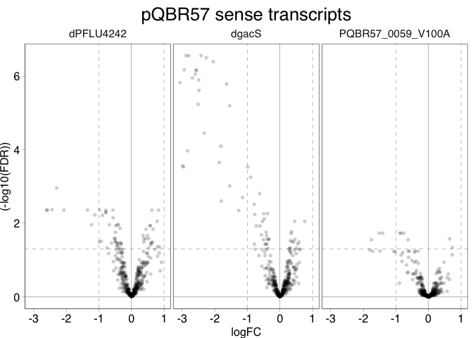
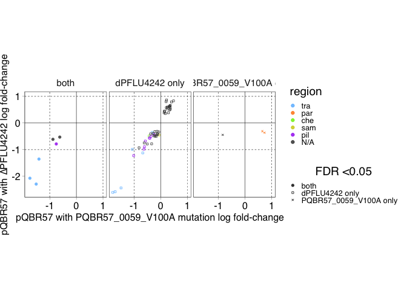
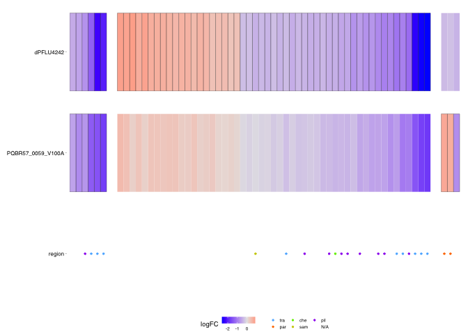
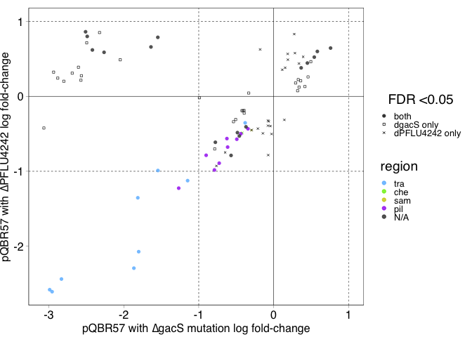
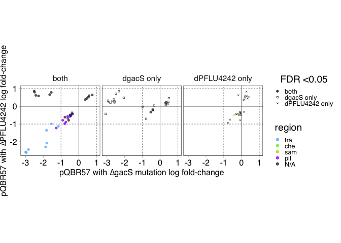
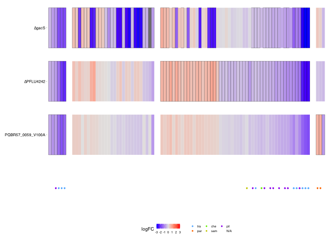

COMPMUT RNAseq Analysis 6b: pQBR57 genes — plots, figures, and analysis
================
jpjh
compiled Feb 2021, edited Jul 2021

## Analysis of edgeR tables outline

Recall:

This data was collected in
[`COMPMUT_RNAseq_4_edgeR.Rmd`](COMPMUT_RNAseq_4_edgeR.md).

This analysis will pull out differentially expressed genes under the
different treatments.

1.  Chromosomal genes differentially expressed relative to the ancestor.

-   Effect of plasmid acquisition
-   Effect of ameliorations without plasmid
-   Effect of ameliorations on effect of plasmid

1.  Chromosomal genes differentially expressed relative to the
    unameliorated plasmid.

-   Are the genes which are upregulated by the plasmid and then not
    significantly different from the ancestor significantly
    downregulated relative to the plasmid-carrying strain?

1.  Plasmid genes differentially expressed relative to the unameliorated
    plasmid.

-   Comparisons of gene expression from plasmid and from chromosome.

See [`COMPMUT_RNAseq_6a_analysis`](COMPMUT_RNAseq_6a_analysis.md) for
points 1 and 2. This document addresses point 3 for pQBR57. See
[`COMPMUT_RNAseq_6c_analysis`](COMPMUT_RNAseq_6c_analysis.md) for
pQBR103 genes.

### 3a. Plasmid genes (pQBR57) differentially expressed relative to the unameliorated plasmid.

Read in tables of plasmid differential gene expression.

``` r
full_table_pq57 <- read.csv("../data/COMPMUT_RNAseq_3_de_table_pQ57.csv", sep=",", header=TRUE)
full_table_pq57 <- mutate(full_table_pq57, gene = rownames(full_table_pq57))
dim(full_table_pq57)
```

    ## [1] 426  16

Generate volcano plots for each treatment. Reshape data into long
format.

``` r
source("../functions/makeLong.R")

pq57 <- makeLong(full_table_pq57)
head(pq57)
```

    ##          gene                 contrast       FDR   logCPM       logFC plasmid
    ## 1 PQBR57_0001             pQBR57.dgacS 0.5149235 12.70934  0.12844261  pQBR57
    ## 2 PQBR57_0001         pQBR57.dPFLU4242 0.2727964 12.70934 -0.20195460  pQBR57
    ## 3 PQBR57_0001 pQBR57.PQBR57_0059_V100A 0.5058729 12.70934 -0.20200552  pQBR57
    ## 4 PQBR57_0002             pQBR57.dgacS 0.9737409  5.80386 -0.01533765  pQBR57
    ## 5 PQBR57_0002         pQBR57.dPFLU4242 0.4934377  5.80386  0.27690568  pQBR57
    ## 6 PQBR57_0002 pQBR57.PQBR57_0059_V100A 0.9458854  5.80386 -0.07359223  pQBR57
    ##        amelioration
    ## 1             dgacS
    ## 2         dPFLU4242
    ## 3 PQBR57_0059_V100A
    ## 4             dgacS
    ## 5         dPFLU4242
    ## 6 PQBR57_0059_V100A

Generate volcano plots.

``` r
ggplot(data=pq57, aes(x=logFC, y=(-log10(FDR)))) +
  ggtitle("pQBR57 sense transcripts") +
  geom_vline(xintercept=0, size=0.1) +
  geom_vline(xintercept=c(-1,1), size=0.1, linetype="dashed") +
  geom_hline(yintercept=0, size=0.1) + 
  geom_hline(yintercept=-log10(0.05), size=0.1, linetype="dashed") + 
  geom_point(alpha=0.2, shape=16) +
  facet_grid(.~amelioration) 
```

<!-- -->

#### Investigate effects of different ameliorations on expression

``` r
pq57 %>% group_by(amelioration) %>%
  filter(FDR<0.05) %>%
  summarise(de_all = n(),
            up_all = sum(logFC>0),
            down_all = sum(logFC<0),
            up_2x = sum(logFC>1),
            down_2x = sum(logFC<(-1))) %>% kable()
```

| amelioration        | de\_all | up\_all | down\_all | up\_2x | down\_2x |
|:--------------------|--------:|--------:|----------:|-------:|---------:|
| dPFLU4242           |      57 |      20 |        37 |      0 |        8 |
| dgacS               |      62 |      13 |        49 |      0 |       26 |
| PQBR57\_0059\_V100A |       9 |       2 |         7 |      0 |        3 |

##### Plot effects of different ameliorations against one another

Load up gene info, remove any duplicates, and create a ‘gene’ column for
merging.

``` r
pq57_gene_info <- read.table("../rnaseq/ref/LN713926_gene_info.tsv", header=TRUE, sep="\t",
                      stringsAsFactors = FALSE)

pq57_gene_info <- pq57_gene_info[!(duplicated(pq57_gene_info)),] %>% mutate(gene = gene_name)
```

Load up information on the regions or regulons to which these genes
belong. From [Hall et al. 2015](dx.doi.org/10.1111/1462-2920.12901).
Define how they should be coloured in the figures. Merge into full table
and into the table of gene info.

``` r
pregions <- read.csv("../ext/pQBR_regions.csv", header=TRUE, sep=",") %>%
  mutate(region = ifelse(region=="", "N/A", region),
         gene = locus_tag)

regions_cols <- data.frame(
  region = c("tra",       "par",        "che",        "sam",    
             "pil",   "Tn5042", "uvr",    "rep",  "N/A"),
  colour = c("steelblue1","darkorange1","chartreuse2","yellow3",
             "purple","red3",   "hotpink","grey", "grey20")
)

pregions <- pregions %>% left_join(regions_cols, by="region")

pq57_gene_info <- left_join(pq57_gene_info, pregions, by="gene")

full_table_pq57 <- left_join(full_table_pq57, pregions, by="gene")
```

###### PFLU4242 and PQBR57\_0059

First: the contrasting plasmid and chromosomal mutations.

``` r
pq57_de_am <- filter(pq57, amelioration!="dgacS" & FDR<0.05) 
pq57_de_am_list <- pq57_de_am %>% 
  select(gene) %>% pull() %>% unique()

tab_pq57_am <- full_table_pq57 %>% filter(gene %in% pq57_de_am_list) %>%
  select(matches("pQBR57\\.(PQBR57_0059_V100A|dPFLU4242)\\."), region, colour, gene)

tab_pq57_am <- tab_pq57_am %>% 
  mutate(sig = ifelse(pQBR57.PQBR57_0059_V100A.FDR<0.05 & pQBR57.dPFLU4242.FDR<0.05,"both",
                      ifelse(pQBR57.PQBR57_0059_V100A.FDR<0.05 & pQBR57.dPFLU4242.FDR>0.05,"PQBR57_0059_V100A only",
                             ifelse(pQBR57.PQBR57_0059_V100A.FDR>0.05 & pQBR57.dPFLU4242.FDR<0.05,"dPFLU4242 only",
                                    "neither"))))

leg_title <- "FDR <0.05"

lines <- data.frame(intercept= c(-1,0,1),
                    linetype = c("2","1","2"))

(p_pq57_am <- ggplot(data=tab_pq57_am,
       aes(x=pQBR57.PQBR57_0059_V100A.logFC, y=pQBR57.dPFLU4242.logFC)) +
  geom_vline(data=lines, aes(xintercept=intercept, linetype=linetype), size=0.2, show.legend=FALSE) +
  geom_hline(data=lines, aes(yintercept=intercept, linetype=linetype), size=0.2, show.legend=FALSE) +
  geom_point(aes(shape=sig, size=sig, colour=region), alpha=0.8) +
  scale_size_manual(values=c(1.5,0.8,0.8,0.8)) +
  scale_shape_manual(values=c(16,0,4,16)) +
  scale_colour_manual(values=regions_cols$colour, breaks=regions_cols$region) +
  coord_fixed() +
  labs(x="pQBR57 with PQBR57_0059_V100A mutation log fold-change",
       y="pQBR57 with ∆PFLU4242 log fold-change",
       alpha=leg_title, size=leg_title, shape=leg_title) +
  theme(legend.position="right"))
```

<!-- -->

Plot different significances on different plots.

``` r
p_pq57_am + facet_wrap(~sig)
```

<!-- -->

What genes are downregulated by both?

``` r
pq57_am_both <- tab_pq57_am %>% filter(sig=="both") %>% select(gene) %>% pull() %>% unique()

pq57_gene_info %>% filter(gene_name %in% pq57_am_both) %>% 
  select(gene_name, protein_name, go, region) %>% kable()
```

| gene\_name   | protein\_name           | go           | region |
|:-------------|:------------------------|:-------------|:-------|
| PQBR57\_0075 | Uncharacterized protein | <GO:0009306> | pil    |
| PQBR57\_0207 | Uncharacterized protein | <GO:0016021> | tra    |
| PQBR57\_0208 | Uncharacterized protein |              | tra    |
| PQBR57\_0210 | Uncharacterized protein |              | tra    |
| PQBR57\_0213 | Uncharacterized protein |              | N/A    |
| PQBR57\_0214 | Uncharacterized protein |              | N/A    |

All uncharacterized proteins. <GO:0009306> is “protein secretion” and
<GO:0016021> is “integral component of the membrane”. However 3/6 of
these genes are part of the *tra* operon, and the remaining two are
adjacent to the *tra* operon.

What genes are regulated only by PFLU57\_0059\_V100A?

``` r
pq57_am_V100A <- tab_pq57_am %>% filter(sig=="PQBR57_0059_V100A only") %>% 
  select(gene) %>% pull() %>% unique()

pq57_gene_info %>% filter(gene_name %in% pq57_am_V100A) %>% 
  select(gene_name, protein_name, go, region) %>% kable()
```

| gene\_name   | protein\_name                                                                                 | go  | region |
|:-------------|:----------------------------------------------------------------------------------------------|:----|:-------|
| PQBR57\_0054 | Chromosome (Plasmid) partitioning protein ParA / Sporulation initiation inhibitor protein Soj |     | par    |
| PQBR57\_0055 | Uncharacterized protein                                                                       |     | par    |
| PQBR57\_0215 | Uncharacterized protein                                                                       |     | N/A    |

The two genes that make up the putative *par* locus PQBR57\_0054 and
0055 are upregulated by PQBR57\_0059 disruption. See the analysis of
PQBR57\_0059 for further analysis of this.

PQBR57\_0215 is adjacent to the *tra* locus and has a marginal FDR value
(&lt;0.1) for dPFLU4242.

``` r
tab_pq57_am %>% filter(gene =="PQBR57_0215") %>% 
  select(pQBR57.dPFLU4242.FDR)
```

    ##   pQBR57.dPFLU4242.FDR
    ## 1            0.0965049

What genes are upregulated by PFLU4242 disruption?

``` r
pq57_am_4242_up <- tab_pq57_am %>% 
  filter(sig=="dPFLU4242 only" & pQBR57.dPFLU4242.logFC>0) %>%
   select(gene) %>% pull() %>% unique()

pq57_gene_info %>% filter(gene_name %in% pq57_am_4242_up) %>% 
  select(gene_name, protein_name, go, region) %>%
  kable()
```

| gene\_name   | protein\_name                | go                                                                                                             | region |
|:-------------|:-----------------------------|:---------------------------------------------------------------------------------------------------------------|:-------|
| PQBR57\_0005 | Uncharacterized protein      |                                                                                                                | N/A    |
| PQBR57\_0006 | Uncharacterized protein      |                                                                                                                | N/A    |
| PQBR57\_0008 | Uncharacterized protein      |                                                                                                                | N/A    |
| PQBR57\_0009 | Uncharacterized protein      |                                                                                                                | N/A    |
| PQBR57\_0014 | Uncharacterized protein      |                                                                                                                | N/A    |
| PQBR57\_0026 | Uncharacterized protein      |                                                                                                                | N/A    |
| PQBR57\_0027 | Uncharacterized protein      |                                                                                                                | N/A    |
| PQBR57\_0032 | Uncharacterized protein      |                                                                                                                | N/A    |
| PQBR57\_0056 | Uncharacterized protein      | <GO:0016021>                                                                                                   | N/A    |
| PQBR57\_0057 | Uncharacterized protein      |                                                                                                                | N/A    |
| PQBR57\_0122 | Uncharacterized protein      |                                                                                                                | N/A    |
| PQBR57\_0138 | Protein RecA (Recombinase A) | <GO:0003684>; <GO:0003697>; <GO:0005524>; <GO:0005737>; <GO:0006281>; <GO:0006310>; <GO:0008094>; <GO:0009432> | N/A    |
| PQBR57\_0178 | Uncharacterized protein      |                                                                                                                | N/A    |
| PQBR57\_0179 | Uncharacterized protein      |                                                                                                                | N/A    |
| PQBR57\_0188 | Uncharacterized protein      |                                                                                                                | N/A    |
| PQBR57\_0259 | Uncharacterized protein      | <GO:0016021>                                                                                                   | N/A    |
| PQBR57\_0315 | Uncharacterized protein      |                                                                                                                | N/A    |
| PQBR57\_0333 | Uncharacterized protein      |                                                                                                                | N/A    |
| PQBR57\_0392 | Uncharacterized protein      |                                                                                                                | N/A    |
| PQBR57\_0413 | Uncharacterized protein      | <GO:0016021>                                                                                                   | N/A    |

All but one of the 20 genes upregulated by PFLU4242 disruption are
uncharacterized. Three of these are “integral membrane components”
according to the GO term, and there is also a *recA* homologue. RecA
binds to ssDNA, and also activates the SOS response by cleaving LexA -
but it’s unclear whether it is doing anything relevant here.

Of the dPFLU4242 downregulated genes:

``` r
pq57_am_4242_down <- tab_pq57_am %>% filter(sig=="dPFLU4242 only" & pQBR57.dPFLU4242.logFC<0) %>%
   select(gene) %>% pull() %>% unique()

pq57_gene_info %>% filter(gene_name %in% pq57_am_4242_down) %>% select(gene_name, protein_name, go, region) %>% 
  kable()
```

| gene\_name   | protein\_name                                                 | go                                       | region |
|:-------------|:--------------------------------------------------------------|:-----------------------------------------|:-------|
| PQBR57\_0018 | Uncharacterized protein                                       |                                          | N/A    |
| PQBR57\_0047 | Methyl-accepting chemotaxis protein                           | <GO:0007165>; <GO:0016021>               | che    |
| PQBR57\_0074 | Uncharacterized protein                                       |                                          | pil    |
| PQBR57\_0076 | Uncharacterized protein                                       | <GO:0016021>                             | pil    |
| PQBR57\_0077 | Uncharacterized protein                                       |                                          | pil    |
| PQBR57\_0078 | Uncharacterized protein                                       |                                          | pil    |
| PQBR57\_0079 | General secretion pathway protein E                           |                                          | pil    |
| PQBR57\_0081 | Uncharacterized protein                                       | <GO:0016021>                             | pil    |
| PQBR57\_0082 | Uncharacterized protein                                       | <GO:0016021>                             | pil    |
| PQBR57\_0083 | Uncharacterized protein                                       | <GO:0016021>                             | pil    |
| PQBR57\_0094 | Uncharacterized protein                                       | <GO:0003824>                             | sam    |
| PQBR57\_0100 | Twitching motility protein PilT                               |                                          | N/A    |
| PQBR57\_0146 | Uncharacterized protein                                       |                                          | N/A    |
| PQBR57\_0161 | Cointegrate resolution protein T                              |                                          | N/A    |
| PQBR57\_0186 | Uncharacterized protein                                       |                                          | N/A    |
| PQBR57\_0204 | Uncharacterized protein                                       |                                          | tra    |
| PQBR57\_0205 | Uncharacterized protein                                       | <GO:0016021>                             | tra    |
| PQBR57\_0206 | Uncharacterized protein                                       | <GO:0000746>; <GO:0019867>               | tra    |
| PQBR57\_0209 | Uncharacterized protein                                       | <GO:0016021>                             | tra    |
| PQBR57\_0211 | Uncharacterized protein                                       |                                          | tra    |
| PQBR57\_0212 | IncF plasmid conjugative transfer pilus assembly protein TraC |                                          | tra    |
| PQBR57\_0218 | Uncharacterized protein                                       |                                          | N/A    |
| PQBR57\_0231 | Uncharacterized protein                                       | <GO:0016021>                             | N/A    |
| PQBR57\_0233 | Uncharacterized protein                                       | <GO:0004222>; <GO:0005524>; <GO:0016021> | N/A    |
| PQBR57\_0266 | Uncharacterized protein                                       | <GO:0003824>; <GO:0008152>               | N/A    |
| PQBR57\_0295 | Uncharacterized protein                                       |                                          | N/A    |
| PQBR57\_0357 | Uncharacterized protein                                       |                                          | N/A    |
| PQBR57\_0358 | Uncharacterized protein                                       | <GO:0016021>                             | N/A    |
| PQBR57\_0369 | Uncharacterized protein                                       | <GO:0016021>                             | N/A    |
| PQBR57\_0378 | Uncharacterized protein                                       |                                          | N/A    |
| PQBR57\_0379 | Uncharacterized protein                                       |                                          | N/A    |

Many of these are part of the *tra* region. Many of the remainder are
part of the *pil* region, and of the uncharacterised proteins many are
membrane components.

Generate a nice heatmap image for pQBR57 like that for the chromosome.

``` r
pq57_de_am_plot <- pq57 %>% filter(gene %in% pq57_de_am_list, amelioration != "dgacS") %>%
  left_join(pregions, by="gene") %>% left_join(select(tab_pq57_am, sig, gene), by="gene")

pq57_de_am_plot_gene_names <- data.frame(select(pq57_de_am_plot, gene, sig, region),
                                         logFC=0,
                                         amelioration="region")

pq57_de_am_plot_gene_names$region <- factor(pq57_de_am_plot_gene_names$region,
                                            levels=regions_cols$region)

(plot_fig14 <- ggplot(data=pq57_de_am_plot,
       aes(y=amelioration, x=fct_reorder(gene, -logFC))) +
  geom_tile(colour="black", aes(fill=logFC, size=ifelse(FDR<0.05,"sig","ns"))) + 
  scale_size_manual(values=c(0,0.1), guide=FALSE) +
  scale_fill_gradient2(high="red",mid="grey90",low="blue") +
  geom_point(data=pq57_de_am_plot_gene_names, size=0.8,
             aes(colour=region, alpha=region, shape=region)) +
  scale_alpha_manual(values=c(rep(1,5),0), name="") +
  scale_colour_manual(values=regions_cols$colour, name="") +
  scale_shape_manual(values=c(20,20,20,20,20,32), name="") +
  facet_grid(amelioration~sig, scales="free", space="free") + 
  theme_pub() +
  labs(x="", y="") +
  scale_x_discrete(expand = expansion(add=1)) +
  theme(legend.position="bottom", strip.text=element_blank(),
        panel.border=element_blank(), axis.line=element_blank(),
        axis.text.x=element_blank(), axis.ticks.x=element_blank(),
        panel.spacing.x=unit(5, units="pt")))
```

<!-- -->

Output this image.

``` r
svglite::svglite(height=2, width=3.6, file = "../plots/Fig14.svg")
plot_fig14 + theme_pub() + 
  theme(legend.position="bottom", strip.text=element_blank(),
        panel.border=element_blank(), axis.line=element_blank(),
        axis.text.x=element_blank(), axis.ticks.x=element_blank(),
        panel.spacing.x=unit(5, units="pt"))
dev.off()
```

    ## quartz_off_screen 
    ##                 2

**Summary: There is a broadly similar response to amelioration both by
the chromosome and by the plasmid. Both downregulate a shared set of
genes which are annotated as being in the ‘tra’ region. Their
upregulation in the unameliorated plasmid may be due to a stress
response (see for example Waldor & Wozniak 2010 Nat. Rev. Microbiol.),
i.e. their expression and downregulation may be a consequence rather
than a cause of cost and amelioration, though this requires further
experiments to investigate.**

**Summary: The PFLU4242 knockout also reduces expression of a set of
genes, most of which are unknown but some of which are part of the ‘pil’
region. Some genes are upregulated by the PFLU4242 mutation, but none by
a great deal, and most of these are uncharacterised.**

**Summary: The PQBR57\_0059\_V100A mutation causes the putative
partition genes PQBR57\_0054 and PQBR57\_0055 to be upregulated.**

###### dgacS and dPFLU4242

Plot the contrasting chromosomal mutations against one another. Recall
in the edgeR analysis that ∆gacS caused an overall decrease in the
number of reads mapping to pQBR57, and the final data was calculated
compensating for this fact. So all analysis of the pQBR57 + ∆gacS data
should be done in light of the fact that pQBR57 has a generally lower
level of transcription in the gacS knockout.

``` r
pq57_de_am_gac <- filter(pq57, amelioration!="PQBR57_0059_V100A" & FDR<0.05) 
pq57_de_am_gac_list <- pq57_de_am_gac %>% 
  select(gene) %>% pull() %>% unique()

tab_pq57_am_gac <- full_table_pq57 %>% filter(gene %in% pq57_de_am_gac_list) %>%
  select(matches("pQBR57\\.(dgacS|dPFLU4242)\\."), region, colour, gene)


tab_pq57_am_gac <- tab_pq57_am_gac %>% 
  mutate(sig = ifelse(pQBR57.dgacS.FDR<0.05 & pQBR57.dPFLU4242.FDR<0.05,"both",
                      ifelse(pQBR57.dgacS.FDR<0.05 & pQBR57.dPFLU4242.FDR>0.05,"dgacS only",
                             ifelse(pQBR57.dgacS.FDR>0.05 & pQBR57.dPFLU4242.FDR<0.05,"dPFLU4242 only",
                                    "neither"))))

(p_pq57_am_gac <- ggplot(data=tab_pq57_am_gac,
       aes(x=pQBR57.dgacS.logFC, y=pQBR57.dPFLU4242.logFC)) +
  geom_vline(data=lines, aes(xintercept=intercept, linetype=linetype), size=0.2, show.legend=FALSE) +
  geom_hline(data=lines, aes(yintercept=intercept, linetype=linetype), size=0.2, show.legend=FALSE) +
  geom_point(aes(shape=sig, size=sig, colour=region), alpha=0.8) +
  scale_size_manual(values=c(1.5,0.8,0.8,0.8)) +
  scale_shape_manual(values=c(16,0,4,16)) +
  scale_colour_manual(values=regions_cols$colour, breaks=regions_cols$region) +
  coord_fixed() +
  labs(x="pQBR57 with ∆gacS mutation log fold-change",
       y="pQBR57 with ∆PFLU4242 log fold-change",
       alpha=leg_title, size=leg_title, shape=leg_title) +
  theme(legend.position="right"))
```

<!-- -->

Separate out the plots.

``` r
p_pq57_am_gac + facet_wrap(~sig)
```

<!-- -->

As with the chromosomal mutation, the ∆gacS mutation causes
downregulation of a swathe of *tra*-region genes, and also the
*pil*-region genes. Interestingly, ∆gacS downregulates a cluster of
genes upregulated by ∆PFLU4242, as well as a large cluster of other
genes. These genes are:

``` r
pq57_am_gacS_4242_diff_list <- tab_pq57_am_gac %>% filter(pQBR57.dgacS.logFC<0, 
                                       pQBR57.dPFLU4242.logFC>0,
                                       sig!="dPFLU4242 only") %>% select(gene) %>% pull() %>% unique()

pq57_gene_info %>% 
  filter(gene %in% pq57_am_gacS_4242_diff_list) %>% 
  select(gene_name, protein_name, go, region) %>% kable()
```

| gene\_name   | protein\_name                         | go                         | region |
|:-------------|:--------------------------------------|:---------------------------|:-------|
| PQBR57\_0004 | DNA-cytosine methyltransferase        | <GO:0008168>               | N/A    |
| PQBR57\_0005 | Uncharacterized protein               |                            | N/A    |
| PQBR57\_0006 | Uncharacterized protein               |                            | N/A    |
| PQBR57\_0007 | Uncharacterized protein               |                            | N/A    |
| PQBR57\_0008 | Uncharacterized protein               |                            | N/A    |
| PQBR57\_0009 | Uncharacterized protein               |                            | N/A    |
| PQBR57\_0010 | Uncharacterized protein               |                            | N/A    |
| PQBR57\_0056 | Uncharacterized protein               | <GO:0016021>               | N/A    |
| PQBR57\_0057 | Uncharacterized protein               |                            | N/A    |
| PQBR57\_0060 | Uncharacterized protein               |                            | N/A    |
| PQBR57\_0061 | Aerobic cobaltochelatase CobS subunit | <GO:0005524>; <GO:0016887> | N/A    |
| PQBR57\_0062 | Uncharacterized protein               |                            | N/A    |
| PQBR57\_0063 | Uncharacterized protein               |                            | N/A    |
| PQBR57\_0064 | Uncharacterized protein               |                            | N/A    |
| PQBR57\_0065 | Uncharacterized protein               |                            | N/A    |
| PQBR57\_0066 | Uncharacterized protein               | <GO:0016021>               | N/A    |
| PQBR57\_0292 | Uncharacterized protein               |                            | N/A    |

There is nothing obvious connecting these genes, except for the fact
that all but one are towards the 5’ end of the plasmid sequence.

``` r
ggplot(data=subset(tab_pq57_am_gac, sig!="dPFLU4242 only"),
       aes(x=ifelse(pQBR57.dgacS.logFC>0, "up", "down"), 
           y=abs(pQBR57.dgacS.logFC))) +
  geom_hline(yintercept=0, size=0.2) +
  geom_hline(yintercept=1, size=0.2, linetype="dashed") +
  geom_violin(size=0.4) + geom_point(position=position_jitter(), shape=16, alpha=0.6) +
  labs(x="", y=expression(paste("absolute log fold-change"))) +
  ggtitle("pQBR57 genes DE in ∆gacS")
```

<!-- -->

Generate a heatmap like the one above but for all three ameliorations on
pQBR57 expression.

``` r
pq57_de_am_all <- filter(pq57, FDR<0.05) %>% 
  select(gene) %>% unique() %>% pull()

pq57_de_am_plot_all <- filter(pq57, gene %in% pq57_de_am_all) %>% 
  left_join(select(tab_pq57_am, region, colour, gene, sig), by="gene") %>%
  left_join(select(tab_pq57_am_gac, region, colour, gene, sig), by="gene") %>%
  mutate(region = ifelse(is.na(region.y), region.x, region.y),
         sig = ifelse(is.na(sig.x), sig.y, sig.x))

pq57_de_am_plot_all_gene_names <- data.frame(select(pq57_de_am_plot_all, gene, sig, region),
                                         logFC=0,
                                         amelioration="region")

pq57_de_am_plot_all_gene_names$region <- factor(pq57_de_am_plot_all_gene_names$region,
                                            levels=regions_cols$region)

(p_heatmap_pq57_amelioration_all <- ggplot(data=pq57_de_am_plot_all,
       aes(y=amelioration, x=fct_reorder(gene, -logFC))) +
  geom_tile(colour="black", aes(fill=logFC, size=ifelse(FDR<0.05,"sig","ns"))) + 
  scale_size_manual(values=c(0,0.1), guide=FALSE) +
  scale_fill_gradient2(high="red",mid="grey90",low="blue", limits=c(-3,3)) +
  geom_point(data=pq57_de_am_plot_all_gene_names, size=0.8,
             aes(colour=region, alpha=region, shape=region)) +
  scale_alpha_manual(values=c(rep(1,5),0), name="") +
  scale_colour_manual(values=regions_cols$colour, name="") +
  scale_shape_manual(values=c(rep(20,5),32), name="") +
  facet_grid(amelioration~sig, scales="free", space="free") + 
    scale_y_discrete(breaks=c("dPFLU4242","PQBR57_0059_V100A","dgacS"),
                     labels=c("∆PFLU4242","PQBR57_0059_V100A","∆gacS")) +
  theme_pub() +
  labs(x="", y="") +
  scale_x_discrete(expand = expansion(add=1)) +
  theme(legend.position="bottom", strip.text=element_blank(),
        panel.border=element_blank(), axis.line=element_blank(),
        axis.text.x=element_blank(), #element_text(angle=90, hjust=1, vjust=0.5), 
        axis.ticks.x=element_blank(),
        panel.spacing.x=unit(5, units="pt")))
```

<!-- -->

There is a set of highly downregulated pQBR57 genes in the gacS mutant,
but not with the other ameliorations. What are these?

``` r
pq57_gacSdown <- pq57 %>% filter(FDR<0.05 & amelioration=="dgacS" & logFC<0) %>% select(gene) %>% pull()
  
pq57_4242down <- pq57 %>% filter(FDR<0.05 & amelioration=="dPFLU4242" & logFC<0) %>% select(gene) %>% pull()

pq57_gacSdown[!(pq57_gacSdown %in% pq57_4242down)] #26 genes
```

    ##  [1] "PQBR57_0004" "PQBR57_0005" "PQBR57_0006" "PQBR57_0007" "PQBR57_0008"
    ##  [6] "PQBR57_0009" "PQBR57_0010" "PQBR57_0056" "PQBR57_0057" "PQBR57_0058"
    ## [11] "PQBR57_0060" "PQBR57_0061" "PQBR57_0062" "PQBR57_0063" "PQBR57_0064"
    ## [16] "PQBR57_0065" "PQBR57_0066" "PQBR57_0067" "PQBR57_0184" "PQBR57_0185"
    ## [21] "PQBR57_0220" "PQBR57_0232" "PQBR57_0292" "PQBR57_0317" "PQBR57_0318"
    ## [26] "PQBR57_0424"

Include several sets of genes, as well as singletons PQBR57\_0220,
PQBR57\_0232, PQBR57\_0292, and PQBR57\_0424

-   PQBR57\_0004-0010. All uncharacterised, but includes a DNA-cytosine
    methyltransferase (PQBR57\_0004)
-   PQBR57\_0056-0067 (but *not* PQBR57\_0059!). All uncharacterised,
    but includes a DNA primase (PQBR57\_0058) and CobS (PQBR57\_0061).
-   PQBR57\_0184-0185. Both uncharacterised, &lt;2x DE
-   PQBR57\_0317-0318. Both uncharacterised, &lt;2x DE
-   PQBR57\_0424. N6-adenine methyltransferase, &lt;2x DE

Save the figure for compilation with the pQBR103 figure.

``` r
saveRDS(p_heatmap_pq57_amelioration_all, file = "../plots/Fig14b.rds")
```

**GacS deletion appears to have an unusual effect on pQBR57 gene
expression, with specific sets of genes downregulated in the ∆gacS
mutant compared with the other ameliorations. These genes tend to be
towards the putative origin-of-replication of pQBR57.**

------------------------------------------------------------------------

**[Back to index.](COMPMUT_index.md)**

**[On to pQBR103 genes.]()(COMPMUT\_RNAseq\_6c\_analysis.md)**
