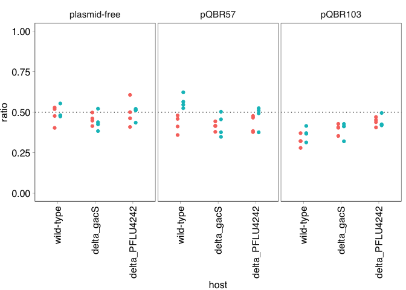
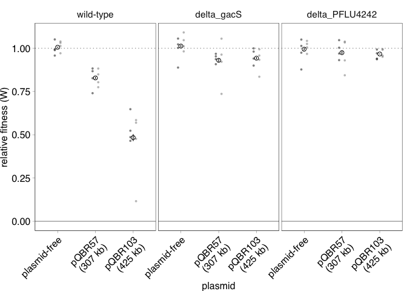
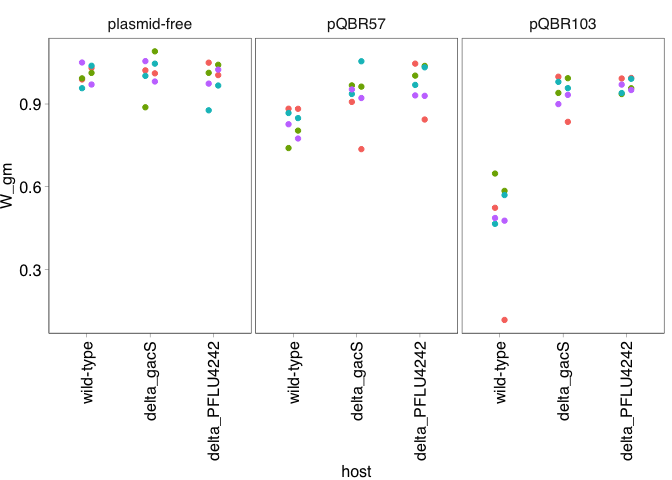
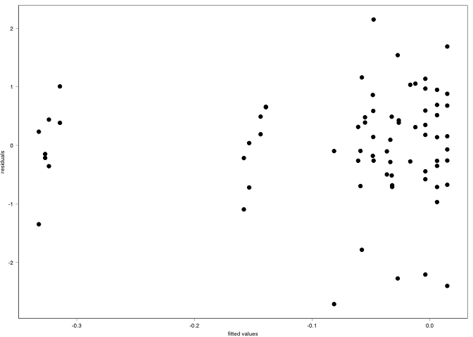
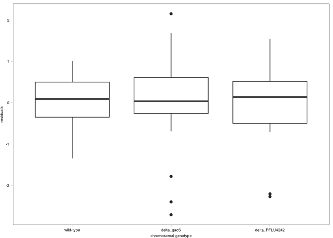
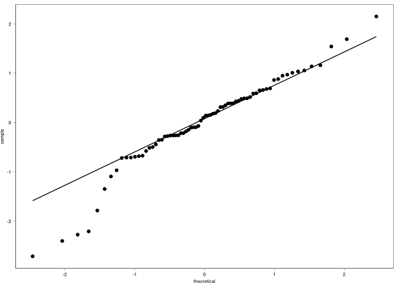

COMPMUT Experiments 1: Presentation and analysis of knockout fitness
================
jpjh
06 February, 2021

[Back to index.](COMPMUT_index.md)

## Competition experiments with plasmid-carrying knockout strains

#### Experimental design:

Knockouts were made of *gacS* or *PFLU4242*, using allelic replacement,
in a gentamicin-resistant background of *P. fluorescens* SBW25. These
strains were sequenced to validate the deletion and confirm an absence
of second-site mutations. Megaplasmids pQBR57 or pQBR103 were introduced
to each of these knockouts (∆*gacS*, ∆*PFLU4242*), as well as the
unmodified gentamicin-resistant strain (‘wild-type’), by conjugation.
Conjugations were performed in quadruplicate to mitigate any effect of
jackpot mutations resulting in a total of (three ‘host’ treatments by
two plasmid treatments by four replicates = ) 24 strains, which were
confirmed by PCR.

Competition experiments were established for all of these 24 strains,
alongside experiments for the plasmid-free wild-type, ∆*gacS*, and
∆*PFLU4242* strains, which were likewise performed in quadruplicate.
There were therefore 36 ‘competitions’.

For each competition, overnight cultures of the ‘test’ strain were mixed
in approximately equal proportions with a plasmid-free *lacZ*-expressing
‘reference’ strain of *P. fluorescens* SBW25, and the mixture
subcultured into fresh media for growth for 48 hours. Changes in the
relative abundance of ‘test’ and ‘reference’ were assessed by spreading
diluted samples of ‘start’ and ‘end’ culture on X-gal-containing KB and
counting colonies.

Replica plating (patching) of ‘end’ culture onto mercury-containing
media did not show substantial loss or conjugation of either plasmid
sufficient to significantly impact calculation of relative fitness.

The whole experiment was repeated twice.

#### Calculation of relative fitness and generation of figures

Load in data and plot.

``` r
d1 <- read.csv("../data/COMPMUT_exp_data_1.csv", header=TRUE)

kable(head(d1))
```

| experiment | replicate | host        | plasmid      | timepoint | dilution | spread | count\_white | count\_blue |
|:-----------|:----------|:------------|:-------------|:----------|---------:|-------:|-------------:|------------:|
| A          | a         | wild-type   | plasmid-free | start     |        6 |     80 |          266 |         237 |
| A          | a         | wild-type   | pQBR57       | start     |        6 |     80 |          215 |         233 |
| A          | a         | wild-type   | pQBR103      | start     |        6 |     80 |           82 |         173 |
| A          | a         | delta\_gacS | plasmid-free | start     |        6 |     80 |          154 |         180 |
| A          | a         | delta\_gacS | pQBR57       | start     |        6 |     80 |          183 |         256 |
| A          | a         | delta\_gacS | pQBR103      | start     |        6 |     80 |          155 |         229 |

Order variables.

``` r
d1 <- d1 %>% 
  mutate(host = factor(host, levels=c("wild-type","delta_gacS","delta_PFLU4242")),
         plasmid = factor(plasmid, levels=c("plasmid-free","pQBR57","pQBR103")))
```

Check starting ratios are approximately equal.

``` r
pd <- position_dodge(width=0.3)

d1 %>% filter(timepoint=="start") %>% 
  mutate(ratio = count_white/(count_white + count_blue)) %>%
  ggplot(aes(x=host, y=ratio, colour=experiment)) + 
    geom_hline(yintercept=0.5, linetype="dotted") +
    facet_grid(.~plasmid) + 
    geom_point(position=pd) + 
    lims(y=c(0,1)) +
    theme(axis.text.x=element_text(angle=90, vjust=0.5, hjust=1))
```

<!-- -->

Looks ok, some skew but nothing really off.

Calculate fitness. Load up `calulate_fitness()`.

``` r
source("../functions/calculate_fitness.R")

id_cols <- c("experiment","replicate","host","plasmid")
df1 <- calculate_fitness(d1, id_cols)  
```

Calculate summary statistics and make a nice plot.

``` r
pd <- position_dodge(width=0.3)

df1_summ <- df1 %>% 
  group_by(host, plasmid) %>%
  summarise(mean = mean(W_gm), 
            n = n(), 
            se = sd(W_gm)/n, 
            ci = (qt(0.95/2 + 0.5, n-1)) * se) %>%
  rename(W_gm=mean)
```

    ## `summarise()` regrouping output by 'host' (override with `.groups` argument)

``` r
(plot_fig1 <- ggplot(data=df1,
                   aes(x=host, y=W_gm)) +
  geom_hline(yintercept=1, size=0.2, linetype=111) +
  geom_hline(yintercept=0, size=0.2) +
  geom_point(position=pd, alpha=0.5, size=1.5, shape=16, aes(colour=experiment, group=experiment)) +
  geom_point(data=df1_summ, 
             position=pd,
             shape=1, size=2) +
  geom_errorbar(data=df1_summ, width=0, size=0.5, 
                aes(ymax=W_gm+se, ymin=W_gm-se), colour="black") +
  scale_colour_manual(values=c("black","grey50")) +
  scale_x_discrete(breaks=c("wild-type","delta_gacS","delta_PFLU4242"),
                   labels=c("wild-type", 
                            expression(paste(Delta,italic("gacS"))),
                            expression(paste(Delta,italic("PFLU4242")))),
                   name="chromosomal genotype") +
  scale_y_continuous(name="relative fitness (W)", breaks=seq(0,2,0.25)) +
  facet_grid(.~plasmid, scales="free") +
  theme(axis.text.x=element_text(angle=45, hjust=1)))
```

<!-- -->

``` r
svglite::svglite(height=3, width=3.5, file = "../plots/Fig1.svg")
plot_fig1
dev.off()
```

    ## quartz_off_screen 
    ##                 2

Make an alternative plot, where different plasmids are represented on
the x-axis.

``` r
(plot_fig1_alt <- ggplot(data=df1,
                   aes(x=plasmid, y=W_gm)) +
  geom_hline(yintercept=1, size=0.2, linetype=111) +
  geom_hline(yintercept=0, size=0.2) +
  geom_point(position=pd, alpha=0.5, size=1, shape=16, aes(colour=experiment, group=experiment)) +
  geom_point(data=df1_summ, 
             position=pd,
             shape=1, size=2) +
  geom_errorbar(data=df1_summ, width=0, size=0.4, 
                aes(ymax=W_gm+se, ymin=W_gm-se), colour="black") +
  scale_colour_manual(values=c("black","grey50")) +
  scale_x_discrete(labels=c("plasmid-free", "pQBR57\n(307 kb)", "pQBR103\n(425 kb)")) +
  scale_y_continuous(name="relative fitness (W)", breaks=seq(0,2,0.25)) +
  facet_grid(.~host, scales="free") +
  theme(axis.text.x=element_text(angle=45, hjust=1)))
```

<!-- -->

Good.

### Analysis

There is some correlation in the data, because each ‘replicate’ was
tested twice.

Are there any patterns here? Do some replicates do worse or better in
both experiments?

``` r
ggplot(data=df1,
       aes(x=host, y=W_gm, colour=replicate, group=experiment)) + 
  geom_point(position=pd) + 
  facet_grid(.~plasmid, scales="free") +
  theme(axis.text.x=element_text(angle=90, hjust=1, vjust=0.5))
```

<!-- -->

There is no obvious effect, but it should be accommodated anyway, by
including a random effect of ‘replicate’ in the model.

Recall that megaplasmids were conjugated into each strain, so each
plasmid-bearing ‘replicate’ is an independent ‘clone’. The plasmid-free
strains were all the same, so there is no expected correlation across
‘replicates’.

``` r
df1 <- df1 %>% mutate(clone = ifelse(plasmid=="plasmid-free",
                                     paste(host, plasmid, sep="."),
                                     paste(replicate, host, plasmid, sep=".")))
```

Generate a linear model with and without the random effect of clone, and
compare following Zuur et al. (2009).

Preliminary analysis suggested a Box-Cox transformation with lambda =
2.5 improved homoscedasticity and normality of residuals.

``` r
MASS::boxcox(data=df1, 
       W_gm ~ host * plasmid, lambda=seq(-5,5,0.2))
```

<!-- -->

Set lambda at 2.5 and Box-Cox transform.

``` r
lambda <- 2.5

df1 <- df1 %>% mutate(W_gm_boxcox = ((W_gm^lambda) - 1)/lambda)
```

Run model with and without random effect of clone to assess contribution
of random effects.

``` r
library(nlme)
```

    ## 
    ## Attaching package: 'nlme'

    ## The following object is masked from 'package:dplyr':
    ## 
    ##     collapse

``` r
mod1_1 <- gls(data=df1, W_gm_boxcox ~ host * plasmid, method="REML")
mod1_2 <- lme(data=df1, W_gm_boxcox ~ host * plasmid, 
              random = ~1|clone, method="REML")

kable(anova(mod1_1, mod1_2) %>% select(-call))
```

|         | Model |  df |       AIC |       BIC |   logLik | Test   |   L.Ratio |   p-value |
|:--------|------:|----:|----------:|----------:|---------:|:-------|----------:|----------:|
| mod1\_1 |     1 |  10 | -157.5646 | -136.1333 | 88.78232 |        |        NA |        NA |
| mod1\_2 |     2 |  11 | -156.0017 | -132.4272 | 89.00086 | 1 vs 2 | 0.4370746 | 0.5085378 |

Suggests that any effect of ‘clone’ is not significant, by AIC or BIC.
However, the effect of clone will be retained in the model since it is
part of the data structure.

Generate plots for model validation.

``` r
df1 <- df1 %>% mutate(mod1_2_resid  = resid(mod1_2, type = "normalized"),
              mod1_2_fitted = fitted(mod1_2))

ggplot(data=df1, aes(x=mod1_2_fitted, y=mod1_2_resid)) + 
  geom_point() + labs(x="fitted values", y="residuals")
```

<!-- -->

``` r
ggplot(data=df1, aes(x=host, y=mod1_2_resid)) + 
  geom_boxplot() + labs(x="chromosomal genotype", y="residuals")
```

<!-- -->

``` r
ggplot(data=df1, aes(x=plasmid, y=mod1_2_resid)) + 
  geom_boxplot() + labs(x="plasmid", y="residuals")
```

<!-- -->

``` r
ggplot(data=df1, aes(sample=mod1_2_resid)) + stat_qq() + stat_qq_line()
```

<!-- -->

These all look good, no obvious patterns in the residuals. There is
possibly some non-normality of residuals, driven by a handful of
lower-fitness outliers.

``` r
shapiro.test(df1$mod1_2_resid)
```

    ## 
    ##  Shapiro-Wilk normality test
    ## 
    ## data:  df1$mod1_2_resid
    ## W = 0.95185, p-value = 0.007844

However, I will proceed with this modelling approach as, though the
Shapiro-Wilk test is significant, the significance is not large (p \~
0.01), and nonparametric alternatives are not available.

Assess significance of terms.

``` r
mod1_2_ml <- update(mod1_2, method="ML")

mod1_3_ml <- update(mod1_2_ml, .~.-host:plasmid)

kable(anova(mod1_2_ml, mod1_3_ml) %>% select(-call))
```

|             | Model |  df |       AIC |       BIC |    logLik | Test   |  L.Ratio | p-value |
|:------------|------:|----:|----------:|----------:|----------:|:-------|---------:|--------:|
| mod1\_2\_ml |     1 |  11 | -211.9338 | -186.8905 | 116.96691 |        |       NA |      NA |
| mod1\_3\_ml |     2 |   7 | -182.6334 | -166.6967 |  98.31668 | 1 vs 2 | 37.30045 |   2e-07 |

Clearly significant interaction between chromosomal genotype and
plasmid.

Extract Tukey-corrected post-hoc pairwise (least-square means)
comparisons. [Using `mvt` adjustment as a more exact means of Tukey
correction for smaller
samples.](https://cran.r-project.org/web/packages/emmeans/vignettes/confidence-intervals.html).

``` r
library(emmeans)

posthoc <- lsmeans(mod1_2, pairwise ~ host * plasmid, adjust="mvt")

contr <- data.frame(posthoc$contrasts) %>% mutate(sign = ifelse(p.value<0.05, "*", ""))

kable(contr)
```

| contrast                                                    |   estimate |        SE |  df |     t.ratio |   p.value | sign |
|:------------------------------------------------------------|-----------:|----------:|----:|------------:|----------:|:-----|
| (wild-type plasmid-free) - (delta\_gacS plasmid-free)       | -0.0086637 | 0.0360467 |  18 |  -0.2403472 | 0.9999994 |      |
| (wild-type plasmid-free) - (delta\_PFLU4242 plasmid-free)   |  0.0099640 | 0.0360467 |  18 |   0.2764180 | 0.9999982 |      |
| (wild-type plasmid-free) - (wild-type pQBR57)               |  0.1548097 | 0.0321996 |  18 |   4.8078168 | 0.0035167 | \*   |
| (wild-type plasmid-free) - delta\_gacS pQBR57               |  0.0674239 | 0.0321996 |  18 |   2.0939374 | 0.5028660 |      |
| (wild-type plasmid-free) - delta\_PFLU4242 pQBR57           |  0.0281928 | 0.0321996 |  18 |   0.8755656 | 0.9915450 |      |
| (wild-type plasmid-free) - (wild-type pQBR103)              |  0.3304440 | 0.0321996 |  18 |  10.2623712 | 0.0000001 | \*   |
| (wild-type plasmid-free) - delta\_gacS pQBR103              |  0.0594564 | 0.0321996 |  18 |   1.8464954 | 0.6512281 |      |
| (wild-type plasmid-free) - delta\_PFLU4242 pQBR103          |  0.0383558 | 0.0321996 |  18 |   1.1911890 | 0.9476034 |      |
| (delta\_gacS plasmid-free) - (delta\_PFLU4242 plasmid-free) |  0.0186277 | 0.0360467 |  18 |   0.5167652 | 0.9997866 |      |
| (delta\_gacS plasmid-free) - (wild-type pQBR57)             |  0.1634734 | 0.0321996 |  18 |   5.0768804 | 0.0018742 | \*   |
| (delta\_gacS plasmid-free) - delta\_gacS pQBR57             |  0.0760876 | 0.0321996 |  18 |   2.3630010 | 0.3561694 |      |
| (delta\_gacS plasmid-free) - delta\_PFLU4242 pQBR57         |  0.0368566 | 0.0321996 |  18 |   1.1446291 | 0.9578760 |      |
| (delta\_gacS plasmid-free) - (wild-type pQBR103)            |  0.3391077 | 0.0321996 |  18 |  10.5314347 | 0.0000000 | \*   |
| (delta\_gacS plasmid-free) - delta\_gacS pQBR103            |  0.0681201 | 0.0321996 |  18 |   2.1155590 | 0.4896317 |      |
| (delta\_gacS plasmid-free) - delta\_PFLU4242 pQBR103        |  0.0470195 | 0.0321996 |  18 |   1.4602526 | 0.8575722 |      |
| (delta\_PFLU4242 plasmid-free) - (wild-type pQBR57)         |  0.1448457 | 0.0321996 |  18 |   4.4983728 | 0.0064336 | \*   |
| (delta\_PFLU4242 plasmid-free) - delta\_gacS pQBR57         |  0.0574599 | 0.0321996 |  18 |   1.7844934 | 0.6882286 |      |
| (delta\_PFLU4242 plasmid-free) - delta\_PFLU4242 pQBR57     |  0.0182289 | 0.0321996 |  18 |   0.5661215 | 0.9995826 |      |
| (delta\_PFLU4242 plasmid-free) - (wild-type pQBR103)        |  0.3204800 | 0.0321996 |  18 |   9.9529271 | 0.0000001 | \*   |
| (delta\_PFLU4242 plasmid-free) - delta\_gacS pQBR103        |  0.0494924 | 0.0321996 |  18 |   1.5370514 | 0.8223743 |      |
| (delta\_PFLU4242 plasmid-free) - delta\_PFLU4242 pQBR103    |  0.0283918 | 0.0321996 |  18 |   0.8817450 | 0.9911316 |      |
| (wild-type pQBR57) - delta\_gacS pQBR57                     | -0.0873858 | 0.0278255 |  18 |  -3.1404934 | 0.0988782 |      |
| (wild-type pQBR57) - delta\_PFLU4242 pQBR57                 | -0.1266168 | 0.0278255 |  18 |  -4.5503898 | 0.0058490 | \*   |
| (wild-type pQBR57) - (wild-type pQBR103)                    |  0.1756343 | 0.0278255 |  18 |   6.3119946 | 0.0001453 | \*   |
| (wild-type pQBR57) - delta\_gacS pQBR103                    | -0.0953533 | 0.0278255 |  18 |  -3.4268326 | 0.0572053 |      |
| (wild-type pQBR57) - delta\_PFLU4242 pQBR103                | -0.1164539 | 0.0278255 |  18 |  -4.1851512 | 0.0125987 | \*   |
| delta\_gacS pQBR57 - delta\_PFLU4242 pQBR57                 | -0.0392311 | 0.0278255 |  18 |  -1.4098964 | 0.8784378 |      |
| delta\_gacS pQBR57 - (wild-type pQBR103)                    |  0.2630201 | 0.0278255 |  18 |   9.4524880 | 0.0000002 | \*   |
| delta\_gacS pQBR57 - delta\_gacS pQBR103                    | -0.0079675 | 0.0278255 |  18 |  -0.2863391 | 0.9999976 |      |
| delta\_gacS pQBR57 - delta\_PFLU4242 pQBR103                | -0.0290681 | 0.0278255 |  18 |  -1.0446578 | 0.9749087 |      |
| delta\_PFLU4242 pQBR57 - (wild-type pQBR103)                |  0.3022511 | 0.0278255 |  18 |  10.8623844 | 0.0000116 | \*   |
| delta\_PFLU4242 pQBR57 - delta\_gacS pQBR103                |  0.0312635 | 0.0278255 |  18 |   1.1235572 | 0.9620021 |      |
| delta\_PFLU4242 pQBR57 - delta\_PFLU4242 pQBR103            |  0.0101629 | 0.0278255 |  18 |   0.3652386 | 0.9999847 |      |
| (wild-type pQBR103) - delta\_gacS pQBR103                   | -0.2709876 | 0.0278255 |  18 |  -9.7388271 | 0.0000001 | \*   |
| (wild-type pQBR103) - delta\_PFLU4242 pQBR103               | -0.2920882 | 0.0278255 |  18 | -10.4971458 | 0.0000000 | \*   |
| delta\_gacS pQBR103 - delta\_PFLU4242 pQBR103               | -0.0211006 | 0.0278255 |  18 |  -0.7583186 | 0.9967154 |      |

Key lines in this table:

-   Significant effect of pQBR57 and pQBR103 in plasmid-free background.
-   No significant effect of either knockout in the plasmid-free
    background.
-   No significant effect of either plasmid carriage in the ∆gacS
    background.
-   No significant effect of either plasmid carriage in the ∆PFLU4242
    background.
-   No significant effect of ∆gacS when carrying pQBR57 (p \~ 0.1).
-   Significant effect of ∆PFLU4242 when carrying pQBR57.
-   Significant effect of ∆gacS when carrying pQBR103.
-   Significant effect of ∆PFLU4242 when carrying pQBR103.

### Does specifying ‘clone’ in the model affect qualitative outcomes?

The non-independence of measurements due to the same clone being
measured on two occasions did not have a significant effect on model
fit, but it may have an effect on p-values.

Check this.

``` r
mod1_1_ml <- update(mod1_1, method="ML")

mod1_4_ml <- update(mod1_1_ml, .~.-host:plasmid)

kable(anova(mod1_1_ml, mod1_4_ml) %>% select(-call))
```

|             | Model |  df |       AIC |       BIC |    logLik | Test   |  L.Ratio | p-value |
|:------------|------:|----:|----------:|----------:|----------:|:-------|---------:|--------:|
| mod1\_1\_ml |     1 |  10 | -213.9338 | -191.1672 | 116.96691 |        |       NA |      NA |
| mod1\_4\_ml |     2 |   6 | -159.9565 | -146.2965 |  85.97825 | 1 vs 2 | 61.97731 |       0 |

Significant effect of the interaction by any measure.

What about post-hoc tests? How do these differ between the
random-effects (LMM) and no random-effects (LM) models?

``` r
posthoc_gls <- lsmeans(mod1_1, pairwise ~ host * plasmid, adjust="mvt", data=df1)

data.frame(posthoc_gls$contrasts) %>% mutate(sign = ifelse(p.value<0.05, "*", ""))  %>%
  left_join(contr, suffix = c(".lm", ".lmm"), by="contrast") %>%
  filter(sign.lmm == "*" | sign.lm == "*") %>%
  select(contrast, contains("p.value"), contains("sign")) %>% kable()
```

| contrast                                             | p.value.lm | p.value.lmm | sign.lm | sign.lmm |
|:-----------------------------------------------------|-----------:|------------:|:--------|:---------|
| (wild-type plasmid-free) - (wild-type pQBR57)        |  0.0000014 |   0.0035167 | \*      | \*       |
| (wild-type plasmid-free) - (wild-type pQBR103)       |  0.0000000 |   0.0000001 | \*      | \*       |
| (delta\_gacS plasmid-free) - (wild-type pQBR57)      |  0.0000003 |   0.0018742 | \*      | \*       |
| (delta\_gacS plasmid-free) - (wild-type pQBR103)     |  0.0000000 |   0.0000000 | \*      | \*       |
| (delta\_PFLU4242 plasmid-free) - (wild-type pQBR57)  |  0.0000257 |   0.0064336 | \*      | \*       |
| (delta\_PFLU4242 plasmid-free) - (wild-type pQBR103) |  0.0000000 |   0.0000001 | \*      | \*       |
| (wild-type pQBR57) - delta\_gacS pQBR57              |  0.0278205 |   0.0988782 | \*      |          |
| (wild-type pQBR57) - delta\_PFLU4242 pQBR57          |  0.0001527 |   0.0058490 | \*      | \*       |
| (wild-type pQBR57) - (wild-type pQBR103)             |  0.0000000 |   0.0001453 | \*      | \*       |
| (wild-type pQBR57) - delta\_gacS pQBR103             |  0.0111369 |   0.0572053 | \*      |          |
| (wild-type pQBR57) - delta\_PFLU4242 pQBR103         |  0.0007759 |   0.0125987 | \*      | \*       |
| delta\_gacS pQBR57 - (wild-type pQBR103)             |  0.0000000 |   0.0000002 | \*      | \*       |
| delta\_PFLU4242 pQBR57 - (wild-type pQBR103)         |  0.0000000 |   0.0000116 | \*      | \*       |
| (wild-type pQBR103) - delta\_gacS pQBR103            |  0.0000000 |   0.0000001 | \*      | \*       |
| (wild-type pQBR103) - delta\_PFLU4242 pQBR103        |  0.0000000 |   0.0000000 | \*      | \*       |

Overall, very similar. Neglecting correlation between replicates means
that a significant effect of gacS is detected with pQBR57, but otherwise
there is no big qualitative difference from accounting for correlation
between replicates.

### Testing each experiment separately

Random effects should take account of the correlation between the
replicates in the differnet experiments, but if findings are consistent
when each experiment is analysed separately that would increase
confidence.

#### Experiment A

``` r
df1A <- df1 %>% filter(experiment=="A") 

mod1_4 <- lm(W_gm_boxcox ~ host * plasmid, data = df1A)
```

Generate plots for validation.

``` r
par(mfrow=c(2,2))

plot(mod1_4)
```

<!-- -->

Looks fine.

``` r
kable(anova(mod1_4))
```

|              |  Df |    Sum Sq |   Mean Sq |  F value | Pr(&gt;F) |
|:-------------|----:|----------:|----------:|---------:|----------:|
| host         |   2 | 0.1283115 | 0.0641558 | 29.19368 |   2.0e-07 |
| plasmid      |   2 | 0.0921862 | 0.0460931 | 20.97439 |   3.2e-06 |
| host:plasmid |   4 | 0.1121143 | 0.0280286 | 12.75424 |   5.9e-06 |
| Residuals    |  27 | 0.0593349 | 0.0021976 |       NA |        NA |

Significant interaction effect.

#### Experiment B

``` r
df1B <- df1 %>% filter(experiment=="B") 

mod1_5 <- lm(W_gm_boxcox ~ host * plasmid, data = df1B)
```

Examine validation plots.

``` r
par(mfrow=c(2,2))
plot(mod1_5)
```

<!-- -->

Look fine.

``` r
kable(anova(mod1_5))
```

|              |  Df |    Sum Sq |   Mean Sq |   F value | Pr(&gt;F) |
|:-------------|----:|----------:|----------:|----------:|----------:|
| host         |   2 | 0.1416863 | 0.0708431 | 19.943697 | 0.0000048 |
| plasmid      |   2 | 0.1589724 | 0.0794862 | 22.376888 | 0.0000019 |
| host:plasmid |   4 | 0.1134243 | 0.0283561 |  7.982776 | 0.0002206 |
| Residuals    |  27 | 0.0959082 | 0.0035522 |        NA |        NA |

Significant interaction effect.

**Together this all suggests that there is no qualitative difference
between the two experiments, and suggests there is no problem with
analysing them all togther as done above.**

#### What is the effect of each plasmid?

The table of post-hoc comparisons should be used to state significance
of effects.

The fitness costs of each plasmid are estimated as the difference in
mean fitness from the control.

**pQBR57:**

``` r
marker_effect <- df1_summ %>% filter(host=="wild-type" & plasmid=="plasmid-free") %>%
  pull(W_gm)

df1_summ <- mutate(df1_summ, W_gm_corr = W_gm - marker_effect)
```

Fitness cost: -0.1771431

Confidence interval: 0.0154583

**pQBR103:**

Fitness cost: -0.5218532

Confidence interval: 0.0475899

------------------------------------------------------------------------

**[On to COMPMUT experiments 2: Presentation and analysis of plasmid
mutant fitness.](COMPMUT_exp_2_plasmids.md)**

**[Back to index.](COMPMUT_index.md)**
