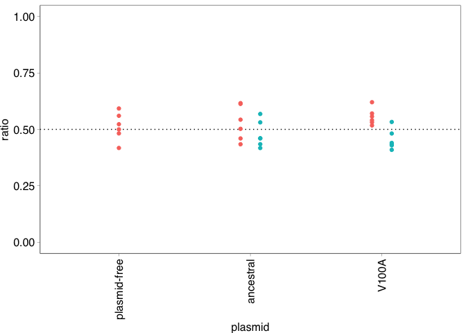
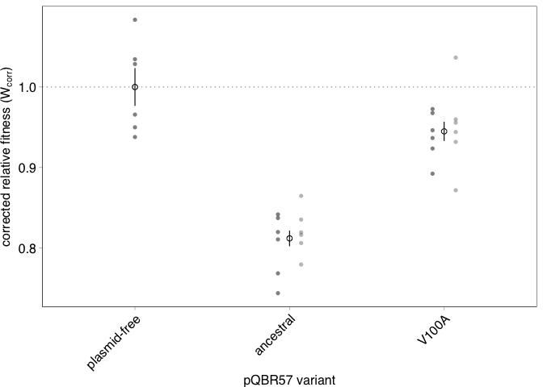
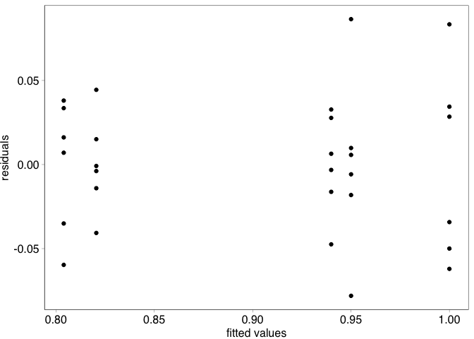
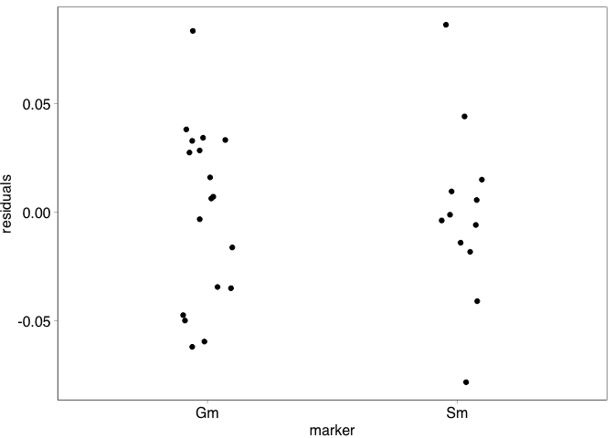
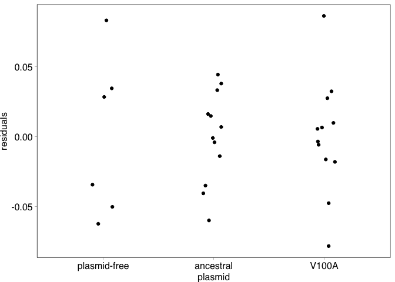

COMPMUT Experiments 2: Presentation and analysis of plasmid mutant
fitness
================
jpjh
compiled Feb 2021

[Now published in PLoS
Biology](https://journals.plos.org/plosbiology/article?id=10.1371/journal.pbio.3001225):

Hall, J. P. J., Wright, R. C. T., Harrison, E., Muddiman, K. J., Jamie
Wood, A., Paterson, S., & Brockhurst, M. A. (2021). Plasmid fitness
costs are caused by specific genetic conflicts enabling resolution by
compensatory mutation. *PLoS Biology*, *19*(10), e3001225.
<https://doi.org/10.1371/journal.pbio.3001225>

**[Back to index.](COMPMUT_index.md)**

------------------------------------------------------------------------

## Competition experiments with strains carrying different PQBR57\_0059 variants

#### Experimental design:

Naturally occurring mutants of pQBR57 emerged during the evolution
experiment. The main target of locus-level parallel mutation was the
gene encoding PQBR57\_0059. To understand how disruption of this gene
affects plasmid fitness costs, two variants were investigated
experimentally.

-   Variant A.01.65.G.002 was an ‘evolved’ plasmid (i.e. it had
    experienced the evolution experiment) but had not acquired any
    mutations. This variant is referred to as ‘ancestral’.
-   Variant B.09.65.G.029 had a single mutation in PQBR57\_0059, that
    causes a valine to alanine substitution at position 100 (V100A).
    This variant is referred to as ‘V100A’.

These plasmids evolved in the evolution experiment in the
gentamicin-resistant strain. These strains have other mutations on the
chromosome. To disentangle chromosomal vs. plasmid mutations, the two
variants were conjugated into plasmid-free strains.

Six replicates were performed for each conjugation. Both variants were
transferred into the *lacZ*-expressing streptomycin-resistant strain (6
replicates per variant). To ensure that there was not a significant
effect of the antibiotic resistant marker, both plasmids were conjugated
back into an ‘unevolved’ gentamicin-resistant strain (6 replicates per
variant). This resulted in 12 replicates transconjugants per variant,
with half in the gentamicin-resistant background and half in the
streptomycin-resistant background.

Each of these strains was competed against a plasmid-free competitor
with the heterologous resistance marker. Streptomycin-resistant
(*lacZ*-expressing) plasmid-bearing ‘test’ strains were competed against
gentamicin-resistant plasmid-free ‘reference’ strains, while
gentamicin-resistant plasmid-bearing ‘test’ strains were competed
against streptomycin-resistant, *lacZ*-expressing, plasmid-free
‘reference’ strains.

Replica plating (patching) of ‘end’ culture onto mercury-containing
media did not show substantial loss or conjugation of either plasmid
sufficient to significantly impact calculation of relative fitness.

Each transconjugant is treated as an independent replicate.

#### Calculation of relative fitness and generation of figures

Load up and inspect data

``` r
d2 <- read.table("../data/COMPMUT_exp_data_2.csv", header=TRUE, sep=",")

kable(head(d2))
```

| replicate | marker | plasmid       | timepoint | dilution | spread | count\_white | count\_blue |
|:----------|:-------|:--------------|:----------|---------:|-------:|-------------:|------------:|
| a         | Gm     | plasmid-free  | start     |        6 |     40 |           68 |          68 |
| a         | Gm     | pQBR57\_anc   | start     |        6 |     40 |          101 |          85 |
| a         | Gm     | pQBR57\_V100A | start     |        6 |     40 |           85 |          64 |
| a         | Sm     | pQBR57\_anc   | start     |        6 |     40 |           79 |          60 |
| a         | Sm     | pQBR57\_V100A | start     |        6 |     40 |           73 |          64 |
| b         | Gm     | plasmid-free  | start     |        6 |     40 |          112 |          77 |

Order variables.

``` r
d2 <- d2 %>% 
  mutate(plasmid = factor(plasmid, levels=c("plasmid-free","pQBR57_anc","pQBR57_V100A"),
                          labels=c("plasmid-free", "ancestral", "V100A")))
```

Check starting ratios are approximately equal.

``` r
pd <- position_dodge(width=0.3)

d2 %>% filter(timepoint=="start") %>% 
  mutate(ratio = count_white/(count_white + count_blue)) %>%
  ggplot(aes(x=plasmid, y=ratio, colour=marker)) + 
    geom_hline(yintercept=0.5, linetype="dotted") +
    geom_point(position=pd) + 
    lims(y=c(0,1)) +
    theme(axis.text.x=element_text(angle=90, vjust=0.5, hjust=1))
```

<!-- -->

Looks good.

Calculate fitness.

``` r
source("../functions/calculate_fitness.R")

id_cols <- c("replicate","marker","plasmid")
df2 <- calculate_fitness(d2, id_cols=id_cols)
```

Control competitions were also performed with plasmid-free test and
reference strains.

Is there a significant difference in fitness between these strains?

``` r
df2 %>% filter(plasmid=="plasmid-free") %>% select(W_gm) %>%
  t.test(mu=1)
```

    ## 
    ##  One Sample t-test
    ## 
    ## data:  .
    ## t = 0.32072, df = 5, p-value = 0.7614
    ## alternative hypothesis: true mean is not equal to 1
    ## 95 percent confidence interval:
    ##  0.9468873 1.0682555
    ## sample estimates:
    ## mean of x 
    ##  1.007571

No obvious marker effect.

Correct fitness so it gives fitness of plasmid-bearer relative to
plasmid-free rather than Gm to Sm, and correct minor marker effect.

``` r
W_plasmidfree <- df2 %>% filter(plasmid=="plasmid-free") %>% 
  summarise(mean = mean(W_gm)) %>% pull()

df2 <- df2 %>% mutate(W_corr = ifelse(marker == "Sm",
                               1/(W_gm / W_plasmidfree),
                               (W_gm / W_plasmidfree)))
```

Calculate summary statistics and plot.

``` r
df2_summ <- df2 %>% 
  group_by(plasmid) %>%
  summarise(mean = mean(W_corr), 
            n = n(), 
            se = sd(W_corr)/sqrt(n), 
            ci = (qt(0.95/2 + 0.5, n-1)) * se) %>%
  rename(W_corr=mean)

(plot_fig2 <- ggplot(data=df2,
                   aes(x=plasmid, y=W_corr)) +
  geom_hline(yintercept=1, size=0.2, linetype=111) +
  geom_point(position=pd, alpha=0.5, size=1.5, shape=16, 
             aes(colour=marker)) +
  geom_point(data=df2_summ, 
             position=pd,
             shape=1, size=2) +
  geom_errorbar(data=df2_summ, width=0, size=0.4, 
                aes(ymax=W_corr+se, ymin=W_corr-se), colour="black") +
  scale_colour_manual(values=c("black","grey50")) +
  labs(x="pQBR57 variant") +
  scale_y_continuous(name=expression(paste("corrected relative fitness (W"[corr], ")")), 
                     breaks=c(0.8,0.9,1)) +
  theme(axis.text.x=element_text(angle=45, hjust=1)))
```

<!-- -->

Good.

Put alongside Figure 1 in a `.svg` for the manuscript.

``` r
svglite::svglite(height=3, width=1.8, file = "../plots/Fig2.svg")
plot_fig2 + theme_pub() + theme(axis.text.x=element_text(angle=45, hjust=1))
dev.off()
```

    ## quartz_off_screen 
    ##                 2

``` r
saveRDS(plot_fig2, "../plots/Fig2.rds")

library(patchwork)

plot_fig1 <- read_rds("../plots/Fig1.rds")

f1 <- plot_fig1 + theme_pub() + ggtitle("A") +
  theme(axis.text.x=element_text(angle=45, hjust=1),
        plot.title=element_text(hjust=0))
f2 <- plot_fig2 + theme_pub() + ggtitle("B") +
  theme(axis.text.x=element_text(angle=45, hjust=1),
        plot.title=element_text(hjust=0))

svglite::svglite(height=3, width=7.2, file = "../plots/Fig1_2.svg")
f1 + f2 + plot_layout(widths=c(3,1))
dev.off()
```

    ## quartz_off_screen 
    ##                 2

### Analysis

Analysis should be relatively straightforward.

Linear model. Test for effect of marker, both as a main and as an
interaction effect.

``` r
mod2_1 <- lm(data=df2,
             W_corr ~ plasmid*marker)

df2 <- df2 %>% mutate(mod2_1_resid  = resid(mod2_1),
              mod2_1_fitted = fitted(mod2_1))

ggplot(data=df2, aes(x=mod2_1_fitted, y=mod2_1_resid)) + 
  geom_point() + labs(x="fitted values", y="residuals")
```

<!-- -->

``` r
ggplot(data=df2, aes(x=marker, y=mod2_1_resid)) + 
  geom_point(position=position_jitter(width=0.1)) + 
  labs(x="marker", y="residuals")
```

<!-- -->

``` r
ggplot(data=df2, aes(x=plasmid, y=mod2_1_resid)) + 
  geom_point(position=position_jitter(width=0.1)) + 
  labs(x="plasmid", y="residuals")
```

<!-- -->

``` r
ggplot(data=df2, aes(sample=mod2_1_resid)) + 
    stat_qq() + stat_qq_line()
```

<!-- -->

Diagnostic plots look good.

Run through tests of model assumptions.

``` r
fligner.test(W_corr ~ interaction(plasmid,marker), data=df2)  
```

    ## 
    ##  Fligner-Killeen test of homogeneity of variances
    ## 
    ## data:  W_corr by interaction(plasmid, marker)
    ## Fligner-Killeen:med chi-squared = 5.3337, df = 4, p-value = 0.2547

``` r
bartlett.test(W_corr ~ interaction(plasmid,marker), data=df2)  
```

    ## 
    ##  Bartlett test of homogeneity of variances
    ## 
    ## data:  W_corr by interaction(plasmid, marker)
    ## Bartlett's K-squared = 3.7029, df = 4, p-value = 0.4477

``` r
car::leveneTest(W_corr ~ interaction(plasmid,marker), data=df2)  
```

    ## Levene's Test for Homogeneity of Variance (center = median)
    ##       Df F value Pr(>F)
    ## group  4  1.2527 0.3147
    ##       25

``` r
shapiro.test(resid(mod2_1))  
```

    ## 
    ##  Shapiro-Wilk normality test
    ## 
    ## data:  resid(mod2_1)
    ## W = 0.97741, p-value = 0.7534

All look good.

Model reduction to test for significance of interaction and main
effects.

``` r
kable(anova(mod2_1))
```

|                |  Df |    Sum Sq |   Mean Sq |    F value | Pr(&gt;F) |
|:---------------|----:|----------:|----------:|-----------:|----------:|
| plasmid        |   2 | 0.1765171 | 0.0882585 | 47.2619456 | 0.0000000 |
| marker         |   1 | 0.0010661 | 0.0010661 |  0.5708843 | 0.4569681 |
| plasmid:marker |   1 | 0.0000624 | 0.0000624 |  0.0334386 | 0.8563810 |
| Residuals      |  25 | 0.0466858 | 0.0018674 |         NA |        NA |

No evidence of effect of marker.

``` r
mod2_2 <- step(mod2_1)
```

    ## Start:  AIC=-183.97
    ## W_corr ~ plasmid * marker
    ## 
    ##                  Df  Sum of Sq      RSS     AIC
    ## - plasmid:marker  1 6.2444e-05 0.046748 -185.93
    ## <none>                         0.046686 -183.97
    ## 
    ## Step:  AIC=-185.93
    ## W_corr ~ plasmid + marker
    ## 
    ##           Df Sum of Sq      RSS     AIC
    ## - marker   1  0.001066 0.047814 -187.25
    ## <none>                 0.046748 -185.93
    ## - plasmid  2  0.171375 0.218123 -143.72
    ## 
    ## Step:  AIC=-187.25
    ## W_corr ~ plasmid
    ## 
    ##           Df Sum of Sq      RSS     AIC
    ## <none>                 0.047814 -187.25
    ## - plasmid  2   0.17652 0.224331 -144.88

Marker is removed during stepwise model reduction.

``` r
kable(anova(mod2_2))
```

|           |  Df |    Sum Sq |   Mean Sq |  F value | Pr(&gt;F) |
|:----------|----:|----------:|----------:|---------:|----------:|
| plasmid   |   2 | 0.1765171 | 0.0882585 | 49.83817 |         0 |
| Residuals |  27 | 0.0478144 | 0.0017709 |       NA |        NA |

Significant effect of plasmid.

Run post-hoc tests to compare.

``` r
library(emmeans)

posthoc <- lsmeans(mod2_2, pairwise ~ plasmid, adjust="mvt")

contr <- data.frame(posthoc$contrasts) %>% mutate(sign = ifelse(p.value<0.05, "*", ""))

kable(contr)
```

| contrast                   |   estimate |        SE |  df |   t.ratio |   p.value | sign |
|:---------------------------|-----------:|----------:|----:|----------:|----------:|:-----|
| (plasmid-free) - ancestral |  0.1877998 | 0.0210410 |  27 |  8.925401 | 0.0000000 | \*   |
| (plasmid-free) - V100A     |  0.0550393 | 0.0210410 |  27 |  2.615805 | 0.0366384 | \*   |
| ancestral - V100A          | -0.1327605 | 0.0171799 |  27 | -7.727645 | 0.0000000 | \*   |

Significant effect of ancestral plasmid acquisition, compared with V100A
mutation and with plasmid-free.

There is a small but significant effect detected when comparing V100A
mutation with plasmid-free.

------------------------------------------------------------------------

**[Back to index.](COMPMUT_index.md)**
