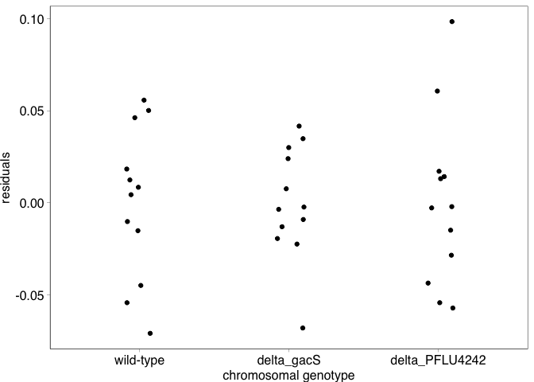
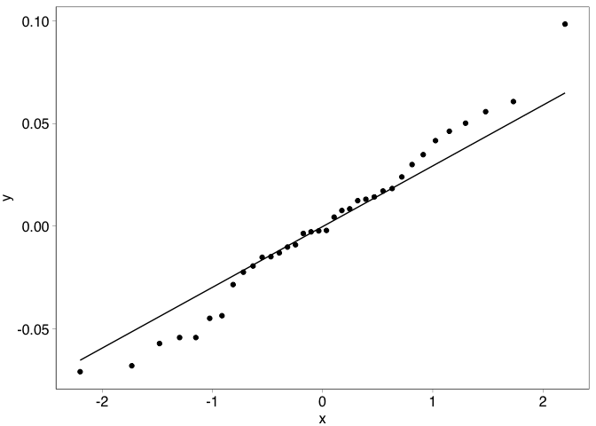
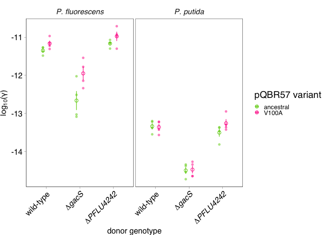
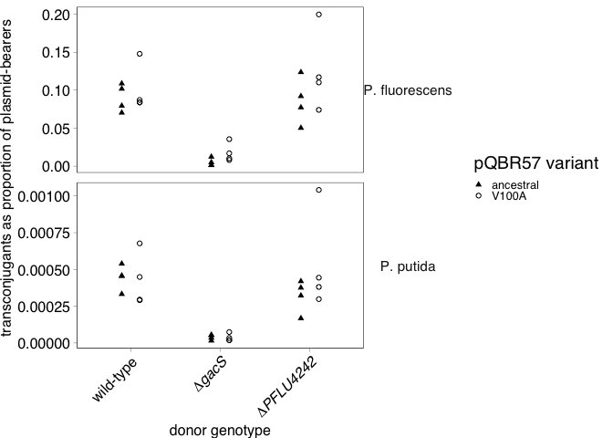

COMPMUT Experiments 3: Presentation and analysis of plasmid mutant and
knockout fitness
================
jpjh
compiled Feb 2021, edited Jul 2021

[Now published in PLoS
Biology](https://journals.plos.org/plosbiology/article?id=10.1371/journal.pbio.3001225):

Hall, J. P. J., Wright, R. C. T., Harrison, E., Muddiman, K. J., Jamie
Wood, A., Paterson, S., & Brockhurst, M. A. (2021). Plasmid fitness
costs are caused by specific genetic conflicts enabling resolution by
compensatory mutation. *PLoS Biology*, *19*(10), e3001225.
<https://doi.org/10.1371/journal.pbio.3001225>

**[Back to index.](COMPMUT_index.md)**

------------------------------------------------------------------------

## Competition experiments with knockout strains carrying different pQBR57 variants

#### Experimental design:

The naturally-occurring variants of pQBR57 (ancestral, V100A) were
conjugated into the knockout strains (∆*gacS*, ∆*PFLU4242*) or into the
unmodified gentamicin-resistant ‘wild-type’ strain. Conjugations were
performed in quadruplicate to mitigate any effect of jackpot mutations
resulting in a total of (three ‘host’ treatments by two plasmid
treatments by four replicates = ) 24 strains, which were confirmed by
PCR.

Again, competition experiments were established for all of these 24
strains, alongside experiments for the plasmid-free wild-type, ∆*gacS*,
and ∆*PFLU4242* strains, which were likewise performed in quadruplicate.
There were therefore 36 ‘competitions’.

Competition experiments were conducted as described in
[`COMPMUT_exp_1_knockouts.Rmd`](COMPMUT_exp_1_knockouts.md).

#### Calculation of relative fitness and generation of figures

Load in data and plot.

``` r
d3 <- read.csv("../data/COMPMUT_exp_data_3.csv", header=TRUE)

kable(head(d3))
```

| replicate | host        | plasmid       | timepoint | dilution | spread | count\_white | count\_blue |
|:----------|:------------|:--------------|:----------|---------:|-------:|-------------:|------------:|
| a         | wild-type   | plasmid-free  | start     |        6 |     60 |          141 |         136 |
| a         | wild-type   | pQBR57\_anc   | start     |        6 |     60 |          104 |          99 |
| a         | wild-type   | pQBR57\_V100A | start     |        6 |     60 |          139 |         161 |
| a         | delta\_gacS | plasmid-free  | start     |        6 |     60 |           95 |         151 |
| a         | delta\_gacS | pQBR57\_anc   | start     |        6 |     60 |          137 |         141 |
| a         | delta\_gacS | pQBR57\_V100A | start     |        6 |     60 |           91 |         125 |

Order variables.

``` r
d3 <- d3 %>% 
  mutate(host = factor(host, levels=c("wild-type","delta_gacS","delta_PFLU4242")),
         plasmid = factor(plasmid, levels=c("plasmid-free","pQBR57_anc","pQBR57_V100A"),
                          labels=c("plasmid-free","ancestral","V100A")))
```

Check starting ratios are approximately equal.

``` r
pd <- position_dodge(width=0.3)

d3 %>% filter(timepoint=="start") %>% 
  mutate(ratio = count_white/(count_white + count_blue)) %>%
  ggplot(aes(x=host, y=ratio)) + 
    geom_hline(yintercept=0.5, linetype="dotted") +
    facet_grid(.~plasmid) + 
    geom_point(position=pd) + 
    lims(y=c(0,1)) +
    theme(axis.text.x=element_text(angle=90, vjust=0.5, hjust=1))
```

<!-- -->

Looks ok, some skew but nothing really off.

Calculate fitness. Load up `calulate_fitness()`.

``` r
source("../functions/calculate_fitness.R")

id_cols <- c("replicate","host","plasmid")
df3 <- calculate_fitness(d3, id_cols)  
```

Calculate summary statistics and make a nice plot.

``` r
df3_summ <- df3 %>% 
  group_by(host, plasmid) %>%
  summarise(mean = mean(W_gm), 
            n = n(), 
            se = sd(W_gm)/sqrt(n), 
            ci = (qt(0.95/2 + 0.5, n-1)) * se) %>%
  rename(W_gm=mean)
```

    ## `summarise()` has grouped output by 'host'. You can override using the `.groups` argument.

``` r
(plot_fig3 <- ggplot(data=df3,
                   aes(x=host, y=W_gm)) +
  geom_hline(yintercept=1, size=0.2, linetype=111) +
  geom_point(position=pd, alpha=0.5, size=1, shape=16) +
  geom_point(data=df3_summ, 
             position=pd,
             shape=1, size=2) +
  geom_errorbar(data=df3_summ, width=0, size=0.4, 
                aes(ymax=W_gm+se, ymin=W_gm-se), colour="black") +
  scale_colour_manual(values=c("black","grey50")) +
  scale_x_discrete(breaks=c("wild-type","delta_gacS","delta_PFLU4242"),
                   labels=c("wild-type",
                            expression(paste(Delta,italic("gacS"))),
                            expression(paste(Delta,italic("PFLU4242")))),
                   name="chromosomal genotype") +
  facet_grid(.~plasmid, scales="free") +
  scale_y_continuous(name="relative fitness (W)", breaks=c(0.8,0.9,1)) +
  theme(axis.text.x=element_text(angle=45, hjust=1)))
```

<!-- -->

Output as `.svg`.

``` r
svglite::svglite(height=2, width=3.5, file = "../plots/Fig3.svg")
plot_fig3 + theme_pub() + theme(axis.text.x=element_text(angle=45, hjust=1))
dev.off()
```

    ## quartz_off_screen 
    ##                 2

This plot can receive further annotation in Inkscape if necessary.

Good. Proceed to analysis.

#### Analysis of fitness data

Analyse using standard linear model.

``` r
mod3_1 <- lm(data=df3,
             W_gm ~ host * plasmid)

df3 <- df3 %>% mutate(mod3_1_resid = resid(mod3_1),
              mod3_1_fitted = fitted(mod3_1))

ggplot(data=df3, aes(x=mod3_1_fitted, y=mod3_1_resid)) + 
  geom_point() + labs(x="fitted values", y="residuals")
```

<!-- -->

``` r
ggplot(data=df3, aes(x=host, y=mod3_1_resid)) + 
  geom_point(position=position_jitter(width=0.1)) + 
  labs(x="chromosomal genotype", y="residuals")
```

<!-- -->

``` r
ggplot(data=df3, aes(x=plasmid, y=mod3_1_resid)) + 
  geom_point(position=position_jitter(width=0.1)) + 
  labs(x="plasmid", y="residuals")
```

<!-- -->

``` r
ggplot(data=df3, aes(sample=mod3_1_resid)) + 
    stat_qq() + stat_qq_line()
```

<!-- -->

Model plots look good.

``` r
fligner.test(W_gm ~ interaction(host, plasmid), data=df3)  
```

    ## 
    ##  Fligner-Killeen test of homogeneity of variances
    ## 
    ## data:  W_gm by interaction(host, plasmid)
    ## Fligner-Killeen:med chi-squared = 6.3985, df = 8, p-value = 0.6027

``` r
bartlett.test(W_gm ~ interaction(host, plasmid), data=df3)  
```

    ## 
    ##  Bartlett test of homogeneity of variances
    ## 
    ## data:  W_gm by interaction(host, plasmid)
    ## Bartlett's K-squared = 7.4933, df = 8, p-value = 0.4845

``` r
car::leveneTest(W_gm ~ interaction(host, plasmid), data=df3)  
```

    ## Levene's Test for Homogeneity of Variance (center = median)
    ##       Df F value Pr(>F)
    ## group  8  0.8695 0.5535
    ##       27

``` r
shapiro.test(resid(mod3_1))  
```

    ## 
    ##  Shapiro-Wilk normality test
    ## 
    ## data:  resid(mod3_1)
    ## W = 0.9822, p-value = 0.8169

All looks fine.

``` r
kable(anova(mod3_1))
```

|              |  Df |    Sum Sq |   Mean Sq |  F value | Pr(&gt;F) |
|:-------------|----:|----------:|----------:|---------:|----------:|
| host         |   2 | 0.0239924 | 0.0119962 | 6.208174 | 0.0060503 |
| plasmid      |   2 | 0.0265493 | 0.0132746 | 6.869799 | 0.0038742 |
| host:plasmid |   4 | 0.0254932 | 0.0063733 | 3.298268 | 0.0252506 |
| Residuals    |  27 | 0.0521726 | 0.0019323 |       NA |        NA |

Interaction effect is significant (F4,27 = 3.29, p = 0.025) –
chromosomal mutations affect the different `plasmid`s differently
(i.e. different effect in plasmid-free).

Run post-hoc tests.

``` r
library(emmeans)
posthoc <- lsmeans(mod3_1, pairwise ~ host * plasmid, adjust="mvt")
contr <- data.frame(posthoc$contrasts) %>% mutate(sign = ifelse(p.value<0.05, "*", ""))
kable(contr)
```

| contrast                                                    |   estimate |        SE |  df |    t.ratio |   p.value | sign |
|:------------------------------------------------------------|-----------:|----------:|----:|-----------:|----------:|:-----|
| (wild-type plasmid-free) - (delta\_gacS plasmid-free)       | -0.0511473 | 0.0310831 |  27 | -1.6454997 | 0.7725293 |      |
| (wild-type plasmid-free) - (delta\_PFLU4242 plasmid-free)   | -0.0105851 | 0.0310831 |  27 | -0.3405408 | 0.9999926 |      |
| (wild-type plasmid-free) - (wild-type ancestral)            |  0.1150825 | 0.0310831 |  27 |  3.7024133 | 0.0236315 | \*   |
| (wild-type plasmid-free) - delta\_gacS ancestral            |  0.0155234 | 0.0310831 |  27 |  0.4994162 | 0.9998618 |      |
| (wild-type plasmid-free) - delta\_PFLU4242 ancestral        | -0.0275831 | 0.0310831 |  27 | -0.8873981 | 0.9918676 |      |
| (wild-type plasmid-free) - (wild-type V100A)                | -0.0176469 | 0.0310831 |  27 | -0.5677317 | 0.9996409 |      |
| (wild-type plasmid-free) - delta\_gacS V100A                | -0.0370378 | 0.0310831 |  27 | -1.1915746 | 0.9514983 |      |
| (wild-type plasmid-free) - delta\_PFLU4242 V100A            | -0.0221880 | 0.0310831 |  27 | -0.7138290 | 0.9981381 |      |
| (delta\_gacS plasmid-free) - (delta\_PFLU4242 plasmid-free) |  0.0405622 | 0.0310831 |  27 |  1.3049589 | 0.9211733 |      |
| (delta\_gacS plasmid-free) - (wild-type ancestral)          |  0.1662298 | 0.0310831 |  27 |  5.3479130 | 0.0003403 | \*   |
| (delta\_gacS plasmid-free) - delta\_gacS ancestral          |  0.0666707 | 0.0310831 |  27 |  2.1449159 | 0.4665525 |      |
| (delta\_gacS plasmid-free) - delta\_PFLU4242 ancestral      |  0.0235642 | 0.0310831 |  27 |  0.7581017 | 0.9971646 |      |
| (delta\_gacS plasmid-free) - (wild-type V100A)              |  0.0335004 | 0.0310831 |  27 |  1.0777680 | 0.9727284 |      |
| (delta\_gacS plasmid-free) - delta\_gacS V100A              |  0.0141094 | 0.0310831 |  27 |  0.4539252 | 0.9999324 |      |
| (delta\_gacS plasmid-free) - delta\_PFLU4242 V100A          |  0.0289592 | 0.0310831 |  27 |  0.9316708 | 0.9888826 |      |
| (delta\_PFLU4242 plasmid-free) - (wild-type ancestral)      |  0.1256676 | 0.0310831 |  27 |  4.0429541 | 0.0099956 | \*   |
| (delta\_PFLU4242 plasmid-free) - delta\_gacS ancestral      |  0.0261085 | 0.0310831 |  27 |  0.8399570 | 0.9943232 |      |
| (delta\_PFLU4242 plasmid-free) - delta\_PFLU4242 ancestral  | -0.0169980 | 0.0310831 |  27 | -0.5468573 | 0.9997273 |      |
| (delta\_PFLU4242 plasmid-free) - (wild-type V100A)          | -0.0070618 | 0.0310831 |  27 | -0.2271909 | 0.9999997 |      |
| (delta\_PFLU4242 plasmid-free) - delta\_gacS V100A          | -0.0264528 | 0.0310831 |  27 | -0.8510338 | 0.9938108 |      |
| (delta\_PFLU4242 plasmid-free) - delta\_PFLU4242 V100A      | -0.0116030 | 0.0310831 |  27 | -0.3732882 | 0.9999849 |      |
| (wild-type ancestral) - delta\_gacS ancestral               | -0.0995591 | 0.0310831 |  27 | -3.2029971 | 0.0708606 |      |
| (wild-type ancestral) - delta\_PFLU4242 ancestral           | -0.1426656 | 0.0310831 |  27 | -4.5898114 | 0.0024321 | \*   |
| (wild-type ancestral) - (wild-type V100A)                   | -0.1327294 | 0.0310831 |  27 | -4.2701450 | 0.0056137 | \*   |
| (wild-type ancestral) - delta\_gacS V100A                   | -0.1521204 | 0.0310831 |  27 | -4.8939879 | 0.0010300 | \*   |
| (wild-type ancestral) - delta\_PFLU4242 V100A               | -0.1372706 | 0.0310831 |  27 | -4.4162423 | 0.0040042 | \*   |
| delta\_gacS ancestral - delta\_PFLU4242 ancestral           | -0.0431065 | 0.0310831 |  27 | -1.3868143 | 0.8931459 |      |
| delta\_gacS ancestral - (wild-type V100A)                   | -0.0331703 | 0.0310831 |  27 | -1.0671479 | 0.9742640 |      |
| delta\_gacS ancestral - delta\_gacS V100A                   | -0.0525613 | 0.0310831 |  27 | -1.6909908 | 0.7464081 |      |
| delta\_gacS ancestral - delta\_PFLU4242 V100A               | -0.0377114 | 0.0310831 |  27 | -1.2132452 | 0.9464708 |      |
| delta\_PFLU4242 ancestral - (wild-type V100A)               |  0.0099362 | 0.0310831 |  27 |  0.3196664 | 0.9999955 |      |
| delta\_PFLU4242 ancestral - delta\_gacS V100A               | -0.0094548 | 0.0310831 |  27 | -0.3041765 | 0.9999969 |      |
| delta\_PFLU4242 ancestral - delta\_PFLU4242 V100A           |  0.0053951 | 0.0310831 |  27 |  0.1735691 | 1.0000000 |      |
| (wild-type V100A) - delta\_gacS V100A                       | -0.0193910 | 0.0310831 |  27 | -0.6238429 | 0.9992867 |      |
| (wild-type V100A) - delta\_PFLU4242 V100A                   | -0.0045412 | 0.0310831 |  27 | -0.1460973 | 1.0000000 |      |
| delta\_gacS V100A - delta\_PFLU4242 V100A                   |  0.0148498 | 0.0310831 |  27 |  0.4777456 | 0.9999003 |      |

Shows a significant cost of pQBR57\_anc, a significant effect of
PFLU4242 amelioration, and a significant effect of pQBR57\_V100A
ameliorations.

## Measurement of conjugation

#### Experimental design

Experiments were also performed to measure conjugation rate.

For these experiments, the same strains were used as for the competition
experiments above.

For each conjugation rate measurement, the strain to be tested was mixed
with streptomycin-resistant recipient strains of *P. fluorescens* SBW25,
or *P. putida* KT2440 to measure within-species and between-species
conjugation rates. CFU/ml measurements were made for donor and recipient
prior to mixing to enable calculation of starting population size. The
mix was then subcultured 1:100 into fresh KB broth and incubated at 28°C
shaking for 24 hours, before spreading samples on selective media to
enumerate donors, recipients, and transconjugants.

### Calculation and analysis of conjugation rates

Load up conjugation rate data and convert into a wide format for
calculations.

``` r
d7 <- read.csv(file="../data/COMPMUT_exp_data_3-1.csv", header=TRUE)

kable(head(d7))
```

| replicate | donor           | plasmid       | recipient | timepoint    | dilution | spread | count\_donor | count\_recipient |
|:----------|:----------------|:--------------|:----------|:-------------|---------:|-------:|-------------:|-----------------:|
| a         | wild-type       | pQBR57\_anc   | NA        | start\_donor |        6 |     60 |          202 |                0 |
| a         | wild-type       | pQBR57\_V100A | NA        | start\_donor |        6 |     60 |          254 |                0 |
| a         | delta\_gacS     | pQBR57\_anc   | NA        | start\_donor |        6 |     60 |          178 |                0 |
| a         | delta\_gacS     | pQBR57\_V100A | NA        | start\_donor |        6 |     60 |          164 |                0 |
| a         | delta\_PFLU4242 | pQBR57\_anc   | NA        | start\_donor |        6 |     60 |          273 |                0 |
| a         | delta\_PFLU4242 | pQBR57\_V100A | NA        | start\_donor |        6 |     60 |          308 |                0 |

The Simonsen et al. (1990) formula for conjugation rate calculation is:

`gamma = (log(N/N0)/t) * log(1+((TC/R)*(N/D))) * (1/(N-N0)))`

For conjugation rate calculations, we therefore require:

-   N = total population at end point
-   N0 = total population at start point
-   TC = population of transconjugants at endpoint
-   R = population of recipients at endpoint
-   D = population of donors at endpoint

We can also calculate fitness from these data to compare with the
(better-controlled) data presented above.

#### Calculate conjugation rates

Requires a bit of wrestling to get the cfu/ml information for this.

Calculate cfu/ml for Pf and Pp separately.

``` r
d7_start_D <- d7 %>% 
  filter(timepoint == "start_donor") %>% select(!recipient & !timepoint) %>%
  mutate(D0 = (10^dilution) * (1000/spread) * count_donor * 0.5 * 0.01)

d7_start_R_pf <- d7 %>%
  filter(timepoint == "start_pf_recipient") %>% select(!donor & !plasmid & !timepoint) %>%
  mutate(R0 = (10^dilution) * (1000/spread) * count_recipient * 0.5 * 0.01)

d7_start_R_pp <- d7 %>%
  filter(timepoint == "start_pp_recipient") %>% select(!donor & !plasmid & !timepoint) %>%
  mutate(R0 = (10^dilution) * (1000/spread) * count_recipient * 0.5 * 0.01)

d7_start_pf <- full_join(d7_start_D, d7_start_R_pf, by=c("replicate"),
                         suffix=c("donor","recipient")) %>%
  select(replicate, donor, plasmid, recipient, D0, R0)
                         
d7_start_pp <- full_join(d7_start_D, d7_start_R_pp, by=c("replicate"),
                         suffix=c("donor","recipient")) %>%
    select(replicate, donor, plasmid, recipient, D0, R0)

d7_start <- bind_rows(d7_start_pf, d7_start_pp)

d7_end_DR <- d7 %>% filter(timepoint == "end_DR") %>%
  mutate(D = (10^dilution) * (1000/spread) * count_donor,
         R = (10^dilution) * (1000/spread) * count_recipient) %>%
  select(replicate, donor, plasmid, recipient, D, R)

d7_end_T <- d7 %>% filter(timepoint == "end_T") %>%
  mutate(TC = (10^dilution) * (1000/spread) * count_recipient) %>%
  select(replicate, donor, plasmid, recipient, TC)

dc7 <- left_join(d7_start, d7_end_DR) %>%
  left_join(d7_end_T) %>%
  mutate(N0 = D0 + R0,
         N = D + R,
         gamma = (log(N/N0)/24) * log(1+((TC/R)*(N/D))) * (1/(N-N0)),
         donor = factor(donor, levels=c("wild-type","delta_gacS","delta_PFLU4242")),
         recipient = factor(recipient, levels=c("Pf","Pp"), 
                            labels=c("P. fluorescens","P. putida")),
         plasmid = factor(plasmid, levels=c("pQBR57_anc","pQBR57_V100A"),
                          labels=c("ancestral","V100A")))
```

    ## Joining, by = c("replicate", "donor", "plasmid", "recipient")
    ## Joining, by = c("replicate", "donor", "plasmid", "recipient")

Generate a plot.

``` r
dc7_summ <- dc7 %>% 
  group_by(donor, recipient, plasmid) %>%
  mutate(log10_gamma = log10(gamma)) %>%
  summarise(mean = mean(log10_gamma), 
            n = n(), 
            se = sd(log10_gamma)/sqrt(n), 
            ci = (qt(0.95/2 + 0.5, n-1)) * se) %>%
  rename(log10_gamma=mean)
```

    ## `summarise()` has grouped output by 'donor', 'recipient'. You can override using the `.groups` argument.

``` r
pd <- position_dodge(width=0.4)


(plot_fig7 <- ggplot(data=dc7, aes(x=donor, y=log10(gamma), colour=plasmid)) + 
    geom_point(position=pd, alpha=0.5, size=1.5, shape=16) + 
    facet_grid(.~recipient) +
    labs(y=expression(paste("log"[10], "(\u03B3)"))) +
    scale_colour_manual(values=c("chartreuse3","deeppink"), name = "pQBR57 variant") +
    scale_x_discrete(breaks=c("wild-type","delta_gacS","delta_PFLU4242"),
                     labels=c("wild-type",
                              expression(paste(Delta,italic("gacS"))),
                              expression(paste(Delta,italic("PFLU4242")))),
                     name="donor genotype") +
    geom_point(data=dc7_summ, aes(y=log10_gamma, group=interaction(donor, plasmid)), 
               shape = 1, position=pd, size=2) +
    geom_errorbar(data=dc7_summ,
                  aes(ymax=log10_gamma+se, ymin=log10_gamma-se, y=log10_gamma, group=interaction(donor, plasmid)),
                  width=0, size=0.4, position=pd) +
   theme(axis.text.x=element_text(angle=45, hjust=1),
        strip.text.x=element_text(face="italic"),
        legend.position="right"))
```

<!-- -->

Output.

``` r
svglite::svglite(height=2, width=3.5, file = "../plots/Fig7.svg")
plot_fig7 + theme_pub() + 
  theme(axis.text.x=element_text(angle=45, hjust=1), legend.position="right", strip.text.x=element_text(face="italic"))
dev.off()
```

    ## quartz_off_screen 
    ##                 2

Output alongside competition data.

``` r
library(patchwork)

plot_fig1 <- readRDS("../plots/Fig1.rds")
plot_fig2 <- readRDS("../plots/Fig2.rds")

f1 <- plot_fig1 + theme_pub() + ggtitle("A") +
  theme(axis.text.x=element_text(angle=45, hjust=1),
        plot.title=element_text(hjust=0))
f2 <- plot_fig2 + theme_pub() + ggtitle("B") +
  theme(axis.text.x=element_text(angle=45, hjust=1),
        plot.title=element_text(hjust=0))
f7 <- plot_fig7 + theme_pub() + ggtitle("C") +
  theme(axis.text.x=element_text(angle=45, hjust=1), 
        legend.position=c(0.75, 0.8), 
        plot.title=element_text(hjust=0),
        strip.text.x=element_text(face="italic"))

svglite::svglite(height=3, width=7.2, file = "../plots/Fig1_2_7.svg")
f1 + f2 + f7 + plot_layout(widths=c(3,1,2))
dev.off()
```

    ## quartz_off_screen 
    ##                 2

#### Analysis

``` r
mod7_1 <- lm(data=dc7,
             log10(gamma) ~ recipient * donor * plasmid)

par(mfrow=c(2,2))
plot(mod7_1)
```

<!-- -->

Data look ok for a linear model.

``` r
fligner.test(log10(gamma) ~ interaction(recipient, donor, plasmid), data=dc7)  
```

    ## 
    ##  Fligner-Killeen test of homogeneity of variances
    ## 
    ## data:  log10(gamma) by interaction(recipient, donor, plasmid)
    ## Fligner-Killeen:med chi-squared = 18.291, df = 11, p-value = 0.07507

``` r
bartlett.test(log10(gamma) ~ interaction(recipient, donor, plasmid), data=dc7)  
```

    ## 
    ##  Bartlett test of homogeneity of variances
    ## 
    ## data:  log10(gamma) by interaction(recipient, donor, plasmid)
    ## Bartlett's K-squared = 14.049, df = 11, p-value = 0.2303

``` r
car::leveneTest(W_gm ~ interaction(host, plasmid), data=df3)  
```

    ## Levene's Test for Homogeneity of Variance (center = median)
    ##       Df F value Pr(>F)
    ## group  8  0.8695 0.5535
    ##       27

``` r
shapiro.test(resid(mod3_1))  
```

    ## 
    ##  Shapiro-Wilk normality test
    ## 
    ## data:  resid(mod3_1)
    ## W = 0.9822, p-value = 0.8169

These are fine. Proceed with model reduction.

``` r
kable(anova(mod7_1))
```

|                         |  Df |     Sum Sq |    Mean Sq |      F value | Pr(&gt;F) |
|:------------------------|----:|-----------:|-----------:|-------------:|----------:|
| recipient               |   1 | 57.8884869 | 57.8884869 | 1002.0332467 | 0.0000000 |
| donor                   |   2 | 13.7395730 |  6.8697865 |  118.9140510 | 0.0000000 |
| plasmid                 |   1 |  0.5938486 |  0.5938486 |   10.2793503 | 0.0028202 |
| recipient:donor         |   2 |  0.0961862 |  0.0480931 |    0.8324782 | 0.4431702 |
| recipient:plasmid       |   1 |  0.2374738 |  0.2374738 |    4.1106036 | 0.0500677 |
| donor:plasmid           |   2 |  0.1633785 |  0.0816893 |    1.4140177 | 0.2563466 |
| recipient:donor:plasmid |   2 |  0.2887285 |  0.1443643 |    2.4989045 | 0.0963282 |
| Residuals               |  36 |  2.0797569 |  0.0577710 |           NA |        NA |

No significant 3-way interaction (p &gt; 0.05)

``` r
mod7_2 <- update(mod7_1, .~.-recipient:donor:plasmid)

kable(anova(mod7_2))
```

|                   |  Df |     Sum Sq |    Mean Sq |     F value | Pr(&gt;F) |
|:------------------|----:|-----------:|-----------:|------------:|----------:|
| recipient         |   1 | 57.8884869 | 57.8884869 | 928.7633726 | 0.0000000 |
| donor             |   2 | 13.7395730 |  6.8697865 | 110.2189128 | 0.0000000 |
| plasmid           |   1 |  0.5938486 |  0.5938486 |   9.5277119 | 0.0037676 |
| recipient:donor   |   2 |  0.0961862 |  0.0480931 |   0.7716064 | 0.4693764 |
| recipient:plasmid |   1 |  0.2374738 |  0.2374738 |   3.8100314 | 0.0583445 |
| donor:plasmid     |   2 |  0.1633785 |  0.0816893 |   1.3106231 | 0.2815637 |
| Residuals         |  38 |  2.3684854 |  0.0623286 |          NA |        NA |

Remove least significant interaction first.

``` r
mod7_3 <- update(mod7_2, .~.-recipient:donor)

kable(anova(mod7_3))
```

|                   |  Df |     Sum Sq |    Mean Sq |    F value | Pr(&gt;F) |
|:------------------|----:|-----------:|-----------:|-----------:|----------:|
| recipient         |   1 | 57.8884869 | 57.8884869 | 939.492071 | 0.0000000 |
| donor             |   2 | 13.7395730 |  6.8697865 | 111.492117 | 0.0000000 |
| plasmid           |   1 |  0.5938486 |  0.5938486 |   9.637772 | 0.0034942 |
| recipient:plasmid |   1 |  0.2374738 |  0.2374738 |   3.854043 | 0.0566056 |
| donor:plasmid     |   2 |  0.1633785 |  0.0816893 |   1.325763 | 0.2770183 |
| Residuals         |  40 |  2.4646717 |  0.0616168 |         NA |        NA |

Other interaction is also not significant.

``` r
mod7_4 <- update(mod7_3, .~.-donor:plasmid)

kable(anova(mod7_4))
```

|                   |  Df |     Sum Sq |    Mean Sq |    F value | Pr(&gt;F) |
|:------------------|----:|-----------:|-----------:|-----------:|----------:|
| recipient         |   1 | 57.8884869 | 57.8884869 | 925.140809 | 0.0000000 |
| donor             |   2 | 13.7395730 |  6.8697865 | 109.789013 | 0.0000000 |
| plasmid           |   1 |  0.5938486 |  0.5938486 |   9.490550 | 0.0036362 |
| recipient:plasmid |   1 |  0.2374738 |  0.2374738 |   3.795171 | 0.0581039 |
| Residuals         |  42 |  2.6280502 |  0.0625726 |         NA |        NA |

And the remaining interaction (recipient:plasmid) also has p &gt; 0.05,
though it is marginal (p &lt; 0.06).

``` r
mod7_5 <- update(mod7_4, .~.-recipient:plasmid)

kable(anova(mod7_5))
```

|           |  Df |     Sum Sq |    Mean Sq |    F value | Pr(&gt;F) |
|:----------|----:|-----------:|-----------:|-----------:|----------:|
| recipient |   1 | 57.8884869 | 57.8884869 | 868.673579 | 0.0000000 |
| donor     |   2 | 13.7395730 |  6.8697865 | 103.087891 | 0.0000000 |
| plasmid   |   1 |  0.5938486 |  0.5938486 |   8.911281 | 0.0046615 |
| Residuals |  43 |  2.8655239 |  0.0666401 |         NA |        NA |

This shows that recipient has an effect (lower conjugation rates into
putida than into fluorescens), donor has an effect (lower conjugation
rates with ∆gacS). There is also a small, but significant effect of
plasmid (V100A has slightly higher conjugation rate).

Validate model by examining plots.

``` r
plot(mod7_5)
```

<!-- --><!-- --><!-- --><!-- -->

Looks ok.

The marginal interaction, recipient:plasmid, suggests that the plasmid
has a stronger effect when conjugating into fluorescens than into
putida.

``` r
posthoc_c <- lsmeans(mod7_5, pairwise ~ plasmid + recipient + donor, adjust="mvt")
contr_c <- data.frame(posthoc_c$contrasts) %>% mutate(sign = ifelse(p.value<0.05, "*", ""))
contr_c %>% kable()
```

| contrast                                                                        |   estimate |        SE |  df |     t.ratio |   p.value | sign |
|:--------------------------------------------------------------------------------|-----------:|----------:|----:|------------:|----------:|:-----|
| (ancestral P. fluorescens wild-type) - (V100A P. fluorescens wild-type)         | -0.2224576 | 0.0745207 |  43 |  -2.9851769 | 0.0551939 |      |
| (ancestral P. fluorescens wild-type) - (ancestral P. putida wild-type)          |  2.1963699 | 0.0745207 |  43 |  29.4732689 | 0.0000000 | \*   |
| (ancestral P. fluorescens wild-type) - (V100A P. putida wild-type)              |  1.9739123 | 0.1053882 |  43 |  18.7299095 | 0.0000000 | \*   |
| (ancestral P. fluorescens wild-type) - ancestral P. fluorescens delta\_gacS     |  1.0949347 | 0.0912689 |  43 |  11.9968004 | 0.0000000 | \*   |
| (ancestral P. fluorescens wild-type) - V100A P. fluorescens delta\_gacS         |  0.8724771 | 0.1178276 |  43 |   7.4046900 | 0.0000000 | \*   |
| (ancestral P. fluorescens wild-type) - ancestral P. putida delta\_gacS          |  3.2913046 | 0.1178276 |  43 |  27.9332136 | 0.0000000 | \*   |
| (ancestral P. fluorescens wild-type) - V100A P. putida delta\_gacS              |  3.0688470 | 0.1394155 |  43 |  22.0122301 | 0.0000000 | \*   |
| (ancestral P. fluorescens wild-type) - ancestral P. fluorescens delta\_PFLU4242 | -0.0761699 | 0.0912689 |  43 |  -0.8345656 | 0.9376036 |      |
| (ancestral P. fluorescens wild-type) - V100A P. fluorescens delta\_PFLU4242     | -0.2986275 | 0.1178276 |  43 |  -2.5344434 | 0.1425697 |      |
| (ancestral P. fluorescens wild-type) - ancestral P. putida delta\_PFLU4242      |  2.1202000 | 0.1178276 |  43 |  17.9940802 | 0.0000000 | \*   |
| (ancestral P. fluorescens wild-type) - V100A P. putida delta\_PFLU4242          |  1.8977424 | 0.1394155 |  43 |  13.6121293 | 0.0000000 | \*   |
| (V100A P. fluorescens wild-type) - (ancestral P. putida wild-type)              |  2.4188275 | 0.1053882 |  43 |  22.9515871 | 0.0000000 | \*   |
| (V100A P. fluorescens wild-type) - (V100A P. putida wild-type)                  |  2.1963699 | 0.0745207 |  43 |  29.4732689 | 0.0000000 | \*   |
| (V100A P. fluorescens wild-type) - ancestral P. fluorescens delta\_gacS         |  1.3173923 | 0.1178276 |  43 |  11.1806733 | 0.0000000 | \*   |
| (V100A P. fluorescens wild-type) - V100A P. fluorescens delta\_gacS             |  1.0949347 | 0.0912689 |  43 |  11.9968004 | 0.0000000 | \*   |
| (V100A P. fluorescens wild-type) - ancestral P. putida delta\_gacS              |  3.5137622 | 0.1394155 |  43 |  25.2035185 | 0.0000000 | \*   |
| (V100A P. fluorescens wild-type) - V100A P. putida delta\_gacS                  |  3.2913046 | 0.1178276 |  43 |  27.9332136 | 0.0000000 | \*   |
| (V100A P. fluorescens wild-type) - ancestral P. fluorescens delta\_PFLU4242     |  0.1462877 | 0.1178276 |  43 |   1.2415399 | 0.7793463 |      |
| (V100A P. fluorescens wild-type) - V100A P. fluorescens delta\_PFLU4242         | -0.0761699 | 0.0912689 |  43 |  -0.8345656 | 0.9376070 |      |
| (V100A P. fluorescens wild-type) - ancestral P. putida delta\_PFLU4242          |  2.3426576 | 0.1394155 |  43 |  16.8034176 | 0.0000000 | \*   |
| (V100A P. fluorescens wild-type) - V100A P. putida delta\_PFLU4242              |  2.1202000 | 0.1178276 |  43 |  17.9940802 | 0.0000000 | \*   |
| (ancestral P. putida wild-type) - (V100A P. putida wild-type)                   | -0.2224576 | 0.0745207 |  43 |  -2.9851769 | 0.0550543 |      |
| (ancestral P. putida wild-type) - ancestral P. fluorescens delta\_gacS          | -1.1014351 | 0.1178276 |  43 |  -9.3478503 | 0.0000000 | \*   |
| (ancestral P. putida wild-type) - V100A P. fluorescens delta\_gacS              | -1.3238927 | 0.1394155 |  43 |  -9.4960196 | 0.0000000 | \*   |
| (ancestral P. putida wild-type) - ancestral P. putida delta\_gacS               |  1.0949347 | 0.0912689 |  43 |  11.9968004 | 0.0000000 | \*   |
| (ancestral P. putida wild-type) - V100A P. putida delta\_gacS                   |  0.8724771 | 0.1178276 |  43 |   7.4046900 | 0.0000004 | \*   |
| (ancestral P. putida wild-type) - ancestral P. fluorescens delta\_PFLU4242      | -2.2725397 | 0.1178276 |  43 | -19.2869837 | 0.0000000 | \*   |
| (ancestral P. putida wild-type) - V100A P. fluorescens delta\_PFLU4242          | -2.4949973 | 0.1394155 |  43 | -17.8961205 | 0.0000000 | \*   |
| (ancestral P. putida wild-type) - ancestral P. putida delta\_PFLU4242           | -0.0761699 | 0.0912689 |  43 |  -0.8345656 | 0.9376183 |      |
| (ancestral P. putida wild-type) - V100A P. putida delta\_PFLU4242               | -0.2986275 | 0.1178276 |  43 |  -2.5344434 | 0.1425218 |      |
| (V100A P. putida wild-type) - ancestral P. fluorescens delta\_gacS              | -0.8789775 | 0.1394155 |  43 |  -6.3047313 | 0.0000017 | \*   |
| (V100A P. putida wild-type) - V100A P. fluorescens delta\_gacS                  | -1.1014351 | 0.1178276 |  43 |  -9.3478503 | 0.0000000 | \*   |
| (V100A P. putida wild-type) - ancestral P. putida delta\_gacS                   |  1.3173923 | 0.1178276 |  43 |  11.1806733 | 0.0000000 | \*   |
| (V100A P. putida wild-type) - V100A P. putida delta\_gacS                       |  1.0949347 | 0.0912689 |  43 |  11.9968004 | 0.0000000 | \*   |
| (V100A P. putida wild-type) - ancestral P. fluorescens delta\_PFLU4242          | -2.0500821 | 0.1394155 |  43 | -14.7048321 | 0.0000000 | \*   |
| (V100A P. putida wild-type) - V100A P. fluorescens delta\_PFLU4242              | -2.2725397 | 0.1178276 |  43 | -19.2869837 | 0.0000000 | \*   |
| (V100A P. putida wild-type) - ancestral P. putida delta\_PFLU4242               |  0.1462877 | 0.1178276 |  43 |   1.2415399 | 0.7793512 |      |
| (V100A P. putida wild-type) - V100A P. putida delta\_PFLU4242                   | -0.0761699 | 0.0912689 |  43 |  -0.8345656 | 0.9376129 |      |
| ancestral P. fluorescens delta\_gacS - V100A P. fluorescens delta\_gacS         | -0.2224576 | 0.0745207 |  43 |  -2.9851769 | 0.0552273 |      |
| ancestral P. fluorescens delta\_gacS - ancestral P. putida delta\_gacS          |  2.1963699 | 0.0745207 |  43 |  29.4732689 | 0.0000000 | \*   |
| ancestral P. fluorescens delta\_gacS - V100A P. putida delta\_gacS              |  1.9739123 | 0.1053882 |  43 |  18.7299095 | 0.0000000 | \*   |
| ancestral P. fluorescens delta\_gacS - ancestral P. fluorescens delta\_PFLU4242 | -1.1711046 | 0.0912689 |  43 | -12.8313660 | 0.0000000 | \*   |
| ancestral P. fluorescens delta\_gacS - V100A P. fluorescens delta\_PFLU4242     | -1.3935622 | 0.1178276 |  43 | -11.8271250 | 0.0000000 | \*   |
| ancestral P. fluorescens delta\_gacS - ancestral P. putida delta\_PFLU4242      |  1.0252652 | 0.1178276 |  43 |   8.7013986 | 0.0000000 | \*   |
| ancestral P. fluorescens delta\_gacS - V100A P. putida delta\_PFLU4242          |  0.8028076 | 0.1394155 |  43 |   5.7583799 | 0.0000173 | \*   |
| V100A P. fluorescens delta\_gacS - ancestral P. putida delta\_gacS              |  2.4188275 | 0.1053882 |  43 |  22.9515871 | 0.0000000 | \*   |
| V100A P. fluorescens delta\_gacS - V100A P. putida delta\_gacS                  |  2.1963699 | 0.0745207 |  43 |  29.4732689 | 0.0000000 | \*   |
| V100A P. fluorescens delta\_gacS - ancestral P. fluorescens delta\_PFLU4242     | -0.9486470 | 0.1178276 |  43 |  -8.0511417 | 0.0000000 | \*   |
| V100A P. fluorescens delta\_gacS - V100A P. fluorescens delta\_PFLU4242         | -1.1711046 | 0.0912689 |  43 | -12.8313660 | 0.0000000 | \*   |
| V100A P. fluorescens delta\_gacS - ancestral P. putida delta\_PFLU4242          |  1.2477228 | 0.1394155 |  43 |   8.9496682 | 0.0000000 | \*   |
| V100A P. fluorescens delta\_gacS - V100A P. putida delta\_PFLU4242              |  1.0252652 | 0.1178276 |  43 |   8.7013986 | 0.0000000 | \*   |
| ancestral P. putida delta\_gacS - V100A P. putida delta\_gacS                   | -0.2224576 | 0.0745207 |  43 |  -2.9851769 | 0.0551329 |      |
| ancestral P. putida delta\_gacS - ancestral P. fluorescens delta\_PFLU4242      | -3.3674745 | 0.1178276 |  43 | -28.5796653 | 0.0000000 | \*   |
| ancestral P. putida delta\_gacS - V100A P. fluorescens delta\_PFLU4242          | -3.5899321 | 0.1394155 |  43 | -25.7498699 | 0.0000000 | \*   |
| ancestral P. putida delta\_gacS - ancestral P. putida delta\_PFLU4242           | -1.1711046 | 0.0912689 |  43 | -12.8313660 | 0.0000000 | \*   |
| ancestral P. putida delta\_gacS - V100A P. putida delta\_PFLU4242               | -1.3935622 | 0.1178276 |  43 | -11.8271250 | 0.0000000 | \*   |
| V100A P. putida delta\_gacS - ancestral P. fluorescens delta\_PFLU4242          | -3.1450169 | 0.1394155 |  43 | -22.5585816 | 0.0000000 | \*   |
| V100A P. putida delta\_gacS - V100A P. fluorescens delta\_PFLU4242              | -3.3674745 | 0.1178276 |  43 | -28.5796653 | 0.0000000 | \*   |
| V100A P. putida delta\_gacS - ancestral P. putida delta\_PFLU4242               | -0.9486470 | 0.1178276 |  43 |  -8.0511417 | 0.0000000 | \*   |
| V100A P. putida delta\_gacS - V100A P. putida delta\_PFLU4242                   | -1.1711046 | 0.0912689 |  43 | -12.8313660 | 0.0000000 | \*   |
| ancestral P. fluorescens delta\_PFLU4242 - V100A P. fluorescens delta\_PFLU4242 | -0.2224576 | 0.0745207 |  43 |  -2.9851769 | 0.0551631 |      |
| ancestral P. fluorescens delta\_PFLU4242 - ancestral P. putida delta\_PFLU4242  |  2.1963699 | 0.0745207 |  43 |  29.4732689 | 0.0000000 | \*   |
| ancestral P. fluorescens delta\_PFLU4242 - V100A P. putida delta\_PFLU4242      |  1.9739123 | 0.1053882 |  43 |  18.7299095 | 0.0000000 | \*   |
| V100A P. fluorescens delta\_PFLU4242 - ancestral P. putida delta\_PFLU4242      |  2.4188275 | 0.1053882 |  43 |  22.9515871 | 0.0000000 | \*   |
| V100A P. fluorescens delta\_PFLU4242 - V100A P. putida delta\_PFLU4242          |  2.1963699 | 0.0745207 |  43 |  29.4732689 | 0.0000000 | \*   |
| ancestral P. putida delta\_PFLU4242 - V100A P. putida delta\_PFLU4242           | -0.2224576 | 0.0745207 |  43 |  -2.9851769 | 0.0551649 |      |

Are these conclusions qualitatively different when we just consider the
*P. fluorescens* data?

``` r
mod7_10 <- lm(data=filter(dc7, recipient=="P. fluorescens"),
             log10(gamma) ~ donor * plasmid)

kable(anova(mod7_10))
```

|               |  Df |    Sum Sq |   Mean Sq |   F value | Pr(&gt;F) |
|:--------------|----:|----------:|----------:|----------:|----------:|
| donor         |   2 | 7.1143982 | 3.5571991 | 44.760838 | 0.0000001 |
| plasmid       |   1 | 0.7911921 | 0.7911921 |  9.955704 | 0.0054747 |
| donor:plasmid |   2 | 0.3693491 | 0.1846746 |  2.323791 | 0.1265482 |
| Residuals     |  18 | 1.4304822 | 0.0794712 |        NA |        NA |

No significant interaction.

``` r
mod7_11 <- update(mod7_10, .~.-donor:plasmid)

kable(anova(mod7_11))
```

|           |  Df |    Sum Sq |   Mean Sq |   F value | Pr(&gt;F) |
|:----------|----:|----------:|----------:|----------:|----------:|
| donor     |   2 | 7.1143982 | 3.5571991 | 39.528137 | 0.0000001 |
| plasmid   |   1 | 0.7911921 | 0.7911921 |  8.791847 | 0.0076533 |
| Residuals |  20 | 1.7998314 | 0.0899916 |        NA |        NA |

Significant effect of plasmid and donor, as with the full analysis.

What about with just *P. putida*?

``` r
mod7_20 <- lm(data=filter(dc7, recipient=="P. putida"),
             log10(gamma) ~ donor * plasmid)
kable(anova(mod7_20))
```

|               |  Df |    Sum Sq |   Mean Sq |   F value | Pr(&gt;F) |
|:--------------|----:|----------:|----------:|----------:|----------:|
| donor         |   2 | 6.7213611 | 3.3606806 | 93.168972 | 0.0000000 |
| plasmid       |   1 | 0.0401303 | 0.0401303 |  1.112541 | 0.3054831 |
| donor:plasmid |   2 | 0.0827579 | 0.0413790 |  1.147159 | 0.3396897 |
| Residuals     |  18 | 0.6492746 | 0.0360708 |        NA |        NA |

No significant interaction.

``` r
mod7_21 <- update(mod7_20, .~.-donor:plasmid)

kable(anova(mod7_21))
```

|           |  Df |    Sum Sq |   Mean Sq |   F value | Pr(&gt;F) |
|:----------|----:|----------:|----------:|----------:|----------:|
| donor     |   2 | 6.7213611 | 3.3606806 | 91.817789 | 0.0000000 |
| plasmid   |   1 | 0.0401303 | 0.0401303 |  1.096407 | 0.3075463 |
| Residuals |  20 | 0.7320326 | 0.0366016 |        NA |        NA |

No significant main effect of plasmid in *P. putida*, so indeed it seems
like there is a possibly varying effect of the different pQBR57 variants
depending on the recipient. But it is unclear, and strong conclusions
should not be drawn either way.

#### Validation plots

It is possible that apparent differences in conjugation rates are driven
by differences in recipients or donors, rather than changes in
transconjugants. To test what populations in the conjugation mix are
driving differences in conjugation rate, try plotting all populations
against rate.

``` r
ggplot(data=dc7, aes(x=log10(D0), y=log10(gamma), shape=plasmid, colour=donor)) + 
  geom_point() + facet_grid(.~recipient, scale="free_x") + 
  scale_shape_manual(values=c(17,1)) + 
  theme(legend.position="right") + ggtitle("starting donors vs gamma")
```

<!-- -->

``` r
ggplot(data=dc7, aes(x=log10(R0), y=log10(gamma), shape=plasmid, colour=donor)) + 
  geom_point() + facet_grid(.~recipient, scale="free_x") + 
  scale_shape_manual(values=c(17,1)) + 
  theme(legend.position="right") + ggtitle("starting recipients vs gamma")
```

<!-- -->

``` r
ggplot(data=dc7, aes(x=log10(D), y=log10(gamma), shape=plasmid, colour=donor)) + 
  geom_point() + facet_grid(.~recipient, scale="free_x") + 
  scale_shape_manual(values=c(17,1)) + 
  theme(legend.position="right") + ggtitle("endpoint donors vs gamma")
```

<!-- -->

``` r
ggplot(data=dc7, aes(x=log10(R), y=log10(gamma), shape=plasmid, colour=donor)) + 
  geom_point() + facet_grid(.~recipient, scale="free_x") + 
  scale_shape_manual(values=c(17,1)) + 
  theme(legend.position="right") + ggtitle("endpoint recipients vs gamma")
```

<!-- -->

``` r
ggplot(data=dc7, aes(x=log10(TC), y=log10(gamma), shape=plasmid, colour=donor)) + 
  geom_point() + facet_grid(.~recipient, scale="free_x") + 
  scale_shape_manual(values=c(17,1)) + 
  theme(legend.position="right") + ggtitle("transconjugants vs gamma")
```

<!-- -->

These plots clearly show that the main driver of conjugation rate
calculations is the transconjugants.

### How much does conjugation affect measures of fitness?

We are interested in the fitness of bacteria carrying plasmid relative
to plasmid-free. It therefore makes sense for conjugation and
segregation to be rolled into this measure — if high conjugation rate
increases the relative fitness of plasmid bearers, due to infection of
neighbours, then that should be included in the measure.

Nevertheless, it is useful to estimate the effect that conjugation can
have on fitness.

Calculate ratios — what proportion of endpoint population are
transconjugants?

``` r
dc7 <- dc7 %>% mutate(tr_ratio = TC/R,
                      td_ratio = TC/D,
                      tp_ratio = TC/(D+TC),
                      tn_ratio = TC/N)

dc7 %>%
  ggplot(aes(x=donor, y=tp_ratio, shape=plasmid)) + 
  geom_point(position=pd) + 
  facet_grid(recipient~., scales="free_y") +
  labs(y="transconjugants as proportion of plasmid-bearers") +
  scale_shape_manual(values=c(17,1), name = "pQBR57 variant") +
  scale_x_discrete(breaks=c("wild-type","delta_gacS","delta_PFLU4242"),
                   labels=c("wild-type",
                            expression(paste(Delta,italic("gacS"))),
                            expression(paste(Delta,italic("PFLU4242")))),
                   name="donor genotype") +
   theme(axis.text.x=element_text(angle=45, hjust=1),
        strip.text.x=element_text(face="italic"),
        legend.position="right")
```

<!-- -->

``` r
dc7 %>%
  ggplot(aes(x=donor, y=tr_ratio, shape=plasmid)) + 
  geom_point(position=pd) + 
  facet_grid(recipient~., scales="free_y") +
  labs(y="T/R ratio") +
  scale_shape_manual(values=c(17,1), name = "pQBR57 variant") +
  scale_x_discrete(breaks=c("wild-type","delta_gacS","delta_PFLU4242"),
                   labels=c("wild-type",
                            expression(paste(Delta,italic("gacS"))),
                            expression(paste(Delta,italic("PFLU4242")))),
                   name="donor genotype") +
   theme(axis.text.x=element_text(angle=45, hjust=1),
        strip.text.x=element_text(face="italic"),
        legend.position="right")
```

<!-- -->

``` r
dc7 %>%
  ggplot(aes(x=donor, y=tn_ratio, shape=plasmid)) + 
  geom_point(position=pd) + 
  facet_grid(recipient~., scales="free_y") +
  labs(y="T/N ratio") +
  scale_shape_manual(values=c(17,1), name = "pQBR57 variant") +
  scale_x_discrete(breaks=c("wild-type","delta_gacS","delta_PFLU4242"),
                   labels=c("wild-type",
                            expression(paste(Delta,italic("gacS"))),
                            expression(paste(Delta,italic("PFLU4242")))),
                   name="donor genotype") +
   theme(axis.text.x=element_text(angle=45, hjust=1),
        strip.text.x=element_text(face="italic"),
        legend.position="right")
```

<!-- -->

Transconjugants end up being up to 12% of the total population in one
replicate, but usually more like 2.5%.

``` r
dc7 %>% group_by(plasmid, recipient, donor) %>%
  summarise(mean = mean(tn_ratio), sd = sd(tn_ratio), max=max(tn_ratio), min=min(tn_ratio)) %>% kable()
```

    ## `summarise()` has grouped output by 'plasmid', 'recipient'. You can override using the `.groups` argument.

| plasmid   | recipient      | donor           |      mean |        sd |       max |       min |
|:----------|:---------------|:----------------|----------:|----------:|----------:|----------:|
| ancestral | P. fluorescens | wild-type       | 0.0287355 | 0.0088342 | 0.0359155 | 0.0176707 |
| ancestral | P. fluorescens | delta\_gacS     | 0.0018485 | 0.0019223 | 0.0045226 | 0.0004367 |
| ancestral | P. fluorescens | delta\_PFLU4242 | 0.0487769 | 0.0166793 | 0.0705479 | 0.0313043 |
| ancestral | P. putida      | wild-type       | 0.0001534 | 0.0000388 | 0.0001856 | 0.0001022 |
| ancestral | P. putida      | delta\_gacS     | 0.0000148 | 0.0000073 | 0.0000220 | 0.0000055 |
| ancestral | P. putida      | delta\_PFLU4242 | 0.0001599 | 0.0000513 | 0.0001985 | 0.0000853 |
| V100A     | P. fluorescens | wild-type       | 0.0487352 | 0.0179918 | 0.0750000 | 0.0358289 |
| V100A     | P. fluorescens | delta\_gacS     | 0.0057173 | 0.0039917 | 0.0116667 | 0.0031142 |
| V100A     | P. fluorescens | delta\_PFLU4242 | 0.0743627 | 0.0334578 | 0.1200000 | 0.0395904 |
| V100A     | P. putida      | wild-type       | 0.0001833 | 0.0000569 | 0.0002519 | 0.0001184 |
| V100A     | P. putida      | delta\_gacS     | 0.0000129 | 0.0000071 | 0.0000230 | 0.0000071 |
| V100A     | P. putida      | delta\_PFLU4242 | 0.0002434 | 0.0001257 | 0.0004280 | 0.0001514 |

Mean effect is 2.9% of total.

How are fitness measurements changed if transconjugants count as donors?

``` r
dc7 <- dc7 %>% mutate(m_D = log(D/D0),
                      m_R = log(R/R0),
                      m_Dadj = log((D+TC)/D0),
                      m_Radj = log((R-TC)/R0),
                      W = m_D/m_R,
                      W_pla = m_Dadj/m_Radj)

cols_to_take <- c("replicate", "recipient","plasmid", "donor")

dc7l <- dc7 %>%
  select(all_of(cols_to_take), W, W_pla) %>%
  pivot_longer(cols = c("W", "W_pla"), names_to = "fitness_measure", values_to = "fitness")
```

Plot this:

``` r
dc7l %>% filter(recipient != "P. putida") %>%
  ggplot(aes(x=donor, y=fitness, shape=plasmid, colour=fitness_measure)) + 
  geom_hline(yintercept=1, size=0.2) +
  geom_point(position=pd) + 
  facet_grid(.~recipient) +
  theme(legend.position="right")
```

<!-- -->

Looks very similar; no outstanding difference, except possibly for the
double mutant which benefits from higher conjugation rates. What are the
statistics?

``` r
dc7 %>% mutate(ratio = W_pla/W) %>% 
  group_by(recipient, donor, plasmid) %>%
  summarise(mean = mean(ratio), sd = sd(ratio), max=max(ratio), min=min(ratio)) %>% kable()
```

    ## `summarise()` has grouped output by 'recipient', 'donor'. You can override using the `.groups` argument.

| recipient      | donor           | plasmid   |     mean |        sd |      max |      min |
|:---------------|:----------------|:----------|---------:|----------:|---------:|---------:|
| P. fluorescens | wild-type       | ancestral | 1.029487 | 0.0070261 | 1.035795 | 1.022336 |
| P. fluorescens | wild-type       | V100A     | 1.041166 | 0.0152544 | 1.064014 | 1.032378 |
| P. fluorescens | delta\_gacS     | ancestral | 1.001685 | 0.0018441 | 1.004334 | 1.000422 |
| P. fluorescens | delta\_gacS     | V100A     | 1.005801 | 0.0040235 | 1.011483 | 1.002731 |
| P. fluorescens | delta\_PFLU4242 | ancestral | 1.042557 | 0.0136433 | 1.061717 | 1.029711 |
| P. fluorescens | delta\_PFLU4242 | V100A     | 1.068451 | 0.0354153 | 1.117986 | 1.033932 |
| P. putida      | wild-type       | ancestral | 1.000157 | 0.0000389 | 1.000195 | 1.000105 |
| P. putida      | wild-type       | V100A     | 1.000156 | 0.0000611 | 1.000232 | 1.000091 |
| P. putida      | delta\_gacS     | ancestral | 1.000013 | 0.0000054 | 1.000018 | 1.000006 |
| P. putida      | delta\_gacS     | V100A     | 1.000011 | 0.0000063 | 1.000020 | 1.000006 |
| P. putida      | delta\_PFLU4242 | ancestral | 1.000127 | 0.0000414 | 1.000156 | 1.000066 |
| P. putida      | delta\_PFLU4242 | V100A     | 1.000201 | 0.0001028 | 1.000352 | 1.000126 |

When including transconjugants, fitness of the plasmid is up to 12%
greater for the V100A variant in the PFLU4242 background (for one
replicate). But fitness is on average increased by 4%, and is likely to
have only a minor effect on outcomes.

Plot fitness against conjugation rate. If fitness is strongly influenced
by conjugation, there should be a correlation.

``` r
ggplot(data=dc7, aes(x=W, y=(log10(gamma)), shape=plasmid, colour=donor)) + 
  geom_point() + facet_grid(.~recipient) + theme(legend.position="right")
```

<!-- -->

Analyse.

``` r
mod8 <- lm(W ~ log10(gamma) * donor * plasmid, data=subset(dc7, recipient=="P. fluorescens"))
par(mfrow=c(2,2))
plot(mod8)
```

<!-- -->

Residual plots look OK for a linear model.

``` r
shapiro.test(resid(mod8))  
```

    ## 
    ##  Shapiro-Wilk normality test
    ## 
    ## data:  resid(mod8)
    ## W = 0.97036, p-value = 0.6759

Normally-distributed residuals.

``` r
anova(mod8)
```

    ## Analysis of Variance Table
    ## 
    ## Response: W
    ##                            Df   Sum Sq   Mean Sq F value  Pr(>F)  
    ## log10(gamma)                1 0.002424 0.0024235  0.6880 0.42305  
    ## donor                       2 0.042670 0.0213351  6.0564 0.01519 *
    ## plasmid                     1 0.028090 0.0280903  7.9739 0.01535 *
    ## log10(gamma):donor          2 0.012615 0.0063073  1.7904 0.20871  
    ## log10(gamma):plasmid        1 0.000034 0.0000345  0.0098 0.92283  
    ## donor:plasmid               2 0.011614 0.0058069  1.6484 0.23307  
    ## log10(gamma):donor:plasmid  2 0.005023 0.0025116  0.7130 0.50982  
    ## Residuals                  12 0.042273 0.0035228                  
    ## ---
    ## Signif. codes:  0 '***' 0.001 '**' 0.01 '*' 0.05 '.' 0.1 ' ' 1

No obvious significant effect or interactions of conjugation rate.

``` r
mod8_1 <- step(mod8)
```

    ## Start:  AIC=-128.2
    ## W ~ log10(gamma) * donor * plasmid
    ## 
    ##                              Df Sum of Sq      RSS    AIC
    ## - log10(gamma):donor:plasmid  2 0.0050233 0.047296 -129.5
    ## <none>                                    0.042273 -128.2
    ## 
    ## Step:  AIC=-129.51
    ## W ~ log10(gamma) + donor + plasmid + log10(gamma):donor + log10(gamma):plasmid + 
    ##     donor:plasmid
    ## 
    ##                        Df Sum of Sq      RSS     AIC
    ## - log10(gamma):donor    2 0.0009763 0.048273 -133.01
    ## - log10(gamma):plasmid  1 0.0027835 0.050080 -130.13
    ## <none>                              0.047296 -129.50
    ## - donor:plasmid         2 0.0116137 0.058910 -128.24
    ## 
    ## Step:  AIC=-133.01
    ## W ~ log10(gamma) + donor + plasmid + log10(gamma):plasmid + donor:plasmid
    ## 
    ##                        Df Sum of Sq      RSS     AIC
    ## - log10(gamma):plasmid  1 0.0034356 0.051708 -133.37
    ## <none>                              0.048273 -133.01
    ## - donor:plasmid         2 0.0232581 0.071531 -127.58
    ## 
    ## Step:  AIC=-133.36
    ## W ~ log10(gamma) + donor + plasmid + donor:plasmid
    ## 
    ##                 Df Sum of Sq      RSS     AIC
    ## <none>                       0.051708 -133.37
    ## - log10(gamma)   1  0.005862 0.057570 -132.79
    ## - donor:plasmid  2  0.019851 0.071559 -129.57

``` r
anova(mod8_1)
```

    ## Analysis of Variance Table
    ## 
    ## Response: W
    ##               Df   Sum Sq   Mean Sq F value   Pr(>F)   
    ## log10(gamma)   1 0.002424 0.0024235  0.7968 0.384522   
    ## donor          2 0.042670 0.0213351  7.0143 0.006010 **
    ## plasmid        1 0.028090 0.0280903  9.2352 0.007412 **
    ## donor:plasmid  2 0.019851 0.0099254  3.2632 0.063184 . 
    ## Residuals     17 0.051708 0.0030417                    
    ## ---
    ## Signif. codes:  0 '***' 0.001 '**' 0.01 '*' 0.05 '.' 0.1 ' ' 1

No main effect, or interaction effects, of conjugation rate on fitness.
Main and interaction effects of plasmid and donor make sense given what
we know about compensation, namely, compensation works, but there is not
an additive effect of PQBR57\_0059\_V100A and ∆PFLU4242.

Add model outputs to plot.

``` r
(mod8_plot <- ggplot(data=subset(dc7, recipient=="P. fluorescens"), 
       aes(y=W, x=(log10(gamma)), shape=plasmid, colour=donor, linetype=plasmid)) + 
  geom_hline(yintercept=1, colour="black", linetype="dotted") +
  geom_point() + facet_grid(.~recipient) +
  stat_smooth(method = "lm", size=0.5) + theme_pub() + theme(legend.position="right") +
  labs(x=expression(paste("log"[10], "(\u03B3)")))) 
```

    ## `geom_smooth()` using formula 'y ~ x'

<!-- -->

``` r
png("../plots/mod8_plot_review.png", height=8, width=9, units="cm", res=300)
mod8_plot
```

    ## `geom_smooth()` using formula 'y ~ x'

``` r
dev.off()
```

    ## quartz_off_screen 
    ##                 2

------------------------------------------------------------------------

**[Back to index.](COMPMUT_index.md)**
