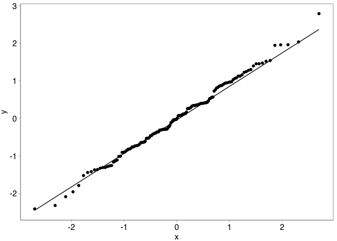
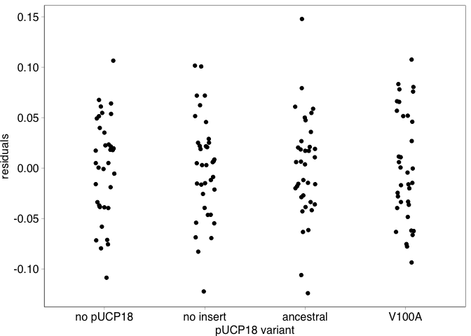
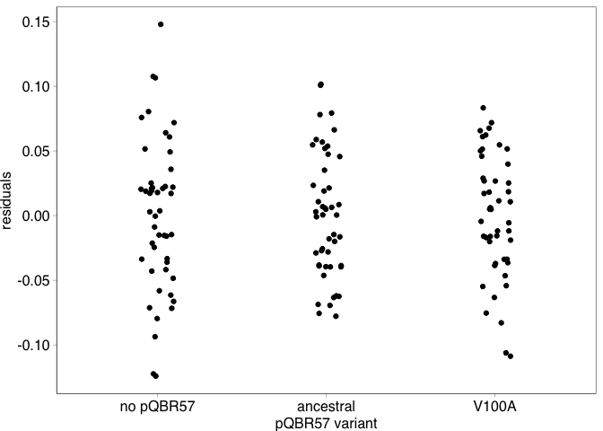
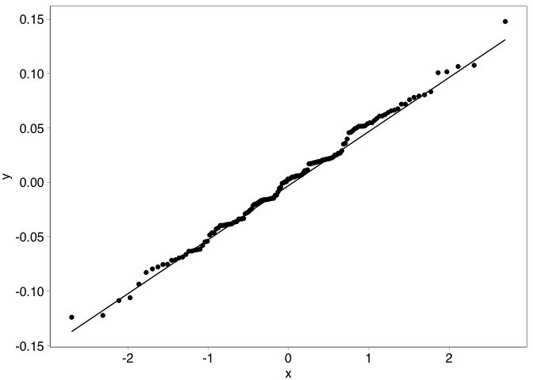
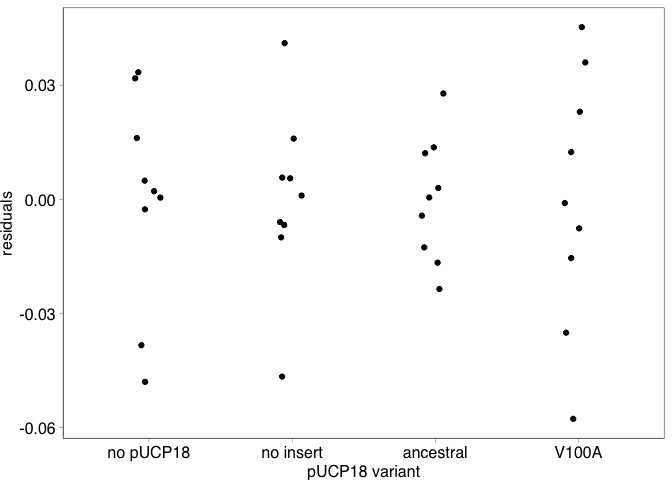
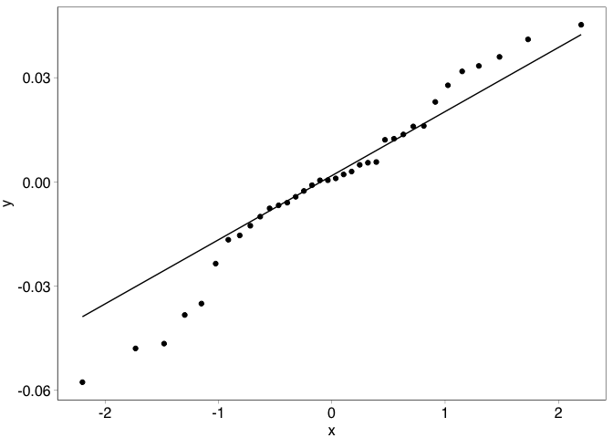

COMPMUT Experiments 4: Presentation and analysis of fitness of
expressing different PQBR57\_0059 variants
================
jpjh
compiled Feb 2021

## Competition experiments with strains expressing PQBR57\_0059 variants

#### Experimental design

The presence of an ancestral, but not a V100A mutant, of PQBR57\_0059 on
the plasmid pQBR57 is associated with a fitness cost. Is this fitness
cost due directly to the ancestral variant of PQBR57\_0059, or is it due
to interactions between the ancestral variant of this gene and other
plasmid gene(s)? To assess this, ancestral or V100A variants of
PQBR57\_0059 were amplified and cloned into the multiple-cloning site
(MCS) of expression vector pUCP18xK using EcoRI/KpnI. pUCP18xK
(henceforth pUCP18) has a Plac promotor driving expression from the
multiple cloning site, and the lack of a cognate LacI repressor in *P.
fluorescens* SBW25 means that the cloned gene product is constitutively
expressed. Three variants of pUCP18 were therefore available: ‘empty’
which contained no gene in the MCS; ‘ancestral’ which contained the
ancestral variant of PQBR57\_0059; and ‘V100A’ which contained the V100A
variant of PQBR57\_0059. *P. fluorescens* was transformed with each of
these plasmids in triplicate, to generate nine strains. Megaplasmid
pQBR57 with the ancestral variant of PQBR57\_0059 (pQBR57\_anc), or with
the V100 variant (pQBR57\_V100A) were then conjugated into each of these
strains, generating 18 strains (two levels of pQBR57 plasmid, three
levels of pUCP18 plasmid, in triplicate).

Competition assays were performed with these strains, alongside the ‘no
pUCP18’ transconjugants that were generated in the wild-type genetic
background for pQBR57\_anc and pQBR57\_V100A, described in
[`COMPMUT_exp_3_knopla.Rmd`](COMPMUT_exp_3_knopla.md). Each
transformant/transconjugant strain was tested in quadruplicate. These
quadruplicate replicates are referred to as ‘experimental replicates’
(`exp_rep`), these are biological replicates of the same
transformant/transconjugant. The different transformant/transconjugant
strains are referred to as transconjugant replicates (`tc_rep`).

Overall, competition assays were performed as described in
[`COMPMUT_exp_1_knockouts.Rmd`](COMPMUT_exp_1_knockouts.md). Samples
from overnight cultures of the ‘test’ strain
(i.e. transconjugant/transformant), grown with kanamycin at 50 µg/ml to
disfavour loss of pUCP18 where appropriate, were pelleted and
resuspended in fresh KB to remove residual antibiotic. Each of these
‘test’ strains was then mixed in approximately equal proportions with a
plasmid-free *lacZ*-expressing ‘reference’ strain of *P. fluorescens*
SBW25, and the mixture subcultured into fresh media for growth for 48
hours. Changes in the relative abundance of ‘test’ and ‘reference’ were
assessed by spreading diluted samples of ‘start’ and ‘end’ culture on
X-gal-containing KB and counting colonies. Replica plating (patching) of
‘end’ culture onto mercury-containing or kanamycin-containing media did
not show substantial loss or conjugation of either plasmid sufficient to
significantly impact calculation of relative fitness.

#### Calculation of relative fitness and generation of figures

Load up and inspect data

``` r
d4 <- read.table("../data/COMPMUT_exp_data_4.csv", header=TRUE, sep=",")

kable(head(d4))
```

| exp\_rep | tc\_rep | plasmid\_pucp | plasmid\_pq   | timepoint | dilution | spread | count\_white | count\_blue |
|:---------|:--------|:--------------|:--------------|:----------|---------:|-------:|-------------:|------------:|
| a        | A       | no pUCP18     | no pQBR57     | end       |        6 |     40 |           89 |          69 |
| a        | A       | no pUCP18     | pQBR57\_anc   | end       |        6 |     40 |           56 |         109 |
| a        | A       | no pUCP18     | pQBR57\_V100A | end       |        6 |     40 |           69 |          64 |
| a        | A       | empty         | no pQBR57     | end       |        6 |     40 |           85 |          82 |
| a        | A       | empty         | pQBR57\_anc   | end       |        6 |     40 |           45 |          90 |
| a        | A       | empty         | pQBR57\_V100A | end       |        6 |     40 |           77 |          55 |

Order variables.

``` r
d4 <- d4 %>% 
  mutate(plasmid_pucp = factor(plasmid_pucp, levels=c("no pUCP18", "empty", "ancestral", "V100A"),
                               labels=c("no pUCP18", "no insert", "ancestral", "V100A")),
         plasmid_pq = factor(plasmid_pq, levels=c("no pQBR57", "pQBR57_anc", "pQBR57_V100A"),
                             labels=c("no pQBR57", "ancestral", "V100A")))
```

Check starting ratios are approximately equal.

``` r
pd <- position_dodge(width=0.3)

d4 %>% filter(timepoint=="start") %>% 
  mutate(ratio = count_white/(count_white + count_blue)) %>%
  ggplot(aes(x=plasmid_pucp, y=ratio, colour=tc_rep)) + 
    geom_hline(yintercept=0.5, linetype="dotted") +
    facet_grid(.~plasmid_pq) + 
    geom_point(position=pd) + 
    lims(y=c(0,1)) +
    theme(axis.text.x=element_text(angle=90, vjust=0.5, hjust=1))
```

<!-- -->

Looks good.

Calculate fitness. Load up `calulate_fitness()`.

``` r
source("../functions/calculate_fitness.R")

id_cols <- c("exp_rep", "tc_rep", "plasmid_pucp", "plasmid_pq")
df4 <- calculate_fitness(d4, id_cols)  
```

Calculate summary statistics and plot.

``` r
df4_summ <- df4 %>% 
  group_by(plasmid_pucp, plasmid_pq) %>%
  summarise(mean = mean(W_gm), 
            n = n(), 
            se = sd(W_gm)/n, 
            ci = (qt(0.95/2 + 0.5, n-1)) * se) %>%
  rename(W_gm=mean)
```

    ## `summarise()` has grouped output by 'plasmid_pucp'. You can override using the `.groups` argument.

``` r
(plot_fig4 <- ggplot(data=df4,
                   aes(x=plasmid_pucp, y=W_gm, colour=tc_rep)) +
  geom_hline(yintercept=1, size=0.2, linetype=111) +
  geom_point(position=pd, alpha=0.8, size=1, shape=16) +
  geom_point(data=df4_summ, 
             position=pd,
             shape=1, size=2, colour="black") +
  scale_colour_manual(values=c("black","grey40","grey80"), name="transformant") +
  labs(x="expression vector pUCP18 PQBR57_0059 variant") +
  facet_grid(.~plasmid_pq, scales="free") +
  scale_y_continuous(name="relative fitness (W)", breaks=seq(0.7,1.2,0.1)) +
  theme(axis.text.x=element_text(angle=45, hjust=1)))
```

<!-- -->

Looks good.

Note that I am not showing error bars as I’m not sure if they should be
over all replicates or just `tc_rep`. It may be clearer just to show the
grand means and the individual data points.

Output as `.svg`.

``` r
svglite::svglite(height=3.5, width=3.6, file = "../plots/Fig4.svg")
plot_fig4 + theme_pub() + theme(axis.text.x=element_text(angle=45, hjust=1))
dev.off()
```

    ## quartz_off_screen 
    ##                 2

### Analysis

#### Linear mixed-effects model

There is some correlation in the data, because each transconjugant
‘replicate’ was tested four times.

Is there an effect here?

Each of the `tc_rep`s are different transconjugants

``` r
df4 <- df4 %>% mutate(clone = ifelse(plasmid_pucp=="no pUCP18" & plasmid_pq=="no pQBR57",
                                     "no pUCP18 / no pQBR57",
                                     paste(tc_rep, plasmid_pucp, plasmid_pq, sep=".")))
```

Generate a linear model with and without the random effect of clone, and
compare following Zuur et al. (2009).

``` r
library(nlme)
```

    ## 
    ## Attaching package: 'nlme'

    ## The following object is masked from 'package:dplyr':
    ## 
    ##     collapse

``` r
mod4_1 <- gls(data=df4, W_gm ~ plasmid_pucp * plasmid_pq, method="REML")
mod4_2 <- lme(data=df4, W_gm ~ plasmid_pucp * plasmid_pq, 
              random = ~1|clone, method="REML")

anova(mod4_1, mod4_2)
```

    ##        Model df       AIC       BIC   logLik   Test   L.Ratio p-value
    ## mod4_1     1 13 -344.5303 -307.0539 185.2652                         
    ## mod4_2     2 14 -342.8327 -302.4735 185.4163 1 vs 2 0.3024044  0.5824

Suggests that any effect of ‘clone’ is not significant, by AIC or BIC.
However, the effect of clone will be retained in the model since it is
part of the data structure.

Generate plots for model validation.

``` r
df4 <- df4 %>% mutate(mod4_2_resid  = resid(mod4_2, type = "normalized"),
              mod4_2_fitted = fitted(mod4_2))

ggplot(data=df4, aes(x=mod4_2_fitted, y=mod4_2_resid)) + 
  geom_point() + labs(x="fitted values", y="residuals")
```

<!-- -->

``` r
ggplot(data=df4, aes(x=plasmid_pucp, y=mod4_2_resid)) + 
  geom_boxplot() + labs(x="pUCP variant", y="residuals")
```

<!-- -->

``` r
ggplot(data=df4, aes(x=plasmid_pq, y=mod4_2_resid)) + 
  geom_boxplot() + labs(x="pQBR57 variant", y="residuals")
```

<!-- -->

``` r
ggplot(data=df4, aes(sample=mod4_2_resid)) + stat_qq() + stat_qq_line()
```

<!-- -->

Look perfect!

Assess significance of terms.

``` r
mod4_2_ml <- update(mod4_2, method="ML")

mod4_3_ml <- update(mod4_2_ml, .~.-plasmid_pucp:plasmid_pq)

anova(mod4_2_ml, mod4_3_ml)
```

    ##           Model df       AIC       BIC   logLik   Test  L.Ratio p-value
    ## mod4_2_ml     1 14 -421.2742 -379.6968 224.6371                        
    ## mod4_3_ml     2  8 -403.8673 -380.1088 209.9336 1 vs 2 29.40692   1e-04

Highly significant interaction between pUCP18 and pQBR57 variant. The
effect on fitness of the PQBR57\_0059 variant in pUCP18 is very
significantly affected by the variant of pQBR57 that is present (if at
all).

Extract Tukey-corrected post-hoc pairwise (least-square means)
comparisons.

``` r
library(emmeans)

posthoc <- lsmeans(mod4_2, pairwise ~ plasmid_pucp * plasmid_pq, adjust="mvt")

contr <- data.frame(posthoc$contrasts) %>% mutate(sign = ifelse(p.value<0.05, "*", ""))

kable(contr)
```

| contrast                                  |   estimate |        SE |  df |     t.ratio |   p.value | sign |
|:------------------------------------------|-----------:|----------:|----:|------------:|----------:|:-----|
| no pUCP18 no pQBR57 - no insert no pQBR57 | -0.0072403 | 0.0251559 |  22 |  -0.2878173 | 1.0000000 |      |
| no pUCP18 no pQBR57 - ancestral no pQBR57 |  0.0384927 | 0.0251559 |  22 |   1.5301665 | 0.9157811 |      |
| no pUCP18 no pQBR57 - V100A no pQBR57     |  0.0019069 | 0.0251559 |  22 |   0.0758052 | 1.0000000 |      |
| no pUCP18 no pQBR57 - no pUCP18 ancestral |  0.1555271 | 0.0251559 |  22 |   6.1825329 | 0.0001583 | \*   |
| no pUCP18 no pQBR57 - no insert ancestral |  0.1525173 | 0.0251559 |  22 |   6.0628850 | 0.0001834 | \*   |
| no pUCP18 no pQBR57 - ancestral ancestral |  0.2571032 | 0.0251559 |  22 |  10.2203962 | 0.0000000 | \*   |
| no pUCP18 no pQBR57 - V100A ancestral     |  0.2554199 | 0.0251559 |  22 |  10.1534834 | 0.0000000 | \*   |
| no pUCP18 no pQBR57 - no pUCP18 V100A     | -0.0210082 | 0.0251559 |  22 |  -0.8351203 | 0.9991678 |      |
| no pUCP18 no pQBR57 - no insert V100A     | -0.0306660 | 0.0251559 |  22 |  -1.2190383 | 0.9811150 |      |
| no pUCP18 no pQBR57 - ancestral V100A     |  0.1544613 | 0.0251559 |  22 |   6.1401628 | 0.0001227 | \*   |
| no pUCP18 no pQBR57 - V100A V100A         |  0.0385333 | 0.0251559 |  22 |   1.5317821 | 0.9156262 |      |
| no insert no pQBR57 - ancestral no pQBR57 |  0.0457330 | 0.0233251 |  22 |   1.9606816 | 0.7124429 |      |
| no insert no pQBR57 - V100A no pQBR57     |  0.0091472 | 0.0233251 |  22 |   0.3921640 | 0.9999995 |      |
| no insert no pQBR57 - no pUCP18 ancestral |  0.1627674 | 0.0233251 |  22 |   6.9782230 | 0.0000182 | \*   |
| no insert no pQBR57 - no insert ancestral |  0.1597576 | 0.0233251 |  22 |   6.8491837 | 0.0000671 | \*   |
| no insert no pQBR57 - ancestral ancestral |  0.2643434 | 0.0233251 |  22 |  11.3330276 | 0.0000000 | \*   |
| no insert no pQBR57 - V100A ancestral     |  0.2626602 | 0.0233251 |  22 |  11.2608627 | 0.0000000 | \*   |
| no insert no pQBR57 - no pUCP18 V100A     | -0.0137679 | 0.0233251 |  22 |  -0.5902622 | 0.9999702 |      |
| no insert no pQBR57 - no insert V100A     | -0.0234257 | 0.0233251 |  22 |  -1.0043148 | 0.9958985 |      |
| no insert no pQBR57 - ancestral V100A     |  0.1617016 | 0.0233251 |  22 |   6.9325272 | 0.0000180 | \*   |
| no insert no pQBR57 - V100A V100A         |  0.0457736 | 0.0233251 |  22 |   1.9624239 | 0.7115765 |      |
| ancestral no pQBR57 - V100A no pQBR57     | -0.0365858 | 0.0233251 |  22 |  -1.5685176 | 0.9031055 |      |
| ancestral no pQBR57 - no pUCP18 ancestral |  0.1170344 | 0.0233251 |  22 |   5.0175414 | 0.0024441 | \*   |
| ancestral no pQBR57 - no insert ancestral |  0.1140246 | 0.0233251 |  22 |   4.8885021 | 0.0029738 | \*   |
| ancestral no pQBR57 - ancestral ancestral |  0.2186105 | 0.0233251 |  22 |   9.3723460 | 0.0000001 | \*   |
| ancestral no pQBR57 - V100A ancestral     |  0.2169272 | 0.0233251 |  22 |   9.3001811 | 0.0000003 | \*   |
| ancestral no pQBR57 - no pUCP18 V100A     | -0.0595009 | 0.0233251 |  22 |  -2.5509438 | 0.3612438 |      |
| ancestral no pQBR57 - no insert V100A     | -0.0691587 | 0.0233251 |  22 |  -2.9649964 | 0.1841241 |      |
| ancestral no pQBR57 - ancestral V100A     |  0.1159686 | 0.0233251 |  22 |   4.9718456 | 0.0025556 | \*   |
| ancestral no pQBR57 - V100A V100A         |  0.0000406 | 0.0233251 |  22 |   0.0017423 | 1.0000000 |      |
| V100A no pQBR57 - no pUCP18 ancestral     |  0.1536202 | 0.0233251 |  22 |   6.5860590 | 0.0000894 | \*   |
| V100A no pQBR57 - no insert ancestral     |  0.1506103 | 0.0233251 |  22 |   6.4570197 | 0.0001059 | \*   |
| V100A no pQBR57 - ancestral ancestral     |  0.2551962 | 0.0233251 |  22 |  10.9408636 | 0.0000000 | \*   |
| V100A no pQBR57 - V100A ancestral         |  0.2535130 | 0.0233251 |  22 |  10.8686987 | 0.0000000 | \*   |
| V100A no pQBR57 - no pUCP18 V100A         | -0.0229151 | 0.0233251 |  22 |  -0.9824262 | 0.9965815 |      |
| V100A no pQBR57 - no insert V100A         | -0.0325729 | 0.0233251 |  22 |  -1.3964788 | 0.9519561 |      |
| V100A no pQBR57 - ancestral V100A         |  0.1525543 | 0.0233251 |  22 |   6.5403632 | 0.0000919 | \*   |
| V100A no pQBR57 - V100A V100A             |  0.0366264 | 0.0233251 |  22 |   1.5702599 | 0.9020631 |      |
| no pUCP18 ancestral - no insert ancestral | -0.0030098 | 0.0233251 |  22 |  -0.1290393 | 1.0000000 |      |
| no pUCP18 ancestral - ancestral ancestral |  0.1015760 | 0.0233251 |  22 |   4.3548046 | 0.0102298 | \*   |
| no pUCP18 ancestral - V100A ancestral     |  0.0998928 | 0.0233251 |  22 |   4.2826397 | 0.0122392 | \*   |
| no pUCP18 ancestral - no pUCP18 V100A     | -0.1765353 | 0.0233251 |  22 |  -7.5684852 | 0.0000105 | \*   |
| no pUCP18 ancestral - no insert V100A     | -0.1861931 | 0.0233251 |  22 |  -7.9825377 | 0.0000026 | \*   |
| no pUCP18 ancestral - ancestral V100A     | -0.0010659 | 0.0233251 |  22 |  -0.0456957 | 1.0000000 |      |
| no pUCP18 ancestral - V100A V100A         | -0.1169938 | 0.0233251 |  22 |  -5.0157990 | 0.0023722 | \*   |
| no insert ancestral - ancestral ancestral |  0.1045859 | 0.0233251 |  22 |   4.4838439 | 0.0077997 | \*   |
| no insert ancestral - V100A ancestral     |  0.1029026 | 0.0233251 |  22 |   4.4116790 | 0.0089086 | \*   |
| no insert ancestral - no pUCP18 V100A     | -0.1735255 | 0.0233251 |  22 |  -7.4394459 | 0.0000045 | \*   |
| no insert ancestral - no insert V100A     | -0.1831833 | 0.0233251 |  22 |  -7.8534985 | 0.0000057 | \*   |
| no insert ancestral - ancestral V100A     |  0.0019440 | 0.0233251 |  22 |   0.0833435 | 1.0000000 |      |
| no insert ancestral - V100A V100A         | -0.1139839 | 0.0233251 |  22 |  -4.8867598 | 0.0030008 | \*   |
| ancestral ancestral - V100A ancestral     | -0.0016832 | 0.0233251 |  22 |  -0.0721649 | 1.0000000 |      |
| ancestral ancestral - no pUCP18 V100A     | -0.2781113 | 0.0233251 |  22 | -11.9232898 | 0.0000000 | \*   |
| ancestral ancestral - no insert V100A     | -0.2877691 | 0.0233251 |  22 | -12.3373423 | 0.0000000 | \*   |
| ancestral ancestral - ancestral V100A     | -0.1026419 | 0.0233251 |  22 |  -4.4005004 | 0.0096080 | \*   |
| ancestral ancestral - V100A V100A         | -0.2185698 | 0.0233251 |  22 |  -9.3706036 | 0.0000002 | \*   |
| V100A ancestral - no pUCP18 V100A         | -0.2764281 | 0.0233251 |  22 | -11.8511249 | 0.0000000 | \*   |
| V100A ancestral - no insert V100A         | -0.2860859 | 0.0233251 |  22 | -12.2651775 | 0.0000000 | \*   |
| V100A ancestral - ancestral V100A         | -0.1009586 | 0.0233251 |  22 |  -4.3283355 | 0.0106963 | \*   |
| V100A ancestral - V100A V100A             | -0.2168866 | 0.0233251 |  22 |  -9.2984388 | 0.0000002 | \*   |
| no pUCP18 V100A - no insert V100A         | -0.0096578 | 0.0233251 |  22 |  -0.4140526 | 0.9999992 |      |
| no pUCP18 V100A - ancestral V100A         |  0.1754694 | 0.0233251 |  22 |   7.5227894 | 0.0000077 | \*   |
| no pUCP18 V100A - V100A V100A             |  0.0595415 | 0.0233251 |  22 |   2.5526861 | 0.3599544 |      |
| no insert V100A - ancestral V100A         |  0.1851272 | 0.0233251 |  22 |   7.9368420 | 0.0000052 | \*   |
| no insert V100A - V100A V100A             |  0.0691993 | 0.0233251 |  22 |   2.9667387 | 0.1842902 |      |
| ancestral V100A - V100A V100A             | -0.1159279 | 0.0233251 |  22 |  -4.9701033 | 0.0025172 | \*   |

Key lines from this table. Note that the format is “pUCP18 variant pQBR
variant”.

1.  no pUCP18 no pQBR57 - no pUCP18 ancestral: significant effect of
    ancestral pQBR57, even when there is no pUCP18 present.
2.  no pUCP18 no pQBR57 - no insert ancestral: remains significant
    effect, even if an empty pUCP18 plasmid is present.
3.  no pUCP18 no pQBR57 - ancestral ancestral: remains significant when
    pUCP18 is expressing the ancestral variant.
4.  no pUCP18 no pQBR57 - V100A ancestral: remains significant when
    pUCP18 is expressing the V100A variant.
5.  no pUCP18 no pQBR57 - ancestral V100A: expression of the ancestral
    variant in the presence of a costless pQBR57 can recreate a
    significant cost; expression of the V100A variant *in trans* has no
    effect on the costly plasmid.
6.  no insert no pQBR57 - no pUCP18 ancestral: As line 1 above, but
    shows that a no-insert pUCP18 has no effect.
7.  no insert no pQBR57 - no insert ancestral: As line 2 above.
8.  no insert no pQBR57 - ancestral ancestral: As line 3 above.
9.  no insert no pQBR57 - V100A ancestral: As line 4 above.
10. no insert no pQBR57 - ancestral V100A: As line 5 above.
11. ancestral no pQBR57 - no pUCP18 ancestral: As line 1 above, with
    ancestral pUCP18, showing no difference associated with expressing
    V100A from pUCP18.
12. ancestral no pQBR57 - no insert ancestral: As line 2 above.
13. ancestral no pQBR57 - ancestral ancestral: As line 3 above.
14. ancestral no pQBR57 - V100A ancestral: As line 4 above.
15. ancestral no pQBR57 - ancestral V100A: As line 5 above.
16. V100A no pQBR57 - no pUCP18 ancestral: As line 1 above, with V100A
    pUCP18, showing no difference associated with expressing V100A from
    pUCP18.
17. V100A no pQBR57 - no insert ancestral: As line 2 above.
18. V100A no pQBR57 - ancestral ancestral: As line 3 above.
19. V100A no pQBR57 - V100A ancestral: As line 4 above.
20. V100A no pQBR57 - ancestral V100A: As line 5 above.
21. no pUCP18 ancestral - ancestral ancestral: This shows that
    overexpressing the ancestral variant of PQBR57\_0059 exacerbates
    fitness costs beyond that seen just with the wild-type plasmid.
22. no pUCP18 ancestral - V100A ancestral: This shows that actually
    overexpressing the V100A variant also exacerbates fitness costs,
    consistent with it being an incomplete loss-of-function mutant.
23. no pUCP18 ancestral - no pUCP18 V100A: Shows that the V100A
    amelioration on the megaplasmid resolves fitness costs.
24. no pUCP18 ancestral - no insert V100A: As line 24 but shows that the
    costs remain resolved when the V100A strain carries an empty pUCP18.
25. no pUCP18 ancestral - V100A V100A: As line 24 and line 25 but
    showing that costs remain resolved when the V100A strain carries
    pUCP18 with V100A.
26. no insert ancestral - ancestral ancestral: As line 22 above, but
    with an empty vector in one of the strains.
27. no insert ancestral - V100A ancestral: As line 23 above but again
    with an empty vector.
28. no insert ancestral - no pUCP18 V100A: As line 24 above.
29. no insert ancestral - no insert V100A: As line 24 above –
    presence/absence of empty pUCP doesn’t affect outcomes.
30. no insert ancestral - V100A V100A: As line 24 and 25.
31. ancestral ancestral - no pUCP18 V100A: As line 24 and 25, but
    showing that the differential remains when the pQBR57 carrying
    strain is overexpressing ancestral PQBR57\_0059.
32. ancestral ancestral - no insert V100A: As line 24 and 25, but
    showing that the differential remains when the pQBR57 carrying
    strain is overexpressing ancestral PQBR57\_0059.
33. ancestral ancestral - ancestral V100A: This shows that the
    combination of ancestral variant on the megaplasmid as well as on
    pUCP18 has an exacerbating effect compared with just expression of
    the ancestral variant *in trans*.
34. ancestral ancestral - V100A V100A: Shows that amelioration works.
35. V100A ancestral - no pUCP18 V100A: Again shows that amelioration
    works; there is no straightforward interpretation for why this
    particular contrast is insightful.
36. V100A ancestral - no insert V100A: Again shows that amelioration
    works; there is no straightforward interpretation for why this
    particular contrast is insightful.
37. V100A ancestral - ancestral V100A: Again shows that amelioration
    works; there is no straightforward interpretation for why this
    particular contrast is insightful.
38. V100A ancestral - V100A V100A: Again shows that amelioration works;
    there is no straightforward interpretation for why this particular
    contrast is insightful.
39. no pUCP18 V100A - ancestral V100A: Shows that expressing the
    ancestral PQBR57\_0059 variant in an ameliorated background imposes
    a fitness cost.
40. no insert V100A - ancestral V100A: As with line 40, the effect
    persists regardless of whether there is a pUCP18 variant.
41. ancestral V100A - V100A V100A: Shows that it is the PQBR57\_0059
    variant on pUCP18 that is responsible for the fitness cost, as a
    single mutation in this variant results in amelioration.

#### Linear model

The fact that random effects did not significantly improve model fit
makes me wonder whether qualitatively similar results are obtained from
a model that does not include the random effects of ‘clone’.

While the LMM is the ‘correct’ statistical approach, I will also
investigate how robust these results are to this particular model
formulation.

There are two main ways to run this. Either, treat all replicates
(`tc_rep` and `exp_rep`) as independent. Or, us `exp_rep` to calculate a
mean value for each `tc_rep` and then analyse this.

##### Linear model with all replicates

``` r
mod4_4 <- lm(data=df4, W_gm ~ plasmid_pucp * plasmid_pq)

df4 <- df4 %>% mutate(mod4_4_resid  = resid(mod4_4),
              mod4_4_fitted = fitted(mod4_4))

ggplot(data=df4, aes(x=mod4_4_fitted, y=mod4_4_resid)) + 
  geom_point() + labs(x="fitted values", y="residuals")
```

<!-- -->

``` r
ggplot(data=df4, aes(x=plasmid_pucp, y=mod4_4_resid)) + 
  geom_point(position=position_jitter(width=0.1)) + 
  labs(x="pUCP18 variant", y="residuals")
```

<!-- -->

``` r
ggplot(data=df4, aes(x=plasmid_pq, y=mod4_4_resid)) + 
  geom_point(position=position_jitter(width=0.1)) + 
  labs(x="pQBR57 variant", y="residuals")
```

<!-- -->

``` r
ggplot(data=df4, aes(sample=mod4_4_resid)) + 
    stat_qq() + stat_qq_line()
```

<!-- -->

Looks good. Run tests to check:

``` r
bartlett.test(W_gm ~ interaction(plasmid_pucp, plasmid_pq), data=df4)
```

    ## 
    ##  Bartlett test of homogeneity of variances
    ## 
    ## data:  W_gm by interaction(plasmid_pucp, plasmid_pq)
    ## Bartlett's K-squared = 6.5868, df = 11, p-value = 0.8315

``` r
fligner.test(W_gm ~ interaction(plasmid_pucp, plasmid_pq), data=df4)
```

    ## 
    ##  Fligner-Killeen test of homogeneity of variances
    ## 
    ## data:  W_gm by interaction(plasmid_pucp, plasmid_pq)
    ## Fligner-Killeen:med chi-squared = 6.6425, df = 11, p-value = 0.8273

``` r
car::leveneTest(W_gm ~ interaction(plasmid_pucp, plasmid_pq), data=df4)
```

    ## Levene's Test for Homogeneity of Variance (center = median)
    ##        Df F value Pr(>F)
    ## group  11  0.5934 0.8316
    ##       132

``` r
shapiro.test(resid(mod4_4))
```

    ## 
    ##  Shapiro-Wilk normality test
    ## 
    ## data:  resid(mod4_4)
    ## W = 0.99462, p-value = 0.8724

All fine.

``` r
kable(anova(mod4_4))
```

|                           |  Df |    Sum Sq |   Mean Sq |   F value | Pr(&gt;F) |
|:--------------------------|----:|----------:|----------:|----------:|----------:|
| plasmid\_pucp             |   3 | 0.2951438 | 0.0983813 |  34.88023 |   0.0e+00 |
| plasmid\_pq               |   2 | 1.0930868 | 0.5465434 | 193.77231 |   0.0e+00 |
| plasmid\_pucp:plasmid\_pq |   6 | 0.1063003 | 0.0177167 |   6.28131 |   7.9e-06 |
| Residuals                 | 132 | 0.3723119 | 0.0028205 |        NA |        NA |

Highly significant interaction, like the LMM.

``` r
posthoc4_4 <- lsmeans(mod4_4, pairwise ~ plasmid_pucp * plasmid_pq, adjust="Tukey")
contr4_4 <- data.frame(posthoc4_4$contrasts) %>% mutate(sign = ifelse(p.value<0.05, "*", ""))
kable(contr4_4)
```

| contrast                                  |   estimate |        SE |  df |     t.ratio |   p.value | sign |
|:------------------------------------------|-----------:|----------:|----:|------------:|----------:|:-----|
| no pUCP18 no pQBR57 - no insert no pQBR57 | -0.0072403 | 0.0216816 | 132 |  -0.3339378 | 1.0000000 |      |
| no pUCP18 no pQBR57 - ancestral no pQBR57 |  0.0384927 | 0.0216816 | 132 |   1.7753645 | 0.8282499 |      |
| no pUCP18 no pQBR57 - V100A no pQBR57     |  0.0019069 | 0.0216816 | 132 |   0.0879524 | 1.0000000 |      |
| no pUCP18 no pQBR57 - no pUCP18 ancestral |  0.1555271 | 0.0216816 | 132 |   7.1732382 | 0.0000000 | \*   |
| no pUCP18 no pQBR57 - no insert ancestral |  0.1525173 | 0.0216816 | 132 |   7.0344177 | 0.0000000 | \*   |
| no pUCP18 no pQBR57 - ancestral ancestral |  0.2571032 | 0.0216816 | 132 |  11.8581393 | 0.0000000 | \*   |
| no pUCP18 no pQBR57 - V100A ancestral     |  0.2554199 | 0.0216816 | 132 |  11.7805043 | 0.0000000 | \*   |
| no pUCP18 no pQBR57 - no pUCP18 V100A     | -0.0210082 | 0.0216816 | 132 |  -0.9689422 | 0.9980940 |      |
| no pUCP18 no pQBR57 - no insert V100A     | -0.0306660 | 0.0216816 | 132 |  -1.4143802 | 0.9587462 |      |
| no pUCP18 no pQBR57 - ancestral V100A     |  0.1544613 | 0.0216816 | 132 |   7.1240787 | 0.0000000 | \*   |
| no pUCP18 no pQBR57 - V100A V100A         |  0.0385333 | 0.0216816 | 132 |   1.7772389 | 0.8272702 |      |
| no insert no pQBR57 - ancestral no pQBR57 |  0.0457330 | 0.0216816 | 132 |   2.1093023 | 0.6171211 |      |
| no insert no pQBR57 - V100A no pQBR57     |  0.0091472 | 0.0216816 | 132 |   0.4218902 | 0.9999995 |      |
| no insert no pQBR57 - no pUCP18 ancestral |  0.1627674 | 0.0216816 | 132 |   7.5071760 | 0.0000000 | \*   |
| no insert no pQBR57 - no insert ancestral |  0.1597576 | 0.0216816 | 132 |   7.3683555 | 0.0000000 | \*   |
| no insert no pQBR57 - ancestral ancestral |  0.2643434 | 0.0216816 | 132 |  12.1920772 | 0.0000000 | \*   |
| no insert no pQBR57 - V100A ancestral     |  0.2626602 | 0.0216816 | 132 |  12.1144422 | 0.0000000 | \*   |
| no insert no pQBR57 - no pUCP18 V100A     | -0.0137679 | 0.0216816 | 132 |  -0.6350044 | 0.9999672 |      |
| no insert no pQBR57 - no insert V100A     | -0.0234257 | 0.0216816 | 132 |  -1.0804424 | 0.9950413 |      |
| no insert no pQBR57 - ancestral V100A     |  0.1617016 | 0.0216816 | 132 |   7.4580165 | 0.0000000 | \*   |
| no insert no pQBR57 - V100A V100A         |  0.0457736 | 0.0216816 | 132 |   2.1111767 | 0.6157984 |      |
| ancestral no pQBR57 - V100A no pQBR57     | -0.0365858 | 0.0216816 | 132 |  -1.6874121 | 0.8707979 |      |
| ancestral no pQBR57 - no pUCP18 ancestral |  0.1170344 | 0.0216816 | 132 |   5.3978737 | 0.0000193 | \*   |
| ancestral no pQBR57 - no insert ancestral |  0.1140246 | 0.0216816 | 132 |   5.2590532 | 0.0000359 | \*   |
| ancestral no pQBR57 - ancestral ancestral |  0.2186105 | 0.0216816 | 132 |  10.0827749 | 0.0000000 | \*   |
| ancestral no pQBR57 - V100A ancestral     |  0.2169272 | 0.0216816 | 132 |  10.0051399 | 0.0000000 | \*   |
| ancestral no pQBR57 - no pUCP18 V100A     | -0.0595009 | 0.0216816 | 132 |  -2.7443067 | 0.2169869 |      |
| ancestral no pQBR57 - no insert V100A     | -0.0691587 | 0.0216816 | 132 |  -3.1897447 | 0.0735115 |      |
| ancestral no pQBR57 - ancestral V100A     |  0.1159686 | 0.0216816 | 132 |   5.3487142 | 0.0000240 | \*   |
| ancestral no pQBR57 - V100A V100A         |  0.0000406 | 0.0216816 | 132 |   0.0018744 | 1.0000000 |      |
| V100A no pQBR57 - no pUCP18 ancestral     |  0.1536202 | 0.0216816 | 132 |   7.0852858 | 0.0000000 | \*   |
| V100A no pQBR57 - no insert ancestral     |  0.1506103 | 0.0216816 | 132 |   6.9464653 | 0.0000000 | \*   |
| V100A no pQBR57 - ancestral ancestral     |  0.2551962 | 0.0216816 | 132 |  11.7701869 | 0.0000000 | \*   |
| V100A no pQBR57 - V100A ancestral         |  0.2535130 | 0.0216816 | 132 |  11.6925519 | 0.0000000 | \*   |
| V100A no pQBR57 - no pUCP18 V100A         | -0.0229151 | 0.0216816 | 132 |  -1.0568946 | 0.9958973 |      |
| V100A no pQBR57 - no insert V100A         | -0.0325729 | 0.0216816 | 132 |  -1.5023326 | 0.9375051 |      |
| V100A no pQBR57 - ancestral V100A         |  0.1525543 | 0.0216816 | 132 |   7.0361263 | 0.0000000 | \*   |
| V100A no pQBR57 - V100A V100A             |  0.0366264 | 0.0216816 | 132 |   1.6892865 | 0.8699628 |      |
| no pUCP18 ancestral - no insert ancestral | -0.0030098 | 0.0216816 | 132 |  -0.1388205 | 1.0000000 |      |
| no pUCP18 ancestral - ancestral ancestral |  0.1015760 | 0.0216816 | 132 |   4.6849011 | 0.0004154 | \*   |
| no pUCP18 ancestral - V100A ancestral     |  0.0998928 | 0.0216816 | 132 |   4.6072661 | 0.0005691 | \*   |
| no pUCP18 ancestral - no pUCP18 V100A     | -0.1765353 | 0.0216816 | 132 |  -8.1421804 | 0.0000000 | \*   |
| no pUCP18 ancestral - no insert V100A     | -0.1861931 | 0.0216816 | 132 |  -8.5876184 | 0.0000000 | \*   |
| no pUCP18 ancestral - ancestral V100A     | -0.0010659 | 0.0216816 | 132 |  -0.0491595 | 1.0000000 |      |
| no pUCP18 ancestral - V100A V100A         | -0.1169938 | 0.0216816 | 132 |  -5.3959993 | 0.0000194 | \*   |
| no insert ancestral - ancestral ancestral |  0.1045859 | 0.0216816 | 132 |   4.8237216 | 0.0002342 | \*   |
| no insert ancestral - V100A ancestral     |  0.1029026 | 0.0216816 | 132 |   4.7460866 | 0.0003232 | \*   |
| no insert ancestral - no pUCP18 V100A     | -0.1735255 | 0.0216816 | 132 |  -8.0033599 | 0.0000000 | \*   |
| no insert ancestral - no insert V100A     | -0.1831833 | 0.0216816 | 132 |  -8.4487979 | 0.0000000 | \*   |
| no insert ancestral - ancestral V100A     |  0.0019440 | 0.0216816 | 132 |   0.0896610 | 1.0000000 |      |
| no insert ancestral - V100A V100A         | -0.1139839 | 0.0216816 | 132 |  -5.2571788 | 0.0000362 | \*   |
| ancestral ancestral - V100A ancestral     | -0.0016832 | 0.0216816 | 132 |  -0.0776350 | 1.0000000 |      |
| ancestral ancestral - no pUCP18 V100A     | -0.2781113 | 0.0216816 | 132 | -12.8270815 | 0.0000000 | \*   |
| ancestral ancestral - no insert V100A     | -0.2877691 | 0.0216816 | 132 | -13.2725195 | 0.0000000 | \*   |
| ancestral ancestral - ancestral V100A     | -0.1026419 | 0.0216816 | 132 |  -4.7340606 | 0.0003396 | \*   |
| ancestral ancestral - V100A V100A         | -0.2185698 | 0.0216816 | 132 | -10.0809005 | 0.0000000 | \*   |
| V100A ancestral - no pUCP18 V100A         | -0.2764281 | 0.0216816 | 132 | -12.7494465 | 0.0000000 | \*   |
| V100A ancestral - no insert V100A         | -0.2860859 | 0.0216816 | 132 | -13.1948845 | 0.0000000 | \*   |
| V100A ancestral - ancestral V100A         | -0.1009586 | 0.0216816 | 132 |  -4.6564256 | 0.0004665 | \*   |
| V100A ancestral - V100A V100A             | -0.2168866 | 0.0216816 | 132 | -10.0032654 | 0.0000000 | \*   |
| no pUCP18 V100A - no insert V100A         | -0.0096578 | 0.0216816 | 132 |  -0.4454380 | 0.9999992 |      |
| no pUCP18 V100A - ancestral V100A         |  0.1754694 | 0.0216816 | 132 |   8.0930209 | 0.0000000 | \*   |
| no pUCP18 V100A - V100A V100A             |  0.0595415 | 0.0216816 | 132 |   2.7461811 | 0.2161224 |      |
| no insert V100A - ancestral V100A         |  0.1851272 | 0.0216816 | 132 |   8.5384589 | 0.0000000 | \*   |
| no insert V100A - V100A V100A             |  0.0691993 | 0.0216816 | 132 |   3.1916191 | 0.0731382 |      |
| ancestral V100A - V100A V100A             | -0.1159279 | 0.0216816 | 132 |  -5.3468398 | 0.0000242 | \*   |

Same signiicant results as the LMM.

##### Linear model averaging over experimental replicates

``` r
df4_tc_summ <- df4 %>% 
  group_by(tc_rep, plasmid_pucp, plasmid_pq) %>%
  summarise(mean = mean(W_gm), 
            n = n(), 
            se = sd(W_gm)/n, 
            ci = (qt(0.95/2 + 0.5, n-1)) * se) %>%
  rename(W_gm=mean)
```

    ## `summarise()` has grouped output by 'tc_rep', 'plasmid_pucp'. You can override using the `.groups` argument.

``` r
mod4_5 <- lm(W_gm ~ plasmid_pucp * plasmid_pq, data=df4_tc_summ)

df4_tc_summ <- df4_tc_summ %>% ungroup() %>%
  mutate(mod4_5_resid  = resid(mod4_5),
         mod4_5_fitted = fitted(mod4_5))

ggplot(data=df4_tc_summ, aes(x=mod4_5_fitted, y=mod4_5_resid)) + 
  geom_point() + labs(x="fitted values", y="residuals")
```

<!-- -->

``` r
ggplot(data=df4_tc_summ, aes(x=plasmid_pucp, y=mod4_5_resid)) + 
  geom_point(position=position_jitter(width=0.1)) + 
  labs(x="pUCP18 variant", y="residuals")
```

<!-- -->

``` r
ggplot(data=df4_tc_summ, aes(x=plasmid_pq, y=mod4_5_resid)) + 
  geom_point(position=position_jitter(width=0.1)) + 
  labs(x="pQBR57 variant", y="residuals")
```

<!-- -->

``` r
ggplot(data=df4_tc_summ, aes(sample=mod4_5_resid)) + 
    stat_qq() + stat_qq_line()
```

<!-- -->

Looks good. Run tests to check:

``` r
bartlett.test(W_gm ~ interaction(plasmid_pucp, plasmid_pq), data=df4_tc_summ)
```

    ## 
    ##  Bartlett test of homogeneity of variances
    ## 
    ## data:  W_gm by interaction(plasmid_pucp, plasmid_pq)
    ## Bartlett's K-squared = 17.884, df = 11, p-value = 0.08431

``` r
fligner.test(W_gm ~ interaction(plasmid_pucp, plasmid_pq), data=df4_tc_summ)
```

    ## 
    ##  Fligner-Killeen test of homogeneity of variances
    ## 
    ## data:  W_gm by interaction(plasmid_pucp, plasmid_pq)
    ## Fligner-Killeen:med chi-squared = 7.8678, df = 11, p-value = 0.7251

``` r
car::leveneTest(W_gm ~ interaction(plasmid_pucp, plasmid_pq), data=df4_tc_summ)
```

    ## Levene's Test for Homogeneity of Variance (center = median)
    ##       Df F value Pr(>F)
    ## group 11  0.8534 0.5932
    ##       24

``` r
shapiro.test(resid(mod4_5))
```

    ## 
    ##  Shapiro-Wilk normality test
    ## 
    ## data:  resid(mod4_5)
    ## W = 0.96841, p-value = 0.3837

Good.

``` r
kable(anova(mod4_5))
```

|                           |  Df |    Sum Sq |   Mean Sq |    F value | Pr(&gt;F) |
|:--------------------------|----:|----------:|----------:|-----------:|----------:|
| plasmid\_pucp             |   3 | 0.0737859 | 0.0245953 |  27.428158 | 0.0000001 |
| plasmid\_pq               |   2 | 0.2732717 | 0.1366359 | 152.373329 | 0.0000000 |
| plasmid\_pucp:plasmid\_pq |   6 | 0.0265751 | 0.0044292 |   4.939323 | 0.0020258 |
| Residuals                 |  24 | 0.0215212 | 0.0008967 |         NA |        NA |

Again shows significant effect of the interaction.

``` r
posthoc4_5 <- lsmeans(mod4_5, pairwise ~ plasmid_pucp * plasmid_pq, adjust="Tukey")
contr4_5 <- data.frame(posthoc4_5$contrasts) %>% mutate(sign = ifelse(p.value<0.05, "*", ""))
kable(contr4_5)
```

| contrast                                  |   estimate |        SE |  df |     t.ratio |   p.value | sign |
|:------------------------------------------|-----------:|----------:|----:|------------:|----------:|:-----|
| no pUCP18 no pQBR57 - no insert no pQBR57 | -0.0072403 | 0.0244502 |  24 |  -0.2961244 | 1.0000000 |      |
| no pUCP18 no pQBR57 - ancestral no pQBR57 |  0.0384927 | 0.0244502 |  24 |   1.5743314 | 0.9022486 |      |
| no pUCP18 no pQBR57 - V100A no pQBR57     |  0.0019069 | 0.0244502 |  24 |   0.0779931 | 1.0000000 |      |
| no pUCP18 no pQBR57 - no pUCP18 ancestral |  0.1555271 | 0.0244502 |  24 |   6.3609777 | 0.0000749 | \*   |
| no pUCP18 no pQBR57 - no insert ancestral |  0.1525173 | 0.0244502 |  24 |   6.2378766 | 0.0001002 | \*   |
| no pUCP18 no pQBR57 - ancestral ancestral |  0.2571032 | 0.0244502 |  24 |  10.5153849 | 0.0000000 | \*   |
| no pUCP18 no pQBR57 - V100A ancestral     |  0.2554199 | 0.0244502 |  24 |  10.4465409 | 0.0000000 | \*   |
| no pUCP18 no pQBR57 - no pUCP18 V100A     | -0.0210082 | 0.0244502 |  24 |  -0.8592242 | 0.9989813 |      |
| no pUCP18 no pQBR57 - no insert V100A     | -0.0306660 | 0.0244502 |  24 |  -1.2542231 | 0.9776462 |      |
| no pUCP18 no pQBR57 - ancestral V100A     |  0.1544613 | 0.0244502 |  24 |   6.3173848 | 0.0000830 | \*   |
| no pUCP18 no pQBR57 - V100A V100A         |  0.0385333 | 0.0244502 |  24 |   1.5759935 | 0.9016568 |      |
| no insert no pQBR57 - ancestral no pQBR57 |  0.0457330 | 0.0244502 |  24 |   1.8704558 | 0.7650914 |      |
| no insert no pQBR57 - V100A no pQBR57     |  0.0091472 | 0.0244502 |  24 |   0.3741175 | 0.9999997 |      |
| no insert no pQBR57 - no pUCP18 ancestral |  0.1627674 | 0.0244502 |  24 |   6.6571022 | 0.0000373 | \*   |
| no insert no pQBR57 - no insert ancestral |  0.1597576 | 0.0244502 |  24 |   6.5340010 | 0.0000498 | \*   |
| no insert no pQBR57 - ancestral ancestral |  0.2643434 | 0.0244502 |  24 |  10.8115093 | 0.0000000 | \*   |
| no insert no pQBR57 - V100A ancestral     |  0.2626602 | 0.0244502 |  24 |  10.7426653 | 0.0000000 | \*   |
| no insert no pQBR57 - no pUCP18 V100A     | -0.0137679 | 0.0244502 |  24 |  -0.5630998 | 0.9999823 |      |
| no insert no pQBR57 - no insert V100A     | -0.0234257 | 0.0244502 |  24 |  -0.9580987 | 0.9973516 |      |
| no insert no pQBR57 - ancestral V100A     |  0.1617016 | 0.0244502 |  24 |   6.6135092 | 0.0000413 | \*   |
| no insert no pQBR57 - V100A V100A         |  0.0457736 | 0.0244502 |  24 |   1.8721180 | 0.7641651 |      |
| ancestral no pQBR57 - V100A no pQBR57     | -0.0365858 | 0.0244502 |  24 |  -1.4963383 | 0.9275794 |      |
| ancestral no pQBR57 - no pUCP18 ancestral |  0.1170344 | 0.0244502 |  24 |   4.7866464 | 0.0032801 | \*   |
| ancestral no pQBR57 - no insert ancestral |  0.1140246 | 0.0244502 |  24 |   4.6635452 | 0.0044038 | \*   |
| ancestral no pQBR57 - ancestral ancestral |  0.2186105 | 0.0244502 |  24 |   8.9410535 | 0.0000002 | \*   |
| ancestral no pQBR57 - V100A ancestral     |  0.2169272 | 0.0244502 |  24 |   8.8722095 | 0.0000003 | \*   |
| ancestral no pQBR57 - no pUCP18 V100A     | -0.0595009 | 0.0244502 |  24 |  -2.4335556 | 0.4223762 |      |
| ancestral no pQBR57 - no insert V100A     | -0.0691587 | 0.0244502 |  24 |  -2.8285545 | 0.2292115 |      |
| ancestral no pQBR57 - ancestral V100A     |  0.1159686 | 0.0244502 |  24 |   4.7430534 | 0.0036413 | \*   |
| ancestral no pQBR57 - V100A V100A         |  0.0000406 | 0.0244502 |  24 |   0.0016622 | 1.0000000 |      |
| V100A no pQBR57 - no pUCP18 ancestral     |  0.1536202 | 0.0244502 |  24 |   6.2829846 | 0.0000901 | \*   |
| V100A no pQBR57 - no insert ancestral     |  0.1506103 | 0.0244502 |  24 |   6.1598835 | 0.0001207 | \*   |
| V100A no pQBR57 - ancestral ancestral     |  0.2551962 | 0.0244502 |  24 |  10.4373918 | 0.0000000 | \*   |
| V100A no pQBR57 - V100A ancestral         |  0.2535130 | 0.0244502 |  24 |  10.3685478 | 0.0000000 | \*   |
| V100A no pQBR57 - no pUCP18 V100A         | -0.0229151 | 0.0244502 |  24 |  -0.9372173 | 0.9978089 |      |
| V100A no pQBR57 - no insert V100A         | -0.0325729 | 0.0244502 |  24 |  -1.3322162 | 0.9658426 |      |
| V100A no pQBR57 - ancestral V100A         |  0.1525543 | 0.0244502 |  24 |   6.2393917 | 0.0000999 | \*   |
| V100A no pQBR57 - V100A V100A             |  0.0366264 | 0.0244502 |  24 |   1.4980004 | 0.9270891 |      |
| no pUCP18 ancestral - no insert ancestral | -0.0030098 | 0.0244502 |  24 |  -0.1231012 | 1.0000000 |      |
| no pUCP18 ancestral - ancestral ancestral |  0.1015760 | 0.0244502 |  24 |   4.1544071 | 0.0146107 | \*   |
| no pUCP18 ancestral - V100A ancestral     |  0.0998928 | 0.0244502 |  24 |   4.0855631 | 0.0171246 | \*   |
| no pUCP18 ancestral - no pUCP18 V100A     | -0.1765353 | 0.0244502 |  24 |  -7.2202020 | 0.0000102 | \*   |
| no pUCP18 ancestral - no insert V100A     | -0.1861931 | 0.0244502 |  24 |  -7.6152009 | 0.0000042 | \*   |
| no pUCP18 ancestral - ancestral V100A     | -0.0010659 | 0.0244502 |  24 |  -0.0435929 | 1.0000000 |      |
| no pUCP18 ancestral - V100A V100A         | -0.1169938 | 0.0244502 |  24 |  -4.7849842 | 0.0032932 | \*   |
| no insert ancestral - ancestral ancestral |  0.1045859 | 0.0244502 |  24 |   4.2775083 | 0.0109735 | \*   |
| no insert ancestral - V100A ancestral     |  0.1029026 | 0.0244502 |  24 |   4.2086643 | 0.0128833 | \*   |
| no insert ancestral - no pUCP18 V100A     | -0.1735255 | 0.0244502 |  24 |  -7.0971008 | 0.0000135 | \*   |
| no insert ancestral - no insert V100A     | -0.1831833 | 0.0244502 |  24 |  -7.4920997 | 0.0000055 | \*   |
| no insert ancestral - ancestral V100A     |  0.0019440 | 0.0244502 |  24 |   0.0795082 | 1.0000000 |      |
| no insert ancestral - V100A V100A         | -0.1139839 | 0.0244502 |  24 |  -4.6618830 | 0.0044213 | \*   |
| ancestral ancestral - V100A ancestral     | -0.0016832 | 0.0244502 |  24 |  -0.0688440 | 1.0000000 |      |
| ancestral ancestral - no pUCP18 V100A     | -0.2781113 | 0.0244502 |  24 | -11.3746091 | 0.0000000 | \*   |
| ancestral ancestral - no insert V100A     | -0.2877691 | 0.0244502 |  24 | -11.7696080 | 0.0000000 | \*   |
| ancestral ancestral - ancestral V100A     | -0.1026419 | 0.0244502 |  24 |  -4.1980001 | 0.0132065 | \*   |
| ancestral ancestral - V100A V100A         | -0.2185698 | 0.0244502 |  24 |  -8.9393914 | 0.0000002 | \*   |
| V100A ancestral - no pUCP18 V100A         | -0.2764281 | 0.0244502 |  24 | -11.3057651 | 0.0000000 | \*   |
| V100A ancestral - no insert V100A         | -0.2860859 | 0.0244502 |  24 | -11.7007640 | 0.0000000 | \*   |
| V100A ancestral - ancestral V100A         | -0.1009586 | 0.0244502 |  24 |  -4.1291561 | 0.0154886 | \*   |
| V100A ancestral - V100A V100A             | -0.2168866 | 0.0244502 |  24 |  -8.8705473 | 0.0000003 | \*   |
| no pUCP18 V100A - no insert V100A         | -0.0096578 | 0.0244502 |  24 |  -0.3949989 | 0.9999995 |      |
| no pUCP18 V100A - ancestral V100A         |  0.1754694 | 0.0244502 |  24 |   7.1766090 | 0.0000112 | \*   |
| no pUCP18 V100A - V100A V100A             |  0.0595415 | 0.0244502 |  24 |   2.4352177 | 0.4214189 |      |
| no insert V100A - ancestral V100A         |  0.1851272 | 0.0244502 |  24 |   7.5716079 | 0.0000046 | \*   |
| no insert V100A - V100A V100A             |  0.0691993 | 0.0244502 |  24 |   2.8302166 | 0.2285588 |      |
| ancestral V100A - V100A V100A             | -0.1159279 | 0.0244502 |  24 |  -4.7413913 | 0.0036558 | \*   |

Again, same significant results as the LMM.

Together this strongly suggests that the model outputs are robust to
different methods of dealing with the nested data.

------------------------------------------------------------------------

**[Back to index.](COMPMUT_index.md)**
