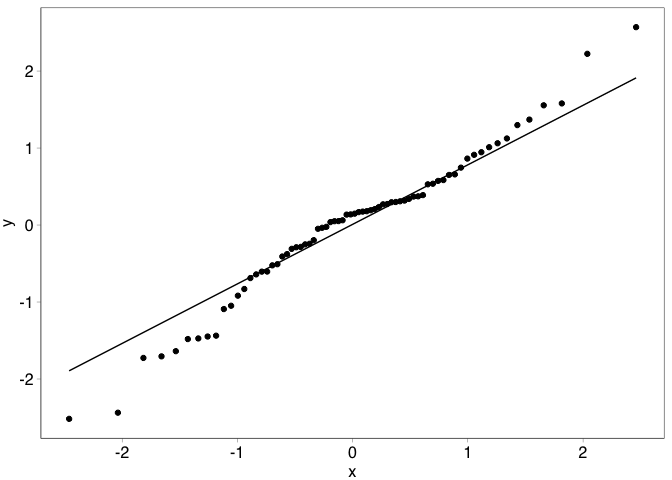
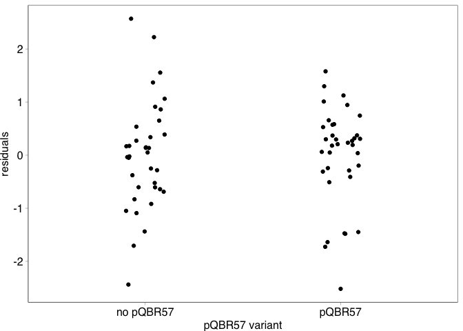
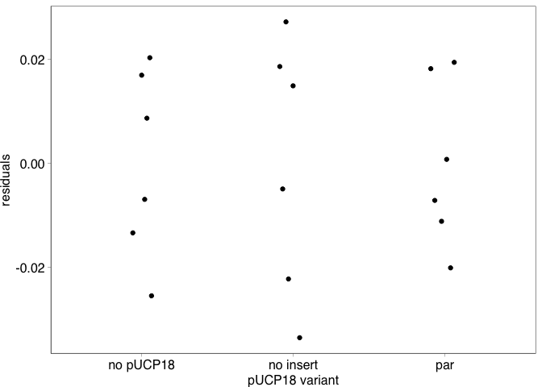
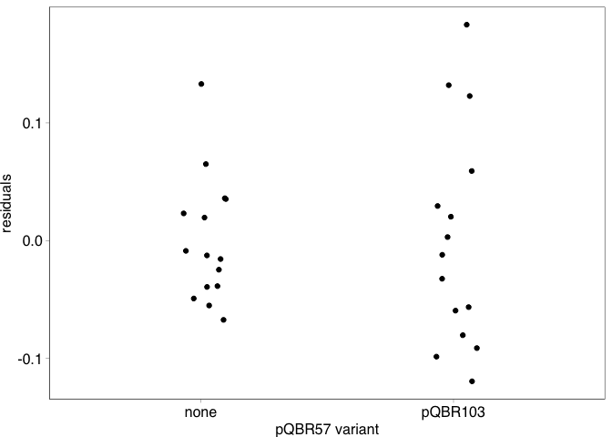
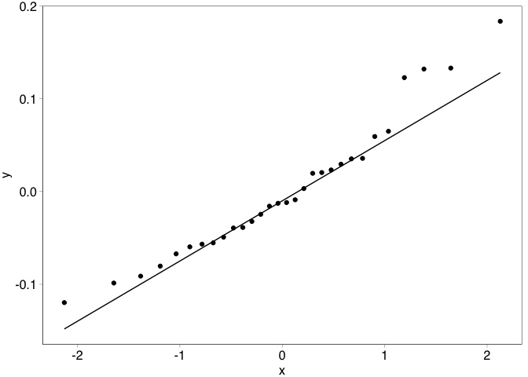
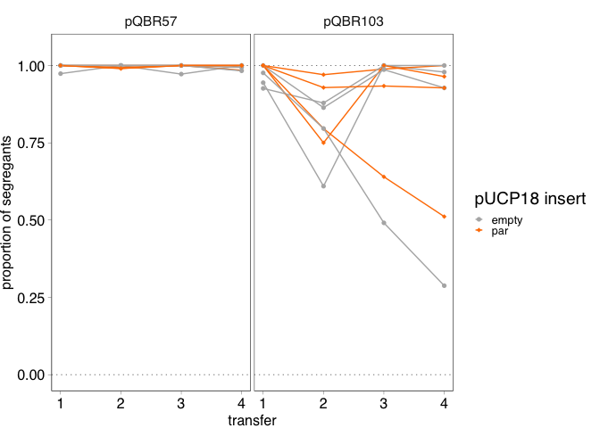

COMPMUT Experiments 5: Presentation and analysis of fitness of
expressing pQBR57 *par* genes
================
jpjh
compiled Feb 2021, edited Jul 2021

[Now published in PLoS
Biology](https://journals.plos.org/plosbiology/article?id=10.1371/journal.pbio.3001225):

Hall, J. P. J., Wright, R. C. T., Harrison, E., Muddiman, K. J., Jamie
Wood, A., Paterson, S., & Brockhurst, M. A. (2021). Plasmid fitness
costs are caused by specific genetic conflicts enabling resolution by
compensatory mutation. *PLoS Biology*, *19*(10), e3001225.
<https://doi.org/10.1371/journal.pbio.3001225>

**[Back to index.](COMPMUT_index.md)**

------------------------------------------------------------------------

## Competition experiments with strains expressing pQBR57\_0054\_0055

#### Experimental design

The data in [`COMPMUT_exp_4_PQ57-59.Rmd`](COMPMUT_exp_4_PQ57-59.md)
showed that the wild-type (anc) variant of PQBR57\_0059 interacts with
other plasmid genes to cause a fitness cost. Inpection of the RNAseq
data showed that there were two plasmid genes that were specifically
upregulated in the V100A mutant compared with the ancestral variant.
These plasmid genes, PQBR57\_0054 and PQBR57\_0055, were also not
upregulated by the ∆*PFLU4242* amelioration. The fact that PQBR57\_0059
is a putative repressor also contributes to a model in which mutation of
PQBR57\_0059 results in increased expression of PQBR57\_0054 and
PQBR57\_0055, which leads to reduced fitness costs.

PQBR57\_0054 and PQBR57\_0055 are the putative *par* genes of pQBR57.
Does upregulation of the *par* system causally affect plasmid fitness
costs?

To test this, PQBR57\_0054 and PQBR57\_0055, which are thought to form
an operon, were cloned together into pUCP18. Transformants with this
expression vector, or an empty control, were performed in triplicate.
Then, the ancestral pQBR57, was conjugated in, or not. This produced
(two different pUCP18 by two different pQBR57 options by three
transformants =) 12 strains. Controls were also set up in which pQBR57
was conjugated into ‘no pUCP18’ lines, in triplicate, giving 3
additional strains. Finally, a no pQBR57 / no pUCP18 control was also
included, giving 16 strains for testing. Each of these strains was
tested in competition assays in quadruplicate. Competitions were
performed as in [`COMPMUT_exp_4_PQ57-59.Rmd`](COMPMUT_exp_4_PQ57-59.md).

#### Calculation of relative fitness and generation of figures

Load up and inspect data

``` r
d5 <- read.table("../data/COMPMUT_exp_data_5.csv", header=TRUE, sep=",")

kable(head(d5))
```

| exp\_rep | tc\_rep | plasmid\_pucp | plasmid\_pq | timepoint | dilution | spread | count\_white | count\_blue |
|:---------|:--------|:--------------|:------------|:----------|---------:|-------:|-------------:|------------:|
| a        | A       | no pUCP18     | none        | start     |        6 |     60 |          164 |         220 |
| a        | A       | no pUCP18     | pQBR57      | start     |        6 |     60 |          242 |         237 |
| a        | A       | no insert     | none        | start     |        6 |     60 |          175 |         250 |
| a        | A       | no insert     | pQBR57      | start     |        6 |     60 |          204 |         251 |
| a        | A       | par           | none        | start     |        6 |     60 |          111 |         236 |
| a        | A       | par           | pQBR57      | start     |        6 |     60 |          188 |         231 |

Order variables.

``` r
d5 <- d5 %>% 
  mutate(plasmid_pucp = factor(plasmid_pucp, levels=c("no pUCP18", "no insert", "par")),
         plasmid_pq = factor(plasmid_pq, levels=c("none", "pQBR57"),
                             labels=c("no pQBR57", "pQBR57")))
```

Check starting ratios are approximately equal.

``` r
pd <- position_dodge(width=0.3)

d5 %>% filter(timepoint=="start") %>% 
  mutate(ratio = count_white/(count_white + count_blue)) %>%
  ggplot(aes(x=plasmid_pucp, y=ratio, colour=tc_rep)) + 
    geom_hline(yintercept=0.5, linetype="dotted") +
    facet_grid(.~plasmid_pq) + 
    geom_point(position=pd) + 
    lims(y=c(0,1)) +
    theme(axis.text.x=element_text(angle=90, vjust=0.5, hjust=1))
```

<!-- -->

Looks good.

Calculate fitness. Load up `calulate_fitness()`.

``` r
source("../functions/calculate_fitness.R")

id_cols <- c("exp_rep", "tc_rep", "plasmid_pucp", "plasmid_pq")
df5 <- calculate_fitness(d5, id_cols)  
```

Calculate summary statistics and plot.

``` r
df5_summ <- df5 %>% 
  group_by(plasmid_pucp, plasmid_pq) %>%
  summarise(mean = mean(W_gm), 
            n = n(), 
            se = sd(W_gm)/sqrt(n), 
            ci = (qt(0.95/2 + 0.5, n-1)) * se) %>%
  rename(W_gm=mean)
```

    ## `summarise()` has grouped output by 'plasmid_pucp'. You can override using the `.groups` argument.

``` r
(plot_fig5 <- ggplot(data=df5,
                   aes(x=plasmid_pucp, y=W_gm, colour=tc_rep)) +
  geom_hline(yintercept=1, size=0.2, linetype=111) +
  geom_point(position=pd, alpha=0.8, size=1, shape=16) +
  geom_point(data=df5_summ, 
             position=pd,
             shape=1, size=2, colour="black") +
  scale_colour_manual(values=c("black","grey40","grey80")) +
  labs(x="expression vector pUCP18 variant") +
  facet_grid(.~plasmid_pq, scales="free") +
  scale_y_continuous(name="relative fitness (W)", breaks=seq(0.7,1.2,0.1)) +
  theme(axis.text.x=element_text(angle=45, hjust=1)))
```

<!-- -->

Looks good.

Note that I am not showing error bars as I’m not sure if they should be
over all replicates or just `tc_rep`. It may be clearer just to show the
grand means and the individual data points.

Output as `.svg`.

``` r
svglite::svglite(height=3.5, width=3.6, file = "../plots/Fig5.svg")
plot_fig5 + theme_pub() + theme(axis.text.x=element_text(angle=45, hjust=1))
dev.off()
```

    ## quartz_off_screen 
    ##                 2

### Analysis

#### Linear mixed-effects model

There is some correlation in the data, because each transconjugant
‘replicate’ was tested four times.

Is there an effect here?

Each of the `tc_rep`s are different transconjugants

``` r
df5 <- df5 %>% mutate(clone = ifelse(plasmid_pucp=="no pUCP18" & plasmid_pq=="no pQBR57",
                                     "no pUCP18 / no pQBR57",
                                     paste(tc_rep, plasmid_pucp, plasmid_pq, sep=".")))
```

Generate a linear model with and without the random effect of clone, and
compare following Zuur et al. (2009).

``` r
library(nlme)
```

    ## 
    ## Attaching package: 'nlme'

    ## The following object is masked from 'package:dplyr':
    ## 
    ##     collapse

``` r
mod5_1 <- gls(data=df5, W_gm ~ plasmid_pucp * plasmid_pq, method="REML")
mod5_2 <- lme(data=df5, W_gm ~ plasmid_pucp * plasmid_pq, 
              random = ~1|clone, method="REML")

anova(mod5_1, mod5_2)
```

    ##        Model df       AIC       BIC   logLik   Test      L.Ratio p-value
    ## mod5_1     1  7 -186.6325 -171.3049 100.3162                            
    ## mod5_2     2  8 -184.6325 -167.1152 100.3162 1 vs 2 9.226795e-09  0.9999

Suggests that any effect of ‘clone’ is not significant, by AIC or BIC.
However, the effect of clone will be retained in the model since it is
part of the data structure.

Generate plots for model validation.

``` r
df5 <- df5 %>% mutate(mod5_2_resid  = resid(mod5_2, type = "normalized"),
              mod5_2_fitted = fitted(mod5_2))

ggplot(data=df5, aes(x=mod5_2_fitted, y=mod5_2_resid)) + 
  geom_point() + labs(x="fitted values", y="residuals")
```

<!-- -->

``` r
ggplot(data=df5, aes(x=plasmid_pucp, y=mod5_2_resid)) + 
  geom_boxplot() + labs(x="pUCP variant", y="residuals")
```

<!-- -->

``` r
ggplot(data=df5, aes(x=plasmid_pq, y=mod5_2_resid)) + 
  geom_boxplot() + labs(x="pQBR57 variant", y="residuals")
```

<!-- -->

``` r
ggplot(data=df5, aes(sample=mod5_2_resid)) + stat_qq() + stat_qq_line()
```

<!-- -->

No obvious skew in residuals, and homoscedasticity seems ok.

Some of the spread of residuals of no pUCP18 and of pQBR57∆59 seem on
the broad side. Is this really the case, or just the way the boxes are
drawn?

``` r
ggplot(data=df5, aes(x=plasmid_pucp, y=mod5_2_resid)) + 
  geom_point(position=position_jitter(width=0.1)) + 
  labs(x="pUCP variant", y="residuals")
```

<!-- -->

``` r
ggplot(data=df5, aes(x=plasmid_pq, y=mod5_2_resid)) + 
  geom_point(position=position_jitter(width=0.1)) + 
  labs(x="pQBR57 variant", y="residuals")
```

<!-- -->

No, they look fine.

Test normality.

``` r
shapiro.test(df5$mod5_2_resid)
```

    ## 
    ##  Shapiro-Wilk normality test
    ## 
    ## data:  df5$mod5_2_resid
    ## W = 0.97463, p-value = 0.1537

It’s fine.

Assess significance of terms.

``` r
mod5_2_ml <- update(mod5_2, method="ML")

mod5_3_ml <- update(mod5_2_ml, .~.-plasmid_pucp:plasmid_pq)

anova(mod5_2_ml, mod5_3_ml)
```

    ##           Model df       AIC       BIC   logLik   Test  L.Ratio p-value
    ## mod5_2_ml     1  8 -225.4014 -207.1881 120.7007                        
    ## mod5_3_ml     2  6 -207.1628 -193.5028 109.5814 1 vs 2 22.23863  <.0001

Highly significant interaction between pUCP18 and pQBR57 variant. The
effect on fitness of the par expression depends on whether ancestral
pQBR57 is present.

Extract Tukey-corrected post-hoc pairwise (least-square means)
comparisons.

``` r
library(emmeans)

posthoc <- lsmeans(mod5_2, pairwise ~ plasmid_pucp * plasmid_pq, adjust="mvt")

contr <- data.frame(posthoc$contrasts) %>% mutate(sign = ifelse(p.value<0.05, "*", ""))

kable(contr)
```

| contrast                                  |   estimate |        SE |  df |    t.ratio |   p.value | sign |
|:------------------------------------------|-----------:|----------:|----:|-----------:|----------:|:-----|
| no pUCP18 no pQBR57 - no insert no pQBR57 | -0.0182666 | 0.0192988 |  10 | -0.9465164 | 0.9247307 |      |
| no pUCP18 no pQBR57 - par no pQBR57       |  0.0168931 | 0.0192988 |  10 |  0.8753417 | 0.9442716 |      |
| no pUCP18 no pQBR57 - no pUCP18 pQBR57    |  0.0871887 | 0.0192988 |  10 |  4.5178273 | 0.0105106 | \*   |
| no pUCP18 no pQBR57 - no insert pQBR57    |  0.0727145 | 0.0192988 |  10 |  3.7678198 | 0.0319443 | \*   |
| no pUCP18 no pQBR57 - par pQBR57          | -0.0268409 | 0.0192988 |  10 | -1.3908029 | 0.7318834 |      |
| no insert no pQBR57 - par no pQBR57       |  0.0351597 | 0.0192988 |  10 |  1.8218581 | 0.4942718 |      |
| no insert no pQBR57 - no pUCP18 pQBR57    |  0.1054554 | 0.0192988 |  10 |  5.4643437 | 0.0027136 | \*   |
| no insert no pQBR57 - no insert pQBR57    |  0.0909811 | 0.0192988 |  10 |  4.7143362 | 0.0078973 | \*   |
| no insert no pQBR57 - par pQBR57          | -0.0085742 | 0.0192988 |  10 | -0.4442865 | 0.9971225 |      |
| par no pQBR57 - no pUCP18 pQBR57          |  0.0702957 | 0.0192988 |  10 |  3.6424856 | 0.0387029 | \*   |
| par no pQBR57 - no insert pQBR57          |  0.0558214 | 0.0192988 |  10 |  2.8924781 | 0.1198585 |      |
| par no pQBR57 - par pQBR57                | -0.0437339 | 0.0192988 |  10 | -2.2661446 | 0.2897633 |      |
| no pUCP18 pQBR57 - no insert pQBR57       | -0.0144743 | 0.0192988 |  10 | -0.7500075 | 0.9701844 |      |
| no pUCP18 pQBR57 - par pQBR57             | -0.1140296 | 0.0192988 |  10 | -5.9086302 | 0.0015235 | \*   |
| no insert pQBR57 - par pQBR57             | -0.0995553 | 0.0192988 |  10 | -5.1586227 | 0.0041324 | \*   |

Key lines from this table. Note that the format is “pUCP18 variant pQBR
variant”.

1.  no pUCP18 no pQBR57 - no pUCP18 pQBR57: shows that there is a
    significant cost of pQBR57. The cost actually appears somewhat less
    than I detected in previous experiments.
2.  no pUCP18 no pQBR57 - no insert pQBR57: shows again that there is a
    cost, though this comparison is not so appropriate.
3.  no insert no pQBR57 - no pUCP18 pQBR57: shows again that there is a
    cost, though this comparison is not so appropriate.
4.  no insert no pQBR57 - no insert pQBR57: shows that cost remain even
    if strains carry an empty pUCP18 vector.
5.  par no pQBR57 - no pUCP18 pQBR57: shows again that there is a cost,
    though this comparison is not so appropriate.
6.  no pUCP18 pQBR57 - par pQBR57: see contrast below; this shows the
    same effect but is not so appropriate a comparison
7.  no insert pQBR57 - par pQBR57: **this is the key comparison**
    showing that expression of par, but not carriage of pUCP18, results
    in a significant effect on relative fitness.

Together these experiments show that *par* expression by itself has a
significant effect on plasmid cost amelioration, showing the mechanism
by which the V100A mutation ameliorates cost.

#### Linear model

As with [`COMPMUT_exp_4_PQ57-59.Rmd`](COMPMUT_exp_4_PQ57-59.md), the
fact that random effects did not significantly improve model fit makes
me wonder whether qualitatively similar results are obtained from a
model that does not include the random effects of ‘clone’.

While the LMM is the ‘correct’ statistical approach, I will also
investigate how robust these results are to this particular model
formulation.

There are two main ways to run this. Either, treat all replicates
(`tc_rep` and `exp_rep`) as independent. Or, us `exp_rep` to calculate a
mean value for each `tc_rep` and then analyse this.

##### Linear model with all replicates

``` r
mod5_4 <- lm(data=df5, W_gm ~ plasmid_pucp * plasmid_pq)

df5 <- df5 %>% mutate(mod5_4_resid = resid(mod5_4),
              mod5_4_fitted = fitted(mod5_4))

ggplot(data=df5, aes(x=mod5_4_fitted, y=mod5_4_resid)) + 
  geom_point() + labs(x="fitted values", y="residuals")
```

<!-- -->

``` r
ggplot(data=df5, aes(x=plasmid_pucp, y=mod5_4_resid)) + 
  geom_point(position=position_jitter(width=0.1)) + 
  labs(x="pUCP18 variant", y="residuals")
```

<!-- -->

``` r
ggplot(data=df5, aes(x=plasmid_pq, y=mod5_4_resid)) + 
  geom_point(position=position_jitter(width=0.1)) + 
  labs(x="pQBR57 variant", y="residuals")
```

<!-- -->

``` r
ggplot(data=df5, aes(sample=mod5_4_resid)) + 
    stat_qq() + stat_qq_line()
```

<!-- -->

Looks good. Run tests to check:

``` r
bartlett.test(W_gm ~ interaction(plasmid_pucp, plasmid_pq), data=df5)
```

    ## 
    ##  Bartlett test of homogeneity of variances
    ## 
    ## data:  W_gm by interaction(plasmid_pucp, plasmid_pq)
    ## Bartlett's K-squared = 4.1149, df = 5, p-value = 0.533

``` r
fligner.test(W_gm ~ interaction(plasmid_pucp, plasmid_pq), data=df5)
```

    ## 
    ##  Fligner-Killeen test of homogeneity of variances
    ## 
    ## data:  W_gm by interaction(plasmid_pucp, plasmid_pq)
    ## Fligner-Killeen:med chi-squared = 3.5898, df = 5, p-value = 0.6098

``` r
car::leveneTest(W_gm ~ interaction(plasmid_pucp, plasmid_pq), data=df5)
```

    ## Levene's Test for Homogeneity of Variance (center = median)
    ##       Df F value Pr(>F)
    ## group  5  0.5214 0.7592
    ##       66

``` r
shapiro.test(resid(mod5_4))
```

    ## 
    ##  Shapiro-Wilk normality test
    ## 
    ## data:  resid(mod5_4)
    ## W = 0.97463, p-value = 0.1537

All fine.

``` r
kable(anova(mod5_4))
```

|                           |  Df |    Sum Sq |   Mean Sq |   F value | Pr(&gt;F) |
|:--------------------------|----:|----------:|----------:|----------:|----------:|
| plasmid\_pucp             |   2 | 0.0293085 | 0.0146543 |  6.557697 | 0.0025254 |
| plasmid\_pq               |   1 | 0.0361460 | 0.0361460 | 16.175140 | 0.0001510 |
| plasmid\_pucp:plasmid\_pq |   2 | 0.0706065 | 0.0353033 | 15.798001 | 0.0000025 |
| Residuals                 |  66 | 0.1474880 | 0.0022347 |        NA |        NA |

Highly significant interaction, like the LMM.

``` r
posthoc5_4 <- lsmeans(mod5_4, pairwise ~ plasmid_pucp * plasmid_pq, adjust="mvt")
contr5_4 <- data.frame(posthoc5_4$contrasts) %>% mutate(sign = ifelse(p.value<0.05, "*", ""))
kable(contr5_4)
```

| contrast                                  |   estimate |        SE |  df |    t.ratio |   p.value | sign |
|:------------------------------------------|-----------:|----------:|----:|-----------:|----------:|:-----|
| no pUCP18 no pQBR57 - no insert no pQBR57 | -0.0182666 | 0.0192988 |  66 | -0.9465164 | 0.9327058 |      |
| no pUCP18 no pQBR57 - par no pQBR57       |  0.0168931 | 0.0192988 |  66 |  0.8753417 | 0.9510994 |      |
| no pUCP18 no pQBR57 - no pUCP18 pQBR57    |  0.0871887 | 0.0192988 |  66 |  4.5178273 | 0.0003739 | \*   |
| no pUCP18 no pQBR57 - no insert pQBR57    |  0.0727145 | 0.0192988 |  66 |  3.7678198 | 0.0046908 | \*   |
| no pUCP18 no pQBR57 - par pQBR57          | -0.0268409 | 0.0192988 |  66 | -1.3908029 | 0.7323040 |      |
| no insert no pQBR57 - par no pQBR57       |  0.0351597 | 0.0192988 |  66 |  1.8218581 | 0.4592164 |      |
| no insert no pQBR57 - no pUCP18 pQBR57    |  0.1054554 | 0.0192988 |  66 |  5.4643437 | 0.0000097 | \*   |
| no insert no pQBR57 - no insert pQBR57    |  0.0909811 | 0.0192988 |  66 |  4.7143362 | 0.0001776 | \*   |
| no insert no pQBR57 - par pQBR57          | -0.0085742 | 0.0192988 |  66 | -0.4442865 | 0.9977200 |      |
| par no pQBR57 - no pUCP18 pQBR57          |  0.0702957 | 0.0192988 |  66 |  3.6424856 | 0.0066900 | \*   |
| par no pQBR57 - no insert pQBR57          |  0.0558214 | 0.0192988 |  66 |  2.8924781 | 0.0557183 |      |
| par no pQBR57 - par pQBR57                | -0.0437339 | 0.0192988 |  66 | -2.2661446 | 0.2227343 |      |
| no pUCP18 pQBR57 - no insert pQBR57       | -0.0144743 | 0.0192988 |  66 | -0.7500075 | 0.9746843 |      |
| no pUCP18 pQBR57 - par pQBR57             | -0.1140296 | 0.0192988 |  66 | -5.9086302 | 0.0000027 | \*   |
| no insert pQBR57 - par pQBR57             | -0.0995553 | 0.0192988 |  66 | -5.1586227 | 0.0000368 | \*   |

Same signiicant results as the LMM.

##### Linear model summing over experimental replicates

``` r
df5_tc_summ <- df5 %>% 
  group_by(tc_rep, plasmid_pucp, plasmid_pq) %>%
  summarise(mean = mean(W_gm), 
            n = n(), 
            se = sd(W_gm)/sqrt(n), 
            ci = (qt(0.95/2 + 0.5, n-1)) * se) %>%
  rename(W_gm=mean)
```

    ## `summarise()` has grouped output by 'tc_rep', 'plasmid_pucp'. You can override using the `.groups` argument.

``` r
mod5_5 <- lm(W_gm ~ plasmid_pucp * plasmid_pq, data=df5_tc_summ)

df5_tc_summ <- df5_tc_summ %>% ungroup() %>%
  mutate(mod5_5_resid  = resid(mod5_5),
         mod5_5_fitted = fitted(mod5_5))

ggplot(data=df5_tc_summ, aes(x=mod5_5_fitted, y=mod5_5_resid)) + 
  geom_point() + labs(x="fitted values", y="residuals")
```

<!-- -->

``` r
ggplot(data=df5_tc_summ, aes(x=plasmid_pucp, y=mod5_5_resid)) + 
  geom_point(position=position_jitter(width=0.1)) + 
  labs(x="pUCP18 variant", y="residuals")
```

<!-- -->

``` r
ggplot(data=df5_tc_summ, aes(x=plasmid_pq, y=mod5_5_resid)) + 
  geom_point(position=position_jitter(width=0.1)) + 
  labs(x="pQBR57 variant", y="residuals")
```

<!-- -->

``` r
ggplot(data=df5_tc_summ, aes(sample=mod5_5_resid)) + 
    stat_qq() + stat_qq_line()
```

<!-- -->

Looks good. Run tests to check:

``` r
bartlett.test(W_gm ~ interaction(plasmid_pucp, plasmid_pq), data=df5_tc_summ)
```

    ## 
    ##  Bartlett test of homogeneity of variances
    ## 
    ## data:  W_gm by interaction(plasmid_pucp, plasmid_pq)
    ## Bartlett's K-squared = 0.83291, df = 5, p-value = 0.9749

``` r
fligner.test(W_gm ~ interaction(plasmid_pucp, plasmid_pq), data=df5_tc_summ)
```

    ## 
    ##  Fligner-Killeen test of homogeneity of variances
    ## 
    ## data:  W_gm by interaction(plasmid_pucp, plasmid_pq)
    ## Fligner-Killeen:med chi-squared = 0.50925, df = 5, p-value = 0.9918

``` r
car::leveneTest(W_gm ~ interaction(plasmid_pucp, plasmid_pq), data=df5_tc_summ)
```

    ## Levene's Test for Homogeneity of Variance (center = median)
    ##       Df F value Pr(>F)
    ## group  5  0.0859 0.9931
    ##       12

``` r
shapiro.test(resid(mod5_5))
```

    ## 
    ##  Shapiro-Wilk normality test
    ## 
    ## data:  resid(mod5_5)
    ## W = 0.93287, p-value = 0.218

Good.

``` r
kable(anova(mod5_5))
```

|                           |  Df |    Sum Sq |   Mean Sq |   F value | Pr(&gt;F) |
|:--------------------------|----:|----------:|----------:|----------:|----------:|
| plasmid\_pucp             |   2 | 0.0073271 | 0.0036636 |  7.430492 | 0.0079498 |
| plasmid\_pq               |   1 | 0.0090365 | 0.0090365 | 18.327965 | 0.0010669 |
| plasmid\_pucp:plasmid\_pq |   2 | 0.0176516 | 0.0088258 | 17.900630 | 0.0002503 |
| Residuals                 |  12 | 0.0059165 | 0.0004930 |        NA |        NA |

Again shows significant effect of the interaction.

``` r
posthoc5_5 <- lsmeans(mod5_5, pairwise ~ plasmid_pucp * plasmid_pq, adjust="mvt")
contr5_5 <- data.frame(posthoc5_5$contrasts) %>% mutate(sign = ifelse(p.value<0.05, "*", ""))
kable(contr5_5)
```

| contrast                                  |   estimate |      SE |  df |    t.ratio |   p.value | sign |
|:------------------------------------------|-----------:|--------:|----:|-----------:|----------:|:-----|
| no pUCP18 no pQBR57 - no insert no pQBR57 | -0.0182666 | 0.01813 |  12 | -1.0075375 | 0.9067047 |      |
| no pUCP18 no pQBR57 - par no pQBR57       |  0.0168931 | 0.01813 |  12 |  0.9317743 | 0.9304576 |      |
| no pUCP18 no pQBR57 - no pUCP18 pQBR57    |  0.0871887 | 0.01813 |  12 |  4.8090880 | 0.0044572 | \*   |
| no pUCP18 no pQBR57 - no insert pQBR57    |  0.0727145 | 0.01813 |  12 |  4.0107281 | 0.0166240 | \*   |
| no pUCP18 no pQBR57 - par pQBR57          | -0.0268409 | 0.01813 |  12 | -1.4804668 | 0.6818611 |      |
| no insert no pQBR57 - par no pQBR57       |  0.0351597 | 0.01813 |  12 |  1.9393118 | 0.4258662 |      |
| no insert no pQBR57 - no pUCP18 pQBR57    |  0.1054554 | 0.01813 |  12 |  5.8166255 | 0.0008964 | \*   |
| no insert no pQBR57 - no insert pQBR57    |  0.0909811 | 0.01813 |  12 |  5.0182657 | 0.0031422 | \*   |
| no insert no pQBR57 - par pQBR57          | -0.0085742 | 0.01813 |  12 | -0.4729293 | 0.9962974 |      |
| par no pQBR57 - no pUCP18 pQBR57          |  0.0702957 | 0.01813 |  12 |  3.8773137 | 0.0209099 | \*   |
| par no pQBR57 - no insert pQBR57          |  0.0558214 | 0.01813 |  12 |  3.0789539 | 0.0797736 |      |
| par no pQBR57 - par pQBR57                | -0.0437339 | 0.01813 |  12 | -2.4122411 | 0.2260566 |      |
| no pUCP18 pQBR57 - no insert pQBR57       | -0.0144743 | 0.01813 |  12 | -0.7983598 | 0.9624157 |      |
| no pUCP18 pQBR57 - par pQBR57             | -0.1140296 | 0.01813 |  12 | -6.2895548 | 0.0004070 | \*   |
| no insert pQBR57 - par pQBR57             | -0.0995553 | 0.01813 |  12 | -5.4911950 | 0.0015098 | \*   |

Again, same signiicant results as the LMM.

Together this strongly suggests that the model outputs are robust to
different methods of dealing with the nested data.

------------------------------------------------------------------------

### Experiments with pQBR103

#### Experimental design

Does upregulation of the pQBR57 *par* system also ameliorate the cost of
a heterologous megaplasmid (pQBR103)?

To test this, use the pUCP18 transformants from the pQBR57 experiments
above. Then conjugate in pQBR103, or not. For these experiments, five
independent transconjugants/transformants were used, and each was tested
once. Competitions were performed as above.

#### Calculation of relative fitness and generation of figures

Load up and inspect data

``` r
d55 <- read.table("../data/COMPMUT_exp_data_5-1.csv", header=TRUE, sep=",")

kable(head(d55))
```

| tc\_rep | plasmid\_pucp | plasmid\_pq | timepoint | dilution | spread | count\_white | count\_blue |
|:--------|:--------------|:------------|:----------|---------:|-------:|-------------:|------------:|
| a       | no pUCP18     | none        | start     |        6 |     60 |           55 |          59 |
| a       | no pUCP18     | pQBR103     | start     |        6 |     60 |          101 |          45 |
| a       | no insert     | none        | start     |        6 |     60 |           36 |          60 |
| a       | no insert     | pQBR103     | start     |        6 |     60 |           48 |          49 |
| a       | par           | none        | start     |        6 |     60 |           37 |          47 |
| a       | par           | pQBR103     | start     |        6 |     60 |           54 |          62 |

Order variables.

``` r
d55 <- d55 %>% 
  mutate(plasmid_pucp = factor(plasmid_pucp, levels=c("no pUCP18", "no insert", "par")))
```

Check starting ratios are approximately equal.

``` r
pd <- position_dodge(width=0.3)

d55 %>% filter(timepoint=="start") %>% 
  mutate(ratio = count_white/(count_white + count_blue)) %>%
  ggplot(aes(x=plasmid_pucp, y=ratio, colour=tc_rep)) + 
    geom_hline(yintercept=0.5, linetype="dotted") +
    facet_grid(.~plasmid_pq) + 
    geom_point(position=pd) + 
    lims(y=c(0,1)) +
    theme(axis.text.x=element_text(angle=90, vjust=0.55, hjust=1))
```

<!-- -->

Looks good.

Calculate fitness as above.

``` r
id_cols <- c("tc_rep", "plasmid_pucp", "plasmid_pq")
df55 <- calculate_fitness(d55, id_cols)  
```

Calculate summary statistics and plot.

``` r
df55_summ <- df55 %>% 
  group_by(plasmid_pucp, plasmid_pq) %>%
  summarise(mean = mean(W_gm), 
            n = n(), 
            se = sd(W_gm)/sqrt(n), 
            ci = (qt(0.95/2 + 0.5, n-1)) * se) %>%
  rename(W_gm=mean)
```

    ## `summarise()` has grouped output by 'plasmid_pucp'. You can override using the `.groups` argument.

``` r
(plot_fig55 <- ggplot(data=df55,
                   aes(x=plasmid_pucp, y=W_gm)) +
  geom_hline(yintercept=1, size=0.2, linetype=111) +
  geom_point(position=pd, alpha=0.8, size=1, shape=16, aes(group=tc_rep)) +
  geom_point(data=df55_summ, 
             position=pd,
             shape=1, size=2, colour="black") +
  labs(x="expression vector pUCP18 variant") +
  facet_grid(.~plasmid_pq, scales="free") +
 scale_y_continuous(name="relative fitness (W)", breaks=seq(0.2,1.2,0.2)) +
  theme(axis.text.x=element_text(angle=45, hjust=1)))
```

<!-- -->

Output as `.svg`.

``` r
library(patchwork)

p5 <- plot_fig5 + theme_pub() + ggtitle("A") +
  theme(axis.text.x=element_text(angle=45, hjust=1), plot.title=element_text(hjust=0))
p55 <- plot_fig55 + theme_pub() + ggtitle("B") +
  theme(axis.text.x=element_text(angle=45, hjust=1), plot.title=element_text(hjust=0))

svglite::svglite(height=3.5, width=3.6, file = "../plots/Fig5-1.svg")
p5 + p55
dev.off()
```

    ## quartz_off_screen 
    ##                 2

#### Analysis

``` r
mod55_1 <- lm(W_gm ~ plasmid_pucp * plasmid_pq, data=df55)

df55 <- df55 %>% mutate(mod55_1_resid  = resid(mod55_1),
              mod55_1_fitted = fitted(mod55_1))

ggplot(data=df55, aes(x=mod55_1_fitted, y=mod55_1_resid)) + 
  geom_point() + labs(x="fitted values", y="residuals")
```

<!-- -->

``` r
ggplot(data=df55, aes(x=plasmid_pucp, y=mod55_1_resid)) + 
  geom_point(position=position_jitter(width=0.1)) + 
  labs(x="pUCP18 variant", y="residuals")
```

<!-- -->

``` r
ggplot(data=df55, aes(x=plasmid_pq, y=mod55_1_resid)) + 
  geom_point(position=position_jitter(width=0.1)) + 
  labs(x="pQBR57 variant", y="residuals")
```

<!-- -->

``` r
ggplot(data=df55, aes(sample=mod55_1_resid)) + 
    stat_qq() + stat_qq_line()
```

<!-- -->

Look good.

``` r
bartlett.test(W_gm ~ interaction(plasmid_pucp, plasmid_pq), data=df55)
```

    ## 
    ##  Bartlett test of homogeneity of variances
    ## 
    ## data:  W_gm by interaction(plasmid_pucp, plasmid_pq)
    ## Bartlett's K-squared = 5.3928, df = 5, p-value = 0.3698

``` r
fligner.test(W_gm ~ interaction(plasmid_pucp, plasmid_pq), data=df55)
```

    ## 
    ##  Fligner-Killeen test of homogeneity of variances
    ## 
    ## data:  W_gm by interaction(plasmid_pucp, plasmid_pq)
    ## Fligner-Killeen:med chi-squared = 3.0186, df = 5, p-value = 0.6971

``` r
car::leveneTest(W_gm ~ interaction(plasmid_pucp, plasmid_pq), data=df55)
```

    ## Levene's Test for Homogeneity of Variance (center = median)
    ##       Df F value Pr(>F)
    ## group  5  0.6567 0.6594
    ##       24

``` r
shapiro.test(resid(mod5_4))
```

    ## 
    ##  Shapiro-Wilk normality test
    ## 
    ## data:  resid(mod5_4)
    ## W = 0.97463, p-value = 0.1537

All are good.

Proceed with model reduction.

``` r
kable(anova(mod55_1))
```

|                           |  Df |    Sum Sq |   Mean Sq |    F value | Pr(&gt;F) |
|:--------------------------|----:|----------:|----------:|-----------:|----------:|
| plasmid\_pucp             |   2 | 0.0613127 | 0.0306563 |   4.679076 | 0.0192358 |
| plasmid\_pq               |   1 | 2.1686486 | 2.1686486 | 331.000759 | 0.0000000 |
| plasmid\_pucp:plasmid\_pq |   2 | 0.0235006 | 0.0117503 |   1.793449 | 0.1879751 |
| Residuals                 |  24 | 0.1572430 | 0.0065518 |         NA |        NA |

No significant interaction here (*par* expression does not have a
compensatory effect on pQBR103 bearers relative to plasmid-free).

``` r
mod55_2 <- update(mod55_1, .~.-plasmid_pucp:plasmid_pq)

kable(anova(mod55_2))
```

|               |  Df |    Sum Sq |   Mean Sq |    F value | Pr(&gt;F) |
|:--------------|----:|----------:|----------:|-----------:|----------:|
| plasmid\_pucp |   2 | 0.0613127 | 0.0306563 |   4.409919 |  0.022434 |
| plasmid\_pq   |   1 | 2.1686486 | 2.1686486 | 311.960395 |  0.000000 |
| Residuals     |  26 | 0.1807437 | 0.0069517 |         NA |        NA |

Significant effect of pQBR103 (as expected). Significant effect of *par*
expression, but not in interaction with pQBR103.

``` r
posthoc_55 <- lsmeans(mod55_2, pairwise ~ plasmid_pucp + plasmid_pq, adjust="mvt")

contr_55 <- data.frame(posthoc_55$contrasts) %>% mutate(sign = ifelse(p.value<0.05, "*", ""))

kable(contr_55)
```

| contrast                              |  estimate |        SE |  df |    t.ratio |   p.value | sign |
|:--------------------------------------|----------:|----------:|----:|-----------:|----------:|:-----|
| no pUCP18 none - no insert none       | 0.0109371 | 0.0372872 |  26 |  0.2933199 | 0.9920317 |      |
| no pUCP18 none - par none             | 0.1009001 | 0.0372872 |  26 |  2.7060253 | 0.0652435 |      |
| no pUCP18 none - no pUCP18 pQBR103    | 0.5377296 | 0.0304449 |  26 | 17.6624006 | 0.0000000 | \*   |
| no pUCP18 none - no insert pQBR103    | 0.5486667 | 0.0481376 |  26 | 11.3978876 | 0.0000000 | \*   |
| no pUCP18 none - par pQBR103          | 0.6386297 | 0.0481376 |  26 | 13.2667612 | 0.0000000 | \*   |
| no insert none - par none             | 0.0899630 | 0.0372872 |  26 |  2.4127055 | 0.1165786 |      |
| no insert none - no pUCP18 pQBR103    | 0.5267925 | 0.0481376 |  26 | 10.9434784 | 0.0000000 | \*   |
| no insert none - no insert pQBR103    | 0.5377296 | 0.0304449 |  26 | 17.6624006 | 0.0000000 | \*   |
| no insert none - par pQBR103          | 0.6276927 | 0.0481376 |  26 | 13.0395566 | 0.0000000 | \*   |
| par none - no pUCP18 pQBR103          | 0.4368295 | 0.0481376 |  26 |  9.0746048 | 0.0000000 | \*   |
| par none - no insert pQBR103          | 0.4477666 | 0.0481376 |  26 |  9.3018094 | 0.0000000 | \*   |
| par none - par pQBR103                | 0.5377296 | 0.0304449 |  26 | 17.6624006 | 0.0000000 | \*   |
| no pUCP18 pQBR103 - no insert pQBR103 | 0.0109371 | 0.0372872 |  26 |  0.2933199 | 0.9920302 |      |
| no pUCP18 pQBR103 - par pQBR103       | 0.1009001 | 0.0372872 |  26 |  2.7060253 | 0.0651122 |      |
| no insert pQBR103 - par pQBR103       | 0.0899630 | 0.0372872 |  26 |  2.4127055 | 0.1165395 |      |

This shows:

-   Significant effect of pQBR103 in all comparisons with
    no-pUCP18-no-pQBR103.
-   Significant effect of pQBR103 in all comparisons with
    no-insert-no-pQBR103.
-   Significant effect of pQBR103 in all comparisons with
    par-no-pQBR103.

The marginally significnt (p = 0.02) effect of *par* is not detected in
the pairwise contrasts. However inspection of the coefficients of the
model shows that *par* expression has a small negative effect that does
not vary with plasmid carriage.

``` r
summary(mod55_2)
```

    ## 
    ## Call:
    ## lm(formula = W_gm ~ plasmid_pucp + plasmid_pq, data = df55)
    ## 
    ## Residuals:
    ##       Min        1Q    Median        3Q       Max 
    ## -0.159205 -0.060358 -0.006336  0.039767  0.205826 
    ## 
    ## Coefficients:
    ##                       Estimate Std. Error t value Pr(>|t|)    
    ## (Intercept)            1.03035    0.03044  33.843  < 2e-16 ***
    ## plasmid_pucpno insert -0.01094    0.03729  -0.293   0.7716    
    ## plasmid_pucppar       -0.10090    0.03729  -2.706   0.0119 *  
    ## plasmid_pqpQBR103     -0.53773    0.03044 -17.662 5.32e-16 ***
    ## ---
    ## Signif. codes:  0 '***' 0.001 '**' 0.01 '*' 0.05 '.' 0.1 ' ' 1
    ## 
    ## Residual standard error: 0.08338 on 26 degrees of freedom
    ## Multiple R-squared:  0.925,  Adjusted R-squared:  0.9164 
    ## F-statistic: 106.9 on 3 and 26 DF,  p-value: 9.548e-15

## Effect of ectopic expression of pQBR57\_par on segregation

#### Experimental design

Expression vector pUCP18 containing either no insert (‘empty’) or
PQBR57\_0054-0055 (‘par’) was transformed in quadruplicate into SBW25.
Plasmid pQBR57 or pQBR103 was subsequently conjugated into these
strains, to give 16 experimental lineages. Strains were streaked out on
KB supplemented with kanamycin (for pUCP18 selection) and mercury (for
pQBR plasmid selection) and single colonies used to inoculate KB broth
supplemented with kanamycin. PCR showed that initial colonies contained
pQBR plasmid and expression vector. Populations were maintained for four
cycles of growth in KB broth supplemented with kanamycin, with a 1:100
dilution every transfer. Samples were spread on KB agar and pQBR plasmid
carriage assessed by replica plating onto KB with mercury every
transfer.

#### Load up data and plot

``` r
d8 <- read.csv("../data/COMPMUT_exp_data_8.csv", header=TRUE, sep=",")

kable(head(d8))
```

| code      | timepoint | replicate | par | plasmid | spread | dilution | count | count\_hgs |
|:----------|----------:|:----------|:----|:--------|-------:|---------:|------:|-----------:|
| a.57.e    |         1 | a         | e   | pQBR57  |     40 |        6 |    76 |          2 |
| a.57.par  |         1 | a         | par | pQBR57  |     40 |        6 |    59 |          0 |
| a.103.e   |         1 | a         | e   | pQBR103 |     40 |        6 |    18 |          1 |
| a.103.par |         1 | a         | par | pQBR103 |     40 |        6 |    20 |          0 |
| b.57.e    |         1 | b         | e   | pQBR57  |     40 |        6 |    69 |          0 |
| b.57.par  |         1 | b         | par | pQBR57  |     40 |        6 |    96 |          0 |

Calculate total cells at each transfer, and proportions of segregants.
Plot.

``` r
d8 <- d8 %>% mutate(cfu.ml = (1000/spread)*(10^dilution)*count,
                    proportion = (count - count_hgs)/count,
                    plasmid = factor(plasmid, levels=c("pQBR57","pQBR103")))

ggplot(data = d8,
       aes(x=timepoint, y=log10(cfu.ml), group=code, colour=par, shape=par)) +
  geom_line() + geom_point() + facet_grid(.~plasmid) +
  scale_colour_manual(values=c("grey70", "darkorange1"),
                      labels=c("empty", "par"), name="pUCP18 insert") +
  scale_shape_manual(values=c(16,18),
                     labels=c("empty", "par"), name="pUCP18 insert") +
  theme(legend.position="right")
```

<!-- -->

As expected, cfu/ml increase over the course of the four transfers.
pQBR57 reaches higher density at transfer.

``` r
(plot_fig_R8 <- ggplot(data = d8,
       aes(x=timepoint, y=proportion, group=code, colour=par, shape=par)) +
  geom_hline(yintercept=c(1,0), size=0.2, linetype="dotted") +
  geom_line() + geom_point() + facet_grid(.~plasmid) +
    scale_colour_manual(values=c("grey70", "darkorange1"),
                      labels=c("empty", "par"), name="pUCP18 insert") +
  scale_shape_manual(values=c(16,18),
                     labels=c("empty", "par"), name="pUCP18 insert") +
  theme(legend.position="right") +
  scale_y_continuous(limits=c(0,1.05), name=c("proportion of segregants")) +
  labs(x="transfer"))
```

<!-- -->

``` r
svglite::svglite(height=2, width=2.5, file = "../plots/FigR8.svg")
plot_fig_R8 + theme_pub() + theme(legend.position=c(0.25,0.5), legend.title = element_text(size=5))
dev.off()
```

    ## quartz_off_screen 
    ##                 2

Statistical analysis. Check for significant effect at each transfer, for
each pQBR plasmid separately. Do not correct p-values, to increase
sensitivity.

``` r
d8 %>%
  group_by(timepoint, plasmid) %>% summarise(p.value = t.test(proportion ~ par)$p.value,
                                             statistic = t.test(proportion ~ par)$statistic) %>%
  kable()
```

    ## `summarise()` has grouped output by 'timepoint'. You can override using the `.groups` argument.

| timepoint | plasmid |   p.value |  statistic |
|----------:|:--------|----------:|-----------:|
|         1 | pQBR57  | 0.3910022 | -1.0000000 |
|         1 | pQBR103 | 0.1022097 | -2.3293361 |
|         2 | pQBR57  | 0.0671399 |  2.8127466 |
|         2 | pQBR103 | 0.3969596 | -0.9137481 |
|         3 | pQBR57  | 0.3910022 | -1.0000000 |
|         3 | pQBR103 | 0.8946308 | -0.1389937 |
|         4 | pQBR57  | 0.7368419 | -0.3520913 |
|         4 | pQBR103 | 0.8089384 | -0.2543280 |

No significant effect at any timepoint for either plasmid.

------------------------------------------------------------------------

**[Back to index.](COMPMUT_index.md)**
