COMPMUT Experiments 6: Presentation and analysis of dynamics data
================
jpjh
compiled Feb 2021

## ‘Medium-term’ culture experiments with strains carrying different evolved pQBR57 variants in soil

#### Experimental design

The only parallel mutation identified in the long-term soil plasmid
evolution experiment was in PQBR57\_0059. Several different mutations to
PQBR57\_0059 were identified. To understand whether these mutants had a
similar effect on plasmid dynamics, ‘evolved’ plasmids were conjugated
into differentially-labelled ancestral strains of *P. fluorescens*
SBW25. These plasmid-bearers were mixed in approximately equal numbers
with plasmid-free ancestral strains, and the competitors were
co-cultured in soil microcosms for five transfers, following the
protocol in [Hall et al. 2016](dx.doi.org/10.1073/pnas.1600974113). The
densities of each competitor were tracked by use of the *lacZ* marker
present on the streptomycin-resistant-labelled strain, and plasmid
carriage by each competitor was followed by replica plating onto
mercury-containing media and identification of blue and white resistant
colonies. To test whether mercury resistance correlated with plasmid
carriage, selected colonies were tested by PCR at the end; no
appreciable plasmid loss was detected in any population, consistent with
the findings of [Hall et al. 2016](dx.doi.org/10.1073/pnas.1600974113).

#### Plotting of data

Load up data.

``` r
d6 <- read.csv("../data/COMPMUT_exp_data_6.csv", header=TRUE, sep=",")
```

Calculate cfu/g soil for white and blue colonies. Remove timepoint 0, as
this will not be included in the plot.

Note that I assume total release of bacteria from soil (some assumption)
and estimate total liquid in the soil to be 11 ml (1 ml added from the
previous transfer, 10 ml added when retrieving), hence a factor of
(11/10) to get cfu/g rather than cfu/ml soil wash.

For some of these experiments, the plasmid starts in the ‘blue’
streptomycin-resistant background, whereas in others it starts in the
‘white’ gentamicin-resistant background. This is labelled in the
‘marker’ column of the dataframe; ‘Sm’ indicates it starts in the blue
background, ‘Gm’ in the white background.

Starting plasmid-bearers will be called ‘donors’, whereas starting
plasmid-free will be called ‘recipients’. Using this I will also
identify ‘segregants’ (i.e. using the column ‘hg\_lost’) — note that
these are only segregants from the donor population, and may be
reinfected with plasmid - and ‘transconjugants’ (using the column
‘hg\_kept’), with similar caveats.

For some samples, I also plated on antibiotics to detect small
subpopulations. A preliminary examination of the data suggests it’s
appropriate to take the larger cfu/g count from populations that were
plated out on different media.

``` r
df6 <- d6 %>% filter(timepoint != 0) %>%
  mutate(cfu.g_white = (1000/spread) * (10^dilution) * count_white * (11/10),
         cfu.g_blue  = (1000/spread) * (10^dilution) * count_blue * (11/10),
         cfu.g_D = ifelse(marker == "Sm", cfu.g_blue, cfu.g_white),
         cfu.g_R = ifelse(marker == "Gm", cfu.g_blue, cfu.g_white),
         cfu.g_S = (1000/spread) * (10^dilution) * hg_lost * (11/10),
         cfu.g_T = (1000/spread) * (10^dilution) * hg_kept * (11/10)) %>%
  select(replicate, variant, marker, timepoint, media, cfu.g_D, cfu.g_R, cfu.g_S, cfu.g_T) %>%
  group_by(replicate, variant, timepoint, marker) %>%
  replace_na(list(cfu.g_D = 0, cfu.g_R = 0, cfu.g_S = 0, cfu.g_T = 0)) %>%
  summarise(cfu.g_D = max(cfu.g_D, na.rm=TRUE),
            cfu.g_R = max(cfu.g_R, na.rm=TRUE),
            cfu.g_S = max(cfu.g_S, na.rm=TRUE),
            cfu.g_T = max(cfu.g_T, na.rm=TRUE)) 
```

    ## `summarise()` has grouped output by 'replicate', 'variant', 'timepoint'. You can override using the `.groups` argument.

Get the data for the ancestral plasmid. This was previously published in
[Hall et al. 2017](dx.doi.org/10.1038/s41559-017-0250-3).

``` r
d_anc <- read.csv("../ext/S2_Hg_transfer_data.csv", header=TRUE, sep=",") %>%
  filter(mercury==0 & transfer > 0) %>%
  transmute(replicate = factor(rep, levels=letters[1:6],
                               labels = c("a","b","c","a","b","c")),
         timepoint = transfer,
         marker = donor_marker,
         cfu.g_D = donor_density,
         cfu.g_R = recipient_density,
         cfu.g_S = donor_density - donor_plasmid_density,
         cfu.g_T = recipient_plasmid_density,
         variant = ifelse(rep %in% c("d","e","f"),
                          "unevolved ", "unevolved"))
```

Join tables and calculate ratios.

Note that in the original tables, ‘donor’ includes segregants, and
‘recipient’ includes transconjugants. When calculating ratios need to
ensure that this is accounted for.

``` r
dl6 <- bind_rows(d_anc, df6) %>% pivot_longer(cols = contains("cfu"), names_to = "subpopulation", values_to = "cfu.g")

dr6 <- bind_rows(d_anc, df6) %>% 
  mutate(ratio_D = (cfu.g_D-cfu.g_S)/(cfu.g_D + cfu.g_R),
         ratio_R = (cfu.g_R-cfu.g_T)/(cfu.g_D + cfu.g_R),
         ratio_S = (cfu.g_S)/(cfu.g_D + cfu.g_R),
         ratio_T = (cfu.g_T)/(cfu.g_D + cfu.g_R)) %>%
  pivot_longer(cols = contains("ratio"), names_to = "subpopulation", values_to = "ratio") %>%
  select(-contains("cfu"))
```

Plot:

``` r
dl6 %>% ggplot(aes(x=timepoint, y=cfu.g, colour=subpopulation)) + 
  geom_line() + facet_grid(replicate~variant)
```

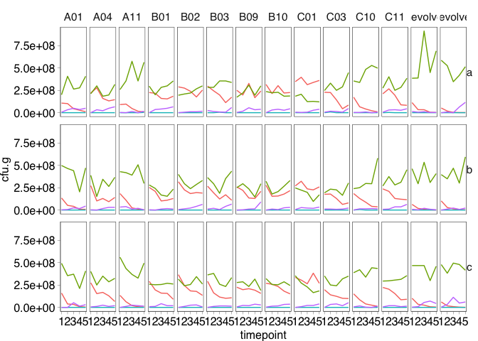<!-- -->

Try a stacked area chart using the ratios.

``` r
dr6 %>% ggplot(aes(x=timepoint, y=ratio, fill=subpopulation)) +
  geom_area(position="stack") + facet_grid(replicate~variant)
```

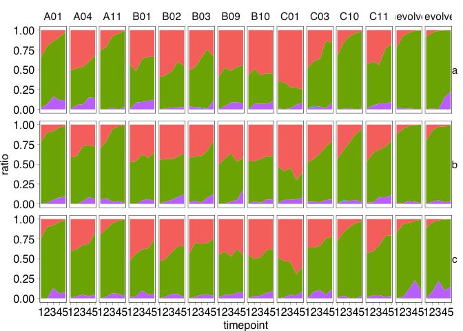<!-- -->

Tidy up the plot: sort out colours, order panels, etc.

Put the ancestral plasmids on the left, then the evolved plasmids with
ancestral-like PQBR57\_0059, then the evolved plasmids with mutated
PQBR57\_0059.

For the ratios, put plasmid-free compartments at the top and bottom, and
plasmid-containing compartments in the middle.

``` r
variants <- data.frame(v = c("unevolved","unevolved ","A01","A11","C01","C10","C11",
                             "A04","B01","B02","B03","B09","B10","C03"),
                       PQ5759 = c(rep("anc",7), rep("mut",7)))

dr6 <- dr6 %>% mutate(subpopulation = factor(subpopulation, levels=c("ratio_R","ratio_T","ratio_D","ratio_S")),
                      variant = factor(variant, levels=variants$v))

(plot_fig6 <- dr6 %>% ggplot(aes(x=timepoint, y=ratio, fill=subpopulation)) +
  geom_area(position="stack") + facet_grid(replicate~variant) +
  labs(y="proportion of total population") +
  scale_fill_manual(values=c("grey90","grey60","grey30","black"),
                    labels=c("recipient","transconjugant","donor","segregant"),
                    name="") +
  theme(legend.position="bottom"))
```

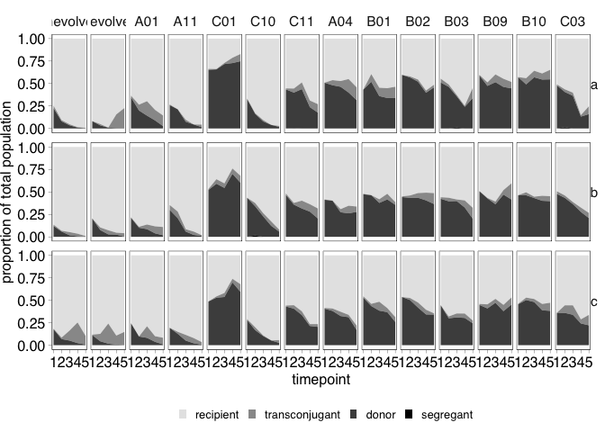<!-- -->

Plot also total counts, using a log scale.

``` r
(plot_fig6b <- bind_rows(d_anc, df6) %>% mutate(total_pop = cfu.g_D + cfu.g_R) %>%
  ggplot(aes(x=timepoint, y=total_pop, group=replicate)) +
  geom_line(colour="black", size=0.2) + facet_grid(replicate~variant) +
  geom_hline(yintercept = 5e8, linetype="dotted", size=0.2) +
  scale_y_continuous(trans="log10", name=expression(paste("log"[10], " cfu/g")), limits=c(1e7,2e9)))
```

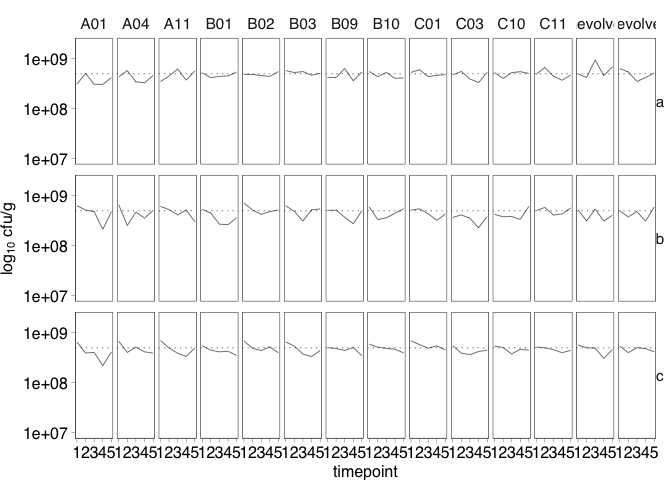<!-- -->

These do not vary greatly over the course of the experiment, and remain
close to the grand mean (dotted line).

Output as `.svg`.

``` r
svglite::svglite(height=3.5, width=7.2, file = "../plots/Fig6.svg")
plot_fig6 + theme_pub() + theme(legend.position="bottom")
dev.off()
```

    ## quartz_off_screen 
    ##                 2

``` r
svglite::svglite(height=3.5, width=7.2, file = "../plots/Fig6b.svg")
plot_fig6b + theme_pub()
dev.off()
```

    ## quartz_off_screen 
    ##                 2

#### Analysis

Analyse data by looking at cumulative plasmid presence over the course
of the experiment.

Calculate this from the ratios. The fact that I am looking at the ratios
doesn’t matter greatly, as the overall counts are similar across the
experiment, and ratios directly reflect what is being presented in the
figure, i.e. I am comparing the dark grey areas.

``` r
dr6_summ <- dr6 %>% filter(subpopulation %in% c("ratio_D","ratio_T")) %>%
  arrange(replicate, timepoint, variant, subpopulation) %>%
  mutate(prop_plasmid = ratio + lag(ratio),
         v = sub(" ", "", variant)) %>%
  filter(subpopulation == "ratio_D") %>%
  group_by(replicate, v, marker) %>%
  summarise(cumulative_plasmid = sum(prop_plasmid)) %>%
  left_join(variants, by="v")
```

    ## `summarise()` has grouped output by 'replicate', 'v'. You can override using the `.groups` argument.

Plot this data to see if it makes sense.

``` r
ggplot(data=dr6_summ, aes(x=v, y=cumulative_plasmid)) + geom_point() +
  facet_wrap(~PQ5759, scales="free_x")
```

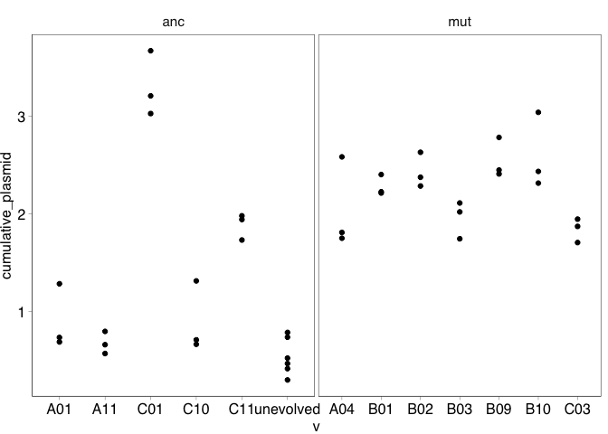<!-- -->

Looks fine, test with a model.

``` r
library(nlme)
```

    ## 
    ## Attaching package: 'nlme'

    ## The following object is masked from 'package:dplyr':
    ## 
    ##     collapse

``` r
mod6_1 <- gls(data=dr6_summ, cumulative_plasmid ~ PQ5759, method="REML")
mod6_2 <- lme(data=dr6_summ, cumulative_plasmid ~ PQ5759, 
              random = ~1|v, method="REML")

anova(mod6_1, mod6_2)
```

    ##        Model df       AIC       BIC    logLik   Test  L.Ratio p-value
    ## mod6_1     1  3 101.96470 107.03134 -47.98235                        
    ## mod6_2     2  4  55.53271  62.28823 -23.76635 1 vs 2 48.43199  <.0001

Strong random effect.

``` r
data.frame(intercept = ranef(mod6_2), 
           v = rownames(ranef(mod6_2))) %>% 
  tibble %>%
  arrange(-abs(X.Intercept.)) %>% select(v, X.Intercept.) %>% kable()
```

| v         | X.Intercept. |
|:----------|-------------:|
| C01       |    1.8603846 |
| unevolved |   -0.8086887 |
| A11       |   -0.6602871 |
| C11       |    0.5002049 |
| C10       |   -0.4488721 |
| A01       |   -0.4427416 |
| C03       |   -0.3857165 |
| B10       |    0.3389404 |
| B09       |    0.2915356 |
| B03       |   -0.2730175 |
| A04       |   -0.1873407 |
| B02       |    0.1795504 |
| B01       |    0.0360484 |

Driven (as expected) by C01.

Generate plots for model validation.

``` r
dr6_summ <- dr6_summ %>% 
  ungroup() %>% 
  mutate(mod6_2_resid  = resid(mod6_2, type = "normalized"),
         mod6_2_fitted = fitted(mod6_2))

ggplot(data=dr6_summ, aes(x=mod6_2_fitted, y=mod6_2_resid)) + 
  geom_point() + labs(x="fitted values", y="residuals")
```

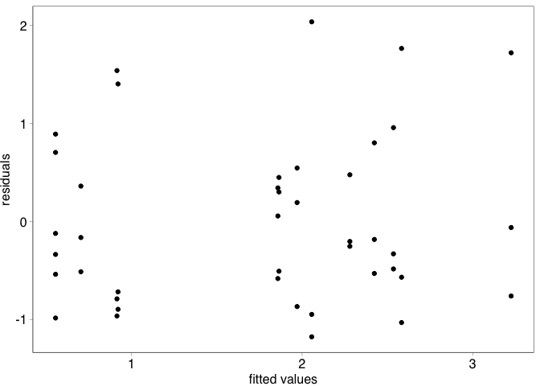<!-- -->

``` r
ggplot(data=dr6_summ, aes(x=PQ5759, y=mod6_2_resid)) + 
  geom_boxplot() + labs(x="PQ5759 variant", y="residuals")
```

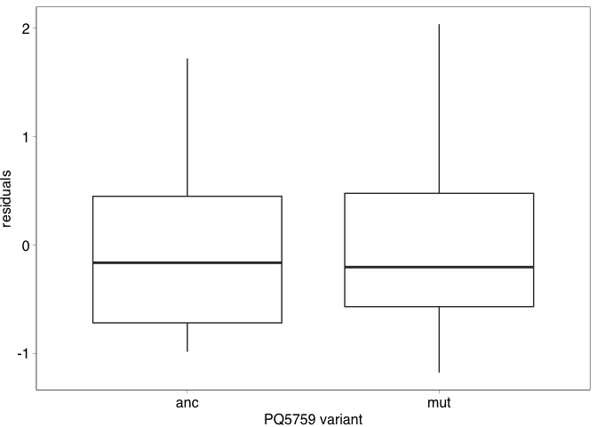<!-- -->

``` r
ggplot(data=dr6_summ, aes(sample=mod6_2_resid)) + stat_qq() + stat_qq_line()
```

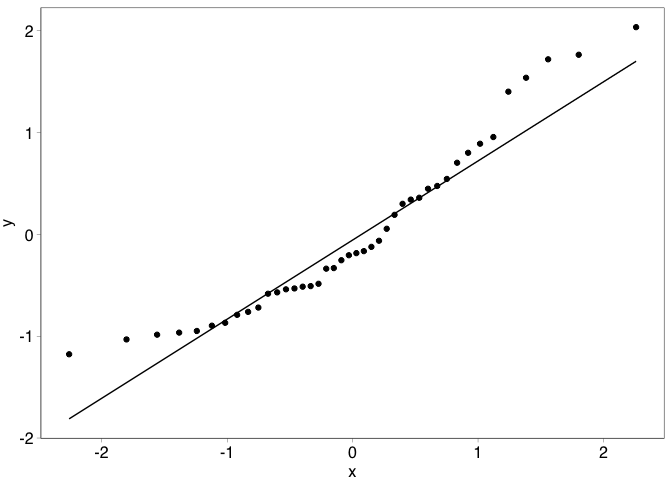<!-- -->

These look fine.

The QQ plot looks like it might be significant.

``` r
shapiro.test(resid(mod6_2, type="normalized"))
```

    ## 
    ##  Shapiro-Wilk normality test
    ## 
    ## data:  resid(mod6_2, type = "normalized")
    ## W = 0.92574, p-value = 0.009333

It is. Transform with Box-Cox and repeat analysis.

``` r
MASS::boxcox(cumulative_plasmid ~ PQ5759, data=dr6_summ)
```

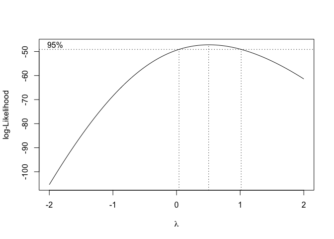<!-- -->

Lambda at 0.5.

``` r
lambda <- 0.5

dr6_summ <- dr6_summ %>%
  mutate(cp_boxcox = ((cumulative_plasmid^lambda) - 1) / lambda)

mod6_3 <- gls(data=dr6_summ, cp_boxcox ~ PQ5759, method="REML")
mod6_4 <- lme(data=dr6_summ, cp_boxcox ~ PQ5759, 
              random = ~1|v, method="REML")

anova(mod6_3, mod6_4)
```

    ##        Model df      AIC      BIC    logLik   Test  L.Ratio p-value
    ## mod6_3     1  3 83.24473 88.31136 -38.62236                        
    ## mod6_4     2  4 40.01851 46.77402 -16.00925 1 vs 2 45.22622  <.0001

Random effects still required.

``` r
dr6_summ <- dr6_summ %>% 
  mutate(mod6_4_resid  = resid(mod6_4, type = "normalized"),
         mod6_4_fitted = fitted(mod6_4))

ggplot(data=dr6_summ, aes(x=mod6_4_fitted, y=mod6_4_resid)) + 
  geom_point() + labs(x="fitted values", y="residuals")
```

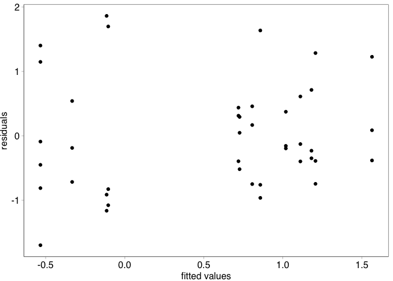<!-- -->

``` r
ggplot(data=dr6_summ, aes(x=PQ5759, y=mod6_4_resid)) + 
  geom_boxplot() + labs(x="PQ5759 variant", y="residuals")
```

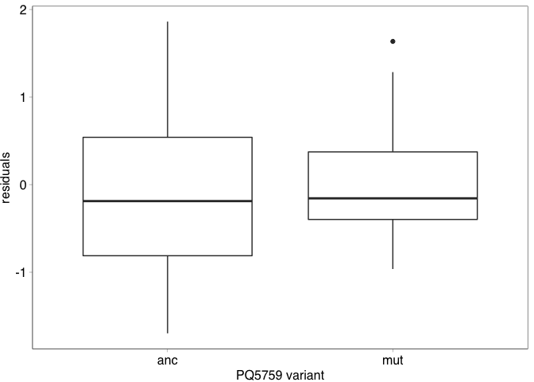<!-- -->

``` r
ggplot(data=dr6_summ, aes(sample=mod6_4_resid)) + stat_qq() + stat_qq_line()
```

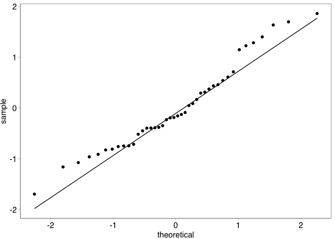<!-- -->

``` r
shapiro.test(resid(mod6_4))
```

    ## 
    ##  Shapiro-Wilk normality test
    ## 
    ## data:  resid(mod6_4)
    ## W = 0.9601, p-value = 0.1489

Good, proceed to model reduction.

``` r
mod6_4_ml <- update(mod6_4, method="ML")

mod6_5_ml <- update(mod6_4_ml, .~.-PQ5759)

anova(mod6_4_ml, mod6_5_ml)
```

    ##           Model df      AIC      BIC    logLik   Test  L.Ratio p-value
    ## mod6_4_ml     1  4 37.59999 44.55067 -14.79999                        
    ## mod6_5_ml     2  3 41.22439 46.43740 -17.61219 1 vs 2 5.624403  0.0177

Shows that there is a significant effect of PQBR57\_0059 variant.

``` r
summary(mod6_4)
```

    ## Linear mixed-effects model fit by REML
    ##   Data: dr6_summ 
    ##        AIC      BIC    logLik
    ##   40.01851 46.77402 -16.00925
    ## 
    ## Random effects:
    ##  Formula: ~1 | v
    ##         (Intercept)  Residual
    ## StdDev:   0.5657169 0.2185946
    ## 
    ## Fixed effects:  cp_boxcox ~ PQ5759 
    ##                 Value Std.Error DF   t-value p-value
    ## (Intercept) 0.1998062 0.2361530 29 0.8460879  0.4044
    ## PQ5759mut   0.7867468 0.3221227 11 2.4423825  0.0327
    ##  Correlation: 
    ##           (Intr)
    ## PQ5759mut -0.733
    ## 
    ## Standardized Within-Group Residuals:
    ##        Min         Q1        Med         Q3        Max 
    ## -1.6984889 -0.6666111 -0.1722391  0.4532063  1.8622325 
    ## 
    ## Number of Observations: 42
    ## Number of Groups: 13

A mutated PQBR57\_0059 is associated with an increase in cumulative
plasmid.

#### Tests

Do the results hold if the ancestral strain is not included?

``` r
drop1(lme(cp_boxcox ~ PQ5759, random = ~1|v, method="ML", data=filter(dr6_summ, v != "unevolved")),
      test="Chisq")
```

    ## Single term deletions
    ## 
    ## Model:
    ## cp_boxcox ~ PQ5759
    ##        Df    AIC    LRT Pr(>Chi)  
    ## <none>    31.634                  
    ## PQ5759  1 33.589 3.9554  0.04672 *
    ## ---
    ## Signif. codes:  0 '***' 0.001 '**' 0.01 '*' 0.05 '.' 0.1 ' ' 1

Yes, though it is approaching the margin!

------------------------------------------------------------------------

**[Back to index.](COMPMUT_index.md)**
