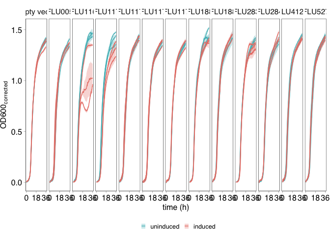
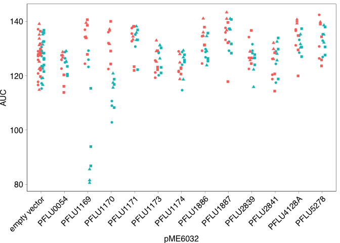
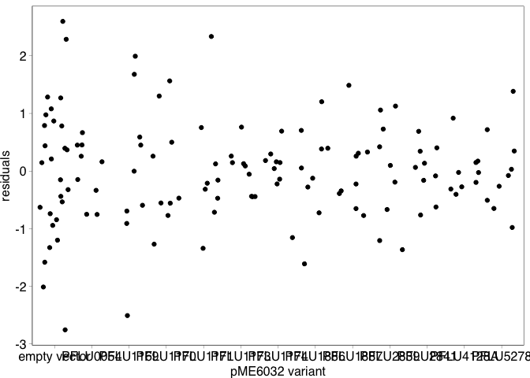
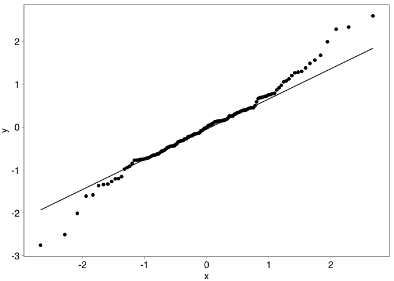

COMPMUT Experiments 7: Presentation and analysis of growth curves with
candidate cost genes
================
jpjh
compiled Feb 2021, edited Jul 2021

[Now published in PLoS
Biology](https://journals.plos.org/plosbiology/article?id=10.1371/journal.pbio.3001225):

Hall, J. P. J., Wright, R. C. T., Harrison, E., Muddiman, K. J., Jamie
Wood, A., Paterson, S., & Brockhurst, M. A. (2021). Plasmid fitness
costs are caused by specific genetic conflicts enabling resolution by
compensatory mutation. *PLoS Biology*, *19*(10), e3001225.
<https://doi.org/10.1371/journal.pbio.3001225>

**[Back to index.](COMPMUT_index.md)**

------------------------------------------------------------------------

## Growth rate experiments with strains overexpressing candidate cost genes

#### Experimental design

Genes were identified from the RNAseq data as those whose product might
directly cause a fitness cost. To test this, these putatitve ‘candidate
cost’ genes were amplified from the chromosome and cloned into the
expression vector pME6032. pME6032 differs from pUCP18xK in that it also
carries a *lacI<sup>q</sup>* gene, which causes repression of insert
expression under normal growth conditions, and enables inducible
expression with the addition of 100 µg/ml IPTG. The generated expression
plasmids were miniprepped and sequenced to ensure a correct insert, and
transformed into *P. fluorescens* SBW25 in triplicate. Empty vector was
also transformed into *P. fluorescens* in triplicate as a negative
control. These transformants are transformant replicates, `t_rep`. Each
`t_rep` strain was tested in triplicate (`exp_rep`).

Overnight cultures grown in the presence of tetracycline (100 µg/ml) to
select for pME6032 maintenance were subcultured into 150 µl KB +
tetracycline ± 100 µM IPTG, and grown in the automatic plate reader with
readings taken every 15 minutes. Several different plates were set up to
test all of the lines. Raw OD600 readings were obtained and corrected by
subtraction of the ‘no inoculation’ blank control.

#### Plotting of growthcurve data

Load up data.

``` r
gr1 <- read.csv("../data/COMPMUT_exp_data_7.csv", header=TRUE, sep=",") %>%
  mutate(pME6032 = gsub("PFLU_","PFLU",pME6032))
```

Calculate means for each set of technical replicates. Plot mean and an
envelope of SE/CI for each transformant.

``` r
gr1_summ <- gr1 %>% mutate(IPTG = factor(IPTG, levels=c("0","100"), labels=c("uninduced","induced"))) %>%
  group_by(cycle, t_rep, pME6032, IPTG) %>%
  summarise(mean = mean(OD600_corr), 
            n = n(), 
            se = sd(OD600_corr)/sqrt(n), 
            ci = (qt(0.95/2 + 0.5, n-1)) * se) %>%
  rename(OD600_corr=mean)
```

    ## `summarise()` has grouped output by 'cycle', 't_rep', 'pME6032'. You can override using the `.groups` argument.

``` r
(plot_fig16 <- ggplot(data=gr1_summ,
       aes(x=(cycle/4), y=OD600_corr,
           colour=IPTG,
           group=interaction(t_rep,pME6032,IPTG))) +
  geom_ribbon(aes(ymin=OD600_corr-se, ymax=OD600_corr+se, fill=IPTG),
              alpha=0.3, colour=NA) +
  geom_line() +
  scale_colour_manual(values=c("#53BCC2","#E98076")) +
  scale_fill_manual(values=c("#53BCC2","#E98076")) +
  labs(x="time (h)", y=expression(paste("OD600"["corrected"])), fill="", colour="") +
  scale_x_continuous(breaks=c(0,18,36)) +
  facet_grid(~pME6032) +
  theme(legend.position="bottom"))
```

<!-- -->

The plots may need to be adjusted for visibility.

Output as `.svg`.

``` r
svglite::svglite(height=1.5, width=7.2, file = "../plots/Fig16.svg")
plot_fig16 + theme_pub() + theme(legend.position="bottom")
dev.off()
```

    ## quartz_off_screen 
    ##                 2

#### Analysis

Preliminary attempts to fit curves to these data were unsuccessful —
particularly bad at fitting to the PFLU\_1169 induced curves, which are
the key features to capture.

Therefore, summarise curves by calculating area under the curve (AUC),
and using this in linear models.

As we have datapoints for all samples at all timepoints, AUC = sum of
densities.

Calculate AUC for all experimental replicates separately.

``` r
gr1_AUC <- gr1 %>% mutate(IPTG = factor(IPTG, levels=c("0","100"), labels=c("uninduced","induced"))) %>%
  group_by(exp, well, exp_rep, t_rep, pME6032, IPTG) %>%
  summarise(AUC = sum(OD600_corr))
```

    ## `summarise()` has grouped output by 'exp', 'well', 'exp_rep', 't_rep', 'pME6032'. You can override using the `.groups` argument.

Plot to check it looks sensible.

``` r
pd <- position_dodge(width=0.3)

gr1_AUC %>% ggplot(aes(x=pME6032, y=AUC, colour=IPTG, shape=t_rep)) +
  geom_point(position=pd) +
  theme(axis.text.x = element_text(angle=45, hjust=1))
```

<!-- -->

Looks good.

We are interested in the ratio between growth when induced vs. growth
when uninduced.

To do this, arrange the `gr1_AUC` dataframe such that consecutive rows
have ±IPTG, then use the `mutate()` and `lag()` functions to get the
ratio between rows.

``` r
gr1_ratio <- gr1_AUC %>% ungroup() %>% arrange(exp, t_rep, exp_rep, pME6032, IPTG) %>%
  mutate(ratio = AUC / lag(AUC)) %>% filter(IPTG=="induced")
```

Again, plot to check.

``` r
gr1_ratio %>% ggplot(aes(x=pME6032, y=ratio, shape=t_rep)) +
  geom_hline(yintercept=1, linetype="dotted") +
  geom_point(position=pd) +
  theme(axis.text.x = element_text(angle=45, hjust=1))
```

<!-- -->

Looks good.

We are interested in whether this ratio varies between pME6032 inserts.

Analyse as an LMM.

``` r
gr1_ratio <- gr1_ratio %>% mutate(clone = factor(paste(t_rep, pME6032)))

library(nlme)
```

    ## 
    ## Attaching package: 'nlme'

    ## The following object is masked from 'package:dplyr':
    ## 
    ##     collapse

``` r
mod11_1 <- gls(data=gr1_ratio, ratio ~ pME6032, method="REML")
mod11_2 <- lme(data=gr1_ratio, ratio ~ pME6032, 
              random = ~1|clone, method="REML")

anova(mod11_1, mod11_2)
```

    ##         Model df       AIC       BIC   logLik   Test  L.Ratio p-value
    ## mod11_1     1 14 -287.9240 -248.6677 157.9620                        
    ## mod11_2     2 15 -317.9865 -275.9262 173.9932 1 vs 2 32.06249  <.0001

The transformant replicate has a very strong (random) effect.

``` r
data.frame(intercept = ranef(mod11_2), 
           clone = rownames(ranef(mod11_2))) %>% 
  tibble %>%
  arrange(-abs(X.Intercept.)) %>% select(clone, X.Intercept.) %>% kable()
```

| clone          | X.Intercept. |
|:---------------|-------------:|
| A PFLU1169     |    0.1543152 |
| B PFLU1169     |   -0.1248543 |
| C PFLU4128A    |    0.0350531 |
| B PFLU4128A    |   -0.0308906 |
| C PFLU1169     |   -0.0294609 |
| A PFLU2839     |    0.0277011 |
| C PFLU5278     |    0.0274956 |
| C PFLU1887     |    0.0252575 |
| C PFLU2841     |    0.0251405 |
| A PFLU1170     |   -0.0248813 |
| B PFLU2839     |   -0.0244145 |
| B PFLU5278     |   -0.0215894 |
| C PFLU0054     |    0.0205978 |
| A PFLU1886     |    0.0205860 |
| B PFLU2841     |   -0.0202342 |
| B PFLU1886     |   -0.0201835 |
| C PFLU1174     |    0.0191235 |
| B PFLU0054     |   -0.0182730 |
| A PFLU1174     |   -0.0179448 |
| C PFLU1171     |    0.0158328 |
| A PFLU1173     |    0.0152060 |
| A PFLU1887     |   -0.0147794 |
| A PFLU1171     |   -0.0139337 |
| C PFLU1170     |    0.0133281 |
| B PFLU1170     |    0.0115532 |
| C empty vector |    0.0113139 |
| B PFLU1887     |   -0.0104781 |
| C PFLU1173     |   -0.0096336 |
| B empty vector |   -0.0064100 |
| A PFLU5278     |   -0.0059062 |
| B PFLU1173     |   -0.0055725 |
| A PFLU2841     |   -0.0049063 |
| A empty vector |   -0.0049039 |
| A PFLU4128A    |   -0.0041625 |
| C PFLU2839     |   -0.0032867 |
| A PFLU0054     |   -0.0023248 |
| B PFLU1171     |   -0.0018990 |
| B PFLU1174     |   -0.0011787 |
| C PFLU1886     |   -0.0004025 |

And the very strongest effects are in PFLU\_1169.

Generate plots for model validation.

``` r
gr1_ratio <- gr1_ratio %>% mutate(mod11_2_resid  = resid(mod11_2, type = "normalized"),
              mod11_2_fitted = fitted(mod11_2))

ggplot(data=gr1_ratio, aes(x=mod11_2_fitted, y=mod11_2_resid)) + 
  geom_point() + labs(x="fitted values", y="residuals")
```

<!-- -->

``` r
ggplot(data=gr1_ratio, aes(x=pME6032, y=mod11_2_resid)) + 
  geom_boxplot() + labs(x="pME6032 variant", y="residuals")
```

<!-- -->

``` r
ggplot(data=gr1_ratio, aes(x=pME6032, y=mod11_2_resid)) + 
  geom_point(position="jitter") + labs(x="pME6032 variant", y="residuals")
```

<!-- -->

``` r
ggplot(data=gr1_ratio, aes(sample=mod11_2_resid)) + stat_qq() + stat_qq_line()
```

<!-- -->

The QQ plot looks like it might be significant.

``` r
shapiro.test(resid(mod11_2, type="normalized"))
```

    ## 
    ##  Shapiro-Wilk normality test
    ## 
    ## data:  resid(mod11_2, type = "normalized")
    ## W = 0.98135, p-value = 0.06126

Borderline (0.06), suggesting that this model is valid.

Proceed with model reduction.

``` r
mod11_2_ml <- update(mod11_2, method="ML")

mod11_3_ml <- update(mod11_2_ml, .~.-pME6032)

anova(mod11_2_ml, mod11_3_ml)
```

    ##            Model df       AIC       BIC   logLik   Test  L.Ratio p-value
    ## mod11_2_ml     1 15 -386.6670 -343.0879 208.3335                        
    ## mod11_3_ml     2  3 -361.4969 -352.7811 183.7484 1 vs 2 49.17014  <.0001

Highly significant – the insert has a significant effect on the
consequences of induction.

Perform post-hoc comparisons with the empty vector control (Dunnett’s
test).

``` r
library(emmeans)

posthoc <- lsmeans(mod11_2, trt.vs.ctrl ~ pME6032, adjust="mvt")

contr <- data.frame(posthoc$contrasts) %>% mutate(sign = ifelse(p.value<0.05, "*", ""))

kable(contr)
```

| contrast                 |   estimate |        SE |  df |    t.ratio |   p.value | sign |
|:-------------------------|-----------:|----------:|----:|-----------:|----------:|:-----|
| PFLU0054 - empty vector  |  0.0161221 | 0.0436426 |  26 |  0.3694117 | 0.9999923 |      |
| PFLU1169 - empty vector  | -0.2337423 | 0.0436426 |  26 | -5.3558312 | 0.0001516 | \*   |
| PFLU1170 - empty vector  | -0.1391306 | 0.0436426 |  26 | -3.1879555 | 0.0326109 | \*   |
| PFLU1171 - empty vector  |  0.0081161 | 0.0436426 |  26 |  0.1859678 | 1.0000000 |      |
| PFLU1173 - empty vector  |  0.0134568 | 0.0436426 |  26 |  0.3083406 | 0.9999989 |      |
| PFLU1174 - empty vector  |  0.0118874 | 0.0436426 |  26 |  0.2723801 | 0.9999997 |      |
| PFLU1886 - empty vector  | -0.0302590 | 0.0436426 |  26 | -0.6933369 | 0.9964991 |      |
| PFLU1887 - empty vector  |  0.0016810 | 0.0436426 |  26 |  0.0385170 | 1.0000000 |      |
| PFLU2839 - empty vector  | -0.0162898 | 0.0436426 |  26 | -0.3732538 | 0.9999914 |      |
| PFLU2841 - empty vector  |  0.0230435 | 0.0436426 |  26 |  0.5280054 | 0.9997017 |      |
| PFLU4128A - empty vector | -0.0131310 | 0.0436426 |  26 | -0.3008767 | 0.9999992 |      |
| PFLU5278 - empty vector  |  0.0001989 | 0.0436426 |  26 |  0.0045585 | 1.0000000 |      |

Clear significant effect for PFLU\_1169. More marginal effect for
PFLU\_1170. Consistent with the figure.

------------------------------------------------------------------------

**[Back to index.](COMPMUT_index.md)**
