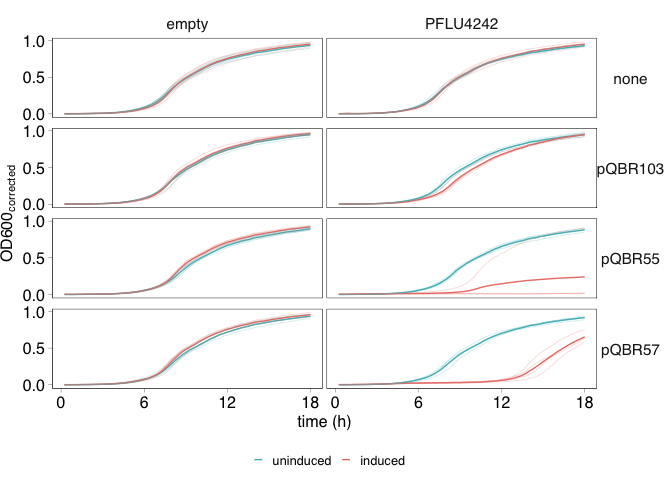
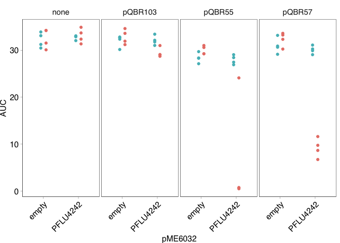
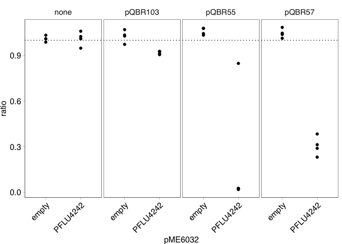
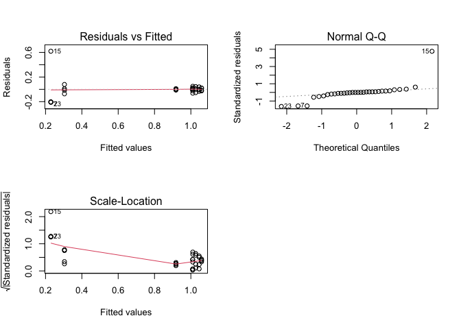
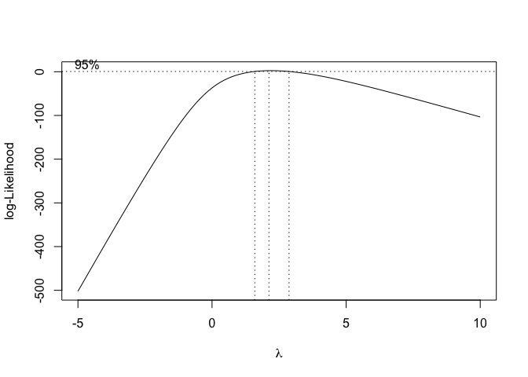
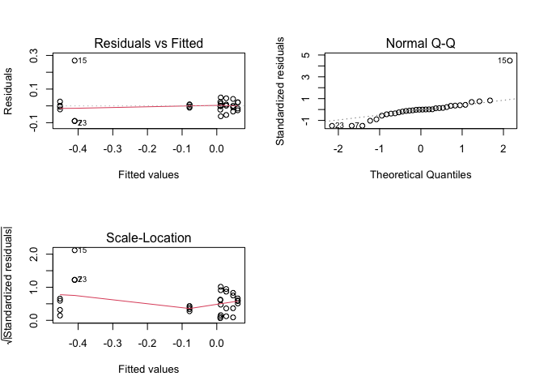
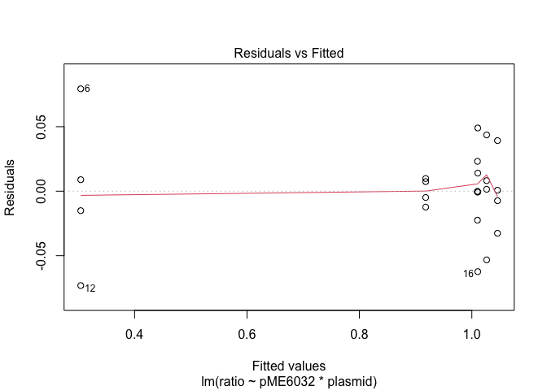
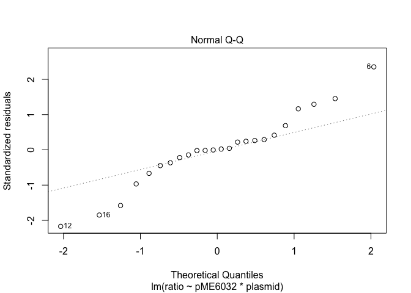
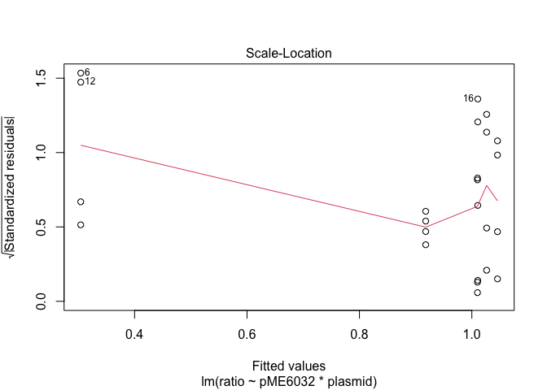

COMPMUT Experiments 8: Presentation and analysis of the effects of
PFLU4242 expression in the ∆gacS mutant
================
jpjh
compiled Jul 2021

[Now published in PLoS
Biology](https://journals.plos.org/plosbiology/article?id=10.1371/journal.pbio.3001225):

Hall, J. P. J., Wright, R. C. T., Harrison, E., Muddiman, K. J., Jamie
Wood, A., Paterson, S., & Brockhurst, M. A. (2021). Plasmid fitness
costs are caused by specific genetic conflicts enabling resolution by
compensatory mutation. *PLoS Biology*, *19*(10), e3001225.
<https://doi.org/10.1371/journal.pbio.3001225>

**[Back to index.](COMPMUT_index.md)**

------------------------------------------------------------------------

## Growth rate experiments with strains ectopically expressing PFLU4242 in the presence of ∆gacS compensated pQBR plasmids

### Experimental design

*Pseudomonas fluorescens* SBW25 *∆gacS* were transformed with pME6032
carrying either no insert, or the wild-type *PFLU4242* gene cloned into
the SacI/KpnI sites. Transformations were conducted in quadruplicate. To
each replicate was then introduced plasmids pQBR103, pQBR57, or pQBR55
by conjugation. Together this resulted in 24 strains (two pME6032
variants, by three introduced megaplasmids plus a no-megaplasmid
control, by four independent replicates), which were validated by PCR.
Overnight cultures grown in the presence of 100 µg/ml tetracycline (to
select for pME6032) were subcultured \~1:1000 into KB broth supplemented
with 100 µg/ml tetracycline, and either no IPTG or 2 mM IPTG, and grown
in a Tecan Nano platereader at 28°C shaking, with optical density
readings taken every 15 minutes.

### Plotting

``` r
d9 <- read.csv("../data/COMPMUT_exp_data_9.csv", header=TRUE)
```

Calculate means and standard error.

``` r
d9 <- d9 %>% mutate(IPTG = factor(IPTG, levels=c("0","100"), labels=c("uninduced","induced"))) 

d9_summ <- d9 %>%
  group_by(cycle, plasmid, pME6032, IPTG) %>%
  summarise(mean = mean(OD600_corr), 
            n = n(), 
            se = sd(OD600_corr)/sqrt(n), 
            ci = (qt(0.95/2 + 0.5, n-1)) * se) %>%
  rename(OD600_corr=mean)
```

    ## `summarise()` has grouped output by 'cycle', 'plasmid', 'pME6032'. You can override using the `.groups` argument.

``` r
(plot_figS17 <- ggplot(data=d9,
       aes(x=(cycle/4), y=OD600_corr,
           colour=IPTG)) +
  # geom_ribbon(data=d9_summ, aes(ymin=OD600_corr-se, ymax=OD600_corr+se, fill=IPTG),
  #             alpha=0.3, colour=NA) +
  geom_line(data=d9_summ) +
  geom_line(data=d9, aes(group=well), alpha=0.4, size=0.2) +
    scale_colour_manual(values=c("#53BCC2","#E98076")) +
  labs(x="time (h)", y=expression(paste("OD600"["corrected"])), fill="", colour="") +
  scale_x_continuous(breaks=c(0,6,12,18)) + scale_y_continuous(breaks=c(0,0.5,1.0)) +
  facet_grid(plasmid~pME6032) +
  theme(legend.position="bottom"))
```

<!-- -->

Looks good, output as .svg.

``` r
svglite::svglite(height=3, width=2.5, file = "../plots/Fig17.svg")
plot_figS17 + theme_pub() + theme(legend.position="bottom")
dev.off()
```

Output without pQBR55.

``` r
d9_ss <- filter(d9, plasmid!="pQBR55")
d9_summ_ss <- filter(d9_summ, plasmid!="pQBR55")
       
svglite::svglite(height=2.2, width=2.5, file = "../plots/Fig17_sub.svg")
ggplot(data=d9_ss,
       aes(x=(cycle/4), y=OD600_corr,
           colour=IPTG)) +
  geom_line(data=d9_summ_ss) +
  geom_line(data=d9_ss, aes(group=well), alpha=0.4, size=0.2) +
    scale_colour_manual(values=c("#53BCC2","#E98076")) +
  labs(x="time (h)", y=expression(paste("OD600"["corrected"])), fill="", colour="") +
  scale_x_continuous(breaks=c(0,6,12,18)) + scale_y_continuous(breaks=c(0,0.5,1.0)) +
  facet_grid(plasmid~pME6032) +
  theme_pub() + theme(legend.position="bottom")
dev.off()
```

### Analysis

Analyse as with the original growth curves.

``` r
d9_auc <- d9 %>%
  group_by(well, replicate, plasmid, pME6032, IPTG) %>%
  summarise(AUC = sum(OD600_corr))
```

    ## `summarise()` has grouped output by 'well', 'replicate', 'plasmid', 'pME6032'. You can override using the `.groups` argument.

Plot to check it looks sensible.

``` r
pd <- position_dodge(width=0.3)

d9_auc %>% ggplot(aes(x=pME6032, y=AUC, colour=IPTG)) +
  geom_point(position=pd) + facet_wrap(.~plasmid, nrow=1) + 
  scale_colour_manual(values=c("#53BCC2","#E98076")) +
  theme(axis.text.x = element_text(angle=45, hjust=1))
```

<!-- -->

Looks good.

We are interested in the ratio between growth when induced vs. growth
when uninduced.

To do this, arrange the `d9_auc` dataframe such that consecutive rows
are replicates ±IPTG, then use the `mutate()` and `lag()` functions to
get the ratio between rows.

``` r
d9_ratio <- d9_auc %>% ungroup() %>% arrange(replicate, pME6032, plasmid, IPTG) %>%
  mutate(ratio = AUC / lag(AUC)) %>% filter(IPTG=="induced")
```

Again, plot to check.

``` r
d9_ratio %>% ggplot(aes(x=pME6032, y=ratio)) +
  geom_hline(yintercept=1, linetype="dotted") +
  geom_point(position=pd) + facet_wrap(.~plasmid, nrow=1) +
  theme(axis.text.x = element_text(angle=45, hjust=1))
```

<!-- -->

Looks good.

We are interested in whether this ratio varies between pME6032 inserts
in the presence of different plasmids.

Analyse as an linear model.

``` r
mod12_1 <- lm(data=d9_ratio, ratio ~ pME6032 * plasmid)
```

Generate plots for model validation.

``` r
par(mfrow=c(2,2))
plot(mod12_1)
```

    ## hat values (leverages) are all = 0.25
    ##  and there are no factor predictors; no plot no. 5

<!-- -->

Probable problem with inhomogenous variances.

Try box-cox transformation.

``` r
MASS::boxcox(data=d9_ratio, ratio ~ pME6032 * plasmid, lambda=seq(-5, 10, 0.5))
```

<!-- -->

``` r
par(mfrow=c(1,1))
lambda <- 2

d9_ratio <- d9_ratio %>% mutate(ratio_bc = ((ratio^lambda) - 1) / lambda)

mod12_2 <- lm(data=d9_ratio, ratio_bc ~ pME6032 * plasmid)

par(mfrow=c(2,2))
plot(mod12_2)
```

    ## hat values (leverages) are all = 0.25
    ##  and there are no factor predictors; no plot no. 5

<!-- -->

Improved, but still a problematic outlier from pQBR55, which shows
unexpectedly high growth, probably due to a mutation or plasmid loss.

``` r
d9_ratio <- within(d9_ratio, {
  groups <- interaction(plasmid,pME6032)
  groups <- reorder(groups, ratio_bc, mean)
})

bartlett.test(ratio_bc ~ groups, data=d9_ratio)
```

    ## 
    ##  Bartlett test of homogeneity of variances
    ## 
    ## data:  ratio_bc by groups
    ## Bartlett's K-squared = 33.947, df = 7, p-value = 1.762e-05

``` r
fligner.test(ratio_bc ~ groups, data=d9_ratio)
```

    ## 
    ##  Fligner-Killeen test of homogeneity of variances
    ## 
    ## data:  ratio_bc by groups
    ## Fligner-Killeen:med chi-squared = 3.6361, df = 7, p-value = 0.8206

``` r
car::leveneTest(ratio_bc ~ groups, data=d9_ratio)
```

    ## Levene's Test for Homogeneity of Variance (center = median)
    ##       Df F value Pr(>F)
    ## group  7  0.6362 0.7216
    ##       24

``` r
shapiro.test(resid(mod12_2))
```

    ## 
    ##  Shapiro-Wilk normality test
    ## 
    ## data:  resid(mod12_2)
    ## W = 0.72917, p-value = 2.447e-06

Bartlett’s test is significant, as is the Shapiro-Wilk test, due to the
outlier pQBR55 replicate that began growing earlier than expected.

Rebuild model without pQBR55.

``` r
d9_ratio_no55 <- filter(d9_ratio, plasmid!="pQBR55")

mod12_3 <- lm(data=d9_ratio_no55, ratio ~ pME6032 * plasmid)

plot(mod12_3)
```

<!-- --><!-- -->

    ## hat values (leverages) are all = 0.25
    ##  and there are no factor predictors; no plot no. 5

<!-- --><!-- -->

``` r
bartlett.test(ratio_bc ~ groups, data=d9_ratio_no55)
```

    ## 
    ##  Bartlett test of homogeneity of variances
    ## 
    ## data:  ratio_bc by groups
    ## Bartlett's K-squared = 7.3147, df = 5, p-value = 0.1983

``` r
fligner.test(ratio_bc ~ groups, data=d9_ratio_no55)
```

    ## 
    ##  Fligner-Killeen test of homogeneity of variances
    ## 
    ## data:  ratio_bc by groups
    ## Fligner-Killeen:med chi-squared = 3.8563, df = 5, p-value = 0.5703

``` r
car::leveneTest(ratio_bc ~ groups, data=d9_ratio_no55)
```

    ## Levene's Test for Homogeneity of Variance (center = median)
    ##       Df F value Pr(>F)
    ## group  5  0.8638  0.524
    ##       18

``` r
shapiro.test(resid(mod12_3))
```

    ## 
    ##  Shapiro-Wilk normality test
    ## 
    ## data:  resid(mod12_3)
    ## W = 0.95905, p-value = 0.4197

Much better!

Test both models to see whether including pQBR55 has a qualitative
effect on the findings.

``` r
anova(mod12_2)
```

    ## Analysis of Variance Table
    ## 
    ## Response: ratio_bc
    ##                 Df  Sum Sq Mean Sq F value    Pr(>F)    
    ## pME6032          1 0.57729 0.57729 119.918 8.105e-11 ***
    ## plasmid          3 0.27106 0.09035  18.769 1.740e-06 ***
    ## pME6032:plasmid  3 0.38650 0.12883  26.762 7.892e-08 ***
    ## Residuals       24 0.11554 0.00481                      
    ## ---
    ## Signif. codes:  0 '***' 0.001 '**' 0.01 '*' 0.05 '.' 0.1 ' ' 1

Significant interaction; effects of PFLU4242 expression varies across
pQBR plasmids.

``` r
anova(mod12_3)
```

    ## Analysis of Variance Table
    ## 
    ## Response: ratio
    ##                 Df  Sum Sq Mean Sq F value    Pr(>F)    
    ## pME6032          1 0.48093 0.48093  317.39 7.023e-13 ***
    ## plasmid          2 0.53935 0.26968  177.97 1.387e-12 ***
    ## pME6032:plasmid  2 0.64216 0.32108  211.90 3.093e-13 ***
    ## Residuals       18 0.02727 0.00152                      
    ## ---
    ## Signif. codes:  0 '***' 0.001 '**' 0.01 '*' 0.05 '.' 0.1 ' ' 1

Also the case when pQBR55 is removed, in fact, the patterns are even
clearer.

Perform comparisons with the empty vector control for each plasmid.

``` r
d9_ratio %>% group_by(plasmid) %>%
  summarise(t_test = tidy(t.test(ratio_bc ~ pME6032))) %>%
  mutate(coef = t_test$estimate,
         p_value = t_test$p.value,
         p_adj = p.adjust(p_value, method="fdr"),
         sig = ifelse(p_adj<0.05, "*", "")) %>%
  select(!t_test) %>% arrange(plasmid) %>% kable()
```

| plasmid |       coef |  p\_value |    p\_adj | sig |
|:--------|-----------:|----------:|----------:|:----|
| none    | -0.0012465 | 0.9628165 | 0.9628165 |     |
| pQBR103 |  0.1059657 | 0.0115429 | 0.0168978 | \*  |
| pQBR55  |  0.4705261 | 0.0126733 | 0.0168978 | \*  |
| pQBR57  |  0.4992706 | 0.0000012 | 0.0000048 | \*  |

Clear significant effect for all plasmids.

``` r
d9_ratio_no55  %>% group_by(plasmid) %>%
  summarise(t_test = tidy(t.test(ratio_bc ~ pME6032))) %>%
  mutate(stat = t_test$statistic,
         df = t_test$parameter,
         coef = t_test$estimate,
         p_value = t_test$p.value,
         p_adj = p.adjust(p_value, method="fdr"),
         sig = ifelse(p_adj<0.05, "*", "")) %>%
  select(!t_test) %>% arrange(plasmid) %>% kable()
```

| plasmid |       stat |       df |       coef |  p\_value |    p\_adj | sig |
|:--------|-----------:|---------:|-----------:|----------:|----------:|:----|
| none    | -0.0496379 | 3.954848 | -0.0012465 | 0.9628165 | 0.9628165 |     |
| pQBR103 |  5.0572828 | 3.329835 |  0.1059657 | 0.0115429 | 0.0173143 | \*  |
| pQBR57  | 27.0840352 | 5.035457 |  0.4992706 | 0.0000012 | 0.0000036 | \*  |

Overall, increased expression of PFLU4242 can clearly compensate for the
absence of *gacS* for generating costs for plasmids pQBR55 and pQBR57.
The effects for pQBR103 are less extreme, but still detectable.

------------------------------------------------------------------------

**[Back to index.](COMPMUT_index.md)**
